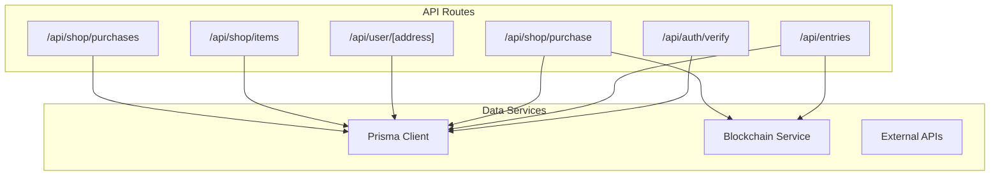
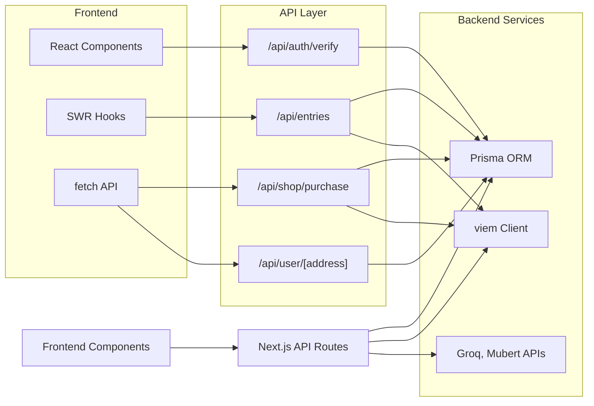
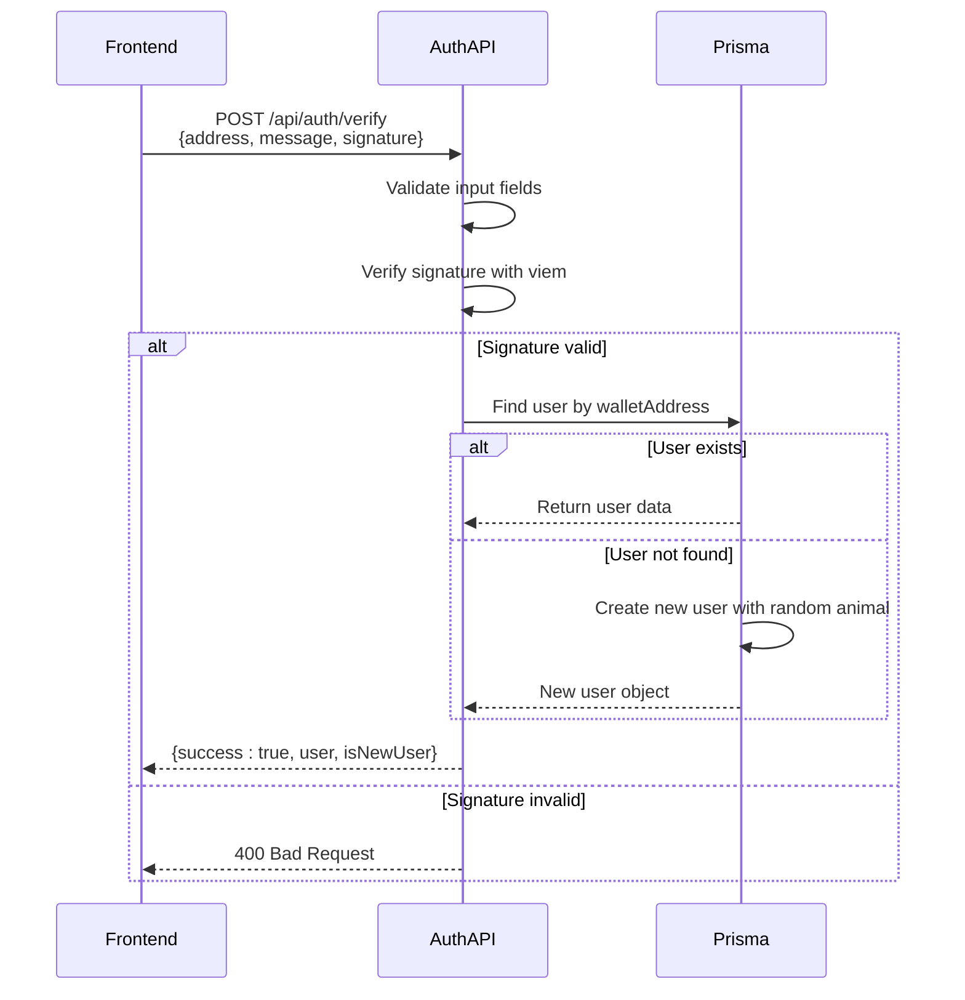
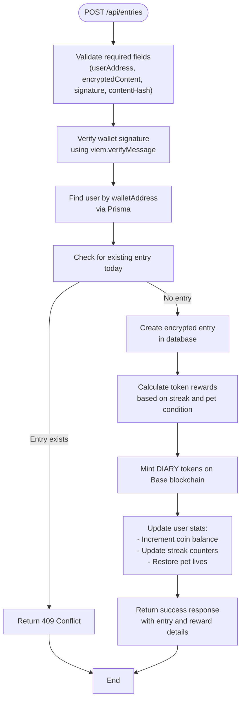
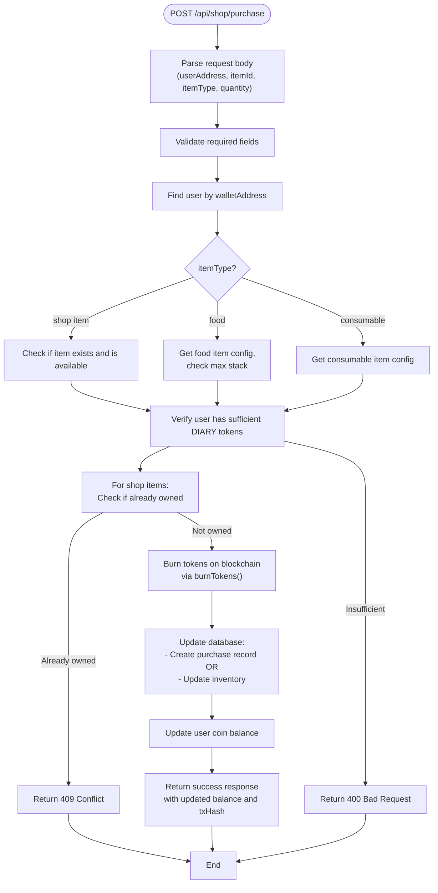

# API Integration Layer

<cite>
**Referenced Files in This Document**   
- [entries/route.ts](file://app/api/entries/route.ts)
- [auth/verify/route.ts](file://app/api/auth/verify/route.ts)
- [shop/purchase/route.ts](file://app/api/shop/purchase/route.ts)
- [user/[address]/route.ts](file://app/api/user/[address]/route.ts)
- [prisma.ts](file://lib/prisma.ts)
- [blockchain.ts](file://lib/blockchain.ts)
- [useAuth.ts](file://lib/useAuth.ts)
- [shop/page.tsx](file://app/shop/page.tsx)
</cite>

## Table of Contents
1. [Introduction](#introduction)
2. [Project Structure](#project-structure)
3. [Core Components](#core-components)
4. [Architecture Overview](#architecture-overview)
5. [Detailed Component Analysis](#detailed-component-analysis)
6. [Dependency Analysis](#dependency-analysis)
7. [Performance Considerations](#performance-considerations)
8. [Troubleshooting Guide](#troubleshooting-guide)
9. [Conclusion](#conclusion)

## Introduction
The API Integration Layer in DiaryBeast serves as the backend-for-frontend (BFF) layer, implemented using Next.js App Router API routes under `app/api/`. This layer handles authentication, business logic, and orchestrates interactions with Prisma (PostgreSQL), blockchain (Base Sepolia), and external services like Groq for transcription. The API routes are designed around a service layer pattern, where each endpoint encapsulates specific functionality such as CRUD operations for diary entries, wallet signature verification, item purchases, and user profile management. Security measures including input validation, rate limiting, and CORS configuration are enforced across all endpoints. Frontend components consume these APIs using `fetch` and SWR for data fetching and state management.

## Project Structure
The API routes are organized under the `app/api/` directory, with subdirectories for different functional areas such as authentication, entries, shop, user management, and background tasks. Each route is implemented as a standalone module with clear separation of concerns. The structure follows a feature-based organization, grouping related endpoints together (e.g., all shop-related routes under `app/api/shop/`). This modular design enables independent development and testing of each service component while maintaining a cohesive architecture.



**Diagram sources**
- [auth/verify/route.ts](file://app/api/auth/verify/route.ts)
- [entries/route.ts](file://app/api/entries/route.ts)
- [shop/purchase/route.ts](file://app/api/shop/purchase/route.ts)
- [user/[address]/route.ts](file://app/api/user/[address]/route.ts)

**Section sources**
- [app/api](file://app/api)

## Core Components
The core components of the API integration layer include the authentication service (`/api/auth/verify`), diary entry management (`/api/entries`), shop transaction processing (`/api/shop/purchase`), and user profile handling (`/api/user/[address]`). These components follow a service layer pattern, where business logic is encapsulated within the API routes and coordinated calls to data access layers (Prisma) and external services (blockchain). Each component implements comprehensive error handling, input validation, and security measures to ensure robust operation in production environments.

**Section sources**
- [auth/verify/route.ts](file://app/api/auth/verify/route.ts)
- [entries/route.ts](file://app/api/entries/route.ts)
- [shop/purchase/route.ts](file://app/api/shop/purchase/route.ts)
- [user/[address]/route.ts](file://app/api/user/[address]/route.ts)

## Architecture Overview
The API integration layer follows a service-oriented architecture where Next.js API routes act as entry points for frontend requests. Each route handles authentication, validates input, processes business logic, and orchestrates calls to backend services. The architecture separates concerns between data access (Prisma), blockchain interactions (via viem), and external API integrations (Groq, Mubert). Responses are structured consistently with success indicators, data payloads, and error details. The system is designed for scalability with serverless deployment on Vercel, leveraging connection pooling and caching where appropriate.



**Diagram sources**
- [auth/verify/route.ts](file://app/api/auth/verify/route.ts)
- [entries/route.ts](file://app/api/entries/route.ts)
- [shop/purchase/route.ts](file://app/api/shop/purchase/route.ts)
- [user/[address]/route.ts](file://app/api/user/[address]/route.ts)
- [prisma.ts](file://lib/prisma.ts)
- [blockchain.ts](file://lib/blockchain.ts)

## Detailed Component Analysis

### Authentication Service Analysis
The authentication service at `/api/auth/verify` handles wallet signature verification and user session management. It verifies the cryptographic signature of a message signed by the user's wallet, ensuring ownership of the wallet address. Upon successful verification, it either retrieves an existing user or creates a new one with default values. The service implements fallback mechanisms for Smart Wallets that may use different signature formats.



**Diagram sources**
- [auth/verify/route.ts](file://app/api/auth/verify/route.ts)
- [prisma.ts](file://lib/prisma.ts)

**Section sources**
- [auth/verify/route.ts](file://app/api/auth/verify/route.ts)

### Diary Entries Service Analysis
The diary entries service at `/api/entries` provides CRUD operations for user journal entries. The POST endpoint handles creation of encrypted diary entries, including signature verification, duplicate prevention, token reward calculation, and user statistics updates. The GET endpoint retrieves a user's recent entries for display in the diary interface.



**Diagram sources**
- [entries/route.ts](file://app/api/entries/route.ts)
- [blockchain.ts](file://lib/blockchain.ts)
- [prisma.ts](file://lib/prisma.ts)

**Section sources**
- [entries/route.ts](file://app/api/entries/route.ts)

### Shop Purchase Service Analysis
The shop purchase service at `/api/shop/purchase` handles item transactions, supporting three types of items: regular shop items (backgrounds, accessories), food items, and consumable items. For each purchase, the service verifies user balance, checks ownership status, burns the required number of DIARY tokens on-chain, and updates the user's inventory or purchase history accordingly.



**Diagram sources**
- [shop/purchase/route.ts](file://app/api/shop/purchase/route.ts)
- [blockchain.ts](file://lib/blockchain.ts)
- [prisma.ts](file://lib/prisma.ts)

**Section sources**
- [shop/purchase/route.ts](file://app/api/shop/purchase/route.ts)

### User Profile Service Analysis
The user profile service at `/api/user/[address]` handles retrieval and updates of user profile data. The GET method fetches comprehensive user information including wallet address, pet selection, token balance, streak statistics, and Tamagotchi-style pet attributes. The PATCH method allows updating various user preferences such as selected animal, pet name, and active cosmetic items.

```mermaid
classDiagram
class UserProfile {
+string id
+string walletAddress
+string selectedAnimal
+string petName
+number coinsBalance
+number livesRemaining
+number currentStreak
+number longestStreak
+string lastEntryDate
+string lastActiveAt
+boolean aiAnalysisEnabled
+string activeBackground
+string activeAccessory
+Record~string, number~ inventory
+number happiness
+string petState
+any petPersonality
+string lastFeedTime
+string lastPlayTime
}
class UserService {
+GET(userAddress) UserProfile
+PATCH(userAddress, data) void
+syncBalance(userAddress) number
+applyHappinessDecay(user) void
+generatePersonality(address) object
}
class PrismaClient {
+user.findUnique()
+user.update()
}
UserService --> UserProfile : "returns"
UserService --> PrismaClient : "uses"
PrismaClient --> "PostgreSQL Database" : "queries"
```

**Diagram sources**
- [user/[address]/route.ts](file://app/api/user/[address]/route.ts)
- [prisma.ts](file://lib/prisma.ts)

**Section sources**
- [user/[address]/route.ts](file://app/api/user/[address]/route.ts)

## Dependency Analysis
The API integration layer depends on several internal and external services. The primary data access dependency is Prisma, which connects to a PostgreSQL database hosted on Vercel. Blockchain interactions are handled through viem, connecting to the Base Sepolia network for token minting and burning operations. External API dependencies include Groq for audio transcription and Mubert for music streaming. Environment variables control configuration for private keys, API tokens, and contract addresses. The service layer pattern ensures loose coupling between components, allowing for independent testing and potential replacement of service implementations.

```mermaid
graph TD
A["API Routes"] --> B["Prisma Client"]
A --> C["Blockchain Service"]
A --> D["External APIs"]
B --> E["PostgreSQL Database"]
C --> F["Base Sepolia Network"]
D --> G["Groq API"]
D --> H["Mubert API"]
style A fill:#4B5563,stroke:#374151
style B fill:#7C3AED,stroke:#5B21B6
style C fill:#059669,stroke:#047857
style D fill:#DC2626,stroke:#B91C1C
style E fill:#1F2937,stroke:#111827
style F fill:#0891B2,stroke:#0E7490
style G fill:#7C2D12,stroke:#9A3412
style H fill:#9333EA,stroke:#7E22CE
```



**Diagram sources**
- [prisma.ts](file://lib/prisma.ts)
- [blockchain.ts](file://lib/blockchain.ts)
- [app/api/transcribe/route.ts](file://app/api/transcribe/route.ts)
- [app/api/music/track/route.ts](file://app/api/music/track/route.ts)

**Section sources**
- [prisma.ts](file://lib/prisma.ts)
- [blockchain.ts](file://lib/blockchain.ts)

## Performance Considerations
The API integration layer is optimized for serverless deployment on Vercel, with considerations for cold start performance and database connection management. The Prisma client uses a global instance to avoid creating multiple connections, and connection pooling is configured for efficient database access. Blockchain operations are designed to be non-blocking, with failed transactions still allowing core functionality to proceed. Caching strategies are implemented for frequently accessed data, such as shop items and user profiles. Rate limiting should be configured at the deployment level to prevent abuse of API endpoints, particularly those involving blockchain transactions which have associated costs.

## Troubleshooting Guide
Common issues in the API integration layer include signature verification failures with Smart Wallets, insufficient token balances for purchases, and blockchain transaction failures. The authentication endpoint includes special handling for Smart Wallets that may use different signature formats, logging warnings rather than rejecting signatures outright during the alpha phase. Purchase operations include comprehensive validation with specific error messages for insufficient balance (400) and already-owned items (409). Blockchain interactions are wrapped in try-catch blocks to prevent failures from blocking database updates, with failed transaction hashes recorded as 'burn_failed' or 'mint_failed' for debugging purposes. Comprehensive logging is implemented across all endpoints to facilitate monitoring and issue resolution.

**Section sources**
- [auth/verify/route.ts](file://app/api/auth/verify/route.ts)
- [shop/purchase/route.ts](file://app/api/shop/purchase/route.ts)
- [entries/route.ts](file://app/api/entries/route.ts)
- [blockchain.ts](file://lib/blockchain.ts)

## Conclusion
The API integration layer in DiaryBeast effectively serves as a backend-for-frontend, providing a well-structured service layer that handles authentication, business logic, and orchestration of data operations. The Next.js App Router API routes offer a clean, modular architecture with clear separation of concerns between different functional areas. By implementing a service layer pattern, the API encapsulates complex operations involving multiple systems (database, blockchain, external APIs) behind simple, consistent endpoints. Security measures including input validation and signature verification are consistently applied, while error handling provides meaningful feedback for both users and developers. The architecture supports the gamified journaling experience by seamlessly integrating Web3 elements like token rewards with traditional web application functionality.