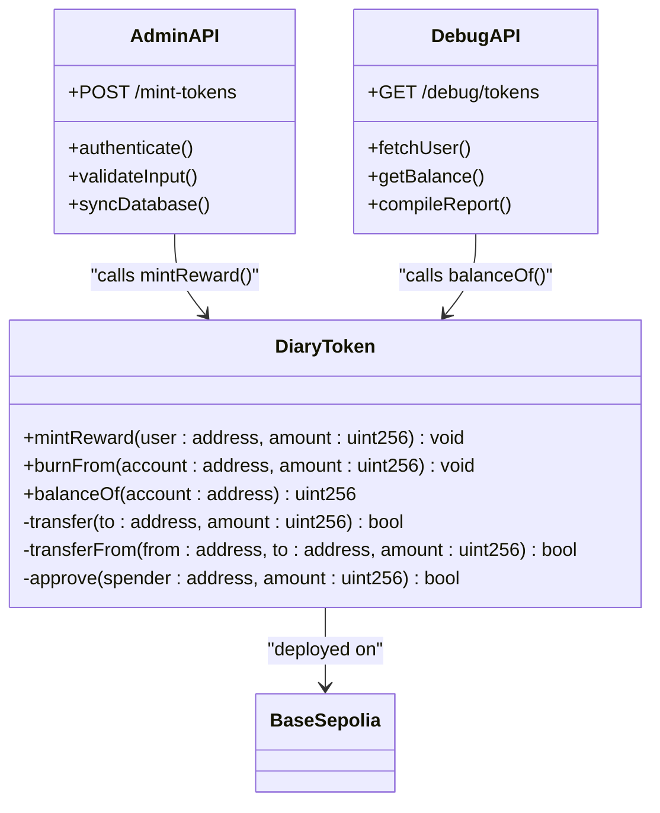

# Admin & Debug API

<cite>
**Referenced Files in This Document**   
- [mint-tokens/route.ts](file://app/api/admin/mint-tokens/route.ts)
- [tokens/route.ts](file://app/api/debug/tokens/route.ts)
- [blockchain.ts](file://lib/blockchain.ts)
- [DiaryToken.sol](file://contracts/contracts/DiaryToken.sol)
- [hardhat.config.ts](file://contracts/hardhat.config.ts)
- [.env.example](file://.env.example)
</cite>

## Table of Contents
1. [Introduction](#introduction)
2. [Admin & Debug API Endpoints](#admin--debug-api-endpoints)
3. [Authentication & Security](#authentication--security)
4. [Blockchain Integration](#blockchain-integration)
5. [Development Safety Measures](#development-safety-measures)
6. [Test Scenarios](#test-scenarios)
7. [Logging & Audit Trails](#logging--audit-trails)
8. [Conclusion](#conclusion)

## Introduction

This document provides comprehensive documentation for the Admin & Debug API endpoints in the DiaryBeast application. These endpoints are specifically designed for development and testing purposes, enabling administrators to manually mint DIARY tokens to user wallets and debug token balances and transaction histories. The APIs are critical for testing the gamification and reward systems during development while maintaining strict security controls to prevent production misuse.

The Admin & Debug APIs serve as essential tools for developers and testers to simulate real-world scenarios, verify blockchain interactions, and troubleshoot issues without requiring actual user activity. These endpoints are intentionally restricted to development environments with multiple safety mechanisms to ensure they cannot be accidentally exposed in production.

**Section sources**
- [mint-tokens/route.ts](file://app/api/admin/mint-tokens/route.ts)
- [tokens/route.ts](file://app/api/debug/tokens/route.ts)

## Admin & Debug API Endpoints

### POST /api/admin/mint-tokens

The mint-tokens endpoint allows authorized administrators to manually mint DIARY tokens to a specified user wallet. This is primarily used during development and testing to simulate reward distribution without requiring users to complete actual diary entries.

**Request Parameters:**
- `userAddress` (string, required): The wallet address of the user to receive tokens
- `amount` (number, required): The number of DIARY tokens to mint (positive number)

**Response Structure:**
```json
{
  "success": true,
  "txHash": "0x...",
  "amount": 100,
  "newBalance": 150,
  "message": "Successfully minted 100 DIARY tokens"
}
```

**Error Responses:**
- `401 Unauthorized`: Invalid or missing admin API key
- `400 Bad Request`: Missing parameters or invalid amount
- `404 Not Found`: User not found in database
- `500 Internal Server Error`: Blockchain transaction failure

The endpoint performs several validation steps including authentication, parameter validation, user existence verification, blockchain token minting, and database synchronization to ensure consistency between on-chain and off-chain states.

**Section sources**
- [mint-tokens/route.ts](file://app/api/admin/mint-tokens/route.ts#L1-L73)

### GET /api/debug/tokens

The debug-tokens endpoint provides comprehensive token debugging information for a specified user address. This is invaluable for developers to inspect token balances, transaction histories, and system configurations during testing and troubleshooting.

**Query Parameters:**
- `address` (string, required): The wallet address to debug

**Response Structure:**
```json
{
  "user": {
    "address": "0x...",
    "coinsBalanceDB": 100,
    "onChainBalance": 100,
    "balanceError": null
  },
  "entries": {
    "total": 5,
    "recent": [...]
  },
  "rewards": {
    "total": 3,
    "totalAmount": 120,
    "recent": [...]
  },
  "contracts": {
    "tokenAddress": "0x...",
    "ownerPrivateKeySet": true
  }
}
```

The response includes both database-stored balances and real-time on-chain balances for comparison, recent entries and rewards for context, and contract configuration details. This comprehensive view helps identify synchronization issues between the database and blockchain.

**Section sources**
- [tokens/route.ts](file://app/api/debug/tokens/route.ts#L1-L86)

## Authentication & Security

### Admin Authentication

The Admin & Debug APIs implement a multi-layered security approach to ensure only authorized personnel can access these powerful endpoints. The primary authentication mechanism uses an API key-based system with environment-controlled values.

The mint-tokens endpoint requires the `x-admin-api-key` header with a value matching the `ADMIN_API_KEY` environment variable. In development, this defaults to `dev-admin-key-2024` when not explicitly set, while production deployments require a secure, randomly generated key.

```typescript
const ADMIN_API_KEY = process.env.ADMIN_API_KEY || 'dev-admin-key-2024';
```

This approach allows for easy development access while requiring explicit configuration for any potential production use, serving as a safety check against accidental exposure.

### Environment-Based Security

The system leverages environment variables to separate development and production configurations. The `.env.example` file reveals key security parameters:

```
ADMIN_API_KEY=your_admin_api_key_here
```

Additionally, the debug endpoint exposes configuration information through its response, including whether the owner private key is set, which helps developers verify their environment configuration without accessing server logs.

**Section sources**
- [mint-tokens/route.ts](file://app/api/admin/mint-tokens/route.ts#L4-L11)
- [.env.example](file://.env.example#L10-L13)

## Blockchain Integration

### DiaryToken Smart Contract

The Admin & Debug APIs integrate with the DiaryToken smart contract deployed on the Base Sepolia testnet. The contract implements a soul-bound ERC20 token system where tokens are non-transferable and tied to user wallets.

Key contract functions used by the APIs:
- `mintReward(address user, uint256 amount)`: Allows the contract owner (backend) to mint tokens to user addresses
- `balanceOf(address account)`: Returns the token balance of a specified address
- `burnFrom(address account, uint256 amount)`: Allows the contract owner to burn tokens from user addresses (for purchases)

The contract enforces non-transferability by reverting all standard ERC20 transfer functions:
```solidity
function transfer(address, uint256) public pure override returns (bool) {
    revert("DiaryToken: transfers are disabled");
}
```

This design ensures tokens remain soul-bound to user wallets, preventing trading or gifting while maintaining their value as engagement rewards.



**Diagram sources**
- [DiaryToken.sol](file://contracts/contracts/DiaryToken.sol#L1-L56)
- [mint-tokens/route.ts](file://app/api/admin/mint-tokens/route.ts#L1-L73)
- [tokens/route.ts](file://app/api/debug/tokens/route.ts#L1-L86)

**Section sources**
- [DiaryToken.sol](file://contracts/contracts/DiaryToken.sol#L1-L56)
- [blockchain.ts](file://lib/blockchain.ts#L1-L112)

### Blockchain Client Integration

The `blockchain.ts` library provides the interface between the API endpoints and the blockchain network. It uses viem to create wallet and public clients for interacting with the Base Sepolia network.

Key functions:
- `mintTokens(userAddress, amount)`: Executes the mintReward function on the smart contract
- `getTokenBalance(userAddress)`: Reads the current token balance from the blockchain
- `syncUserBalance(userAddress, prisma)`: Synchronizes on-chain balances with the database

The wallet client requires the `OWNER_PRIVATE_KEY` environment variable, which signs transactions for minting and burning operations. The public client queries read-only data like balances without requiring authentication.

**Section sources**
- [blockchain.ts](file://lib/blockchain.ts#L1-L112)
- [hardhat.config.ts](file://contracts/hardhat.config.ts#L1-L41)

## Development Safety Measures

### Environment Variable Protection

The system implements multiple safeguards to prevent accidental production use of development endpoints. The hardhat configuration demonstrates this approach:

```typescript
accounts: process.env.OWNER_PRIVATE_KEY ? [process.env.OWNER_PRIVATE_KEY] : [],
```

This conditional pattern ensures that blockchain operations only proceed when the necessary private key is explicitly configured, preventing transactions in improperly configured environments.

### Feature Flagging and IP Restrictions

While not explicitly implemented in the current code, the architecture supports future safety enhancements:
- **Feature flagging**: The presence of debug endpoints could be controlled by a `DEBUG_MODE` environment variable
- **IP restrictions**: Admin endpoints could be restricted to specific development network IP ranges
- **Time-based deactivation**: Debug endpoints could automatically disable after a certain date in staging environments

The current implementation relies on the convention that these endpoints should not be deployed to production environments, with the understanding that they serve purely developmental purposes.

### Code Structure Safety

The separation of admin and debug endpoints into dedicated directories (`/admin/` and `/debug/`) provides clear organizational boundaries. This structure makes it easy to:
- Identify sensitive endpoints during code reviews
- Apply different security policies to different API sections
- Remove or restrict access to development-only endpoints

The naming convention also serves as a constant reminder to developers that these endpoints have elevated privileges and require careful handling.

**Section sources**
- [hardhat.config.ts](file://contracts/hardhat.config.ts#L19-L19)
- [blockchain.ts](file://lib/blockchain.ts#L39-L41)

## Test Scenarios

### Token Minting Verification

**Scenario:** Verify successful token minting and database synchronization
1. Call POST /api/admin/mint-tokens with valid admin key
2. Provide a valid user address and amount (e.g., 100 tokens)
3. Verify response includes transaction hash and updated balance
4. Call GET /api/debug/tokens to confirm on-chain and database balances match
5. Check that the user's coin balance in the database reflects the minted amount

This end-to-end test validates the complete token minting workflow from API request through blockchain transaction to database update.

### Balance Synchronization Testing

**Scenario:** Test database-blockchain balance synchronization
1. Manually update a user's database balance to differ from on-chain balance
2. Call POST /api/admin/mint-tokens with a small amount
3. Verify that the endpoint automatically syncs the database balance with the on-chain balance
4. Confirm the final balance equals the previous on-chain balance plus the minted amount

This scenario ensures the system maintains data consistency between the database and blockchain, preventing balance discrepancies.

### Error Condition Testing

**Scenario:** Validate proper error handling
1. Call POST /api/admin/mint-tokens without admin key (expect 401)
2. Call with invalid user address (expect 404)
3. Call with negative amount (expect 400)
4. Call GET /api/debug/tokens without address parameter (expect 400)
5. Verify all error responses include appropriate status codes and descriptive messages

These tests ensure the APIs provide clear feedback for invalid requests while maintaining security boundaries.

**Section sources**
- [mint-tokens/route.ts](file://app/api/admin/mint-tokens/route.ts#L1-L73)
- [tokens/route.ts](file://app/api/debug/tokens/route.ts#L1-L86)

## Logging & Audit Trails

### Server-Side Logging

Both Admin & Debug APIs implement comprehensive server-side logging to create audit trails for all operations. The mint-tokens endpoint includes error logging:

```typescript
console.error('Admin mint error:', error);
```

This logging captures any failures in the token minting process, including blockchain transaction errors, database issues, or validation problems. The logs include the full error object to facilitate debugging.

### Operational Audit Trail

The combination of API endpoints creates a natural audit trail:
- **mint-tokens calls**: Recorded in server logs with timestamps, IP addresses, and transaction details
- **debug-tokens calls**: Provide snapshots of user states at specific points in time
- **Database updates**: Prisma operations are logged and can be traced

For production-grade audit requirements, additional features could be implemented:
- Dedicated audit log table recording all admin actions
- Integration with external monitoring services
- Email notifications for admin operations
- Rate limiting to prevent abuse

The current logging provides sufficient visibility for development and testing while maintaining performance.

**Section sources**
- [mint-tokens/route.ts](file://app/api/admin/mint-tokens/route.ts#L70-L73)
- [tokens/route.ts](file://app/api/debug/tokens/route.ts#L84-L86)

## Conclusion

The Admin & Debug API endpoints provide essential tools for developing and testing the DiaryBeast application's token economy and gamification systems. The POST /api/admin/mint-tokens and GET /api/debug/tokens endpoints enable controlled token manipulation and comprehensive debugging while implementing multiple security layers to prevent production misuse.

Key strengths of the implementation include:
- Clear separation between development and production concerns
- Robust authentication using environment-controlled API keys
- Comprehensive error handling and logging
- Seamless integration with the DiaryToken smart contract
- Automatic synchronization between database and blockchain states

The safety measures, while currently relying on development conventions, provide a solid foundation that could be enhanced with additional protections like IP restrictions or feature flagging for more sensitive environments. These APIs strike an effective balance between developer convenience and system security, enabling efficient testing while protecting against accidental production exposure.

As the application evolves, these endpoints will remain crucial for verifying new features, troubleshooting issues, and ensuring the integrity of the token economy before user-facing releases.