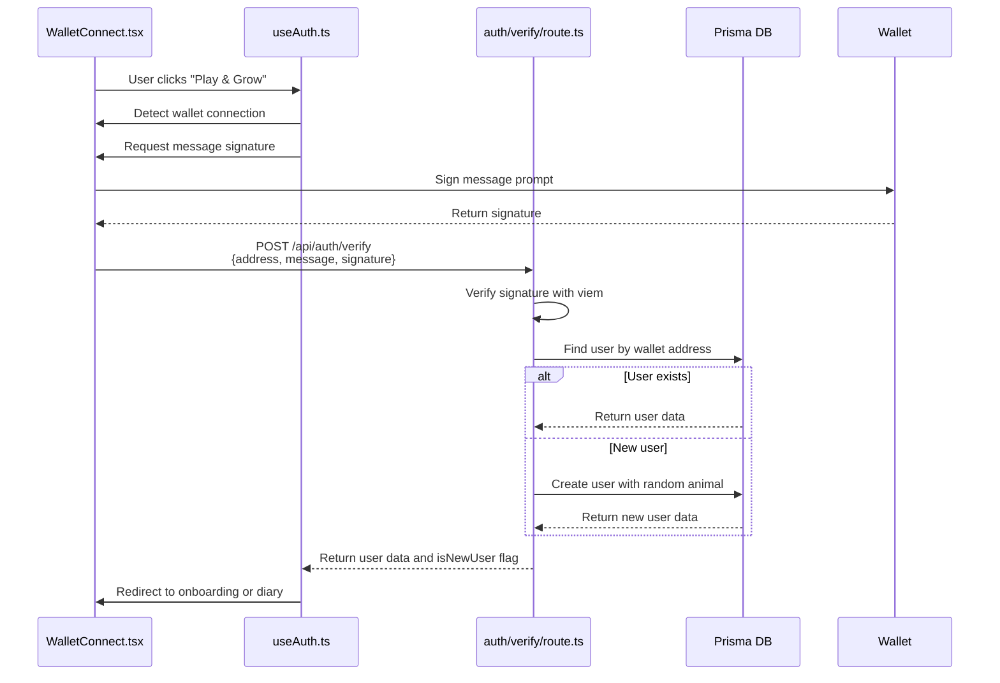
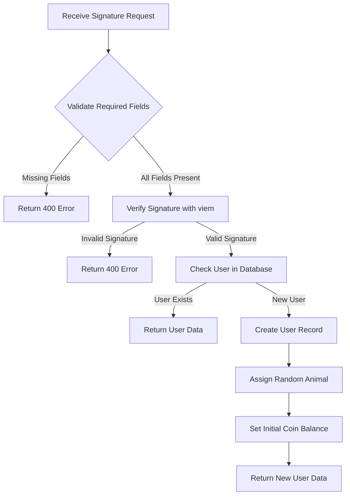

# Authentication API

<cite>
**Referenced Files in This Document**   
- [app/api/auth/verify/route.ts](file://app/api/auth/verify/route.ts)
- [lib/useAuth.ts](file://lib/useAuth.ts)
- [components/WalletConnect.tsx](file://components/WalletConnect.tsx)
</cite>

## Table of Contents
1. [Introduction](#introduction)
2. [Authentication Flow Overview](#authentication-flow-overview)
3. [API Endpoint Specification](#api-endpoint-specification)
4. [Request Payload Structure](#request-payload-structure)
5. [Response Schema](#response-schema)
6. [Security Considerations](#security-considerations)
7. [Integration with Wagmi and Blockchain Wallets](#integration-with-wagmi-and-blockchain-wallets)
8. [Frontend Implementation](#frontend-implementation)
9. [Error Handling](#error-handling)
10. [Session Management](#session-management)
11. [Conclusion](#conclusion)

## Introduction

The Authentication API provides wallet-based user authentication for the DiaryBeast application, enabling users to securely access the platform using their blockchain wallet credentials. The system implements a signature verification mechanism that authenticates users without requiring traditional passwords, leveraging the cryptographic capabilities of Ethereum-compatible wallets.

This documentation details the `/api/auth/verify` endpoint, which handles the core authentication process by verifying wallet signatures and establishing user sessions. The API integrates with the Wagmi library for wallet connectivity and viem for signature verification, creating a seamless Web3 authentication experience.

**Section sources**
- [app/api/auth/verify/route.ts](file://app/api/auth/verify/route.ts#L1-L80)
- [lib/useAuth.ts](file://lib/useAuth.ts#L1-L101)

## Authentication Flow Overview

The authentication process follows a three-step verification pattern that ensures secure user identification while maintaining compatibility with various wallet providers. The flow begins with the frontend requesting a signature from the user's wallet, followed by submission of the signed message to the verification endpoint, and concludes with user session establishment.



**Diagram sources**
- [app/api/auth/verify/route.ts](file://app/api/auth/verify/route.ts#L1-L80)
- [lib/useAuth.ts](file://lib/useAuth.ts#L1-L101)
- [components/WalletConnect.tsx](file://components/WalletConnect.tsx#L1-L35)

**Section sources**
- [app/api/auth/verify/route.ts](file://app/api/auth/verify/route.ts#L1-L80)
- [lib/useAuth.ts](file://lib/useAuth.ts#L1-L101)

## API Endpoint Specification

The authentication verification endpoint provides a POST method for validating wallet signatures and establishing user sessions. The endpoint follows RESTful conventions and returns appropriate HTTP status codes to indicate the outcome of authentication attempts.

### Endpoint Details
- **Method**: POST
- **Path**: `/api/auth/verify`
- **Content-Type**: `application/json`
- **Authentication**: None (signature-based authentication)
- **Rate Limiting**: Not currently implemented

### HTTP Status Codes
| Status Code | Meaning | Description |
|-----------|-------|-------------|
| 200 | OK | Authentication successful, user data returned |
| 400 | Bad Request | Missing required fields or invalid signature |
| 500 | Internal Server Error | Authentication failed due to server-side issues |

**Section sources**
- [app/api/auth/verify/route.ts](file://app/api/auth/verify/route.ts#L1-L80)

## Request Payload Structure

The authentication endpoint expects a JSON payload containing the user's wallet address, the signed message, and the resulting signature. This structure enables the server to verify that the user controls the specified wallet address.

### Request Body Schema
```json
{
  "address": "0x...",
  "message": "Sign this message to authenticate with DiaryBeast",
  "signature": "0x..."
}
```

### Field Descriptions
| Field | Type | Required | Description |
|------|------|---------|-------------|
| address | string | Yes | User's wallet address in hexadecimal format (0x...) |
| message | string | Yes | The message that was signed by the wallet |
| signature | string | Yes | The cryptographic signature generated by the wallet |

The system validates all three fields before proceeding with signature verification. Missing any required field results in a 400 Bad Request response with an appropriate error message.

**Section sources**
- [app/api/auth/verify/route.ts](file://app/api/auth/verify/route.ts#L6-L15)
- [lib/useAuth.ts](file://lib/useAuth.ts#L28-L38)

## Response Schema

Upon successful authentication, the API returns a JSON response containing the user's data and authentication status. The response structure is designed to provide all necessary information for the frontend to manage the user session and navigate appropriately.

### Successful Response (200 OK)
```json
{
  "success": true,
  "user": {
    "id": "string",
    "walletAddress": "string",
    "selectedAnimal": "cat|dog|null",
    "onboardingCompleted": "boolean",
    "coinsBalance": "number",
    "livesRemaining": "number",
    "currentStreak": "number",
    "longestStreak": "number"
  },
  "isNewUser": "boolean"
}
```

### Error Response (400/500)
```json
{
  "error": "string"
}
```

### Response Field Descriptions
| Field | Type | Description |
|------|------|-------------|
| success | boolean | Indicates successful authentication |
| user | object | User profile data from the database |
| user.id | string | Unique identifier for the user |
| user.walletAddress | string | Lowercase wallet address |
| user.selectedAnimal | string/null | User's chosen pet type (cat/dog) |
| user.onboardingCompleted | boolean | Whether user has completed onboarding |
| user.coinsBalance | number | Current coin balance |
| user.livesRemaining | number | Current pet lives |
| user.currentStreak | number | Current daily entry streak |
| user.longestStreak | number | Longest recorded streak |
| isNewUser | boolean | Flag indicating if this is the user's first authentication |

The `isNewUser` flag is particularly important for determining navigation flow, as new users are redirected to the onboarding experience while existing users proceed directly to the diary interface.

**Section sources**
- [app/api/auth/verify/route.ts](file://app/api/auth/verify/route.ts#L59-L78)
- [lib/useAuth.ts](file://lib/useAuth.ts#L80-L95)

## Security Considerations

The authentication system implements several security measures to protect against common attack vectors while maintaining usability across different wallet types.

### Signature Verification
The system uses viem's `verifyMessage` function to cryptographically verify that the provided signature corresponds to the specified wallet address and message. This ensures that only the owner of the private key associated with the wallet can successfully authenticate.



**Diagram sources**
- [app/api/auth/verify/route.ts](file://app/api/auth/verify/route.ts#L16-L58)

### Smart Wallet Compatibility
The system includes a fallback mechanism for Smart Wallets (like Coinbase Smart Wallet) that may use different signature formats. When standard signature verification fails, the system logs a warning and proceeds with authentication, acknowledging that this is a temporary measure for the alpha/testnet phase.

> **Note**: The code includes a clear warning that proper Smart Wallet signature verification should be implemented in production to maintain security standards.

### Replay Attack Protection
While the current implementation does not include explicit nonce management or timestamp validation, the static message "Sign this message to authenticate with DiaryBeast" presents a potential vulnerability to replay attacks. Future implementations should incorporate dynamic nonces or timestamps to enhance security.

**Section sources**
- [app/api/auth/verify/route.ts](file://app/api/auth/verify/route.ts#L16-L39)

## Integration with Wagmi and Blockchain Wallets

The authentication system integrates with the Wagmi library to provide seamless connectivity with Ethereum-compatible wallets. This integration enables users to authenticate using popular wallet providers such as MetaMask, Coinbase Wallet, and others that support the Ethereum provider standard.

### Wagmi Configuration
The system leverages Wagmi's `useAccount` and `useSignMessage` hooks to detect wallet connections and request message signatures. These hooks abstract the complexities of wallet connectivity, providing a consistent interface regardless of the underlying wallet provider.

The integration is configured through the project's dependency management, with Wagmi and viem properly versioned in the package configuration to ensure compatibility.

**Section sources**
- [lib/useAuth.ts](file://lib/useAuth.ts#L2-L10)
- [pnpm-lock.yaml](file://pnpm-lock.yaml#L9021-L9033)

## Frontend Implementation

The frontend implementation of the authentication flow is centered around the `useAuth` custom hook, which orchestrates the interaction between the user interface and the authentication API.

### WalletConnect Component
The `WalletConnect` component provides the user interface for initiating authentication. When a user clicks the "Play & Grow" button, the component detects their wallet connection status and either displays connection options or shows the connected wallet information.

```mermaid
classDiagram
class useAuth {
+address : string
+isConnected : boolean
+user : User | null
+loading : boolean
+error : string | null
+authenticate() : Promise~void~
+isAuthenticated : boolean
}
class WalletConnect {
+render() : JSX.Element
}
useAuth --> WalletConnect : "used by"
useAuth --> "auth/verify/route.ts" : "calls"
WalletConnect --> useAccount : "uses"
WalletConnect --> useSignMessage : "uses"
```

**Diagram sources**
- [lib/useAuth.ts](file://lib/useAuth.ts#L1-L101)
- [components/WalletConnect.tsx](file://components/WalletConnect.tsx#L1-L35)

### Authentication Process
The authentication process in the frontend involves:
1. Detecting the connected wallet address using `useAccount`
2. Requesting a signature for the authentication message using `useSignMessage`
3. Submitting the signature and wallet information to the verification endpoint
4. Handling the response to establish the user session
5. Redirecting to the appropriate application section based on user status

The implementation includes a 60-second timeout for signature requests to prevent indefinite waiting if the user does not respond to the wallet prompt.

**Section sources**
- [lib/useAuth.ts](file://lib/useAuth.ts#L25-L95)
- [components/WalletConnect.tsx](file://components/WalletConnect.tsx#L1-L35)

## Error Handling

The authentication system implements comprehensive error handling to provide meaningful feedback to users and developers while maintaining security.

### Client-Side Error Handling
The `useAuth` hook captures various error conditions and presents user-friendly messages:
- **Signature Rejection**: When users reject the signature request in their wallet
- **Timeout**: When users do not respond to the signature prompt within 60 seconds
- **Network Issues**: When the API request fails due to connectivity problems
- **Authentication Failure**: When the server rejects the authentication attempt

```mermaid
flowchart TD
A[Authentication Attempt] --> B{Signature Successful?}
B --> |No| C{Error Type}
C --> |User Rejected| D[Show "Signature rejected" message]
C --> |Timeout| E[Show "Signature request timed out" message]
C --> |Other Error| F[Show generic error message]
B --> |Yes| G[Call API Endpoint]
G --> H{API Success?}
H --> |No| I[Show error from API response]
H --> |Yes| J[Process User Data]
```

**Diagram sources**
- [lib/useAuth.ts](file://lib/useAuth.ts#L65-L85)

### Server-Side Error Handling
The API endpoint implements structured error handling:
- **400 Bad Request**: For missing fields or invalid signatures
- **500 Internal Server Error**: For unexpected server-side issues
- Detailed logging of authentication errors for debugging purposes

The server logs all authentication errors to facilitate monitoring and troubleshooting while avoiding the exposure of sensitive information in client responses.

**Section sources**
- [lib/useAuth.ts](file://lib/useAuth.ts#L60-L85)
- [app/api/auth/verify/route.ts](file://app/api/auth/verify/route.ts#L70-L78)

## Session Management

The authentication system manages user sessions through client-side state rather than traditional server-managed sessions. This approach aligns with the stateless nature of blockchain authentication while providing a seamless user experience.

### State Management
The `useAuth` hook uses React's `useState` to maintain the following session-related state:
- **user**: The authenticated user's profile data
- **loading**: Authentication process status
- **error**: Any authentication errors
- **hasAttempted**: Whether an authentication attempt has been made

The hook also uses `useRouter` to handle navigation after successful authentication, redirecting new users to the onboarding flow and existing users to the diary interface.

### Session Persistence
Currently, the system does not implement persistent session storage. Users must re-authenticate each time they visit the application. Future enhancements could include:
- Local storage of authentication tokens
- Refresh token mechanisms
- Session expiration policies

The absence of persistent sessions enhances security by requiring explicit user consent for each session while potentially impacting user experience through repeated authentication prompts.

**Section sources**
- [lib/useAuth.ts](file://lib/useAuth.ts#L15-L23)
- [lib/useAuth.ts](file://lib/useAuth.ts#L80-L95)

## Conclusion

The Authentication API provides a secure, wallet-based authentication mechanism that enables users to access the DiaryBeast application using their blockchain credentials. The system effectively integrates with the Wagmi library and viem verification tools to create a seamless Web3 authentication experience.

Key strengths of the implementation include:
- Cryptographic verification of wallet ownership
- Seamless integration with popular wallet providers
- Clear distinction between new and existing users
- Comprehensive error handling
- Smart Wallet compatibility (with appropriate caveats)

Areas for potential improvement include:
- Implementation of nonce-based protection against replay attacks
- Addition of rate limiting to prevent abuse
- Configuration of proper CORS policies
- Implementation of persistent session management
- Enhanced Smart Wallet signature verification for production

The current implementation serves well for the alpha/testnet phase, with clear pathways for enhancement as the application moves toward production deployment.

**Section sources**
- [app/api/auth/verify/route.ts](file://app/api/auth/verify/route.ts#L1-L80)
- [lib/useAuth.ts](file://lib/useAuth.ts#L1-L101)