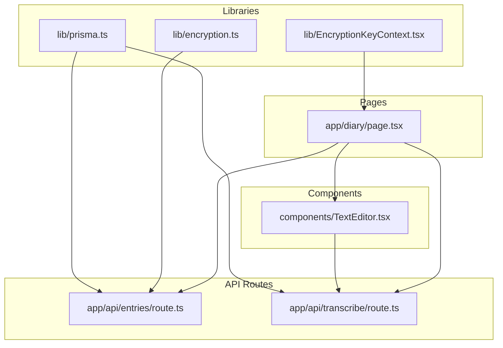
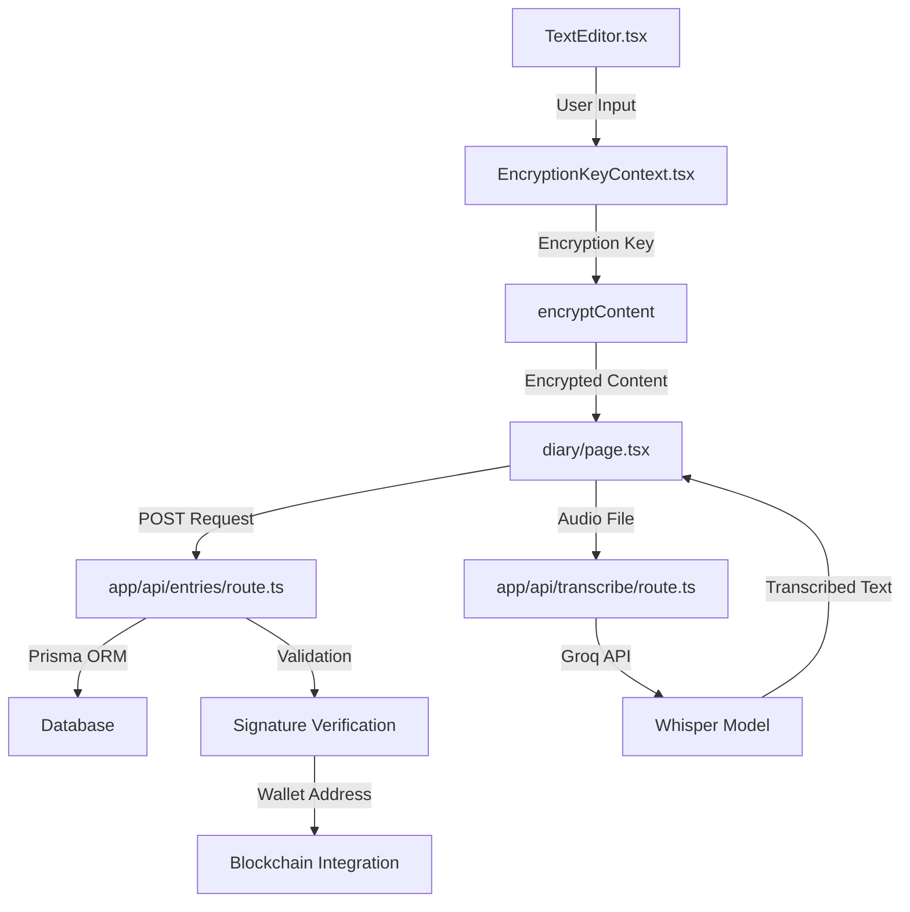
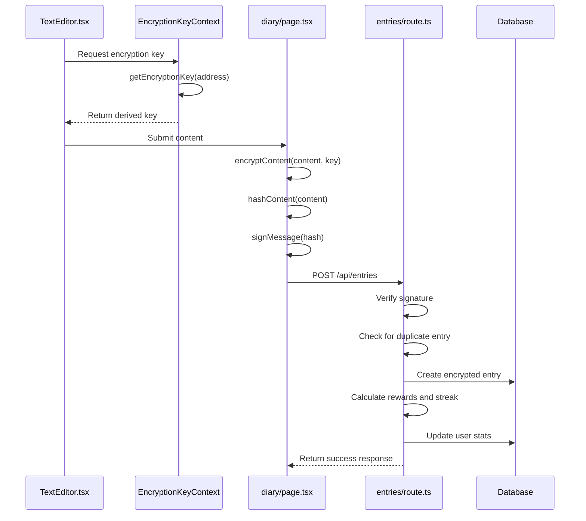
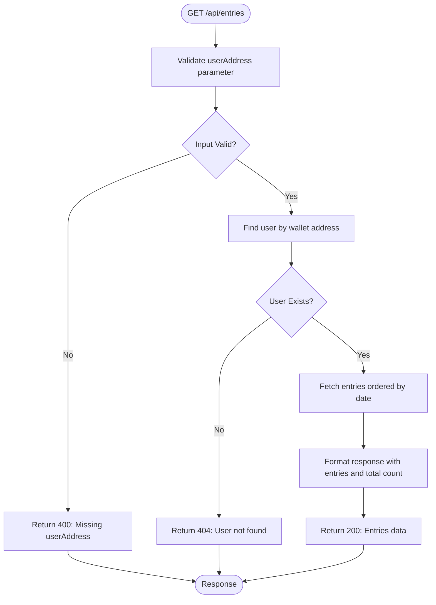
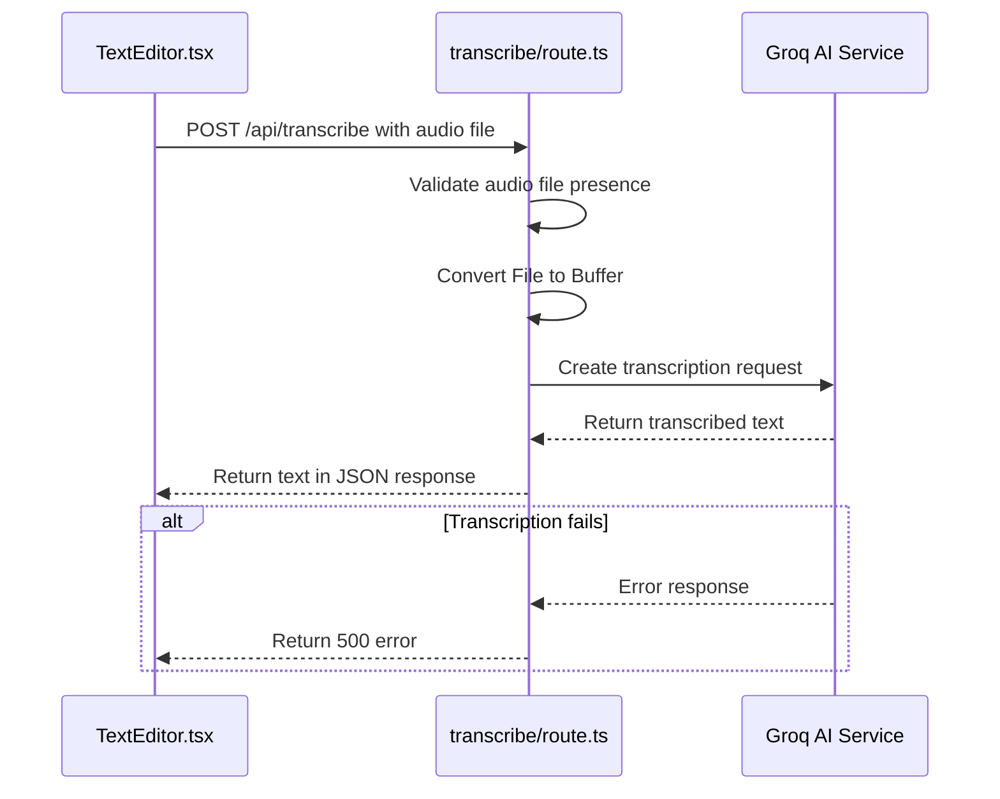
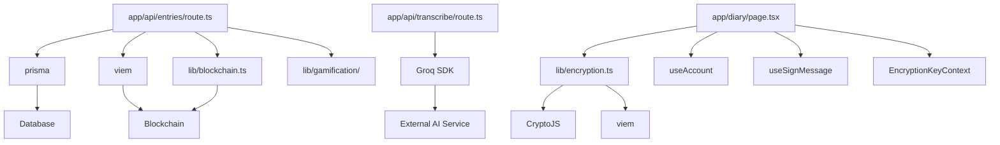

# Entries API

<cite>
**Referenced Files in This Document**   
- [app/api/entries/route.ts](file://app/api/entries/route.ts)
- [app/api/transcribe/route.ts](file://app/api/transcribe/route.ts)
- [lib/encryption.ts](file://lib/encryption.ts)
- [components/TextEditor.tsx](file://components/TextEditor.tsx)
- [lib/EncryptionKeyContext.tsx](file://lib/EncryptionKeyContext.tsx)
- [app/diary/page.tsx](file://app/diary/page.tsx)
</cite>

## Table of Contents
1. [Introduction](#introduction)
2. [Project Structure](#project-structure)
3. [Core Components](#core-components)
4. [Architecture Overview](#architecture-overview)
5. [Detailed Component Analysis](#detailed-component-analysis)
6. [Dependency Analysis](#dependency-analysis)
7. [Performance Considerations](#performance-considerations)
8. [Troubleshooting Guide](#troubleshooting-guide)
9. [Conclusion](#conclusion)

## Introduction
This document provides comprehensive API documentation for the Entries API endpoints in the DiaryBeast application. It covers the CRUD operations for diary entries via `app/api/entries/route.ts` and audio-to-text transcription functionality through `app/api/transcribe/route.ts`. The documentation details client-side encryption using `lib/encryption.ts`, data flow from UI components like `TextEditor.tsx`, integration with Prisma ORM, and key handling via `EncryptionKeyContext.tsx`. It also explains the integration with SWR for data fetching in `diary/page.tsx`, including request/response payloads, error handling, and privacy safeguards.

## Project Structure
The Entries API is organized within the Next.js app directory structure, following a modular approach that separates concerns between API routes, components, and utility libraries. The core entry management functionality resides in dedicated API route files, while encryption and state management are handled by shared libraries.

**Diagram sources**
- [app/api/entries/route.ts](file://app/api/entries/route.ts)
- [app/api/transcribe/route.ts](file://app/api/transcribe/route.ts)
- [components/TextEditor.tsx](file://components/TextEditor.tsx)
- [lib/encryption.ts](file://lib/encryption.ts)
- [lib/EncryptionKeyContext.tsx](file://lib/EncryptionKeyContext.tsx)
- [app/diary/page.tsx](file://app/diary/page.tsx)

**Section sources**
- [app/api/entries/route.ts](file://app/api/entries/route.ts)
- [app/api/transcribe/route.ts](file://app/api/transcribe/route.ts)

## Core Components
The Entries API consists of two primary endpoints: one for managing diary entries and another for transcription services. These components work together with client-side encryption and UI integration to provide a secure and user-friendly experience.

**Section sources**
- [app/api/entries/route.ts](file://app/api/entries/route.ts#L7-L200)
- [app/api/transcribe/route.ts](file://app/api/transcribe/route.ts#L5-L47)

## Architecture Overview
The Entries API follows a layered architecture with clear separation between presentation, business logic, and data access layers. The system integrates client-side encryption with server-side validation and storage, ensuring data privacy while maintaining functionality.

**Diagram sources**
- [app/api/entries/route.ts](file://app/api/entries/route.ts)
- [app/api/transcribe/route.ts](file://app/api/transcribe/route.ts)
- [components/TextEditor.tsx](file://components/TextEditor.tsx)
- [lib/EncryptionKeyContext.tsx](file://lib/EncryptionKeyContext.tsx)
- [app/diary/page.tsx](file://app/diary/page.tsx)

## Detailed Component Analysis

### Entries API Endpoint Analysis
The Entries API endpoint handles both creation and retrieval of diary entries with comprehensive validation, encryption, and reward systems.

#### POST Method for Creating Encrypted Diary Entries
The POST method implements client-side encryption using deterministic key derivation from the user's wallet address. This ensures that diary content is encrypted before leaving the client device.

**Diagram sources**
- [app/api/entries/route.ts](file://app/api/entries/route.ts#L7-L200)
- [lib/encryption.ts](file://lib/encryption.ts#L8-L16)
- [lib/EncryptionKeyContext.tsx](file://lib/EncryptionKeyContext.tsx#L37-L43)
- [app/diary/page.tsx](file://app/diary/page.tsx#L66-L127)

#### GET Method for Retrieving Entry History
The GET method provides access to a user's entry history with pagination and filtering capabilities.

**Diagram sources**
- [app/api/entries/route.ts](file://app/api/entries/route.ts#L202-L237)
- [app/diary/page.tsx](file://app/diary/page.tsx#L37-L56)

### Transcription API Endpoint Analysis
The transcription service integrates with external AI services to convert audio input to text, enhancing accessibility and user convenience.

#### Transcription Workflow with External AI Services
The transcription workflow handles audio file processing and conversion using the Groq AI platform with Whisper model.

**Diagram sources**
- [app/api/transcribe/route.ts](file://app/api/transcribe/route.ts#L5-L47)
- [components/TextEditor.tsx](file://components/TextEditor.tsx#L150-L190)

## Dependency Analysis
The Entries API has well-defined dependencies between components, ensuring loose coupling and high cohesion. The system relies on external services for AI transcription and blockchain integration while maintaining core functionality within the application.

**Diagram sources**
- [app/api/entries/route.ts](file://app/api/entries/route.ts)
- [app/api/transcribe/route.ts](file://app/api/transcribe/route.ts)
- [lib/encryption.ts](file://lib/encryption.ts)
- [lib/EncryptionKeyContext.tsx](file://lib/EncryptionKeyContext.tsx)
- [app/diary/page.tsx](file://app/diary/page.tsx)

**Section sources**
- [app/api/entries/route.ts](file://app/api/entries/route.ts)
- [app/api/transcribe/route.ts](file://app/api/transcribe/route.ts)
- [lib/encryption.ts](file://lib/encryption.ts)
- [lib/EncryptionKeyContext.tsx](file://lib/EncryptionKeyContext.tsx)

## Performance Considerations
The Entries API is designed with performance in mind, implementing several optimizations:

- **Client-side encryption**: Reduces server processing load by encrypting data before transmission
- **Batched data fetching**: The diary page loads user data and entries in parallel using Promise.all
- **Caching strategy**: Uses cache:'no-store' for fresh data while allowing browser-level caching
- **File size limits**: Audio transcription endpoint should implement size validation (current implementation lacks this)
- **Processing timeouts**: External AI services have inherent timeout considerations that affect response times

The system currently lacks explicit file size validation for audio uploads, which could lead to performance issues with large files. Implementing size checks before processing would improve reliability.

## Troubleshooting Guide
Common issues and their solutions for the Entries API:

**Section sources**
- [app/api/entries/route.ts](file://app/api/entries/route.ts)
- [app/api/transcribe/route.ts](file://app/api/transcribe/route.ts)
- [app/diary/page.tsx](file://app/diary/page.tsx)

### Common Error Codes
| Error Code | Scenario | Resolution |
|----------|---------|------------|
| 400 | Missing required fields (userAddress, encryptedContent, signature, contentHash) | Ensure all required fields are included in the request |
| 400 | Invalid signature | Verify the signature was generated correctly from the content hash |
| 404 | User not found | Ensure the userAddress corresponds to an existing user |
| 409 | Entry already exists for today | Users can only create one entry per day |
| 500 | Failed to create entry | Check server logs for specific error details |

### Integration Issues
- **Encryption key not available**: Ensure the user is connected via wallet before attempting to create an entry
- **Transcription fails**: Verify microphone permissions and check network connectivity to Groq API
- **SWR data not updating**: The diary page uses cache:'no-store' with timestamp parameter to ensure fresh data on each load

## Conclusion
The Entries API provides a robust foundation for managing encrypted diary entries with integrated transcription services. The architecture prioritizes user privacy through client-side encryption while maintaining a seamless user experience. Key strengths include deterministic key derivation, comprehensive reward systems, and tight integration between UI components and API endpoints. Future improvements could include implementing file size limits for audio uploads and enhancing error handling for external service failures.