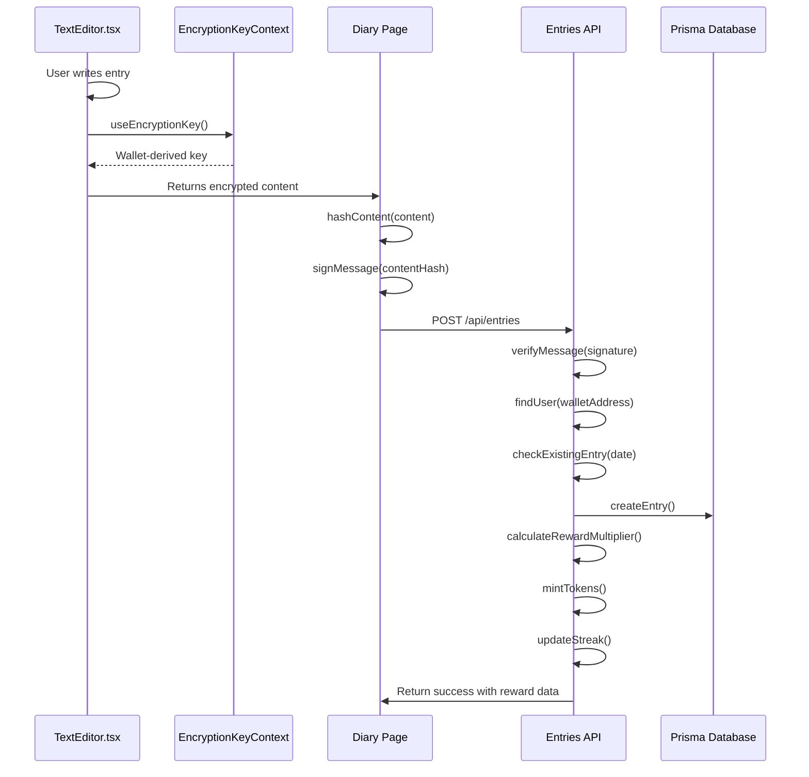
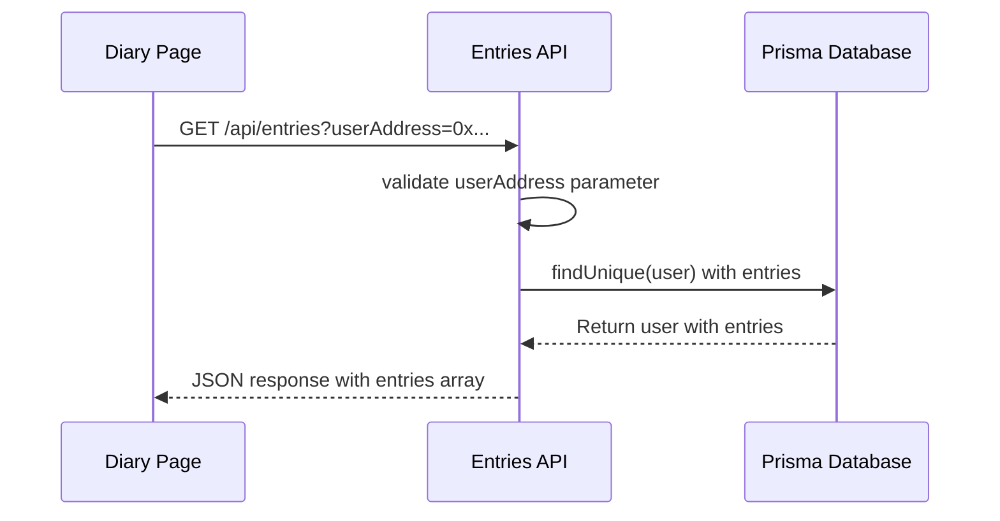
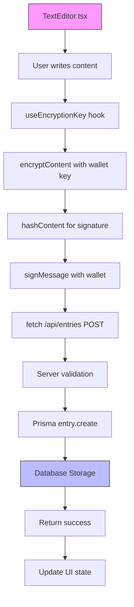
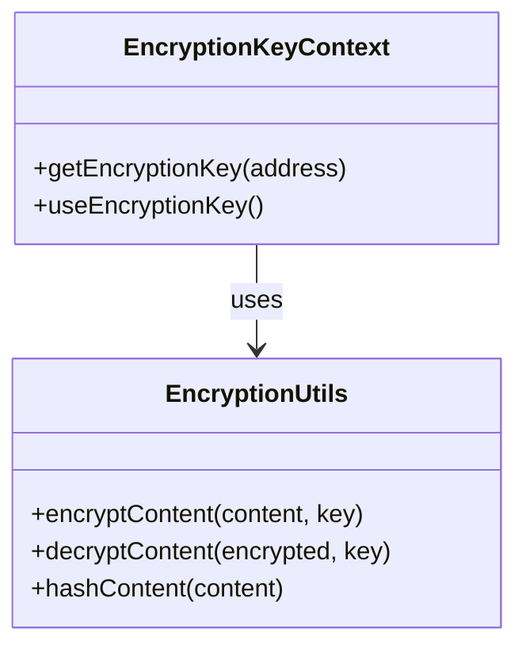
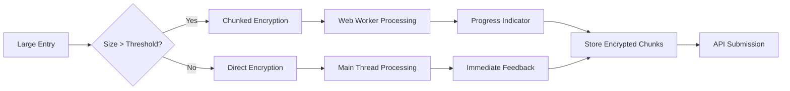

# Entry Management

<cite>
**Referenced Files in This Document**   
- [app/api/entries/route.ts](file://app/api/entries/route.ts)
- [lib/encryption.ts](file://lib/encryption.ts)
- [lib/EncryptionKeyContext.tsx](file://lib/EncryptionKeyContext.tsx)
- [components/TextEditor.tsx](file://components/TextEditor.tsx)
- [app/diary/page.tsx](file://app/diary/page.tsx)
- [prisma/schema.prisma](file://prisma/schema.prisma)
</cite>

## Table of Contents
1. [Introduction](#introduction)
2. [POST Method: Create Encrypted Entry](#post-method-create-encrypted-entry)
3. [GET Method: Retrieve Entry History](#get-method-retrieve-entry-history)
4. [Data Flow and Integration](#data-flow-and-integration)
5. [Request/Response Schemas](#requestresponse-schemas)
6. [Security Considerations](#security-considerations)
7. [Performance Implications](#performance-implications)
8. [Error Handling](#error-handling)
9. [Usage Examples](#usage-examples)

## Introduction
The Entry Management endpoint provides secure, wallet-authenticated access to diary entry creation and retrieval. This API implements client-side encryption using wallet-derived keys, ensuring end-to-end privacy while maintaining blockchain-based authentication. The system integrates with the user interface through SWR-based data fetching and persists encrypted content via Prisma ORM to a PostgreSQL database.

**Section sources**
- [app/api/entries/route.ts](file://app/api/entries/route.ts#L7-L200)
- [app/api/entries/route.ts](file://app/api/entries/route.ts#L202-L237)

## POST Method: Create Encrypted Entry
The POST endpoint creates a new encrypted diary entry with wallet-based authentication and signature verification. The process involves client-side encryption using a deterministic key derived from the user's wallet address, content hashing, message signing, and server-side validation.

The endpoint implements several business rules:
- Prevents duplicate entries on the same day
- Validates wallet ownership through signature verification
- Supports both EOA and Smart Wallet signatures
- Triggers gamification rewards based on streaks and pet condition
- Restores lives and updates user statistics



**Diagram sources**
- [app/api/entries/route.ts](file://app/api/entries/route.ts#L7-L200)
- [lib/encryption.ts](file://lib/encryption.ts#L8-L16)
- [lib/EncryptionKeyContext.tsx](file://lib/EncryptionKeyContext.tsx#L37-L43)
- [components/TextEditor.tsx](file://components/TextEditor.tsx#L12-L246)
- [app/diary/page.tsx](file://app/diary/page.tsx#L66-L127)

**Section sources**
- [app/api/entries/route.ts](file://app/api/entries/route.ts#L7-L200)
- [lib/encryption.ts](file://lib/encryption.ts#L8-L16)
- [lib/EncryptionKeyContext.tsx](file://lib/EncryptionKeyContext.tsx#L37-L43)

## GET Method: Retrieve Entry History
The GET endpoint retrieves paginated entry history for a specific user wallet address. The endpoint implements wallet-based access control, ensuring users can only access their own entries. Entries are returned in descending chronological order with a default limit of 20 records.

The retrieval process includes:
- Wallet address validation from query parameters
- User existence verification in the database
- Entry fetching with date-based sorting
- Return of encrypted content that must be decrypted client-side



**Diagram sources**
- [app/api/entries/route.ts](file://app/api/entries/route.ts#L202-L237)
- [app/diary/page.tsx](file://app/diary/page.tsx#L28-L44)

**Section sources**
- [app/api/entries/route.ts](file://app/api/entries/route.ts#L202-L237)

## Data Flow and Integration
The entry management system follows a complete data flow from user interface to persistent storage. The process begins in the TextEditor component, flows through client-side encryption, is transmitted via API routes, and is stored in the database with proper relationships.



**Diagram sources**
- [components/TextEditor.tsx](file://components/TextEditor.tsx#L12-L246)
- [lib/EncryptionKeyContext.tsx](file://lib/EncryptionKeyContext.tsx#L37-L43)
- [lib/encryption.ts](file://lib/encryption.ts#L8-L21)
- [app/diary/page.tsx](file://app/diary/page.tsx#L66-L127)
- [app/api/entries/route.ts](file://app/api/entries/route.ts#L7-L200)

**Section sources**
- [components/TextEditor.tsx](file://components/TextEditor.tsx#L12-L246)
- [app/diary/page.tsx](file://app/diary/page.tsx#L66-L127)

## Request/Response Schemas
### POST Request Schema
```json
{
  "userAddress": "string",
  "encryptedContent": "string",
  "signature": "string",
  "contentHash": "string",
  "wordCount": "number"
}
```

### POST Success Response Schema
```json
{
  "success": true,
  "entry": {
    "id": "string",
    "date": "string"
  },
  "reward": {
    "amount": "number",
    "baseAmount": "number",
    "multiplier": "number",
    "multiplierReason": "string",
    "streakBonus": "number",
    "baseStreakBonus": "number",
    "totalAmount": "number",
    "type": "string",
    "txHash": "string",
    "milestone": "string"
  },
  "updatedUser": {
    "coinsBalance": "number",
    "currentStreak": "number",
    "livesRemaining": "number"
  },
  "livesRestored": "number",
  "oldLives": "number"
}
```

### GET Response Schema
```json
{
  "entries": [
    {
      "id": "string",
      "userId": "string",
      "encryptedContent": "string",
      "signature": "string",
      "contentHash": "string",
      "wordCount": "number",
      "date": "string",
      "createdAt": "string"
    }
  ],
  "total": "number"
}
```

**Section sources**
- [app/api/entries/route.ts](file://app/api/entries/route.ts#L7-L200)
- [prisma/schema.prisma](file://prisma/schema.prisma#L45-L60)

## Security Considerations
The system implements multiple security layers to protect user data:

### Key Derivation
The encryption key is deterministically derived from the user's wallet address using keccak256 hashing with a salt. This ensures the same key is generated across devices while preventing key exposure.



**Diagram sources**
- [lib/encryption.ts](file://lib/encryption.ts#L8-L21)
- [lib/EncryptionKeyContext.tsx](file://lib/EncryptionKeyContext.tsx#L37-L43)

### Ciphertext Storage
Encrypted content is stored in the database with the following properties:
- Deterministic encryption key derivation ensures consistent decryption
- Content hashing prevents tampering
- Signature verification proves wallet ownership
- No plaintext content ever reaches the server

### Replay Attack Prevention
The system prevents replay attacks through:
- Unique content hashing for each entry
- Signature verification of content hash
- Daily entry limits (one per day)
- Timestamp validation in signature verification

**Section sources**
- [lib/encryption.ts](file://lib/encryption.ts#L8-L21)
- [app/api/entries/route.ts](file://app/api/entries/route.ts#L7-L200)

## Performance Implications
Client-side encryption introduces performance considerations, particularly on mobile devices:

### Mobile Device Impact
- AES encryption performance varies by device capability
- Large entries (>1000 words) may cause UI lag
- Memory usage increases with content size
- Battery consumption during encryption process

### Optimization Strategies
- Implement chunked encryption for large entries
- Use web workers to prevent UI blocking
- Cache encryption keys to avoid repeated derivation
- Provide progress indicators during encryption
- Optimize CryptoJS usage with proper configuration



**Diagram sources**
- [lib/encryption.ts](file://lib/encryption.ts#L14-L16)
- [components/TextEditor.tsx](file://components/TextEditor.tsx#L12-L246)

**Section sources**
- [lib/encryption.ts](file://lib/encryption.ts#L14-L16)
- [components/TextEditor.tsx](file://components/TextEditor.tsx#L12-L246)

## Error Handling
The API implements comprehensive error handling for various failure scenarios:

### POST Endpoint Errors
| Status Code | Error Type | Description |
|-----------|----------|-------------|
| 400 | Missing Fields | Required fields not provided |
| 400 | Invalid Signature | Signature verification failed |
| 404 | User Not Found | Wallet address not registered |
| 409 | Entry Exists | Entry already created for today |
| 500 | Server Error | Internal server error during processing |

### GET Endpoint Errors
| Status Code | Error Type | Description |
|-----------|----------|-------------|
| 400 | Missing Address | userAddress parameter not provided |
| 404 | User Not Found | Wallet address not registered |
| 500 | Server Error | Internal server error during retrieval |

### Decryption Failure Handling
When decryption fails, the client should:
- Verify the correct wallet is connected
- Check for browser storage issues
- Attempt reconnection to wallet provider
- Display user-friendly error messages
- Provide recovery options

**Section sources**
- [app/api/entries/route.ts](file://app/api/entries/route.ts#L7-L200)
- [app/api/entries/route.ts](file://app/api/entries/route.ts#L202-L237)

## Usage Examples
### POST Request Example
```json
{
  "userAddress": "0x742d35Cc6634C0532925a3b8D4C0cB507C97c0cF",
  "encryptedContent": "U2FsdGVkX1+...",
  "signature": "0x88ff22...",
  "contentHash": "0x98a7b6...",
  "wordCount": 142
}
```

### POST Response Example
```json
{
  "success": true,
  "entry": {
    "id": "clx8a1n3m0000v56789abcde",
    "date": "2024-01-15T10:30:00.000Z"
  },
  "reward": {
    "amount": 10,
    "baseAmount": 10,
    "multiplier": 1,
    "multiplierReason": "normal",
    "streakBonus": 0,
    "baseStreakBonus": 0,
    "totalAmount": 10,
    "type": "daily_entry",
    "txHash": "mint_failed",
    "milestone": null
  },
  "updatedUser": {
    "coinsBalance": 150,
    "currentStreak": 3,
    "livesRemaining": 9
  },
  "livesRestored": 2,
  "oldLives": 7
}
```

### GET Response Example
```json
{
  "entries": [
    {
      "id": "clx8a1n3m0000v56789abcde",
      "userId": "clx8a1n3m0000v56789abcde",
      "encryptedContent": "U2FsdGVkX1+...",
      "signature": "0x88ff22...",
      "contentHash": "0x98a7b6...",
      "wordCount": 142,
      "date": "2024-01-15T10:30:00.000Z",
      "createdAt": "2024-01-15T10:30:00.000Z"
    }
  ],
  "total": 1
}
```

**Section sources**
- [app/api/entries/route.ts](file://app/api/entries/route.ts#L7-L200)
- [app/api/entries/route.ts](file://app/api/entries/route.ts#L202-L237)