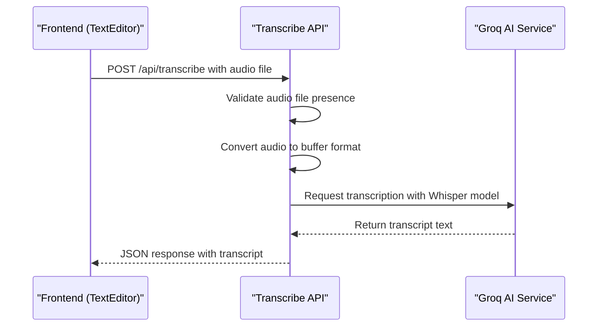
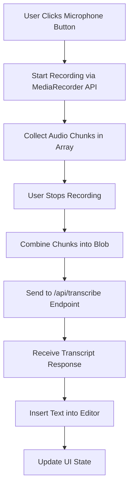
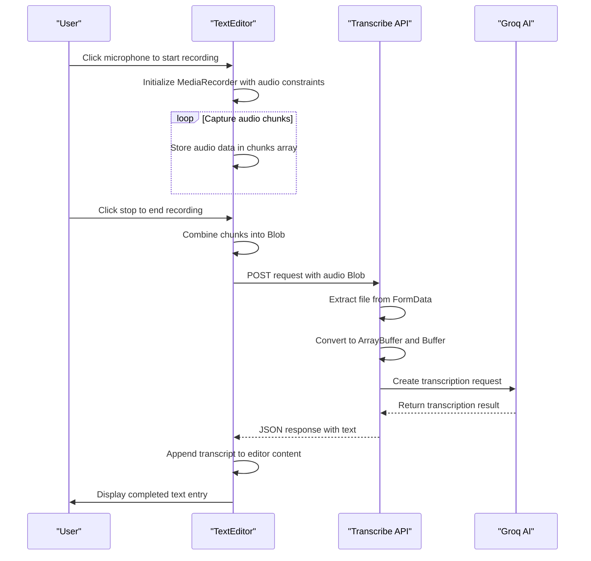
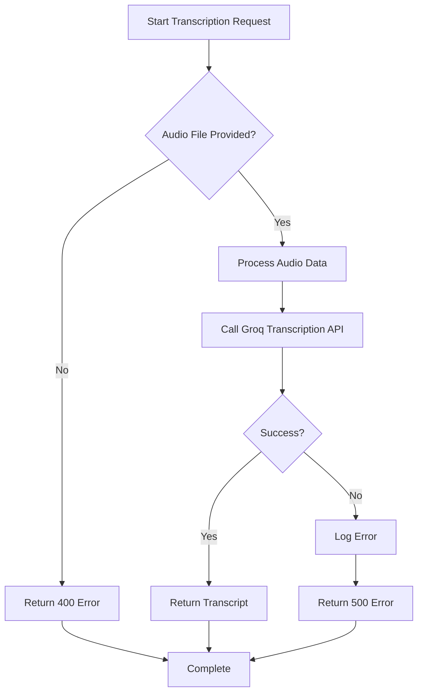

# Transcription Service

<cite>
**Referenced Files in This Document**   
- [app/api/transcribe/route.ts](file://app/api/transcribe/route.ts)
- [components/TextEditor.tsx](file://components/TextEditor.tsx)
- [app/diary/page.tsx](file://app/diary/page.tsx)
</cite>

## Table of Contents
1. [Introduction](#introduction)
2. [API Endpoint Specification](#api-endpoint-specification)
3. [Client-Side Workflow](#client-side-workflow)
4. [Audio Processing and Transcription Flow](#audio-processing-and-transcription-flow)
5. [Request and Response Specifications](#request-and-response-specifications)
6. [Error Handling and Reliability](#error-handling-and-reliability)
7. [Privacy and Security Measures](#privacy-and-security-measures)
8. [Performance and Configuration](#performance-and-configuration)
9. [Extension and Integration Guidance](#extension-and-integration-guidance)

## Introduction
The Transcription Service provides voice-to-text functionality for the DiaryBeast application, enabling users to record audio entries that are automatically converted to text transcripts. This service integrates with the Groq AI platform using the Whisper large v3 model to deliver accurate speech recognition. The system is designed to support seamless voice input within the diary entry interface, allowing users to capture their thoughts naturally through speech.

The service follows a privacy-first approach with ephemeral audio processing, ensuring recordings are handled securely without persistent storage. It is tightly integrated with the frontend TextEditor component and the diary entry page, forming a complete voice input workflow from recording to transcript insertion.

**Section sources**
- [app/api/transcribe/route.ts](file://app/api/transcribe/route.ts#L1-L47)
- [components/TextEditor.tsx](file://components/TextEditor.tsx#L1-L247)
- [app/diary/page.tsx](file://app/diary/page.tsx#L1-L261)

## API Endpoint Specification
The transcription service exposes a POST endpoint at `/api/transcribe` that accepts audio data and returns AI-generated text transcripts. The endpoint processes audio files submitted via FormData and interfaces with the Groq AI platform for speech-to-text conversion.

The service uses the Whisper large v3 model with English language processing by default, though this can be configured for Russian or auto-detection. Audio files are processed in-memory without being stored, ensuring user privacy is maintained throughout the transcription process.



**Diagram sources**
- [app/api/transcribe/route.ts](file://app/api/transcribe/route.ts#L5-L47)

**Section sources**
- [app/api/transcribe/route.ts](file://app/api/transcribe/route.ts#L5-L47)

## Client-Side Workflow
The transcription workflow begins in the TextEditor component, which provides a voice recording interface integrated directly into the text input area. When users click the microphone button, the browser's MediaRecorder API captures audio from the user's microphone in WebM format.

The recording process is managed through state variables that track recording status and audio chunks. When recording stops, the accumulated audio chunks are combined into a Blob and passed to the transcription service. During transcription, the UI displays a loading indicator to provide feedback to the user.



**Diagram sources**
- [components/TextEditor.tsx](file://components/TextEditor.tsx#L49-L95)
- [components/TextEditor.tsx](file://components/TextEditor.tsx#L97-L135)

**Section sources**
- [components/TextEditor.tsx](file://components/TextEditor.tsx#L49-L201)

## Audio Processing and Transcription Flow
The transcription process follows a structured flow from audio capture to transcript insertion. Audio is recorded in WebM format with the browser's native capabilities, then transmitted to the backend service for AI processing. The backend converts the audio data into a format compatible with the Groq SDK before forwarding it to the Whisper model.

The service handles audio data entirely in memory, with no intermediate file storage. After transcription, the resulting text is returned to the client where it is seamlessly integrated into the text editor at the current cursor position, preserving the user's workflow continuity.



**Diagram sources**
- [app/api/transcribe/route.ts](file://app/api/transcribe/route.ts#L5-L47)
- [components/TextEditor.tsx](file://components/TextEditor.tsx#L97-L135)

**Section sources**
- [app/api/transcribe/route.ts](file://app/api/transcribe/route.ts#L5-L47)
- [components/TextEditor.tsx](file://components/TextEditor.tsx#L97-L135)

## Request and Response Specifications
The transcription endpoint accepts POST requests with audio data in FormData format. The audio file must be included in the form data with the field name "audio". The service supports various audio formats, with WebM being the default format used by the client-side recorder.

Successful responses return a JSON object containing the transcribed text and a success flag. Error responses include descriptive error messages and appropriate HTTP status codes to help clients handle different failure scenarios.

### Request Format
- **Endpoint**: POST /api/transcribe
- **Content-Type**: multipart/form-data
- **Required Field**: audio (File object)
- **Size Limit**: 10MB
- **Timeout**: 30 seconds

### Successful Response
```json
{
  "text": "Today was an amazing day at the park with my dog",
  "success": true
}
```

### Error Response
```json
{
  "error": "Failed to transcribe",
  "details": "Audio file processing error"
}
```

**Section sources**
- [app/api/transcribe/route.ts](file://app/api/transcribe/route.ts#L5-L47)

## Error Handling and Reliability
The transcription service implements comprehensive error handling to ensure reliability and provide meaningful feedback to users. Server-side errors are caught and returned with appropriate HTTP status codes, while client-side errors trigger user-friendly alerts.

The service includes validation for missing audio files, returning a 400 status code when no audio is provided. Server-side processing errors result in 500 status codes with descriptive messages. The client handles network errors and service unavailability by displaying appropriate error messages to users.

For reliability, the service could be extended with retry logic and fallback mechanisms. Currently, when the Groq service is unavailable, the system returns a generic transcription failure message. Implementing retry logic with exponential backoff would improve resilience during temporary service disruptions.



**Diagram sources**
- [app/api/transcribe/route.ts](file://app/api/transcribe/route.ts#L5-L47)
- [components/TextEditor.tsx](file://components/TextEditor.tsx#L97-L135)

**Section sources**
- [app/api/transcribe/route.ts](file://app/api/transcribe/route.ts#L5-L47)
- [components/TextEditor.tsx](file://components/TextEditor.tsx#L97-L135)

## Privacy and Security Measures
The transcription service prioritizes user privacy through ephemeral audio handling and in-memory processing. Audio recordings are never stored on the server or written to disk. The entire processing pipeline keeps audio data in memory buffers, which are automatically garbage collected after transcription is complete.

All audio processing occurs within the request lifecycle, with no persistent storage of recordings. The service does not log audio content or transcripts in server logs, maintaining the confidentiality of user entries. The connection between client and server uses HTTPS, ensuring audio data is encrypted in transit.

The architecture follows a zero-retention policy for audio data, aligning with privacy best practices for voice-enabled applications. This approach minimizes the attack surface and reduces compliance requirements for handling sensitive audio data.

**Section sources**
- [app/api/transcribe/route.ts](file://app/api/transcribe/route.ts#L5-L47)

## Performance and Configuration
The transcription service is configured with performance considerations to balance accuracy and response time. The Whisper large v3 model provides high transcription accuracy while maintaining reasonable processing times. The service has a 30-second timeout to prevent hanging requests and ensure responsive user experience.

Audio files are limited to 10MB to prevent excessive resource consumption and maintain service availability. The client-side recorder uses WebM format with default browser encoding settings, which provides good compression while maintaining audio quality suitable for speech recognition.

The service currently processes audio in English by default, with the language parameter hardcoded in the Groq API call. This configuration can be modified to support other languages or automatic language detection based on user preferences.

**Section sources**
- [app/api/transcribe/route.ts](file://app/api/transcribe/route.ts#L5-L47)

## Extension and Integration Guidance
Developers can extend the transcription service to support additional AI providers or language options by modifying the backend implementation. The current integration with Groq can be complemented with alternative services by creating adapter patterns that normalize different API responses.

To add support for additional languages, developers can modify the language parameter in the Groq API call or implement language detection logic. The service could be enhanced to accept a language parameter from the client, allowing users to specify their preferred transcription language.

For multi-provider support, a factory pattern could be implemented to route requests to different transcription services based on availability, cost, or quality metrics. This would improve reliability by providing fallback options when the primary service is unavailable.

The client-side interface could be extended to provide users with transcription settings, including language selection, speaker identification, and formatting options. These enhancements would make the transcription service more versatile while maintaining the simplicity of the core recording workflow.

**Section sources**
- [app/api/transcribe/route.ts](file://app/api/transcribe/route.ts#L5-L47)
- [components/TextEditor.tsx](file://components/TextEditor.tsx#L97-L135)