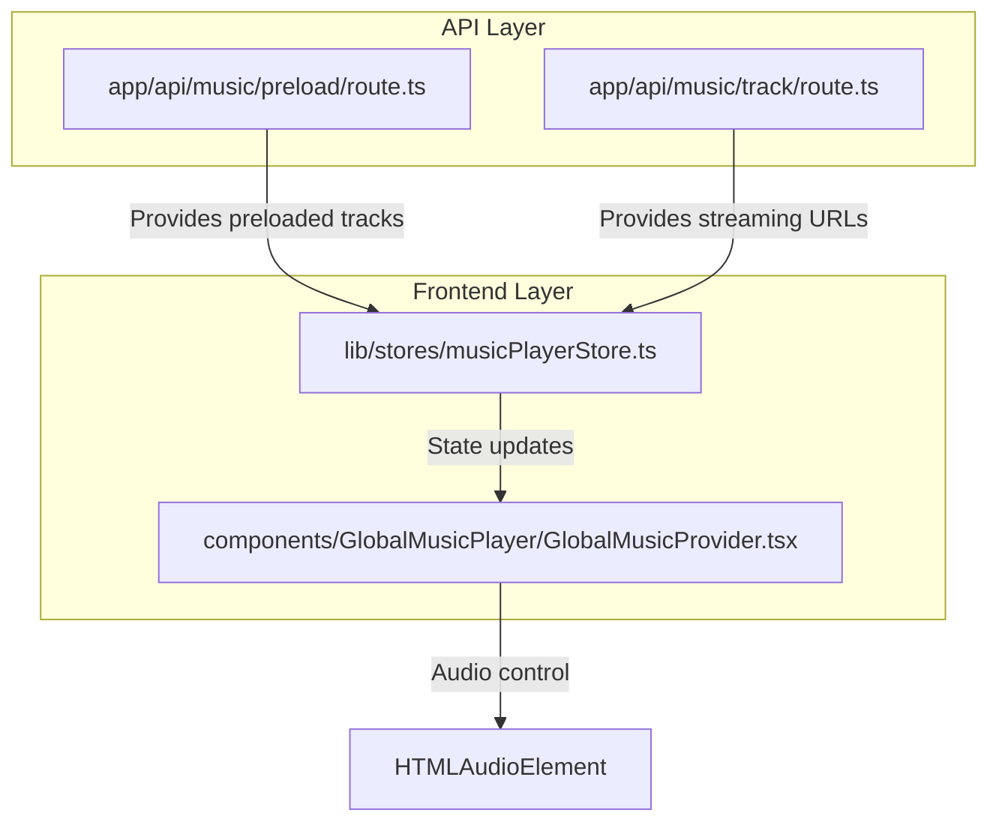
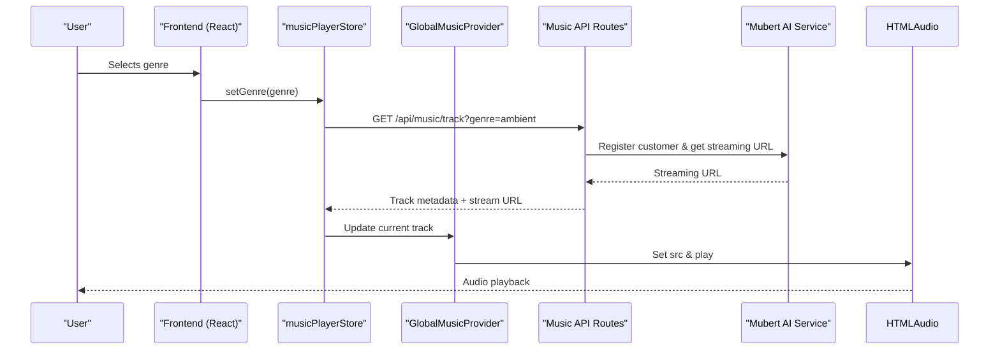
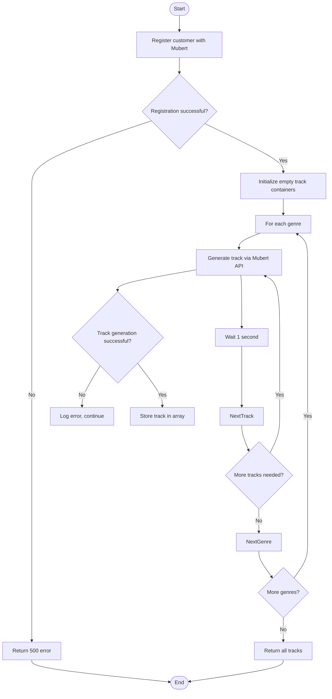
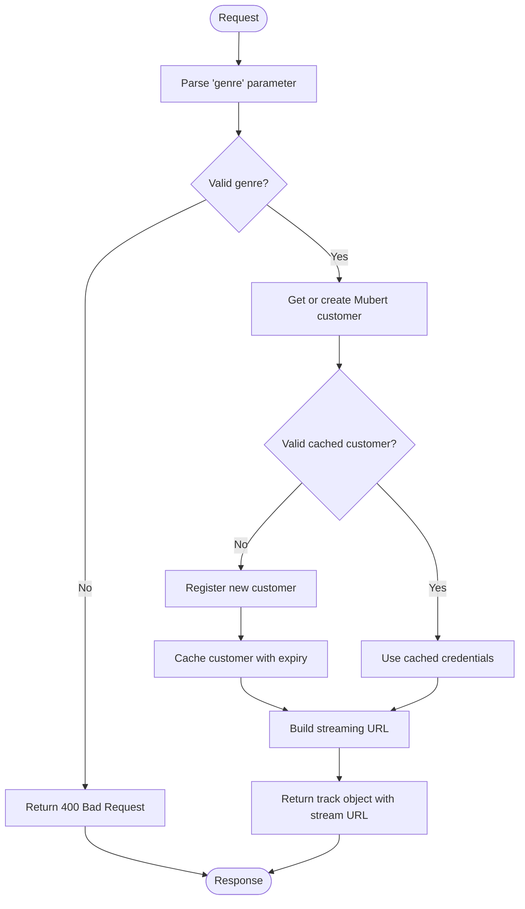
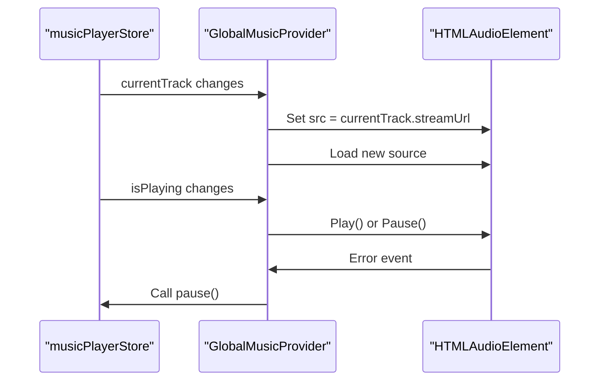
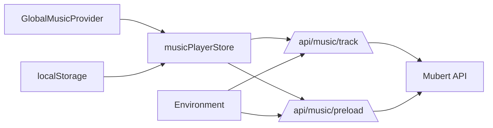

# Music API

<cite>
**Referenced Files in This Document**   
- [app/api/music/preload/route.ts](file://app/api/music/preload/route.ts)
- [app/api/music/track/route.ts](file://app/api/music/track/route.ts)
- [components/GlobalMusicPlayer/GlobalMusicProvider.tsx](file://components/GlobalMusicPlayer/GlobalMusicProvider.tsx)
- [lib/stores/musicPlayerStore.ts](file://lib/stores/musicPlayerStore.ts)
</cite>

## Table of Contents
1. [Introduction](#introduction)
2. [Project Structure](#project-structure)
3. [Core Components](#core-components)
4. [Architecture Overview](#architecture-overview)
5. [Detailed Component Analysis](#detailed-component-analysis)
6. [Dependency Analysis](#dependency-analysis)
7. [Performance Considerations](#performance-considerations)
8. [Troubleshooting Guide](#troubleshooting-guide)
9. [Conclusion](#conclusion)

## Introduction
This document provides comprehensive API documentation for the Music API endpoints that integrate with Mubert for AI-generated background music in the DiaryBeast application. The system enables users to access ambient, lofi, and nature-themed AI-generated music tracks through two primary endpoints: one for preloading multiple tracks and another for fetching specific streaming URLs. The integration leverages client-side state management via Zustand store (`musicPlayerStore`) and React context through `GlobalMusicProvider`, ensuring seamless playback control and user preference persistence. This documentation details the request parameters, response structures, caching mechanisms, error handling, and performance considerations involved in delivering continuous background music within the app.

## Project Structure
The music functionality is organized across backend API routes and frontend components following a modular architecture. The API endpoints reside under `app/api/music/`, separating preload and track retrieval logic. Client-side music controls are encapsulated within the `components/GlobalMusicPlayer/` directory, while state management is handled by a dedicated store in `lib/stores/`. This separation ensures clear boundaries between data fetching, state logic, and UI presentation layers.



**Diagram sources**
- [app/api/music/preload/route.ts](file://app/api/music/preload/route.ts#L1-L125)
- [app/api/music/track/route.ts](file://app/api/music/track/route.ts#L1-L98)
- [components/GlobalMusicPlayer/GlobalMusicProvider.tsx](file://components/GlobalMusicPlayer/GlobalMusicProvider.tsx#L1-L85)
- [lib/stores/musicPlayerStore.ts](file://lib/stores/musicPlayerStore.ts#L1-L162)

**Section sources**
- [app/api/music/preload/route.ts](file://app/api/music/preload/route.ts#L1-L125)
- [app/api/music/track/route.ts](file://app/api/music/track/route.ts#L1-L98)
- [components/GlobalMusicPlayer/GlobalMusicProvider.tsx](file://components/GlobalMusicPlayer/GlobalMusicProvider.tsx#L1-L85)
- [lib/stores/musicPlayerStore.ts](file://lib/stores/musicPlayerStore.ts#L1-L162)

## Core Components
The core components of the music system include two API endpoints for retrieving music content, a Zustand-based state store for managing playback state and preferences, and a React provider component that interfaces with the browser's Audio API. These components work together to deliver AI-generated music from Mubert with minimal latency and robust error recovery.

**Section sources**
- [app/api/music/preload/route.ts](file://app/api/music/preload/route.ts#L1-L125)
- [app/api/music/track/route.ts](file://app/api/music/track/route.ts#L1-L98)
- [components/GlobalMusicPlayer/GlobalMusicProvider.tsx](file://components/GlobalMusicPlayer/GlobalMusicProvider.tsx#L1-L85)
- [lib/stores/musicPlayerStore.ts](file://lib/stores/musicPlayerStore.ts#L1-L162)

## Architecture Overview
The music system follows a client-server architecture where the frontend requests music resources from internal API routes, which in turn communicate with the external Mubert AI music generation service. The backend routes abstract the complexity of Mubert's authentication and track generation process, providing simplified endpoints for the frontend. Client-side state management handles genre selection, playback control, volume persistence, and track caching, while the audio element is managed by a dedicated provider component.



**Diagram sources**
- [app/api/music/track/route.ts](file://app/api/music/track/route.ts#L1-L98)
- [lib/stores/musicPlayerStore.ts](file://lib/stores/musicPlayerStore.ts#L1-L162)
- [components/GlobalMusicPlayer/GlobalMusicProvider.tsx](file://components/GlobalMusicPlayer/GlobalMusicProvider.tsx#L1-L85)

## Detailed Component Analysis

### Music API Endpoints Analysis

#### Preload Endpoint (GET /api/music/preload)
This endpoint generates and returns a collection of pre-generated music tracks across supported genres (ambient, lofi, nature). It handles customer registration with Mubert, generates 10 tracks per genre using specific playlist indices, and returns structured metadata including titles, artists, durations, and direct streaming URLs.



**Diagram sources**
- [app/api/music/preload/route.ts](file://app/api/music/preload/route.ts#L1-L125)

**Section sources**
- [app/api/music/preload/route.ts](file://app/api/music/preload/route.ts#L1-L125)

#### Track Endpoint (GET /api/music/track)
This endpoint provides a direct streaming URL for a requested music genre. It uses an in-memory customer cache to avoid repeated registration, supports mood-based filtering via the `genre` parameter, and constructs streaming URLs using Mubert’s wildcard playlist system for dynamic content delivery.



**Diagram sources**
- [app/api/music/track/route.ts](file://app/api/music/track/route.ts#L1-L98)

**Section sources**
- [app/api/music/track/route.ts](file://app/api/music/track/route.ts#L1-L98)

### State Management Analysis

#### musicPlayerStore.ts Analysis
The `useMusicPlayerStore` manages all music playback state including current genre, play/pause status, volume, and track caching. It persists user preferences (genre and volume) in localStorage and implements lazy loading of streaming links. The store uses an in-memory cache (`streamCache`) to avoid redundant API calls when switching between genres.

```mermaid
classDiagram
class MusicPlayerState {
+currentGenre : Genre
+isPlaying : boolean
+volume : number
+isLoading : boolean
+getCurrentTrack() : Track | null
+setGenre(genre : Genre) : void
+play() : void
+pause() : void
+togglePlay() : void
+setVolume(volume : number) : void
+reset() : void
}
class Track {
+id : string
+title : string
+genre : Genre
+streamUrl : string
+artist? : string
+duration? : number
}
class Genre {
<<type>>
ambient
lofi
nature
}
MusicPlayerState --> Track : "current track"
MusicPlayerState --> "localStorage" : "persists genre/volume"
MusicPlayerState --> "streamCache" : "caches Track objects"
```

**Diagram sources**
- [lib/stores/musicPlayerStore.ts](file://lib/stores/musicPlayerStore.ts#L1-L162)

**Section sources**
- [lib/stores/musicPlayerStore.ts](file://lib/stores/musicPlayerStore.ts#L1-L162)

#### GlobalMusicProvider.tsx Analysis
The `GlobalMusicProvider` component manages the HTMLAudioElement instance, synchronizing its state with the `musicPlayerStore`. It handles audio playback, pause, volume changes, and error events. The provider ensures proper cleanup on unmount and gracefully handles playback failures by pausing the store state.



**Diagram sources**
- [components/GlobalMusicPlayer/GlobalMusicProvider.tsx](file://components/GlobalMusicPlayer/GlobalMusicProvider.tsx#L1-L85)

**Section sources**
- [components/GlobalMusicPlayer/GlobalMusicProvider.tsx](file://components/GlobalMusicPlayer/GlobalMusicProvider.tsx#L1-L85)

## Dependency Analysis
The music system has well-defined dependencies between its components. The frontend depends on the internal API routes rather than directly calling Mubert, which allows for better control over authentication, rate limiting, and response formatting. The `GlobalMusicProvider` depends on the `musicPlayerStore` for state, while the store itself depends on the API endpoints for data. Environment variables are used to securely store Mubert credentials in production.



**Diagram sources**
- [app/api/music/track/route.ts](file://app/api/music/track/route.ts#L1-L98)
- [app/api/music/preload/route.ts](file://app/api/music/preload/route.ts#L1-L125)
- [lib/stores/musicPlayerStore.ts](file://lib/stores/musicPlayerStore.ts#L1-L162)
- [components/GlobalMusicPlayer/GlobalMusicProvider.tsx](file://components/GlobalMusicPlayer/GlobalMusicProvider.tsx#L1-L85)

**Section sources**
- [app/api/music/track/route.ts](file://app/api/music/track/route.ts#L1-L98)
- [app/api/music/preload/route.ts](file://app/api/music/preload/route.ts#L1-L125)
- [lib/stores/musicPlayerStore.ts](file://lib/stores/musicPlayerStore.ts#L1-L162)

## Performance Considerations
The system implements several performance optimizations including in-memory customer caching to reduce Mubert API registration calls, localStorage persistence to maintain user preferences without re-fetching, and lazy loading of streaming URLs. The preload endpoint generates tracks sequentially with 1-second delays to respect rate limits. Audio elements are created once and reused, minimizing DOM operations. Streaming URLs have no fixed duration, enabling infinite playback suitable for background music. Bandwidth usage is optimized by using 128kbps MP3 streams, balancing quality and data consumption.

## Troubleshooting Guide
Common issues include failed track loading due to Mubert API rate limiting or authentication errors, audio playback failures in certain browsers, and stale cached customers. The system handles these by logging errors, falling back to pause state on playback failure, and re-registering customers when credentials expire. Developers should monitor console logs for "Customer registration error" or "Audio playback failed" messages. If streaming stops, clearing the customer cache or refreshing the page typically resolves the issue. Ensure environment variables `MUBERT_COMPANY_ID` and `MUBERT_LICENSE_TOKEN` are correctly set in production.

**Section sources**
- [app/api/music/track/route.ts](file://app/api/music/track/route.ts#L1-L98)
- [app/api/music/preload/route.ts](file://app/api/music/preload/route.ts#L1-L125)
- [components/GlobalMusicPlayer/GlobalMusicProvider.tsx](file://components/GlobalMusicPlayer/GlobalMusicProvider.tsx#L1-L85)
- [lib/stores/musicPlayerStore.ts](file://lib/stores/musicPlayerStore.ts#L1-L162)

## Conclusion
The Music API successfully integrates Mubert's AI-generated music service into the DiaryBeast application through a well-structured backend/frontend architecture. By abstracting the Mubert API behind custom endpoints and implementing robust state management, the system delivers seamless background music experiences with support for mood-based filtering, persistent user preferences, and graceful error recovery. Future improvements could include support for additional genres, playlist customization, and offline caching of generated tracks.