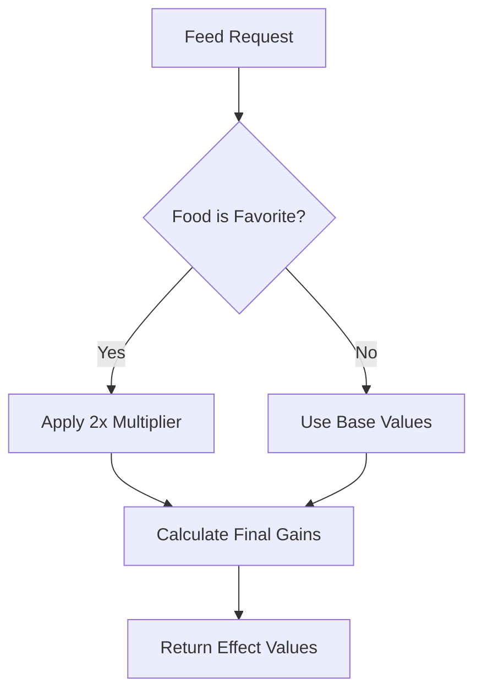
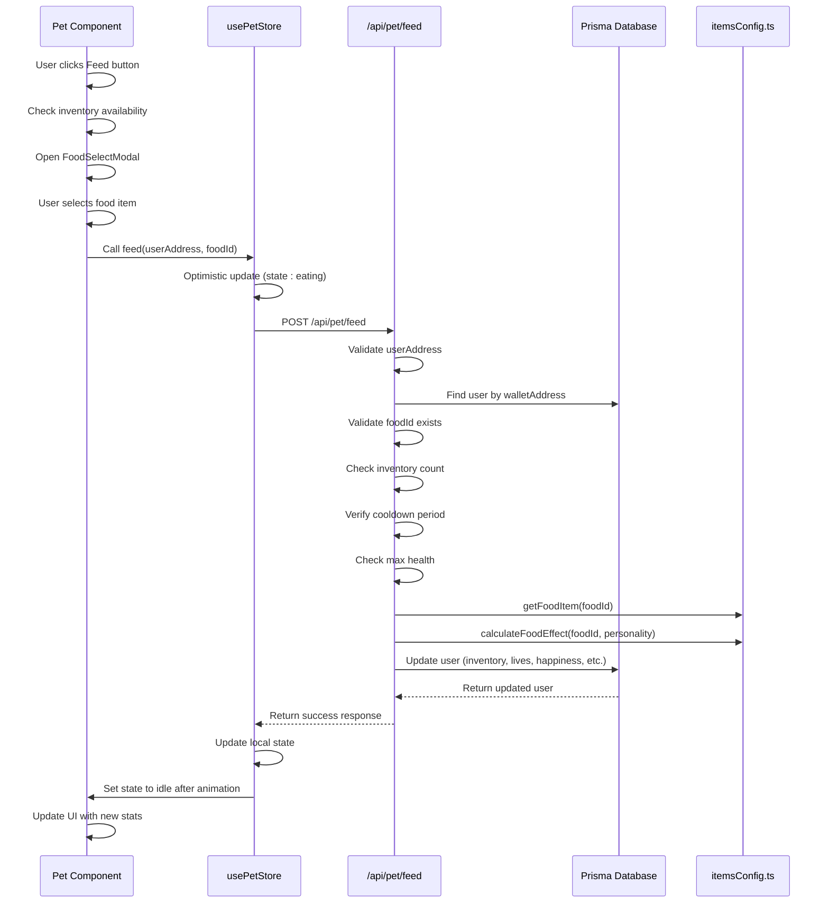

# Feeding System API

<cite>
**Referenced Files in This Document**   
- [app/api/pet/feed/route.ts](file://app/api/pet/feed/route.ts)
- [lib/gamification/itemsConfig.ts](file://lib/gamification/itemsConfig.ts)
- [components/Pet.tsx](file://components/Pet.tsx)
- [lib/stores/petStore.ts](file://lib/stores/petStore.ts)
- [components/FoodSelectModal.tsx](file://components/FoodSelectModal.tsx)
- [lib/prisma.ts](file://lib/prisma.ts)
</cite>

## Table of Contents
1. [Introduction](#introduction)
2. [Request Payload Structure](#request-payload-structure)
3. [Validation and Business Logic](#validation-and-business-logic)
4. [Food Configuration and Effects](#food-configuration-and-effects)
5. [Database Operations](#database-operations)
6. [Response Structure](#response-structure)
7. [Frontend Integration](#frontend-integration)
8. [Sequence Diagram](#sequence-diagram)

## Introduction
The POST /api/pet/feed endpoint enables users to feed their virtual pets within the DiaryBeast application. This API endpoint handles the complete feeding workflow, including inventory validation, cooldown enforcement, food effect calculation based on pet personality, and database updates for pet state and inventory. The system integrates with the frontend Pet component to provide real-time feedback and animation during feeding interactions.

## Request Payload Structure
The endpoint accepts a JSON payload with two required parameters for pet feeding operations.

**Section sources**
- [app/api/pet/feed/route.ts](file://app/api/pet/feed/route.ts#L10-L12)

### Required Parameters
| Parameter | Type | Description | Example |
|---------|------|-------------|---------|
| `userAddress` | string | The wallet address of the user feeding the pet (required) | `"0x742d35Cc6634C0532925a3b8D4C9Fb55F34dA155"` |
| `foodId` | string | The identifier of the food item to use (optional, defaults to 'basic-kibble') | `"premium-meat"` |

The request payload is parsed from the request body and validated for the presence of the userAddress parameter before proceeding with further processing.

## Validation and Business Logic
The feeding endpoint implements multiple layers of validation and business rules to ensure proper game mechanics and prevent abuse.

**Section sources**
- [app/api/pet/feed/route.ts](file://app/api/pet/feed/route.ts#L14-L104)

### Inventory Validation
The system checks the user's inventory to verify they possess the requested food item:
- Retrieves the user's inventory from the database as a key-value object
- Checks if the specified foodId exists in the inventory with a count greater than zero
- Returns a 400 error with specific messaging if the food is not available

### Cooldown Enforcement
Cooldown periods are enforced based on the food item type:
- Each food item has a defined cooldown period in hours (specified in itemsConfig.ts)
- The system calculates the remaining cooldown time by comparing the current time with lastFeedTime
- Returns a 429 Too Many Requests status if the cooldown period has not elapsed
- The remaining cooldown time is returned in the response for frontend display

### Maximum Health Check
The system prevents overfeeding by checking the pet's current health:
- Compares the user's current livesRemaining with the MAX_LIVES constant (7)
- Returns a 400 error if the pet is already at maximum health
- This check occurs after inventory and cooldown validation

## Food Configuration and Effects
The feeding system utilizes a comprehensive configuration system to determine food effects and personality-based bonuses.

**Section sources**
- [lib/gamification/itemsConfig.ts](file://lib/gamification/itemsConfig.ts#L15-L233)

### Food Item Configuration
Food items are defined in the FOOD_ITEMS constant with the following properties:

| Property | Type | Description |
|---------|------|-------------|
| `id` | string | Unique identifier for the food item |
| `name` | string | Display name of the food |
| `description` | string | Brief description of the food |
| `livesGain` | number | Amount of life points restored |
| `happinessGain` | number | Amount of happiness points restored |
| `cooldown` | number | Cooldown period in hours |
| `rarity` | enum | Rarity level (common, premium, rare) |

### Personality-Based Bonuses
The system implements a personality system that affects food effectiveness:
- Each pet has a randomly generated personality with a favorite food type
- When a pet is fed its favorite food, the life and happiness gains are doubled
- The favorite food types are: 'meat', 'veggie', 'kibble', or 'energy'
- The food-to-personality mapping is handled by the foodTypeMap object in calculateFoodEffect()

### Effect Calculation
The calculateFoodEffect function determines the actual benefits from feeding:
- Retrieves the base effect values from the food item configuration
- Applies the 2x multiplier if the food matches the pet's favorite type
- Returns the final life and happiness gain values to the feeding endpoint



**Diagram sources**
- [lib/gamification/itemsConfig.ts](file://lib/gamification/itemsConfig.ts#L205-L232)

## Database Operations
The feeding system uses Prisma ORM to manage persistent data storage and updates.

**Section sources**
- [app/api/pet/feed/route.ts](file://app/api/pet/feed/route.ts#L106-L120)
- [lib/prisma.ts](file://lib/prisma.ts#L1-L10)

### Prisma Client Initialization
The Prisma client is imported from lib/prisma.ts, which implements a singleton pattern to prevent creating multiple client instances in development mode.

### Data Update Flow
When a successful feed occurs, the system performs the following database operations:
1. Decrements the food count in the user's inventory
2. Removes the food item from inventory if the count reaches zero
3. Updates the user's livesRemaining (capped at MAX_LIVES)
4. Updates the user's happiness (capped at MAX_HAPPINESS)
5. Sets the petState to 'eating' for animation purposes
6. Updates the lastFeedTime and lastActiveAt timestamps

The update operation is performed as a single atomic transaction using prisma.user.update().

## Response Structure
The endpoint returns structured JSON responses for both success and error conditions.

**Section sources**
- [app/api/pet/feed/route.ts](file://app/api/pet/feed/route.ts#L122-L127)

### Success Response
On successful feeding, the API returns a 200 status with the following structure:

```json
{
  "success": true,
  "newLives": 5,
  "newHappiness": 75,
  "inventory": {
    "basic-kibble": 2
  },
  "livesGain": 1,
  "happinessGain": 10,
  "foodUsed": "Premium Meat",
  "foodRemaining": 2,
  "isFavorite": false,
  "message": "Fed pet Premium Meat! Lives: 5/7"
}
```

### Error Responses
The endpoint returns appropriate error responses for various failure conditions:

| Status | Condition | Response Structure |
|--------|---------|-------------------|
| 400 | Missing userAddress | `{ "error": "Missing userAddress" }` |
| 404 | User not found | `{ "error": "User not found" }` |
| 400 | Invalid food item | `{ "error": "Invalid food item" }` |
| 400 | Insufficient inventory | `{ "error": "No [food name] in inventory. Buy from shop first!" }` |
| 429 | Cooldown active | `{ "error": "Feed is on cooldown. Please wait [hours] more hours.", "cooldownRemaining": [milliseconds] }` |
| 400 | Pet at maximum health | `{ "error": "Pet is already at maximum health" }` |
| 500 | Server error | `{ "error": "Failed to feed pet", "details": "[error message]" }` |

## Frontend Integration
The feeding system is tightly integrated with the frontend components to provide a seamless user experience.

**Section sources**
- [components/Pet.tsx](file://components/Pet.tsx#L1-L387)
- [lib/stores/petStore.ts](file://lib/stores/petStore.ts#L1-L234)
- [components/FoodSelectModal.tsx](file://components/FoodSelectModal.tsx#L1-L133)

### Pet Component
The Pet component serves as the primary interface for feeding interactions:
- Displays the pet's current state, lives, and happiness
- Shows cooldown timers for feeding and playing
- Handles the feed button click event
- Opens the FoodSelectModal when the feed button is clicked
- Updates the pet's animation state to 'eating' during feeding

### Zustand Store
The usePetStore manages the pet's state and provides actions:
- Maintains local state for lives, happiness, and pet state
- Handles cooldown calculations and status
- Provides the feed() action that calls the API endpoint
- Implements optimistic updates for responsive UI
- Manages animation state transitions

### Food Selection Modal
The FoodSelectModal component allows users to select from their available food:
- Displays only food items that are present in the user's inventory
- Highlights the pet's favorite food with special styling
- Shows the effects (life and happiness gains) for each food item
- Indicates cooldown periods for each food type
- Updates in real-time as inventory changes

## Sequence Diagram
The following diagram illustrates the complete flow of the pet feeding process from frontend interaction to database update.



**Diagram sources**
- [app/api/pet/feed/route.ts](file://app/api/pet/feed/route.ts#L1-L127)
- [components/Pet.tsx](file://components/Pet.tsx#L1-L387)
- [lib/stores/petStore.ts](file://lib/stores/petStore.ts#L1-L234)
- [lib/gamification/itemsConfig.ts](file://lib/gamification/itemsConfig.ts#L1-L233)