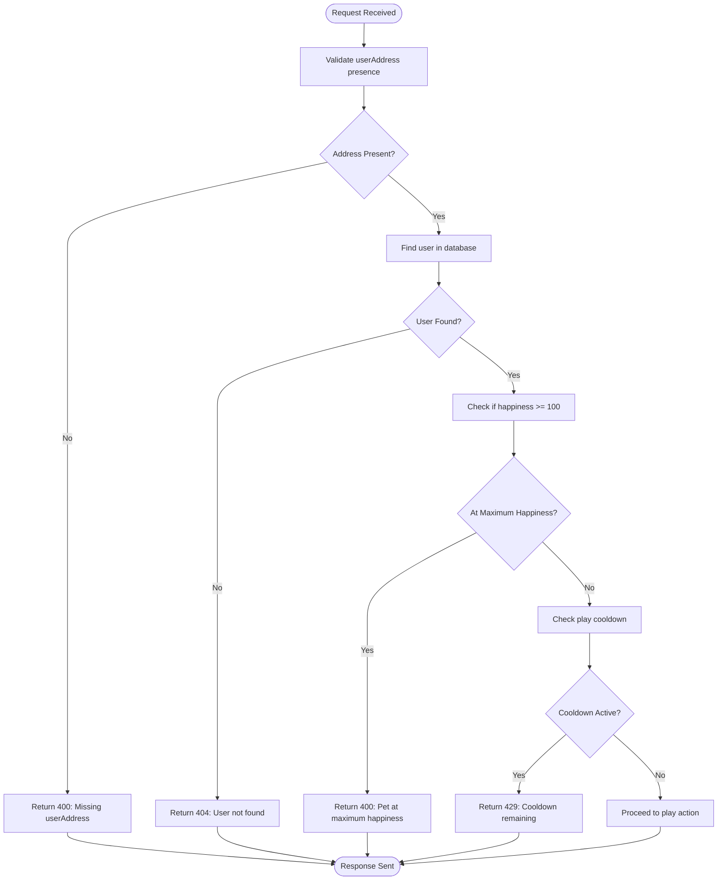
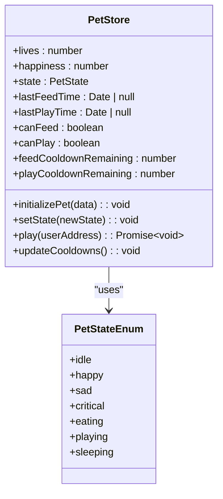
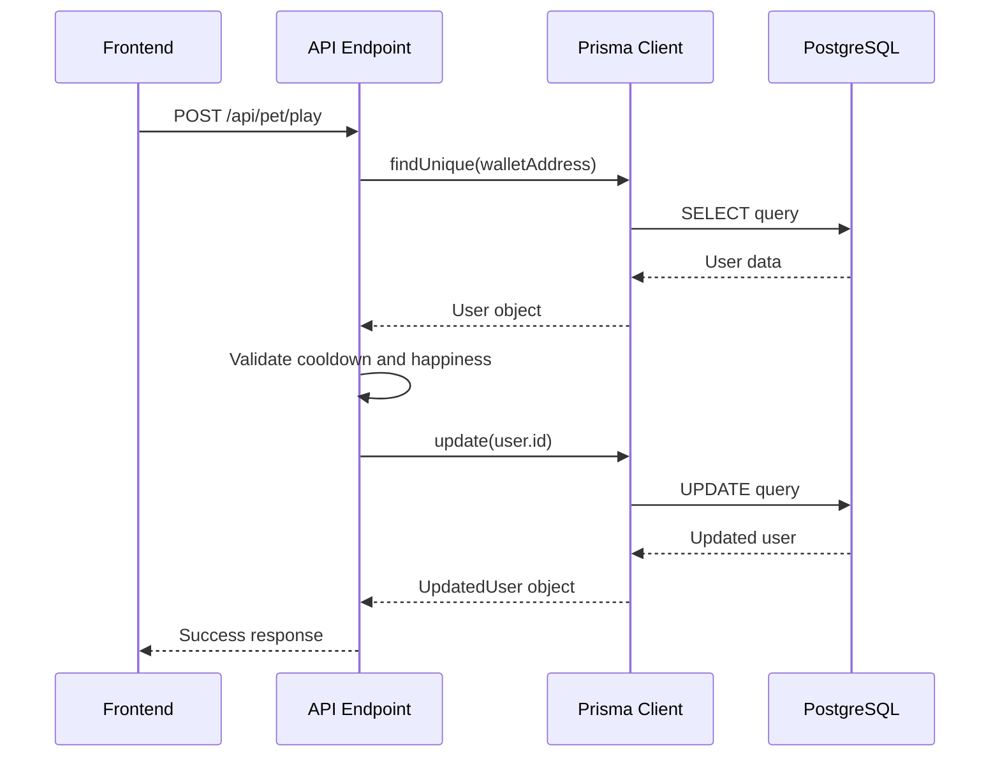
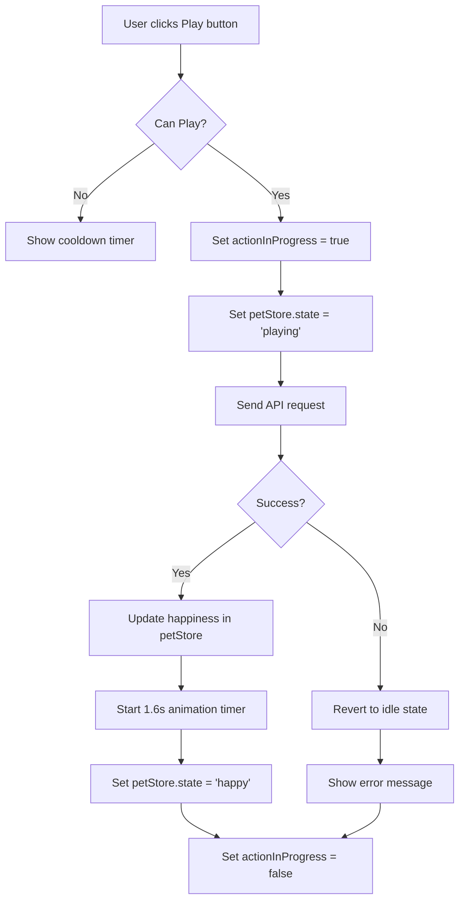

# Play Mechanics API

<cite>
**Referenced Files in This Document**   
- [route.ts](file://app/api/pet/play/route.ts)
- [Pet.tsx](file://components/Pet.tsx)
- [petStore.ts](file://lib/stores/petStore.ts)
- [PET_STATES_LOGIC.md](file://PET_STATES_LOGIC.md)
- [types.ts](file://lib/ascii/types.ts)
</cite>

## Table of Contents
1. [Introduction](#introduction)
2. [Core Mechanics](#core-mechanics)
3. [Request Validation](#request-validation)
4. [State Management](#state-management)
5. [Database Interaction](#database-interaction)
6. [Response Structure](#response-structure)
7. [Frontend Integration](#frontend-integration)
8. [Error Handling](#error-handling)
9. [Race Condition Mitigation](#race-condition-mitigation)
10. [Usage Examples](#usage-examples)

## Introduction
The Play Mechanics API endpoint (POST /api/pet/play) enables users to interact with their virtual pet, increasing its happiness through play sessions. This document details the complete implementation, including cooldown enforcement, happiness mechanics, state management, and frontend integration. The system ensures consistent pet behavior across client and server while maintaining data integrity through proper validation and database updates.

## Core Mechanics

The play functionality implements several key mechanics that govern pet interaction:

- **4-hour cooldown period**: Users must wait 4 hours between play sessions
- **Fixed happiness gain**: Each successful play increases happiness by +10 points
- **Maximum happiness cap**: Happiness is capped at 100 points
- **Pet state animation**: Temporary 'playing' state triggers frontend animations
- **User engagement tracking**: lastActiveAt timestamp is updated with each interaction

These mechanics create a balanced gameplay experience that encourages regular user engagement while preventing abuse of the system.

**Section sources**
- [route.ts](file://app/api/pet/play/route.ts#L5-L7)
- [petStore.ts](file://lib/stores/petStore.ts#L6-L8)

## Request Validation

The API performs comprehensive validation to ensure data integrity and proper gameplay mechanics:

1. **User address validation**: Verifies the presence of userAddress in the request payload
2. **User existence check**: Confirms the user exists in the database
3. **Maximum happiness check**: Prevents playing when happiness is already at maximum
4. **Cooldown validation**: Enforces the 4-hour cooldown period between plays

The validation process follows a strict sequence to efficiently handle edge cases and provide meaningful error messages to the frontend.



**Diagram sources**
- [route.ts](file://app/api/pet/play/route.ts#L10-L55)

**Section sources**
- [route.ts](file://app/api/pet/play/route.ts#L10-L55)

## State Management

The application employs a sophisticated state management system using Zustand for client-side state and Prisma for persistent storage. The petStore manages both temporary animation states and persistent user data.

The state management flow for play interactions includes:

1. **Optimistic updates**: Frontend immediately updates to 'playing' state
2. **Cooldown tracking**: Client-side timers manage cooldown visibility
3. **State prioritization**: Multiple state conditions are evaluated in priority order
4. **Synchronization**: Client state is synchronized with server data on initialization



**Diagram sources**
- [petStore.ts](file://lib/stores/petStore.ts#L13-L40)
- [types.ts](file://lib/ascii/types.ts#L3-L14)

**Section sources**
- [petStore.ts](file://lib/stores/petStore.ts#L42-L220)

## Database Interaction

The API uses Prisma as an ORM to interact with the database, ensuring type-safe and efficient data operations. The database update flow follows a transactional pattern to maintain data consistency.

Key aspects of the database interaction:

- **Atomic updates**: Single update operation modifies multiple fields
- **Type safety**: Prisma provides compile-time type checking
- **Error handling**: Comprehensive error handling for database operations
- **Field updates**: Simultaneous update of happiness, timestamps, and pet state



**Diagram sources**
- [route.ts](file://app/api/pet/play/route.ts#L57-L70)
- [prisma.ts](file://lib/prisma.ts#L6-L6)

**Section sources**
- [route.ts](file://app/api/pet/play/route.ts#L57-L70)

## Response Structure

The API returns structured JSON responses that provide comprehensive information about the play interaction result. Successful responses include updated pet statistics, while error responses provide detailed information about the failure reason.

### Successful Response
```json
{
  "success": true,
  "newHappiness": 75,
  "newLives": 5,
  "message": "Played with pet! Happiness increased to 75/100"
}
```

### Error Responses
- **Missing userAddress**: 400 Bad Request
- **User not found**: 404 Not Found  
- **Maximum happiness reached**: 400 Bad Request
- **Cooldown active**: 429 Too Many Requests

The response structure enables the frontend to provide meaningful feedback to users and update the UI accordingly.

**Section sources**
- [route.ts](file://app/api/pet/play/route.ts#L68-L74)

## Frontend Integration

The play functionality is deeply integrated with the frontend components, particularly the Pet component and ASCII animation system. The integration ensures a seamless user experience with visual feedback for all interactions.

Key integration points:

- **Animation triggering**: petState 'playing' triggers the playing animation
- **State priority system**: Multiple state conditions are evaluated in order of priority
- **Visual feedback**: Button states reflect cooldown status and action progress
- **Optimistic UI**: Immediate visual feedback before server confirmation



**Diagram sources**
- [Pet.tsx](file://components/Pet.tsx#L24-L386)
- [PET_STATES_LOGIC.md](file://PET_STATES_LOGIC.md#L1-L500)

**Section sources**
- [Pet.tsx](file://components/Pet.tsx#L24-L386)

## Error Handling

The API implements comprehensive error handling to ensure robust operation and provide meaningful feedback to users. Errors are categorized and handled appropriately at both server and client levels.

### Server-Side Error Handling
- **Validation errors**: 400-level responses for invalid requests
- **Resource errors**: 404-level responses for missing resources
- **Rate limiting**: 429-level responses for cooldown violations
- **Server errors**: 500-level responses for unexpected failures

### Client-Side Error Handling
- **Network errors**: Graceful handling of connection issues
- **State rollback**: Reversion to previous state on failure
- **User feedback**: Clear error messages and alerts
- **Retry mechanisms**: Option to retry failed operations

The error handling system ensures that the application remains stable and user-friendly even when unexpected conditions occur.

**Section sources**
- [route.ts](file://app/api/pet/play/route.ts#L75-L86)
- [Pet.tsx](file://components/Pet.tsx#L200-L215)

## Race Condition Mitigation

The system employs several strategies to prevent race conditions and maintain state consistency between frontend and backend:

1. **Optimistic locking**: Client assumes success and reverts on failure
2. **Sequential processing**: Actions are processed in sequence, not parallel
3. **State synchronization**: Regular state updates between client and server
4. **Cooldown enforcement**: Server-side cooldown prevents rapid successive calls

The petStore's optimistic update pattern is particularly effective at preventing race conditions. When a play action is initiated, the client immediately updates to the 'playing' state and disables the play button. If the server request fails, the state is reverted to 'idle'. This ensures that only one play action can be in progress at a time, regardless of network conditions.

Additionally, the 4-hour cooldown period is enforced on both client and server sides. The client uses the petStore's updateCooldowns method to track remaining cooldown time, while the server validates the lastPlayTime timestamp on each request. This dual enforcement prevents users from bypassing the cooldown through client manipulation.

**Section sources**
- [petStore.ts](file://lib/stores/petStore.ts#L180-L220)
- [route.ts](file://app/api/pet/play/route.ts#L40-L55)

## Usage Examples

### Successful Play Interaction
**Request:**
```json
{
  "userAddress": "0x1234567890abcdef1234567890abcdef12345678"
}
```

**Response:**
```json
{
  "success": true,
  "newHappiness": 65,
  "newLives": 5,
  "message": "Played with pet! Happiness increased to 65/100"
}
```

### Cooldown Violation
**Request:**
```json
{
  "userAddress": "0x1234567890abcdef1234567890abcdef12345678"
}
```

**Response:**
```json
{
  "error": "Play is on cooldown. Please wait 3 more hours.",
  "cooldownRemaining": 10800000
}
```

### Maximum Happiness
**Request:**
```json
{
  "userAddress": "0x1234567890abcdef1234567890abcdef12345678"
}
```

**Response:**
```json
{
  "error": "Pet is already at maximum happiness"
}
```

These examples demonstrate the various response scenarios that clients should handle when interacting with the play endpoint.

**Section sources**
- [route.ts](file://app/api/pet/play/route.ts#L50-L55)
- [route.ts](file://app/api/pet/play/route.ts#L68-L74)