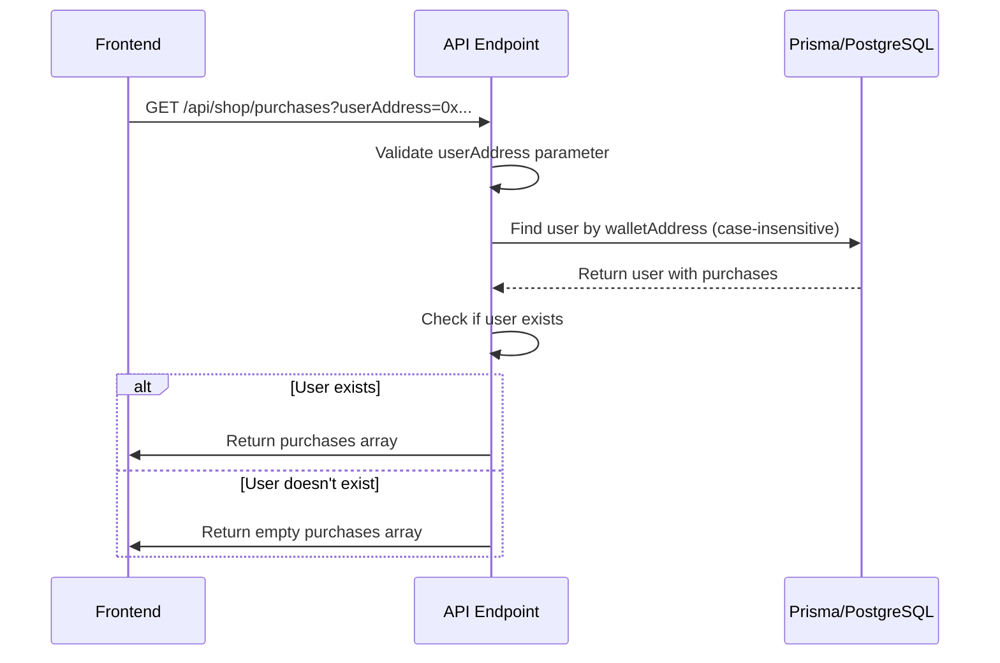
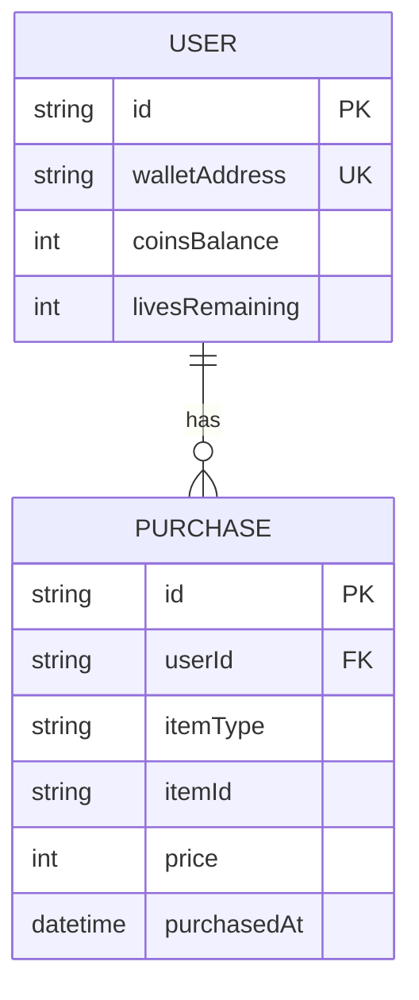
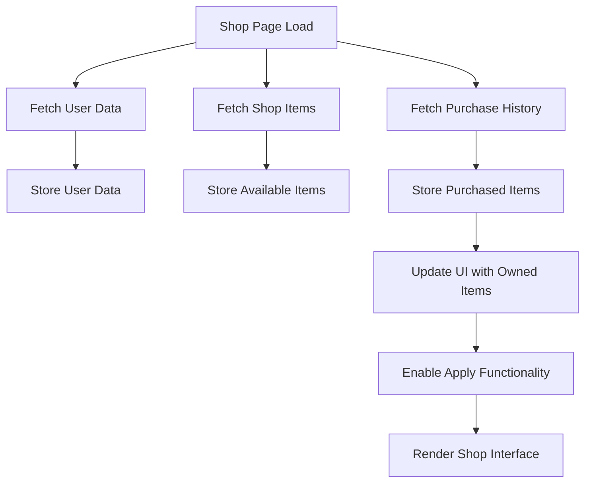

# Purchase History

<cite>
**Referenced Files in This Document**   
- [app/api/shop/purchases/route.ts](file://app/api/shop/purchases/route.ts)
- [prisma/schema.prisma](file://prisma/schema.prisma)
- [app/shop/page.tsx](file://app/shop/page.tsx)
- [TECHNICAL_DOCUMENTATION.md](file://TECHNICAL_DOCUMENTATION.md)
</cite>

## Table of Contents
1. [Introduction](#introduction)
2. [API Endpoint Overview](#api-endpoint-overview)
3. [Query Parameter Validation](#query-parameter-validation)
4. [User Lookup and Case Insensitivity](#user-lookup-and-case-insensitivity)
5. [Prisma Include Relation](#prisma-include-relation)
6. [Response Structure](#response-structure)
7. [Error Handling](#error-handling)
8. [Frontend Integration](#frontend-integration)
9. [Performance Considerations](#performance-considerations)
10. [Future Enhancements](#future-enhancements)

## Introduction

The Purchase History API endpoint provides a mechanism for retrieving a user's complete purchase history based on their wallet address. This functionality is central to the gamification system of the DiaryBeast application, enabling users to track their acquired items such as backgrounds, accessories, and consumables. The endpoint serves as a critical data source for the frontend shop interface, allowing users to view their owned items and apply them to customize their experience.

**Section sources**
- [app/api/shop/purchases/route.ts](file://app/api/shop/purchases/route.ts#L3-L31)

## API Endpoint Overview

The Purchase History endpoint is implemented as a GET request handler located at `app/api/shop/purchases/route.ts`. This serverless function retrieves purchase records associated with a specific user's wallet address. The endpoint follows a straightforward request-response pattern, accepting a wallet address as a query parameter and returning a JSON response containing the user's purchase history.

The implementation leverages Next.js API routes with Prisma as the ORM for database interactions. The endpoint is designed to be stateless and idempotent, ensuring consistent responses for the same input. It integrates with the application's database schema, specifically the User and Purchase models, to fetch related data efficiently.

**Diagram sources**
- [app/api/shop/purchases/route.ts](file://app/api/shop/purchases/route.ts#L3-L31)

**Section sources**
- [app/api/shop/purchases/route.ts](file://app/api/shop/purchases/route.ts#L3-L31)

## Query Parameter Validation

The endpoint implements strict validation for the required `userAddress` query parameter. The validation occurs at the beginning of the request handling process, ensuring that malformed or incomplete requests are rejected early in the execution flow.

The validation checks for the presence of the `userAddress` parameter in the request URL's search parameters. If the parameter is missing, the endpoint immediately returns a 400 Bad Request response with an appropriate error message. This early validation prevents unnecessary database queries and improves overall system efficiency.

The validation is implemented using Next.js's built-in URL search parameter extraction, which safely handles URL parsing and parameter retrieval. The implementation does not perform additional format validation on the wallet address itself, relying on the database layer to handle any address format issues during the lookup process.

**Section sources**
- [app/api/shop/purchases/route.ts](file://app/api/shop/purchases/route.ts#L5-L12)

## User Lookup and Case Insensitivity

The user lookup mechanism implements case-insensitive matching for wallet addresses, accommodating the variable case formatting that can occur with Ethereum addresses. This is achieved by converting the input `userAddress` to lowercase using the `toLowerCase()` method before performing the database query.

The case-insensitive lookup is crucial for user experience, as Ethereum addresses can be represented in various formats (checksummed, all lowercase, all uppercase). By normalizing the input to lowercase, the system ensures consistent lookups regardless of how the address was originally formatted.

The lookup is performed using Prisma's `findUnique` method with a `where` clause that matches the `walletAddress` field. This approach leverages the database index on the `walletAddress` field for optimal performance. The implementation assumes that all wallet addresses are stored in lowercase format in the database, which is consistent with the application's data storage practices.

**Section sources**
- [app/api/shop/purchases/route.ts](file://app/api/shop/purchases/route.ts#L14-L18)

## Prisma Include Relation

The endpoint utilizes Prisma's `include` relation feature to efficiently fetch associated purchase records in a single database query. When retrieving the user record, the `include: { purchases: true }` option instructs Prisma to automatically join the Purchase model and include all related purchase records in the result.

This approach eliminates the need for separate queries to fetch user and purchase data, reducing database round trips and improving performance. The Prisma ORM handles the SQL join operation transparently, returning a fully populated user object with its associated purchases.

The relationship between User and Purchase models is defined in the Prisma schema with a foreign key constraint, ensuring data integrity. The `purchases` field in the User model represents a one-to-many relationship, allowing each user to have multiple purchase records.

**Diagram sources**
- [prisma/schema.prisma](file://prisma/schema.prisma#L30-L38)
- [prisma/schema.prisma](file://prisma/schema.prisma#L80-L88)

**Section sources**
- [app/api/shop/purchases/route.ts](file://app/api/shop/purchases/route.ts#L14-L18)
- [prisma/schema.prisma](file://prisma/schema.prisma#L30-L38)
- [prisma/schema.prisma](file://prisma/schema.prisma#L80-L88)

## Response Structure

The endpoint returns a JSON response containing a `purchases` array with all purchase records associated with the specified user. When the user exists and has made purchases, the response includes the complete array of purchase objects. Each purchase object contains details such as the item type, item ID, price, and purchase timestamp.

If the user does not exist in the database, the endpoint returns a successful response with an empty `purchases` array rather than an error. This design choice ensures that new users or users without purchase history receive a consistent response format, simplifying frontend handling.

The response structure is designed to be predictable and easy to consume by the frontend application. The array format allows for straightforward iteration and display of purchase items in the user interface. The implementation avoids including sensitive user information in the response, focusing only on the purchase history data.

**Section sources**
- [app/api/shop/purchases/route.ts](file://app/api/shop/purchases/route.ts#L20-L28)

## Error Handling

The endpoint implements comprehensive error handling to manage various failure scenarios gracefully. The error handling is wrapped in a try-catch block that captures any exceptions occurring during the database operations or request processing.

For client-side errors, such as missing parameters, the endpoint returns appropriate HTTP status codes (400 Bad Request) with descriptive error messages. For server-side errors, such as database connection issues, the endpoint returns a 500 Internal Server Error with a generic error message to avoid exposing sensitive system information.

The error handling includes logging of error details to the server console, which aids in debugging and monitoring. However, the detailed error information is not exposed in the response to maintain security. The implementation strikes a balance between providing useful feedback to clients and protecting the system from information disclosure vulnerabilities.

**Section sources**
- [app/api/shop/purchases/route.ts](file://app/api/shop/purchases/route.ts#L29-L31)

## Frontend Integration

The purchase history data is integrated into the frontend application through the shop interface, where it is used to display owned items and enable feature unlocking. The `app/shop/page.tsx` component fetches the purchase history during initialization and uses it to populate the user's inventory.

The frontend makes a parallel request to multiple endpoints, including the purchase history endpoint, to load all necessary data efficiently. The purchase data is transformed into a simple array of item IDs, which is used to determine which items the user owns and can apply.

This data drives several frontend features:
- Displaying owned items with appropriate visual indicators
- Enabling the "Apply" functionality for purchased backgrounds and accessories
- Updating the user interface to reflect the currently active items
- Preventing repurchase of already-owned items

**Diagram sources**
- [app/shop/page.tsx](file://app/shop/page.tsx#L36-L84)

**Section sources**
- [app/shop/page.tsx](file://app/shop/page.tsx#L36-L84)

## Performance Considerations

The current implementation retrieves all purchase records in a single query without pagination, which could lead to performance issues as users accumulate large purchase histories. For most users, the number of purchases will remain relatively small, making the current approach efficient.

However, for power users or in the future when additional purchasable items are introduced, the lack of pagination could result in large response payloads and increased database load. The endpoint does not currently implement any limits on the number of records returned, which could impact both server performance and client-side rendering.

The database query benefits from indexing on the `walletAddress` field and the foreign key relationship between User and Purchase models. These indexes ensure that the lookup and join operations remain efficient even as the dataset grows.

**Section sources**
- [app/api/shop/purchases/route.ts](file://app/api/shop/purchases/route.ts#L14-L18)

## Future Enhancements

To address potential performance issues with large purchase histories, implementing pagination would be a valuable enhancement. This could be achieved by adding optional query parameters for `limit` and `offset` to control the number of records returned.

Additional improvements could include:
- Adding sorting options to allow clients to request purchases in chronological order
- Implementing filtering capabilities to retrieve specific types of purchases
- Adding caching mechanisms to reduce database load for frequently accessed data
- Including metadata about the total number of purchases for pagination controls

The implementation could also be extended to include additional information about purchased items by joining with the ShopItem model, providing richer data for the frontend without requiring additional requests.

**Section sources**
- [app/api/shop/purchases/route.ts](file://app/api/shop/purchases/route.ts#L3-L31)