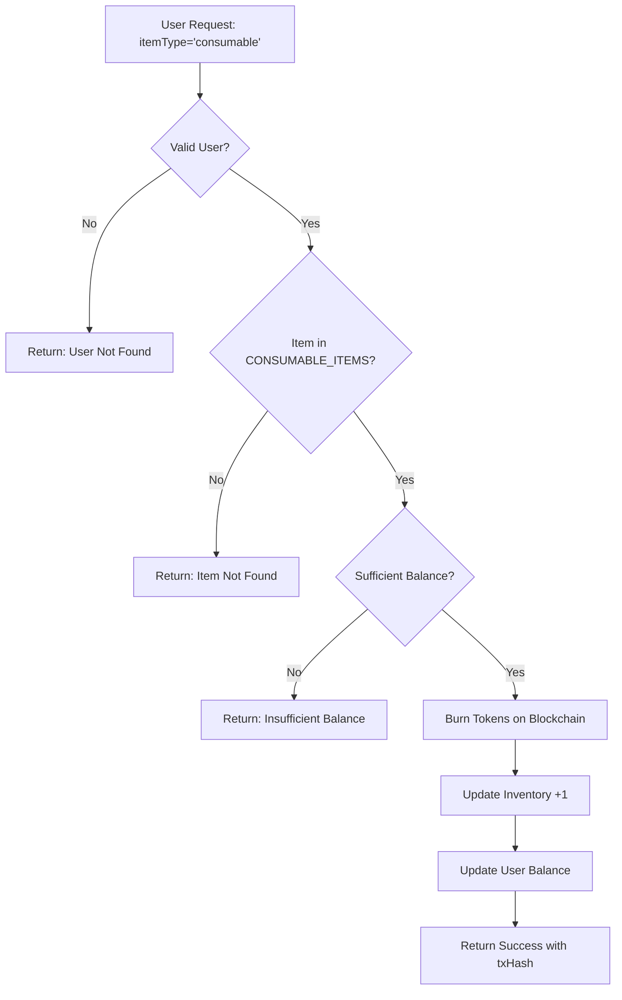
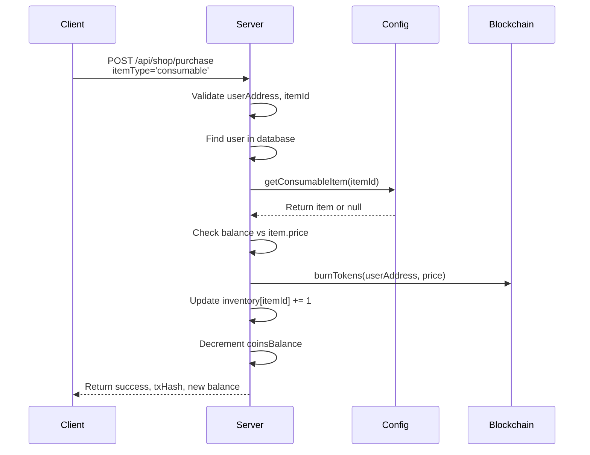
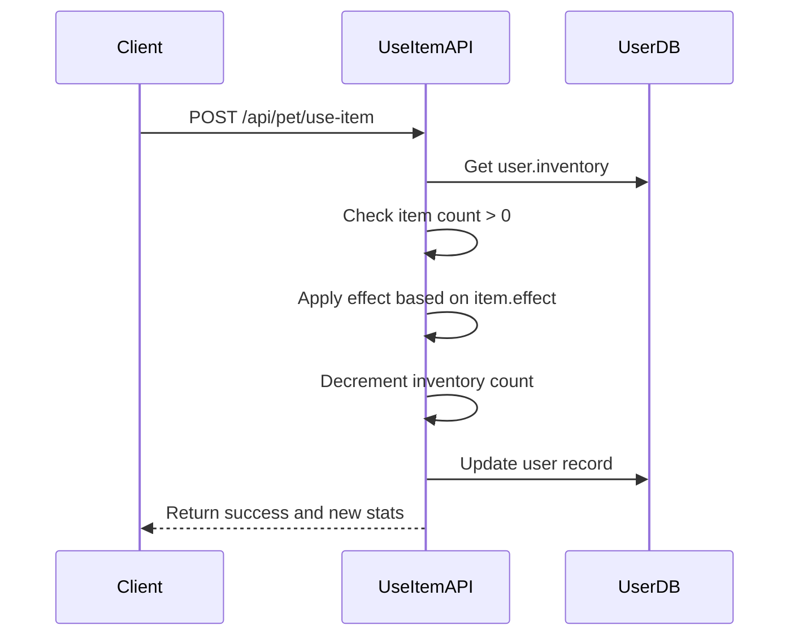

# Consumable Items Purchase

<cite>
**Referenced Files in This Document**   
- [purchase/route.ts](file://app/api/shop/purchase/route.ts)
- [itemsConfig.ts](file://lib/gamification/itemsConfig.ts)
- [blockchain.ts](file://lib/blockchain.ts)
- [use-item/route.ts](file://app/api/pet/use-item/route.ts)
</cite>

## Table of Contents
1. [Introduction](#introduction)
2. [Processing Logic for Consumable Items](#processing-logic-for-consumable-items)
3. [Validation Flow and Routing](#validation-flow-and-routing)
4. [Balance Verification and Token Burning](#balance-verification-and-token-burning)
5. [Inventory Updates](#inventory-updates)
6. [Example Scenarios](#example-scenarios)
7. [Integration with Pet Interaction Systems](#integration-with-pet-interaction-systems)
8. [Audit Logging and Transaction Tracking](#audit-logging-and-transaction-tracking)

## Introduction
The Consumable Items Purchase sub-feature enables users to acquire utility and restoration items such as Time Skip Potion, Health Potion, and Happy Pill using their DIARY token balance. These items are not stored in the database but are defined in a configuration object and managed through client-server interactions. This document details the end-to-end processing logic, validation, balance handling, inventory updates, error resilience, and integration with pet systems.

**Section sources**
- [purchase/route.ts](file://app/api/shop/purchase/route.ts#L0-L184)
- [itemsConfig.ts](file://lib/gamification/itemsConfig.ts#L0-L234)

## Processing Logic for Consumable Items
When a user initiates a purchase with `itemType='consumable'`, the system routes the request to a dedicated handler within the `/api/shop/purchase` endpoint. Unlike food or cosmetic items, consumables are not retrieved from the database (`prisma.shopItem`) but are instead fetched from an in-memory configuration object `CONSUMABLE_ITEMS` via the `getConsumableItem()` function. This design allows for fast, decentralized access to item definitions without requiring database queries.

Each consumable item is defined with properties including `id`, `name`, `price`, `effect`, `value`, and `category`. The system only supports single-unit purchases for consumables—quantity parameter is ignored, and exactly one unit is added per transaction.



**Diagram sources**
- [purchase/route.ts](file://app/api/shop/purchase/route.ts#L87-L134)
- [itemsConfig.ts](file://lib/gamification/itemsConfig.ts#L197-L200)

**Section sources**
- [purchase/route.ts](file://app/api/shop/purchase/route.ts#L87-L134)
- [itemsConfig.ts](file://lib/gamification/itemsConfig.ts#L150-L183)

## Validation Flow and Routing
The validation flow begins with type-based routing. If `itemType` is 'consumable', the system bypasses database lookup and calls `getConsumableItem(itemId)` to retrieve the item from the `CONSUMABLE_ITEMS` registry. If the item does not exist in the configuration, a 404 error is returned.

Quantity is not supported for consumables. The system enforces a fixed quantity of 1, ensuring that only one item is added per purchase. This simplifies inventory logic and aligns with the intended use case of instant-use utilities.



**Diagram sources**
- [purchase/route.ts](file://app/api/shop/purchase/route.ts#L87-L134)
- [itemsConfig.ts](file://lib/gamification/itemsConfig.ts#L197-L200)

**Section sources**
- [purchase/route.ts](file://app/api/shop/purchase/route.ts#L87-L134)

## Balance Verification and Token Burning
Before any purchase, the system verifies that the user's `coinsBalance` is sufficient to cover the item's price. For example, a Health Potion priced at 150 DIARY tokens requires the user to have at least 150 tokens.

The `burnTokens()` function is then invoked to permanently remove the required amount from the user's blockchain wallet. This operation is asynchronous and may fail due to network issues or contract errors. However, the system is designed to be resilient: even if the blockchain transaction fails, the purchase proceeds off-chain with `txHash='burn_failed'`, allowing gameplay continuity while logging the failure for audit.

```mermaid
flowchart LR
A[User Initiates Purchase] --> B{Balance ≥ Price?}
B --> |No| C[Return: Insufficient Balance]
B --> |Yes| D[Call burnTokens()]
D --> E{Transaction Success?}
E --> |Yes| F[Set txHash = blockchain hash]
E --> |No| G[Set txHash = 'burn_failed'<br/>Log error]
F & G --> H[Proceed with inventory update]
```

**Diagram sources**
- [purchase/route.ts](file://app/api/shop/purchase/route.ts#L97-L104)
- [blockchain.ts](file://lib/blockchain.ts#L75-L85)

**Section sources**
- [purchase/route.ts](file://app/api/shop/purchase/route.ts#L97-L104)
- [blockchain.ts](file://lib/blockchain.ts#L75-L85)

## Inventory Updates
Upon successful validation and token burning, the system updates the user's inventory, which is stored as a JSON field in the database (`user.inventory`). The inventory is a key-value map where keys are item IDs and values are quantities.

For consumables, the quantity is incremented by exactly 1. If the item is not present, it is initialized to 1. The update is atomic, ensuring data consistency. After the update, the user's `coinsBalance` is decremented by the item's price.

Example inventory update:
```json
{
  "time-skip": 1,
  "happy-pill": 2
}
```

**Section sources**
- [purchase/route.ts](file://app/api/shop/purchase/route.ts#L110-L118)

## Example Scenarios

### Purchasing a Happy Pill
A user with 100 DIARY tokens attempts to buy a Happy Pill (price: 50 DIARY). The system:
1. Validates user and item
2. Confirms balance ≥ 50
3. Burns 50 tokens via blockchain
4. Adds 1 to `happy-pill` inventory count
5. Reduces balance to 50
6. Returns success with updated balance and txHash

### Handling Insufficient Funds
A user with 120 DIARY attempts to buy a Health Potion (price: 150 DIARY). The system:
1. Validates user and item
2. Detects insufficient balance
3. Returns 400 error: "Insufficient balance"
4. No changes to inventory or blockchain

**Section sources**
- [purchase/route.ts](file://app/api/shop/purchase/route.ts#L87-L134)

## Integration with Pet Interaction Systems
Consumable items are used through the `/api/pet/use-item` endpoint, which applies their effects directly to the pet's state. For example:
- **Time Skip Potion**: Resets `lastFeedTime` and `lastPlayTime` to `null`, allowing immediate feeding and playing.
- **Health Potion**: Increases `livesRemaining` by 3, up to a maximum of 7.
- **Happy Pill**: Boosts `happiness` by 30 points, capped at 100.

Upon use, the item count in inventory is decremented. If the count reaches zero, the item is removed from the JSON object.



**Diagram sources**
- [use-item/route.ts](file://app/api/pet/use-item/route.ts#L0-L97)

**Section sources**
- [use-item/route.ts](file://app/api/pet/use-item/route.ts#L0-L97)

## Audit Logging and Transaction Tracking
All purchase attempts are logged server-side using `console.error()` for failures. The `txHash` field in the response serves as a critical audit trail:
- **Successful burns**: Contains the actual blockchain transaction hash, enabling on-chain verification.
- **Failed burns**: Set to `'burn_failed'`, indicating an off-chain-only transaction.

This dual-mode approach ensures gameplay continuity while preserving transparency. Developers can later reconcile failed burns through manual or automated recovery processes.

**Section sources**
- [purchase/route.ts](file://app/api/shop/purchase/route.ts#L97-L104)
- [purchase/route.ts](file://app/api/shop/purchase/route.ts#L180-L184)