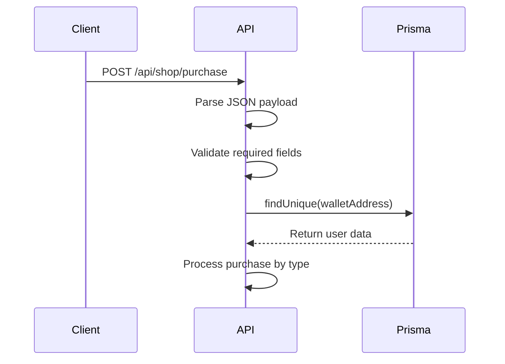
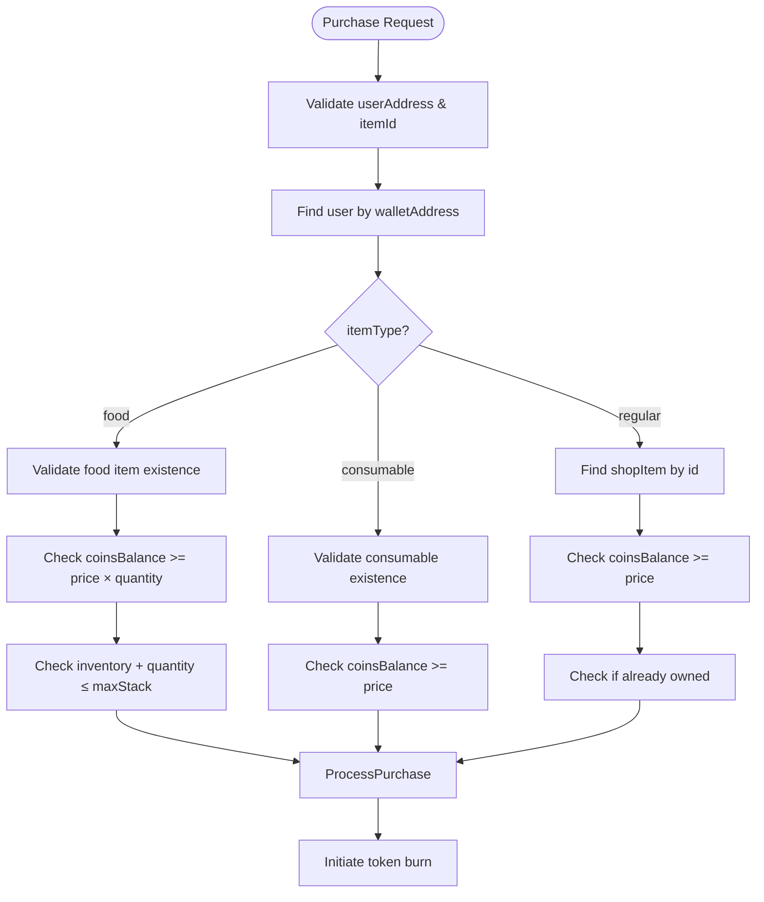
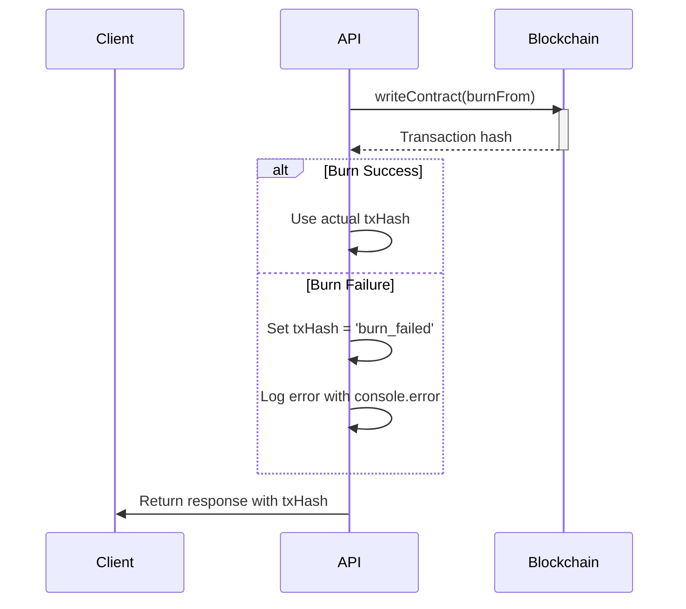
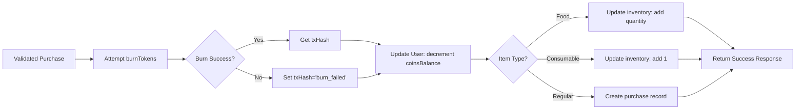

# Purchase Processing

<cite>
**Referenced Files in This Document**  
- [route.ts](file://app/api/shop/purchase/route.ts)
- [blockchain.ts](file://lib/blockchain.ts)
- [prisma.ts](file://lib/prisma.ts)
- [itemsConfig.ts](file://lib/gamification/itemsConfig.ts)
</cite>

## Table of Contents
1. [Introduction](#introduction)
2. [Request Structure and Authentication](#request-structure-and-authentication)
3. [Purchase Types and Validation Logic](#purchase-types-and-validation-logic)
4. [Token Burning and Blockchain Integration](#token-burning-and-blockchain-integration)
5. [Database Transaction Flow](#database-transaction-flow)
6. [Response Examples](#response-examples)
7. [Error Handling and Idempotency](#error-handling-and-idempotency)
8. [Audit Logging and Reconciliation](#audit-logging-and-reconciliation)

## Introduction

The Purchase Processing endpoint handles the acquisition of various in-game items through a secure, blockchain-integrated system. This API endpoint supports three distinct purchase types: regular shop items (such as backgrounds and accessories), food items for pet care, and consumable utility items. The system implements a robust validation workflow that checks user authentication, item availability, balance sufficiency, and inventory constraints before processing transactions. Each purchase triggers a token burn operation on the blockchain while simultaneously updating the user's inventory and balance in the application database, ensuring consistency between on-chain and off-chain states.

**Section sources**
- [route.ts](file://app/api/shop/purchase/route.ts#L5-L183)

## Request Structure and Authentication

The POST endpoint at `/api/shop/purchase` accepts a JSON payload containing the user's wallet address, item identifier, item type, and quantity (defaulting to 1). Authentication is performed through wallet address verification, where the system looks up the user record using the provided `userAddress`. The endpoint first validates that both `userAddress` and `itemId` are present in the request. It then queries the database to confirm the user's existence, using a case-insensitive lookup on the `walletAddress` field. This authentication flow ensures that only registered users with valid wallet addresses can make purchases, while also establishing the user context for subsequent balance and inventory checks.

**Diagram sources**
- [route.ts](file://app/api/shop/purchase/route.ts#L5-L183)
- [prisma.ts](file://lib/prisma.ts#L6)

**Section sources**
- [route.ts](file://app/api/shop/purchase/route.ts#L5-L183)

## Purchase Types and Validation Logic

The system handles three distinct purchase types, each with specific validation rules and processing logic. For food items (`itemType = 'food'`), the endpoint validates against configuration data in `itemsConfig.ts`, checking that the item exists, the user has sufficient `coinsBalance` to cover the total cost (price × quantity), and that adding the quantity won't exceed the item's `maxStack` limit in the user's inventory. For consumable items (`itemType = 'consumable'`), the system verifies item existence and balance sufficiency, automatically adding one unit to the user's inventory. For regular shop items, the endpoint queries the `shopItem` database table to confirm the item exists, checks balance sufficiency, and verifies the user doesn't already own the item by checking the `purchase` table for existing records. This multi-layered validation ensures data integrity across different item categories.

**Diagram sources**
- [route.ts](file://app/api/shop/purchase/route.ts#L5-L183)
- [itemsConfig.ts](file://lib/gamification/itemsConfig.ts#L189-L200)

**Section sources**
- [route.ts](file://app/api/shop/purchase/route.ts#L5-L183)
- [itemsConfig.ts](file://lib/gamification/itemsConfig.ts#L189-L200)

## Token Burning and Blockchain Integration

The purchase process integrates with the blockchain through the `burnTokens` function from `blockchain.ts`. When a purchase is validated, the system attempts to burn the required number of DIARY tokens from the user's wallet by calling the `burnFrom` function on the token contract. This operation is wrapped in a try-catch block to handle potential blockchain failures, such as network issues or contract errors. If the burn operation fails, the error is logged to the console with `console.error`, and the transaction hash is set to `'burn_failed'`, allowing the purchase to proceed off-chain while preserving the user experience. The token amount is converted from the application's decimal format to the blockchain's wei equivalent (multiplying by 10^18) before the contract call, ensuring compatibility with the Ethereum-based token standard.

**Diagram sources**
- [route.ts](file://app/api/shop/purchase/route.ts#L5-L183)
- [blockchain.ts](file://lib/blockchain.ts#L75-L85)

**Section sources**
- [route.ts](file://app/api/shop/purchase/route.ts#L5-L183)
- [blockchain.ts](file://lib/blockchain.ts#L75-L85)

## Database Transaction Flow

The system updates user data through a series of Prisma ORM operations that modify the user's balance, inventory, and purchase history. For food items, the user's `coinsBalance` is decremented by the total cost, and the inventory object is updated to reflect the increased quantity of the purchased food. For consumable items, the balance is decremented by the item price, and the inventory count is incremented by one. For regular shop items, a record is created in the `purchase` table to track ownership, and the user's balance is decremented by the item price. These database operations are performed sequentially after the token burn attempt, ensuring that the off-chain state reflects the purchase regardless of blockchain success. The use of Prisma's `decrement` operation ensures atomic updates to the balance field, preventing race conditions in high-concurrency scenarios.

**Diagram sources**
- [route.ts](file://app/api/shop/purchase/route.ts#L5-L183)
- [prisma.ts](file://lib/prisma.ts#L6)

**Section sources**
- [route.ts](file://app/api/shop/purchase/route.ts#L5-L183)

## Response Examples

Successful purchase responses include a `success: true` flag, the updated `coinsBalance`, and relevant transaction details. For food purchases, the response includes the `itemPurchased` name, `quantity`, and `inventory` object showing all items. For consumable purchases, it returns the `itemPurchased` name and updated `inventory`. For regular shop items, it returns only the `updatedBalance` and `txHash`. Error responses use appropriate HTTP status codes and descriptive error messages, such as "Not enough DIARY. Need X, have Y" for balance issues, "Cannot exceed max stack of Z" for inventory limits, "Already owned" for duplicate purchases (409 Conflict), and "Item not found" for invalid item IDs (404 Not Found). All errors are logged with `console.error` for monitoring and debugging purposes.

**Section sources**
- [route.ts](file://app/api/shop/purchase/route.ts#L5-L183)

## Error Handling and Idempotency

The endpoint implements comprehensive error handling through try-catch blocks at multiple levels. The outermost try-catch captures any unexpected errors during purchase processing, returning a 500 Internal Server Error response with "Purchase failed" message. Validation errors return specific 4xx status codes with descriptive messages, allowing clients to handle different error types appropriately. The system demonstrates idempotency considerations by allowing purchases to proceed even when blockchain operations fail, using the `'burn_failed'` placeholder for transaction hashes. This design prioritizes user experience by ensuring that in-game items are delivered even if the on-chain transaction encounters temporary issues, with the understanding that reconciliation processes can address discrepancies later.

**Section sources**
- [route.ts](file://app/api/shop/purchase/route.ts#L5-L183)

## Audit Logging and Reconciliation

The system maintains audit logs through `console.error` statements that capture token burn failures and general purchase errors. These logs provide visibility into blockchain interaction issues, helping developers identify and resolve problems with the wallet client or network connectivity. The separation between on-chain token burns and off-chain inventory updates creates a reconciliation challenge that must be addressed through monitoring and potential recovery processes. When `txHash` is set to `'burn_failed'`, administrators can investigate the cause and potentially initiate manual corrections or refunds. This logging approach provides a basic audit trail while maintaining system availability, though a more robust solution might include structured logging with error tracking services for production environments.

**Section sources**
- [route.ts](file://app/api/shop/purchase/route.ts#L5-L183)
- [blockchain.ts](file://lib/blockchain.ts#L75-L85)