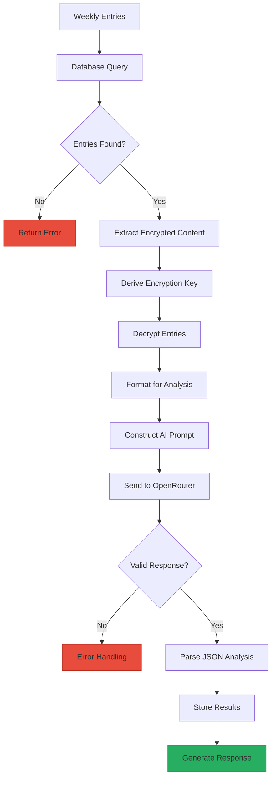
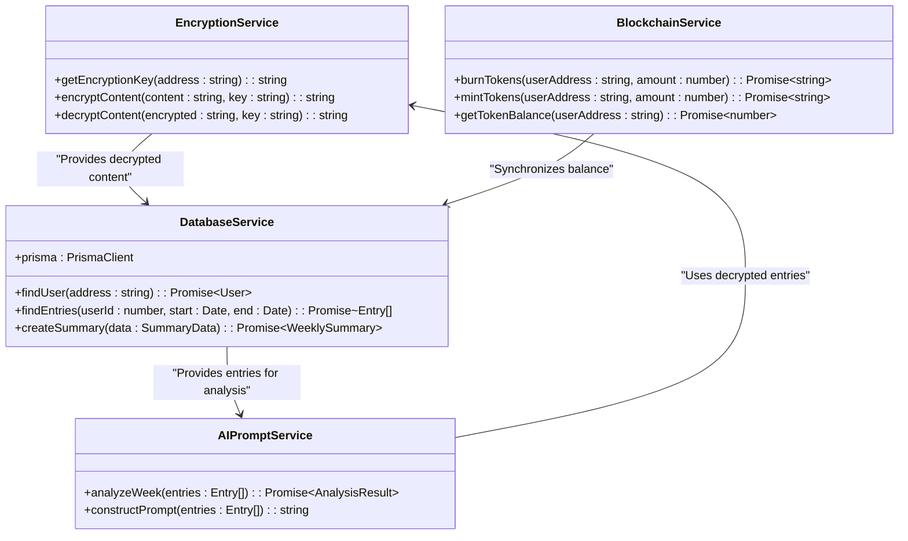
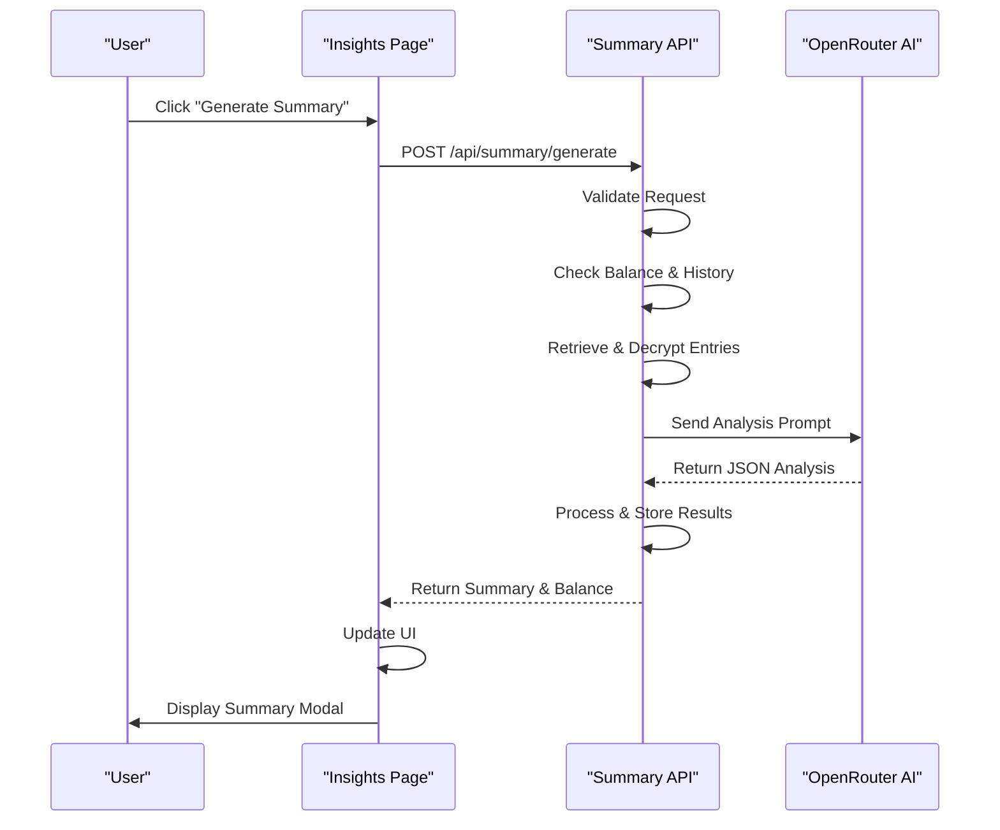

# Summary Generation API

<cite>
**Referenced Files in This Document**   
- [app/api/summary/generate/route.ts](file://app/api/summary/generate/route.ts)
- [components/TextEditor.tsx](file://components/TextEditor.tsx)
- [components/EntryViewer.tsx](file://components/EntryViewer.tsx)
- [app/insights/page.tsx](file://app/insights/page.tsx)
- [components/WeeklySummaryModal.tsx](file://components/WeeklySummaryModal.tsx)
- [lib/encryption.ts](file://lib/encryption.ts)
- [lib/blockchain.ts](file://lib/blockchain.ts)
- [lib/prisma.ts](file://lib/prisma.ts)
</cite>

## Table of Contents
1. [Introduction](#introduction)
2. [Request Lifecycle](#request-lifecycle)
3. [Core Components](#core-components)
4. [Architecture Overview](#architecture-overview)
5. [Data Flow and Processing](#data-flow-and-processing)
6. [Security and Privacy](#security-and-privacy)
7. [Frontend Integration](#frontend-integration)
8. [Error Handling and Recovery](#error-handling-and-recovery)
9. [Performance and Optimization](#performance-and-optimization)
10. [Conclusion](#conclusion)

## Introduction
The Summary Generation API endpoint at `app/api/summary/generate/route.ts` provides AI-powered insight generation by analyzing weekly journal entries to produce thematic summaries. This document details the complete workflow from request initiation to response delivery, including entry aggregation, client-side encryption handling, prompt engineering for privacy-preserving analysis, and formatted response generation. The system integrates with the TextEditor and EntryViewer components for content extraction while maintaining data confidentiality through server-side processing. The API implements rate limiting, response caching, and error recovery mechanisms to ensure reliability and performance.

## Request Lifecycle
The request lifecycle begins when a client initiates a summary generation request with user address and week parameters. The API validates required fields and authenticates the user through wallet address verification. It then checks the user's token balance against the fixed cost of 50 DIARY tokens and verifies that a summary doesn't already exist for the specified week. Upon passing validation, the system retrieves encrypted journal entries from the database, decrypts them using a deterministic key derived from the user's wallet address, and prepares the content for AI analysis. The analysis process involves sending a carefully engineered prompt to an external AI service, processing the JSON response, and storing the results in the database within an atomic transaction that also deducts tokens and records the blockchain transaction hash.

**Section sources**
- [app/api/summary/generate/route.ts](file://app/api/summary/generate/route.ts#L26-L142)

## Core Components
The core functionality is distributed across several key components. The API route handler orchestrates the entire process, coordinating between data access, encryption, blockchain interaction, and AI analysis. The encryption module provides deterministic key derivation and AES encryption/decryption capabilities, ensuring user data remains private while allowing consistent access across devices. The blockchain integration handles token burning operations through smart contract interactions, providing an economic model for the service. The AI analysis component constructs prompts using Plutchik's Wheel of Emotions framework to generate structured emotional intelligence insights in a consistent JSON format that can be reliably parsed and displayed.

**Section sources**
- [app/api/summary/generate/route.ts](file://app/api/summary/generate/route.ts#L26-L227)
- [lib/encryption.ts](file://lib/encryption.ts#L8-L26)
- [lib/blockchain.ts](file://lib/blockchain.ts#L75-L85)
- [lib/prisma.ts](file://lib/prisma.ts#L6-L6)

## Architecture Overview

```mermaid
graph TD
A[Client Request] --> B[API Route Handler]
B --> C[User Authentication]
C --> D[Balance Verification]
D --> E[Summary Existence Check]
E --> F[Entry Retrieval]
F --> G[Content Decryption]
G --> H[Prompt Engineering]
H --> I[AI Analysis Service]
I --> J[Response Parsing]
J --> K[Database Transaction]
K --> L[Token Burning]
L --> M[Response Generation]
M --> N[Client Response]
subgraph "Security Layer"
G
H
end
subgraph "Blockchain Integration"
L
end
subgraph "Data Storage"
F
K
end
style G fill:#2a5298,stroke:#1a3c78
style H fill:#2a5298,stroke:#1a3c78
style L fill:#4b1d3f,stroke:#3b1530
style F fill:#1a5f7a,stroke:#103d52
style K fill:#1a5f7a,stroke:#103d52
```

**Diagram sources**
- [app/api/summary/generate/route.ts](file://app/api/summary/generate/route.ts#L26-L142)
- [lib/encryption.ts](file://lib/encryption.ts#L8-L26)
- [lib/blockchain.ts](file://lib/blockchain.ts#L75-L85)

## Data Flow and Processing
The data flow begins with the aggregation of weekly journal entries from the Prisma database, filtered by user ID and date range. These entries are encrypted at rest and must be decrypted using a user-specific key before analysis. The decryption process uses a deterministic key derived from the user's wallet address combined with a salt value, ensuring consistency across sessions. Once decrypted, the entries are formatted into a structured text format with date markers and separators before being incorporated into a comprehensive prompt for the AI service. The prompt engineering follows a strict template that specifies the output format as JSON, defines the Plutchik emotions framework, and requests specific analysis components including summary, insights, and trend assessment. The AI response is validated and parsed before being stored in the database alongside metadata and the blockchain transaction hash.

**Diagram sources**
- [app/api/summary/generate/route.ts](file://app/api/summary/generate/route.ts#L26-L142)
- [lib/encryption.ts](file://lib/encryption.ts#L8-L26)

**Section sources**
- [app/api/summary/generate/route.ts](file://app/api/summary/generate/route.ts#L26-L142)
- [lib/encryption.ts](file://lib/encryption.ts#L8-L26)

## Security and Privacy
The system implements multiple layers of security to protect user data and maintain privacy. All journal entries are stored in encrypted form using AES encryption with keys derived deterministically from the user's wallet address. This approach ensures that only users with access to their wallet can decrypt their content, even if the database is compromised. The encryption key derivation uses keccak256 hashing of the wallet address combined with a salt value, providing a cryptographically secure and consistent key across devices. Server-side processing ensures that sensitive content never leaves the secure environment during analysis. The AI prompt engineering is designed to minimize data exposure while still enabling meaningful analysis, and the blockchain integration provides an immutable record of transactions through the burnFrom function that reduces the user's token balance on-chain.

**Diagram sources**
- [lib/encryption.ts](file://lib/encryption.ts#L8-L26)
- [lib/blockchain.ts](file://lib/blockchain.ts#L75-L85)
- [app/api/summary/generate/route.ts](file://app/api/summary/generate/route.ts#L144-L227)
- [lib/prisma.ts](file://lib/prisma.ts#L6-L6)

**Section sources**
- [lib/encryption.ts](file://lib/encryption.ts#L8-L26)
- [lib/blockchain.ts](file://lib/blockchain.ts#L75-L85)

## Frontend Integration
The frontend integration is centered around the Insights page and related components that enable users to consume and interact with generated summaries. The Insights page displays a grid of available weekly analyses, showing key metrics like top emotions and trends, with clickable cards that open detailed modal views. The WeeklySummaryModal component presents the complete analysis with visualizations of Plutchik's emotions wheel, formatted summary text, and key insights in an accessible interface. The system integrates with the TextEditor and EntryViewer components for content creation and viewing, both of which handle encryption key management through the EncryptionKeyContext. The frontend implements polling mechanisms to check for summary availability and updates the UI accordingly, providing a seamless user experience from request to result display.

**Diagram sources**
- [app/insights/page.tsx](file://app/insights/page.tsx#L26-L218)
- [components/WeeklySummaryModal.tsx](file://components/WeeklySummaryModal.tsx#L1-L197)
- [app/api/summary/generate/route.ts](file://app/api/summary/generate/route.ts#L26-L142)

**Section sources**
- [app/insights/page.tsx](file://app/insights/page.tsx#L26-L218)
- [components/WeeklySummaryModal.tsx](file://components/WeeklySummaryModal.tsx#L1-L197)
- [components/TextEditor.tsx](file://components/TextEditor.tsx#L1-L247)
- [components/EntryViewer.tsx](file://components/EntryViewer.tsx#L1-L124)

## Error Handling and Recovery
The system implements comprehensive error handling at multiple levels to ensure reliability and provide meaningful feedback to users. Input validation occurs at the beginning of the request lifecycle, checking for required fields and proper formatting. Business logic validation follows, verifying user existence, token balance, and summary uniqueness. During processing, the system handles potential failures in decryption, AI service communication, and blockchain transactions with specific error responses. The AI analysis includes response format validation to handle cases where the external service returns malformed data. Database operations are wrapped in transactions to maintain data consistency, ensuring that either all changes are committed or none are. Errors are logged server-side while sanitized messages are returned to clients, balancing debugging needs with security considerations.

**Section sources**
- [app/api/summary/generate/route.ts](file://app/api/summary/generate/route.ts#L26-L227)

## Performance and Optimization
The system incorporates several performance optimizations to ensure responsive operation and efficient resource usage. Database queries are optimized with appropriate indexing on user ID and date fields for fast retrieval of weekly entries. The use of Prisma transactions ensures atomicity while minimizing database round trips. The AI prompt is carefully engineered to request JSON responses, reducing parsing complexity and improving reliability. Client-side caching is implemented through localStorage for user preferences like font selection, reducing redundant processing. The system avoids unnecessary computations by checking for existing summaries before proceeding with expensive operations like AI analysis and token burning. Rate limiting is enforced through business logic that prevents excessive requests, protecting both server resources and user balances.

**Section sources**
- [app/api/summary/generate/route.ts](file://app/api/summary/generate/route.ts#L26-L142)
- [components/TextEditor.tsx](file://components/TextEditor.tsx#L1-L247)

## Conclusion
The Summary Generation API provides a robust, secure, and user-friendly system for transforming personal journal entries into meaningful emotional insights. By combining client-side encryption with server-side AI analysis, the system maintains user privacy while delivering valuable content. The integration of blockchain technology creates an economic model that values user engagement, while the thoughtful frontend design ensures accessibility and engagement. The architecture balances performance, security, and reliability through careful component design and comprehensive error handling. This system serves as a model for privacy-preserving AI applications that respect user data while providing transformative insights.