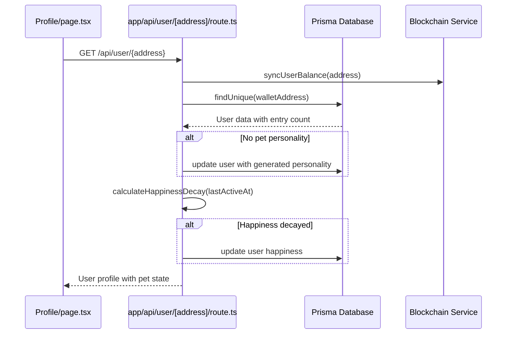
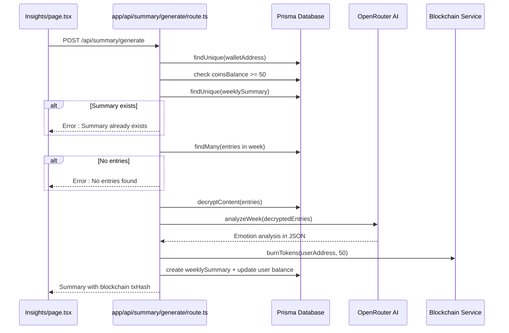
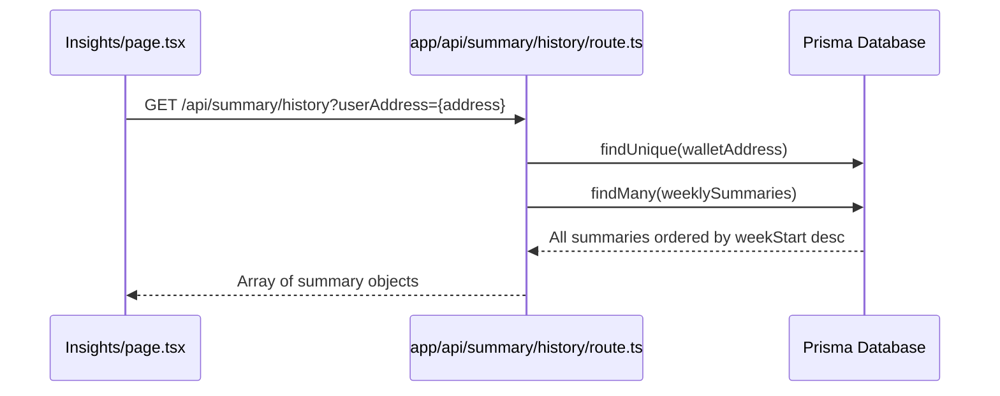
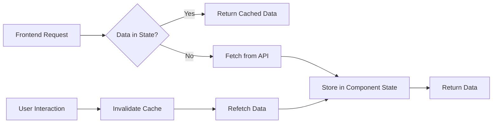
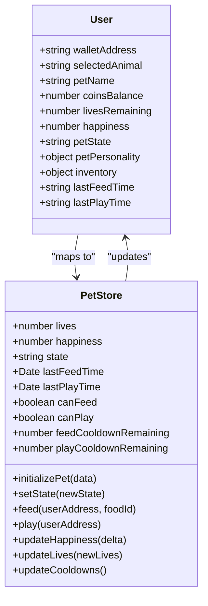
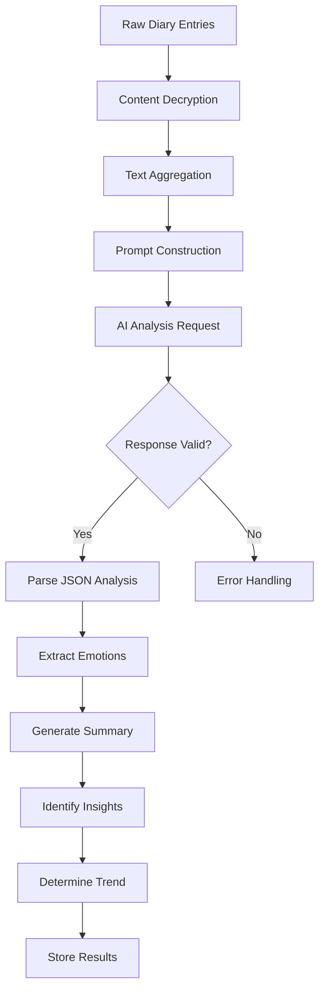
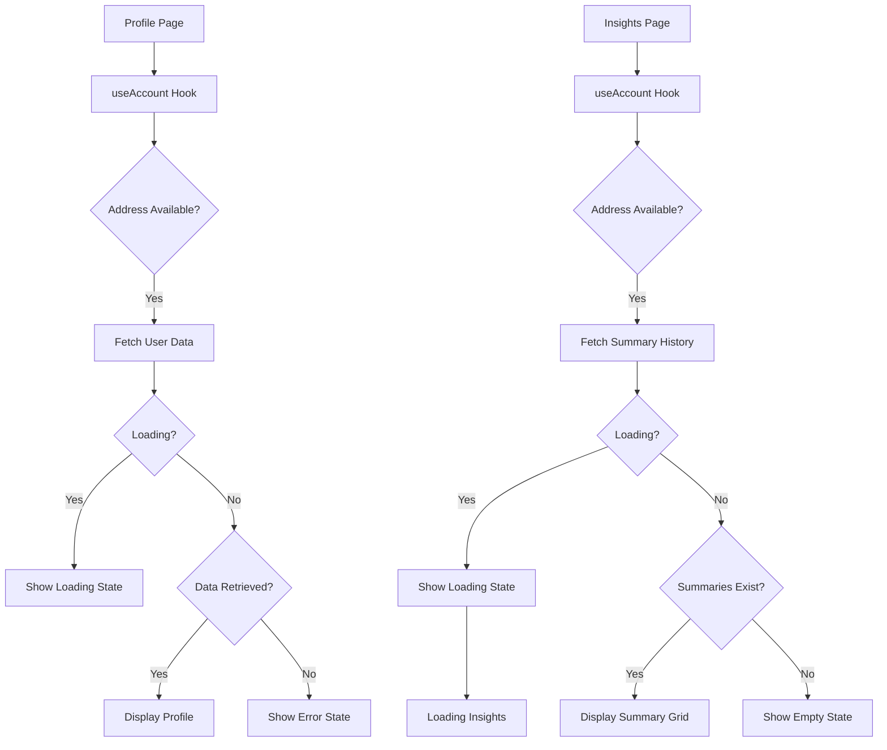

# User API

<cite>
**Referenced Files in This Document**   
- [app/api/user/[address]/route.ts](file://app/api/user/[address]/route.ts)
- [app/api/summary/generate/route.ts](file://app/api/summary/generate/route.ts)
- [app/api/summary/history/route.ts](file://app/api/summary/history/route.ts)
- [lib/stores/petStore.ts](file://lib/stores/petStore.ts)
- [app/profile/page.tsx](file://app/profile/page.tsx)
- [app/insights/page.tsx](file://app/insights/page.tsx)
- [lib/encryption.ts](file://lib/encryption.ts)
- [lib/gamification/lifeSystem.ts](file://lib/gamification/lifeSystem.ts)
</cite>

## Table of Contents
1. [Introduction](#introduction)
2. [User Profile and Pet State API](#user-profile-and-pet-state-api)
3. [Weekly Journal Insights API](#weekly-journal-insights-api)
4. [Summary Generation History API](#summary-generation-history-api)
5. [Dynamic Route Handling](#dynamic-route-handling)
6. [Response Caching Strategy](#response-caching-strategy)
7. [Pet State Integration](#pet-state-integration)
8. [AI-Powered Summary Generation](#ai-powered-summary-generation)
9. [Data Aggregation and Privacy](#data-aggregation-and-privacy)
10. [Frontend Consumption Examples](#frontend-consumption-examples)
11. [Error Handling and Status Codes](#error-handling-and-status-codes)

## Introduction
The User API provides endpoints for retrieving user profile information, generating AI-powered journal insights, and accessing summary generation history. The API integrates with the pet state management system to provide real-time pet status and implements privacy-preserving techniques for handling sensitive diary entries. This documentation covers the three main API endpoints: user profile retrieval, weekly journal insights generation, and summary history access.

## User Profile and Pet State API
The user profile endpoint retrieves comprehensive user information including profile data, pet state, and gamification metrics. It also handles user profile updates through PATCH requests.



**Diagram sources**
- [app/api/user/[address]/route.ts](file://app/api/user/[address]/route.ts#L0-L172)
- [app/profile/page.tsx](file://app/profile/page.tsx#L0-L368)

**Section sources**
- [app/api/user/[address]/route.ts](file://app/api/user/[address]/route.ts#L0-L172)
- [lib/gamification/lifeSystem.ts](file://lib/gamification/lifeSystem.ts#L0-L345)

## Weekly Journal Insights API
The summary generation endpoint creates AI-powered insights from a user's weekly diary entries. It implements a token-based cost system and integrates with blockchain for transaction verification.



**Diagram sources**
- [app/api/summary/generate/route.ts](file://app/api/summary/generate/route.ts#L0-L228)
- [app/insights/page.tsx](file://app/insights/page.tsx#L0-L218)

**Section sources**
- [app/api/summary/generate/route.ts](file://app/api/summary/generate/route.ts#L0-L228)
- [lib/encryption.ts](file://lib/encryption.ts#L0-L26)

## Summary Generation History API
The summary history endpoint retrieves all previously generated weekly summaries for a user, ordered by week start date in descending order.



**Diagram sources**
- [app/api/summary/history/route.ts](file://app/api/summary/history/route.ts#L0-L54)
- [app/insights/page.tsx](file://app/insights/page.tsx#L0-L218)

**Section sources**
- [app/api/summary/history/route.ts](file://app/api/summary/history/route.ts#L0-L54)

## Dynamic Route Handling
The API uses Next.js dynamic routing for user-specific endpoints. The user profile endpoint employs a dynamic route parameter to retrieve user data based on wallet address.

```mermaid
flowchart TD
A[Request] --> B{Route Pattern}
B --> |/api/user/[address]| C[Extract Address Parameter]
C --> D[Validate Address Format]
D --> E[Convert to Lowercase]
E --> F[Query Database with walletAddress]
F --> G{User Found?}
G --> |Yes| H[Return User Data]
G --> |No| I[Return 404 Not Found]
H --> J[Apply Business Logic]
J --> K[Return Response]
```

**Section sources**
- [app/api/user/[address]/route.ts](file://app/api/user/[address]/route.ts#L0-L172)

## Response Caching Strategy
The API implements strategic caching at multiple levels to optimize performance and reduce redundant operations. While the server endpoints themselves are not cached, the frontend implements data fetching patterns that minimize unnecessary requests.



**Section sources**
- [app/profile/page.tsx](file://app/profile/page.tsx#L0-L368)
- [app/insights/page.tsx](file://app/insights/page.tsx#L0-L218)

## Pet State Integration
The user profile API integrates with the pet state management system to provide real-time pet status, including happiness levels, cooldowns, and inventory information.



**Diagram sources**
- [app/api/user/[address]/route.ts](file://app/api/user/[address]/route.ts#L0-L172)
- [lib/stores/petStore.ts](file://lib/stores/petStore.ts#L0-L234)

**Section sources**
- [app/api/user/[address]/route.ts](file://app/api/user/[address]/route.ts#L0-L172)
- [lib/stores/petStore.ts](file://lib/stores/petStore.ts#L0-L234)

## AI-Powered Summary Generation
The summary generation process uses AI to analyze diary entries and provide emotional insights based on Plutchik's Wheel of Emotions framework. The system implements prompt engineering to ensure consistent JSON output.



**Section sources**
- [app/api/summary/generate/route.ts](file://app/api/summary/generate/route.ts#L0-L228)

## Data Aggregation and Privacy
The API implements privacy-preserving techniques for handling sensitive diary entries, including client-side encryption and secure key derivation based on user wallet addresses.

```mermaid
flowchart LR
A[User Wallet Address] --> B[Key Derivation]
B --> C[getEncryptionKey()]
C --> D[SHA-3 Hash with Salt]
D --> E[Encryption Key]
E --> F[Content Encryption/Decryption]
G[Diary Entry] --> H[encryptContent()]
H --> I[Encrypted Content]
I --> J[Database Storage]
J --> K[decryptContent()]
K --> L[AI Analysis]
```

**Diagram sources**
- [lib/encryption.ts](file://lib/encryption.ts#L0-L26)
- [app/api/summary/generate/route.ts](file://app/api/summary/generate/route.ts#L0-L228)

**Section sources**
- [lib/encryption.ts](file://lib/encryption.ts#L0-L26)
- [app/api/summary/generate/route.ts](file://app/api/summary/generate/route.ts#L0-L228)

## Frontend Consumption Examples
The frontend components demonstrate how to consume the User API endpoints with proper loading states and error handling.



**Diagram sources**
- [app/profile/page.tsx](file://app/profile/page.tsx#L0-L368)
- [app/insights/page.tsx](file://app/insights/page.tsx#L0-L218)

**Section sources**
- [app/profile/page.tsx](file://app/profile/page.tsx#L0-L368)
- [app/insights/page.tsx](file://app/insights/page.tsx#L0-L218)

## Error Handling and Status Codes
The API implements comprehensive error handling with appropriate HTTP status codes and descriptive error messages.

| Endpoint | Error Condition | Status Code | Response Structure |
|---------|----------------|------------|-------------------|
| GET /api/user/[address] | User not found | 404 | `{ error: 'User not found' }` |
| GET /api/user/[address] | Server error | 500 | `{ error: 'Failed to fetch user', details: string }` |
| POST /api/summary/generate | Missing required fields | 400 | `{ error: 'Missing required fields' }` |
| POST /api/summary/generate | Insufficient balance | 400 | `{ error: 'Insufficient balance', required: number, current: number }` |
| POST /api/summary/generate | Summary already exists | 400 | `{ error: 'Summary already exists for this week' }` |
| POST /api/summary/generate | No entries found | 400 | `{ error: 'No entries found for this week' }` |
| POST /api/summary/generate | Server error | 500 | `{ error: 'Failed to generate summary', details: string }` |
| GET /api/summary/history | Missing userAddress | 400 | `{ error: 'Missing userAddress' }` |
| GET /api/summary/history | User not found | 404 | `{ error: 'User not found' }` |
| GET /api/summary/history | Server error | 500 | `{ error: 'Failed to fetch summaries', details: string }` |

**Section sources**
- [app/api/user/[address]/route.ts](file://app/api/user/[address]/route.ts#L0-L172)
- [app/api/summary/generate/route.ts](file://app/api/summary/generate/route.ts#L0-L228)
- [app/api/summary/history/route.ts](file://app/api/summary/history/route.ts#L0-L54)