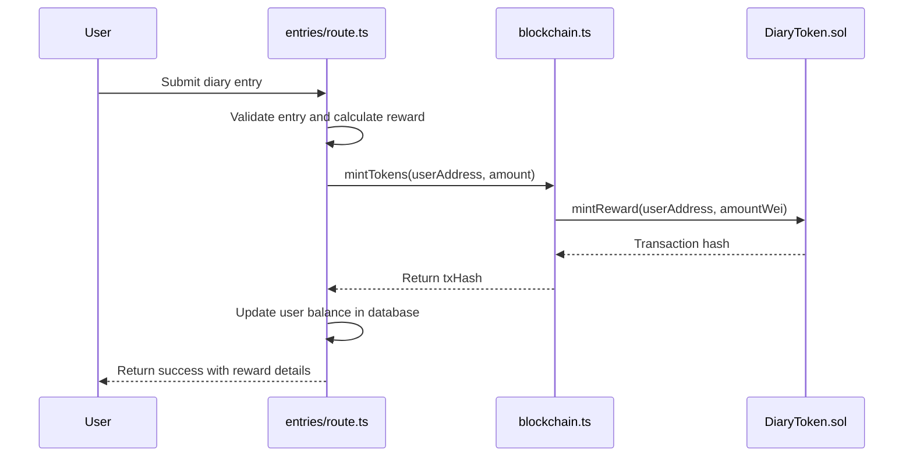
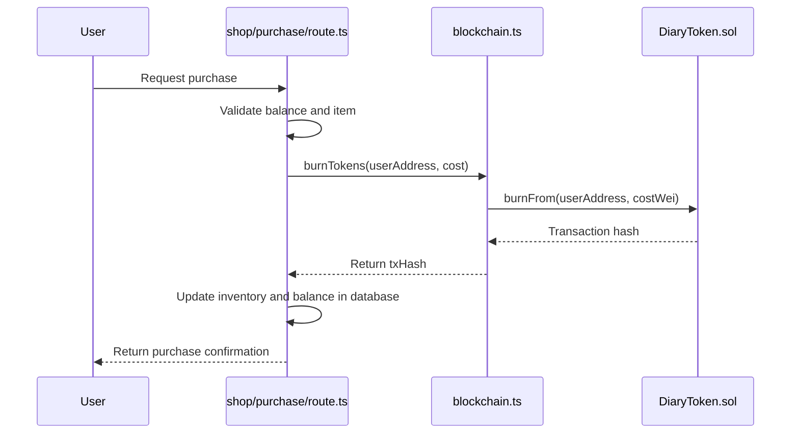
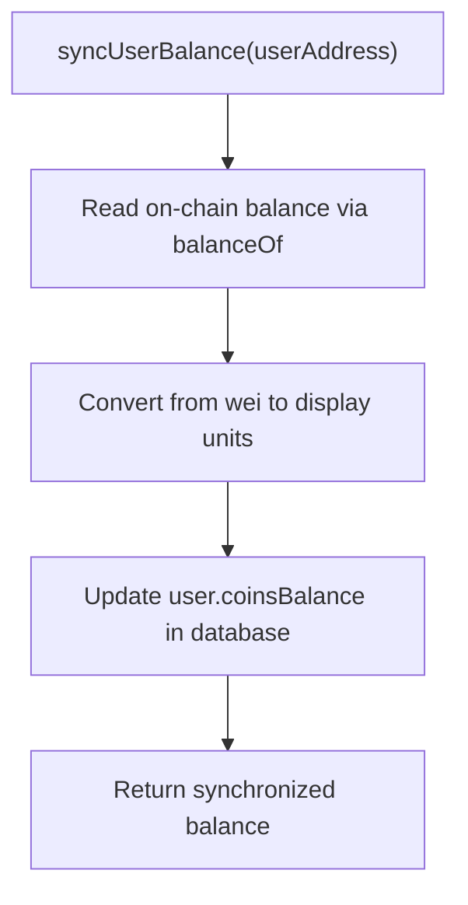
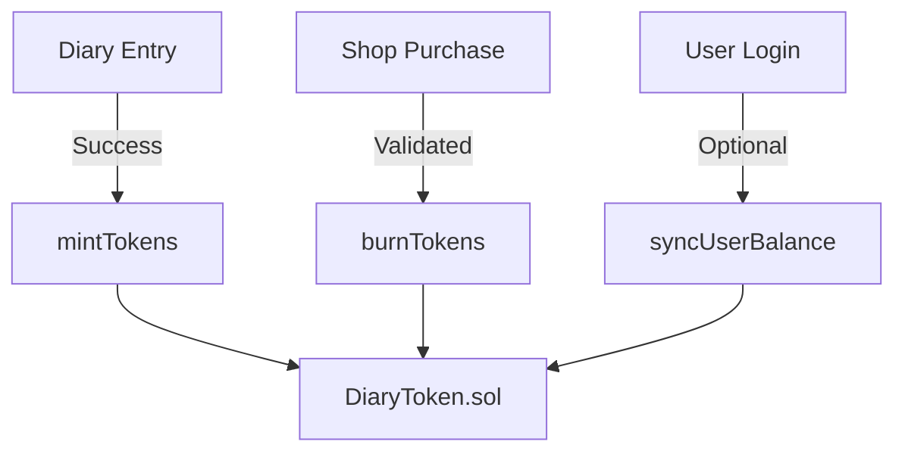
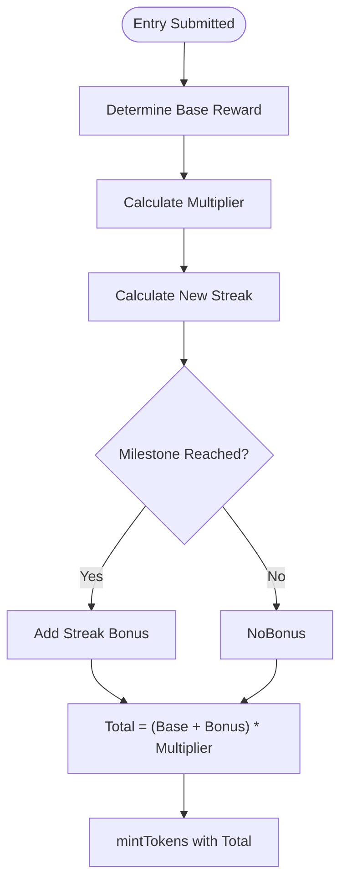

# Token Economy

<cite>
**Referenced Files in This Document**   
- [DiaryToken.sol](file://contracts/contracts/DiaryToken.sol)
- [entries/route.ts](file://app/api/entries/route.ts)
- [shop/purchase/route.ts](file://app/api/shop/purchase/route.ts)
- [blockchain.ts](file://lib/blockchain.ts)
- [streakRewards.ts](file://lib/gamification/streakRewards.ts)
</cite>

## Table of Contents
1. [Introduction](#introduction)
2. [Token Earning Mechanism](#token-earning-mechanism)
3. [Token Spending Mechanism](#token-spending-mechanism)
4. [Balance Synchronization](#balance-synchronization)
5. [Decimal Precision and Unit Conversion](#decimal-precision-and-unit-conversion)
6. [Integration Points](#integration-points)
7. [Reward Calculation and Streak Logic](#reward-calculation-and-streak-logic)
8. [Edge Case Handling](#edge-case-handling)
9. [Performance Considerations](#performance-considerations)
10. [Conclusion](#conclusion)

## Introduction
The DIARY token economy is a core gamification mechanism in the DiaryBeast application, enabling users to earn non-transferable (soul-bound) ERC20 tokens for writing diary entries and spend them in an in-app shop. The system integrates blockchain operations with a backend database to ensure secure, transparent, and synchronized token management. This document details the architecture, implementation, and operational logic of the token economy, focusing on earning, spending, balance synchronization, and edge case handling.

**Section sources**
- [DiaryToken.sol](file://contracts/contracts/DiaryToken.sol#L1-L57)
- [blockchain.ts](file://lib/blockchain.ts#L1-L113)

## Token Earning Mechanism
Users earn DIARY tokens when they successfully submit a diary entry. The process is triggered via the `entries/route.ts` API endpoint, which validates the entry and calculates a reward based on base value, pet condition multiplier, and streak milestones. The actual token minting is performed by calling the `mintTokens` function in `blockchain.ts`, which invokes the `mintReward` method on the `DiaryToken` smart contract. The contract restricts `mintReward` to the owner (server), ensuring only authorized minting occurs.

**Diagram sources**
- [entries/route.ts](file://app/api/entries/route.ts#L1-L239)
- [blockchain.ts](file://lib/blockchain.ts#L63-L73)
- [DiaryToken.sol](file://contracts/contracts/DiaryToken.sol#L15-L20)

**Section sources**
- [entries/route.ts](file://app/api/entries/route.ts#L1-L239)
- [blockchain.ts](file://lib/blockchain.ts#L63-L73)
- [DiaryToken.sol](file://contracts/contracts/DiaryToken.sol#L15-L20)

## Token Spending Mechanism
Users spend DIARY tokens when purchasing items from the in-app shop. The `shop/purchase/route.ts` API endpoint handles purchase requests, validates user balance, and triggers token burning via the `burnTokens` function in `blockchain.ts`. This function calls the `burnFrom` method on the `DiaryToken` contract, which reduces the user's token balance. The contract ensures only the owner (server) can call `burnFrom`, preventing unauthorized burns.

**Diagram sources**
- [shop/purchase/route.ts](file://app/api/shop/purchase/route.ts#L1-L185)
- [blockchain.ts](file://lib/blockchain.ts#L75-L85)
- [DiaryToken.sol](file://contracts/contracts/DiaryToken.sol#L23-L29)

**Section sources**
- [shop/purchase/route.ts](file://app/api/shop/purchase/route.ts#L1-L185)
- [blockchain.ts](file://lib/blockchain.ts#L75-L85)
- [DiaryToken.sol](file://contracts/contracts/DiaryToken.sol#L23-L29)

## Balance Synchronization
To maintain consistency between blockchain and database states, the `syncUserBalance` function in `blockchain.ts` reads the on-chain token balance via `balanceOf` and updates the user's `coinsBalance` in the database. This ensures the frontend displays accurate token balances even if direct blockchain interactions occur outside the main flow.

**Diagram sources**
- [blockchain.ts](file://lib/blockchain.ts#L100-L111)

**Section sources**
- [blockchain.ts](file://lib/blockchain.ts#L87-L111)

## Decimal Precision and Unit Conversion
The DIARY token uses 18 decimal places (wei units) as per ERC20 standards. All blockchain operations use `BigInt` values in wei. The `mintTokens` and `burnTokens` functions convert display units (number) to wei by multiplying by `10^18`. Conversely, `getTokenBalance` converts wei back to display units by dividing by `10^18`, ensuring user-facing values are intuitive (e.g., 10.5 tokens instead of 10500000000000000000).

**Section sources**
- [blockchain.ts](file://lib/blockchain.ts#L63-L85)

## Integration Points
Key integration points include:
- **Entry Submission → Minting**: Successful diary entry triggers `mintTokens` with calculated reward.
- **Shop Purchase → Burning**: Validated purchase triggers `burnTokens` with item cost.
- **Periodic Sync**: `syncUserBalance` ensures database reflects on-chain state, used during user login or balance checks.

**Diagram sources**
- [entries/route.ts](file://app/api/entries/route.ts#L1-L239)
- [shop/purchase/route.ts](file://app/api/shop/purchase/route.ts#L1-L185)
- [blockchain.ts](file://lib/blockchain.ts#L100-L111)

**Section sources**
- [entries/route.ts](file://app/api/entries/route.ts#L1-L239)
- [shop/purchase/route.ts](file://app/api/shop/purchase/route.ts#L1-L185)
- [blockchain.ts](file://lib/blockchain.ts#L1-L113)

## Reward Calculation and Streak Logic
Reward amounts are calculated based on:
- **Base Reward**: 50 tokens for first entry, 10 for subsequent entries.
- **Multiplier**: Based on pet happiness and lives (from `lifeSystem.ts`).
- **Streak Bonus**: Milestone-based bonuses (e.g., 20 tokens at 7-day streak) from `streakRewards.ts`.

The system checks consecutive daily entries to update `currentStreak` and awards bonuses when milestones are reached. All bonuses are multiplied by the same pet condition multiplier.

**Diagram sources**
- [entries/route.ts](file://app/api/entries/route.ts#L1-L239)
- [streakRewards.ts](file://lib/gamification/streakRewards.ts#L1-L62)

**Section sources**
- [entries/route.ts](file://app/api/entries/route.ts#L1-L239)
- [streakRewards.ts](file://lib/gamification/streakRewards.ts#L1-L62)

## Edge Case Handling
The system addresses several edge cases:
- **Failed Transactions**: If `mintTokens` or `burnTokens` fails, the transaction hash is set to `mint_failed` or `burn_failed`, but the database update proceeds to maintain user experience.
- **Balance Discrepancies**: `syncUserBalance` resolves mismatches by aligning the database with the blockchain.
- **Race Conditions**: Prisma updates use atomic operations (e.g., `{ increment: value }`) to prevent race conditions during balance changes.

**Section sources**
- [entries/route.ts](file://app/api/entries/route.ts#L1-L239)
- [shop/purchase/route.ts](file://app/api/shop/purchase/route.ts#L1-L185)
- [blockchain.ts](file://lib/blockchain.ts#L1-L113)

## Performance Considerations
To optimize performance:
- **Minimize Blockchain Reads**: `getTokenBalance` is called only when necessary (e.g., sync), not on every UI render.
- **Optimize User Experience**: Token operations are non-blocking; entries and purchases succeed even if blockchain calls fail, with fallback states.
- **Efficient Database Updates**: Prisma's atomic operations ensure data integrity without additional locking.

**Section sources**
- [blockchain.ts](file://lib/blockchain.ts#L87-L111)
- [entries/route.ts](file://app/api/entries/route.ts#L1-L239)
- [shop/purchase/route.ts](file://app/api/shop/purchase/route.ts#L1-L185)

## Conclusion
The DIARY token economy effectively integrates blockchain-based token management with a traditional backend database, providing a secure and engaging user experience. By leveraging soul-bound tokens, the system ensures tokens are earned through meaningful user activity and spent within the ecosystem. The design emphasizes reliability, consistency, and performance, with robust handling of edge cases and seamless integration between frontend, backend, and smart contract layers.