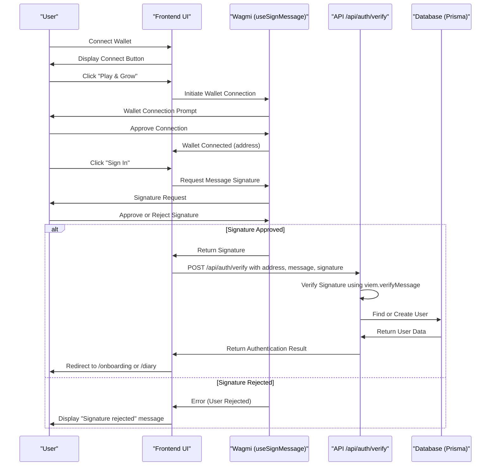
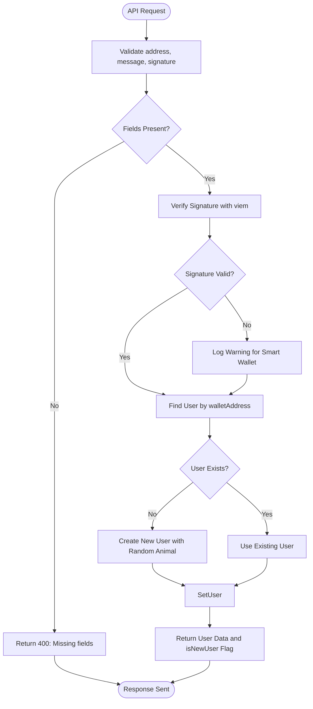

# Wallet Integration

<cite>
**Referenced Files in This Document**   
- [useAuth.ts](file://lib/useAuth.ts)
- [route.ts](file://app/api/auth/verify/route.ts)
- [page.tsx](file://app/page.tsx)
- [WalletConnect.tsx](file://components/WalletConnect.tsx)
- [prisma.ts](file://lib/prisma.ts)
</cite>

## Table of Contents
1. [Introduction](#introduction)
2. [Authentication Flow Overview](#authentication-flow-overview)
3. [Client-Side Authentication with useAuth Hook](#client-side-authentication-with-useauth-hook)
4. [Server-Side Verification in /api/auth/verify](#server-side-verification-in-apiauthverify)
5. [Wallet Connection and User Interface](#wallet-connection-and-user-interface)
6. [State Management and Navigation Logic](#state-management-and-navigation-logic)
7. [Error Handling and Edge Cases](#error-handling-and-edge-cases)
8. [Security Considerations](#security-considerations)
9. [Integration with Next.js App Router](#integration-with-nextjs-app-router)
10. [Conclusion](#conclusion)

## Introduction
DiaryBeast implements a wallet-based authentication system that allows users to connect their cryptocurrency wallets and authenticate using message signing. This document details the integration of wallet authentication using Wagmi and the `useSignMessage` hook, the implementation of the `useAuth` custom hook, server-side verification logic, and associated security considerations. The system is built on the Next.js App Router architecture and leverages Coinbase's OnchainKit for wallet connectivity.

**Section sources**
- [page.tsx](file://app/page.tsx#L1-L202)
- [WalletConnect.tsx](file://components/WalletConnect.tsx#L1-L34)

## Authentication Flow Overview
The wallet authentication flow in DiaryBeast consists of three main phases: wallet connection, message signing, and server-side verification. Users first connect their wallet using Coinbase OnchainKit, then explicitly initiate authentication by signing a predefined message. The signature is sent to the server for verification, where the user's identity is confirmed and a session is established. Upon successful authentication, users are redirected to either the onboarding flow or the diary interface based on their account status.



**Diagram sources**
- [useAuth.ts](file://lib/useAuth.ts#L16-L99)
- [route.ts](file://app/api/auth/verify/route.ts#L1-L79)

## Client-Side Authentication with useAuth Hook
The `useAuth` custom hook manages the entire client-side authentication process. It leverages Wagmi's `useAccount` to retrieve the connected wallet address and `useSignMessage` to request message signatures. The hook maintains state for the authenticated user, loading status, and error conditions. Authentication is initiated explicitly by the user rather than automatically upon wallet connection, providing better user control.

The hook implements a 60-second timeout for signature requests to prevent indefinite waiting. If the user takes longer than one minute to respond to the signature request, the operation is canceled with a timeout error. This prevents the interface from hanging indefinitely when users forget to respond to wallet prompts.

```mermaid
classDiagram
class useAuth {
+address : string
+isConnected : boolean
+user : User | null
+loading : boolean
+error : string | null
+hasAttempted : boolean
+authenticate() : Promise~void~
}
class User {
+id : string
+walletAddress : string
+selectedAnimal : string | null
+coinsBalance : number
+livesRemaining : number
+currentStreak : number
+longestStreak : number
}
class Wagmi {
+useAccount() : { address, isConnected }
+useSignMessage() : { signMessageAsync }
}
useAuth --> Wagmi : "uses"
useAuth --> User : "manages"
```

**Diagram sources**
- [useAuth.ts](file://lib/useAuth.ts#L6-L99)

**Section sources**
- [useAuth.ts](file://lib/useAuth.ts#L16-L99)

## Server-Side Verification in /api/auth/verify
The `/api/auth/verify` endpoint handles server-side authentication verification. It receives the wallet address, original message, and signature from the client, then uses `viem.verifyMessage` to confirm that the signature was created by the owner of the wallet address. The endpoint is designed to be resilient to different signature formats, particularly those used by smart wallets like Coinbase Smart Wallet.

When a signature verification fails, the system logs a warning and proceeds with only address verification during the alpha/testnet phase. In production, proper smart wallet signature verification should be implemented. The endpoint uses Prisma to interact with the database, finding existing users by their wallet address (stored in lowercase) or creating new users with default values when necessary.



**Diagram sources**
- [route.ts](file://app/api/auth/verify/route.ts#L1-L79)

**Section sources**
- [route.ts](file://app/api/auth/verify/route.ts#L1-L79)
- [prisma.ts](file://lib/prisma.ts#L1-L9)

## Wallet Connection and User Interface
The wallet connection interface is implemented through the `WalletConnect` component, which uses Coinbase OnchainKit to provide a seamless connection experience. When no wallet is connected, it displays a "Play & Grow" button that initiates the wallet connection flow. Once connected, it shows the user's wallet identity with avatar, name, and address, along with a dropdown for wallet management.

On the homepage, the authentication flow is clearly separated from wallet connection. Users must first connect their wallet and then click a separate "Sign In" button to initiate the message signing process. This two-step approach improves user understanding of the authentication process and provides better control over when to share authentication proofs.

**Section sources**
- [WalletConnect.tsx](file://components/WalletConnect.tsx#L1-L34)
- [page.tsx](file://app/page.tsx#L1-L202)

## State Management and Navigation Logic
The `useAuth` hook manages several state variables to track the authentication process: `user` for the authenticated user data, `loading` to indicate ongoing authentication, `error` for error messages, and `hasAttempted` to track whether an authentication attempt has been made. These states are used by the UI to display appropriate messages and controls.

After successful authentication, the system implements conditional navigation logic. New users or existing users who haven't completed onboarding are redirected to the `/onboarding` page, while returning users with completed onboarding are taken directly to the `/diary` page. This ensures proper user onboarding while providing quick access for returning users.

An effect in the `useAuth` hook resets the `hasAttempted` and `error` states whenever the wallet address changes, ensuring a clean state when users switch between different wallets.

**Section sources**
- [useAuth.ts](file://lib/useAuth.ts#L16-L99)
- [page.tsx](file://app/page.tsx#L1-L202)

## Error Handling and Edge Cases
The authentication system handles several edge cases and potential errors. If the user rejects the signature request, the system detects this through error messages containing "User rejected" or error code 4001, and displays an appropriate message. Signature request timeouts after 60 seconds are handled gracefully with a specific timeout message.

Network errors or API failures result in generic authentication failure messages. The UI displays these errors prominently and provides a "Try Again" button to allow users to retry authentication without reconnecting their wallet. During the loading state, the interface shows an "AUTHENTICATING..." message with a pulsing animation to indicate activity.

The system also handles wallet disconnection and reconnection. When a user disconnects and reconnects a different wallet, the authentication state is reset, and they must go through the authentication process again with the new wallet.

**Section sources**
- [useAuth.ts](file://lib/useAuth.ts#L16-L99)
- [page.tsx](file://app/page.tsx#L1-L202)

## Security Considerations
The authentication system implements several security measures. The message signed by users is consistent and hardcoded: "Sign this message to authenticate with DiaryBeast", preventing phishing attacks where malicious sites might request signatures for different purposes. This consistency ensures users know exactly what they're signing.

To prevent replay attacks, each authentication request could be enhanced with a nonce or timestamp in production, though this is not currently implemented in the alpha version. The system stores wallet addresses in lowercase to ensure consistent lookups and prevent case-based duplication.

User data is protected through the message signing process, which cryptographically proves ownership of the wallet address. The server verifies signatures using `viem.verifyMessage` before creating or updating user records, ensuring that only the legitimate owner of a wallet address can authenticate as that user.

**Section sources**
- [useAuth.ts](file://lib/useAuth.ts#L16-L99)
- [route.ts](file://app/api/auth/verify/route.ts#L1-L79)

## Integration with Next.js App Router
The wallet integration is built using the Next.js App Router architecture with client components. The `useAuth` hook is implemented as a client-side hook using `'use client'` directive, allowing it to access browser APIs and React hooks like `useState` and `useRouter`. The authentication endpoint is implemented as a server-side route using the App Router's route handlers.

The system leverages React Server Components for most pages while isolating interactive elements that require client-side state into client components. This hybrid approach optimizes performance while maintaining interactivity where needed. The `Providers` component wraps the application with necessary context providers for Wagmi, OnchainKit, and other services required for wallet integration.

**Section sources**
- [useAuth.ts](file://lib/useAuth.ts#L1-L99)
- [route.ts](file://app/api/auth/verify/route.ts#L1-L79)
- [providers.tsx](file://app/providers.tsx#L1-L55)

## Conclusion
DiaryBeast's wallet integration system provides a secure and user-friendly authentication experience using blockchain wallet technology. By separating wallet connection from authentication and implementing proper error handling, the system balances security with usability. The use of Wagmi and Coinbase OnchainKit simplifies wallet integration while maintaining compatibility with various wallet providers. The server-side verification ensures that only legitimate wallet owners can access accounts, and the conditional navigation logic provides an appropriate onboarding experience for new users while enabling quick access for returning users.