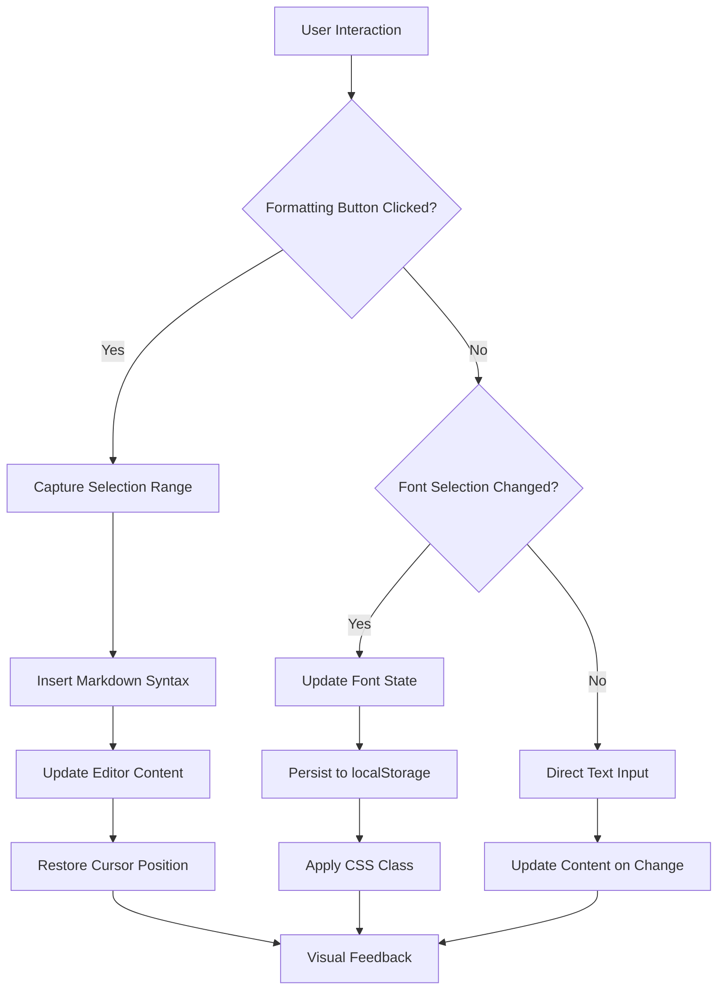
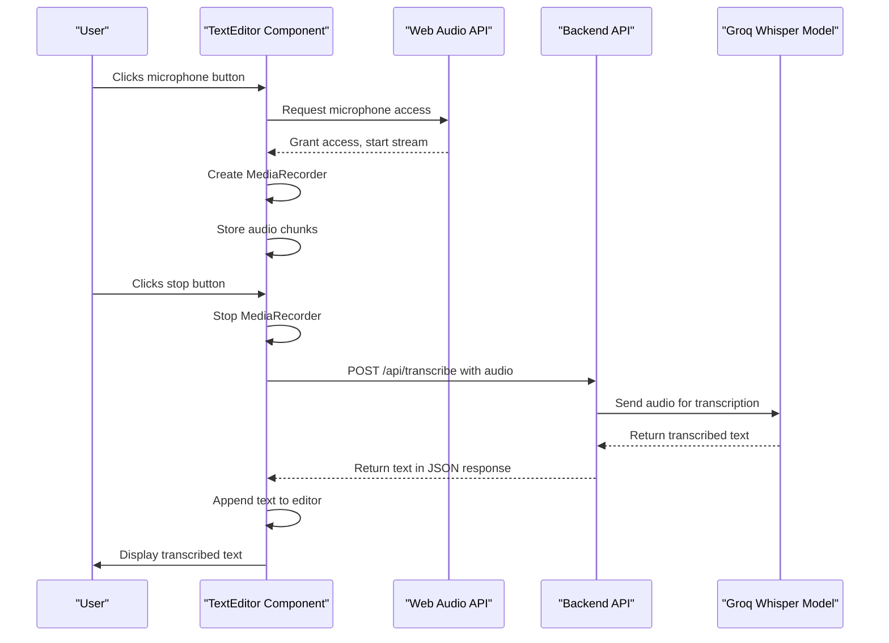
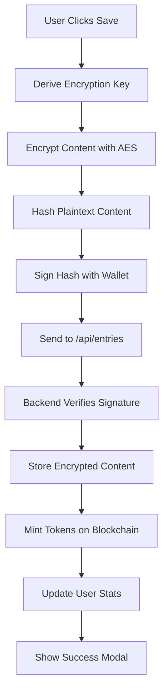
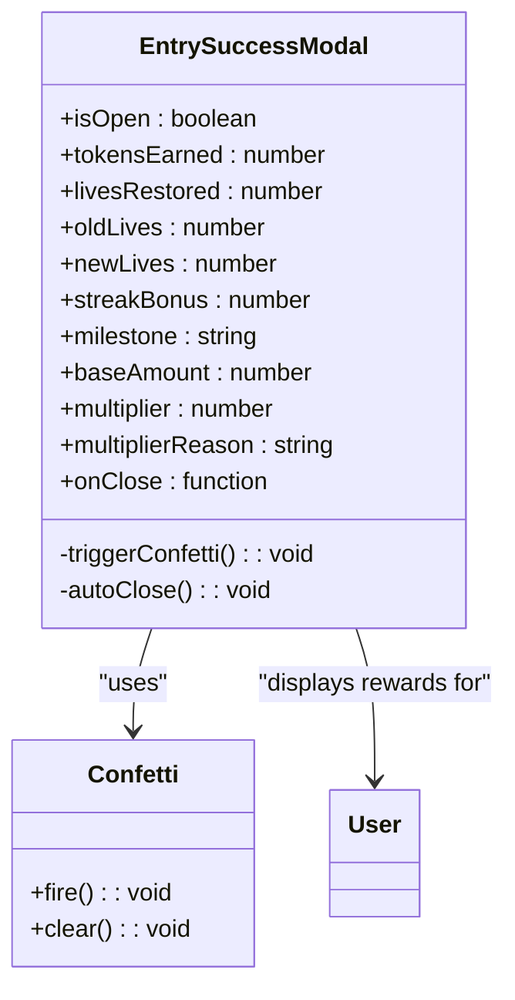

# Editor Components

<cite>
**Referenced Files in This Document**   
- [TextEditor.tsx](file://components/TextEditor.tsx)
- [EntrySuccessModal.tsx](file://components/EntrySuccessModal.tsx)
- [diary/page.tsx](file://app/diary/page.tsx)
- [entries/route.ts](file://app/api/entries/route.ts)
- [transcribe/route.ts](file://app/api/transcribe/route.ts)
- [encryption.ts](file://lib/encryption.ts)
- [EncryptionKeyContext.tsx](file://lib/EncryptionKeyContext.tsx)
</cite>

## Table of Contents
1. [Introduction](#introduction)
2. [TextEditor Component](#texteditor-component)
3. [Rich Text Editing Capabilities](#rich-text-editing-capabilities)
4. [Voice Input and Transcription Workflow](#voice-input-and-transcription-workflow)
5. [Entry Submission and Encryption](#entry-submission-and-encryption)
6. [EntrySuccessModal](#entrysuccessmodal)
7. [Responsive Design and Accessibility](#responsive-design-and-accessibility)
8. [Conclusion](#conclusion)

## Introduction
This document provides comprehensive documentation for the TextEditor component and related entry system components in the DiaryBeast application. The TextEditor serves as the primary interface for users to create diary entries with rich text formatting capabilities, including markdown syntax for bold, italic, and lists. The component supports multiple font families (sans, serif, mono) and features voice input functionality through the Web Audio API. When users submit entries, the content is encrypted client-side before being sent to the server, ensuring privacy and security. After successful submission, the EntrySuccessModal displays information about token rewards and streak progress. This documentation covers the architecture, functionality, and integration points of these components, providing a complete understanding of how they work together to create a seamless diary entry experience.

## TextEditor Component

The TextEditor component is a comprehensive rich text editor designed for the DiaryBeast application, providing users with an intuitive interface for creating diary entries. It combines traditional text editing capabilities with innovative voice input features, creating a flexible and accessible writing experience. The component is implemented as a React functional component with several state variables to manage its various features, including font selection, recording status, and transcription state.

The editor features a clean, modern interface with a toolbar that provides quick access to formatting options and voice recording controls. The design follows a card-based layout with a semi-transparent background and subtle border, creating a focused writing environment. The component is highly interactive, responding to user actions with visual feedback and animations. It also persists user preferences, such as font selection, using localStorage to maintain consistency across sessions.

The TextEditor is designed to be flexible and reusable, accepting several props that allow it to be customized for different use cases. These include the current value of the editor, a callback function for handling changes, placeholder text, action buttons, and word count display. This flexibility enables the component to be integrated into various parts of the application while maintaining a consistent user experience.

**Section sources**
- [TextEditor.tsx](file://components/TextEditor.tsx#L12-L246)

## Rich Text Editing Capabilities

The TextEditor provides users with rich text formatting capabilities through a simple markdown-based interface. Users can apply formatting to their text using toolbar buttons that insert markdown syntax directly into the content. The component supports three primary formatting options: bold, italic, and bulleted lists.

The formatting functionality is implemented through the `insertFormatting` function, which handles the insertion of markdown syntax at the current cursor position. When a user selects text and clicks a formatting button, the function captures the current selection, wraps it with the appropriate markdown delimiters, and updates the editor content. The function also restores the cursor position after formatting is applied, ensuring a seamless user experience.

For font selection, the TextEditor offers three distinct font families: sans-serif, serif, and monospace. Users can switch between these fonts using buttons in the toolbar, and their selection is persisted across sessions using localStorage. The font selection is implemented through CSS classes that are dynamically applied to the textarea based on the current font family state. This approach allows for immediate visual feedback when users change fonts, enhancing the writing experience.

**Diagram sources**
- [TextEditor.tsx](file://components/TextEditor.tsx#L49-L95)

**Section sources**
- [TextEditor.tsx](file://components/TextEditor.tsx#L49-L95)

## Voice Input and Transcription Workflow

The TextEditor includes a voice input feature that allows users to record audio and convert it to text using speech-to-text technology. This functionality is implemented using the Web Audio API for recording and a backend transcription service for processing the audio. The voice input workflow begins when a user clicks the microphone button in the toolbar, which triggers the `startRecording` function.

When recording begins, the component requests access to the user's microphone through the `navigator.mediaDevices.getUserMedia` API. Once access is granted, it creates a MediaRecorder instance to capture the audio stream. The recorded audio chunks are stored in an array using the `audioChunksRef` reference. When the user stops recording, the `stopRecording` function is called, which stops the MediaRecorder and triggers the transcription process.

The transcription process involves sending the recorded audio to the `/api/transcribe` endpoint as a FormData object. The backend service uses the Groq SDK with the Whisper large v3 model to convert the audio to text. Once the transcription is complete, the resulting text is appended to the current editor content. The component provides visual feedback throughout the process, showing "Recording..." when audio is being captured and "Transcribing..." while the audio is being processed.

**Diagram sources**
- [TextEditor.tsx](file://components/TextEditor.tsx#L97-L135)
- [transcribe/route.ts](file://app/api/transcribe/route.ts#L0-L48)

**Section sources**
- [TextEditor.tsx](file://components/TextEditor.tsx#L97-L135)
- [transcribe/route.ts](file://app/api/transcribe/route.ts#L0-L48)

## Entry Submission and Encryption

When users submit a diary entry, the content undergoes client-side encryption before being sent to the server, ensuring that sensitive information remains private. This encryption process is a critical security feature that prevents the server from ever accessing the plaintext content of diary entries. The encryption is implemented using AES encryption from the CryptoJS library, with a key derived from the user's wallet address.

The encryption key is generated deterministically using the `getEncryptionKey` function, which combines the user's wallet address with a salt string and applies the keccak256 hash function. This approach ensures that the same key is generated every time the user accesses the application from any device, allowing them to decrypt their entries consistently. The key derivation process occurs in the EncryptionKeyContext, which provides the encryption key to components that need it through React's context API.

When a user clicks the save button, the handleSave function in the diary page is triggered. This function first encrypts the content using the derived key, then creates a hash of the plaintext content for verification purposes. The user's wallet is used to sign the content hash, providing cryptographic proof of authorship. The encrypted content, signature, and hash are then sent to the `/api/entries` endpoint in a POST request. The backend verifies the signature to ensure the request is legitimate before storing the encrypted content in the database.

**Diagram sources**
- [diary/page.tsx](file://app/diary/page.tsx#L46-L95)
- [entries/route.ts](file://app/api/entries/route.ts#L0-L238)
- [encryption.ts](file://lib/encryption.ts#L0-L26)

**Section sources**
- [diary/page.tsx](file://app/diary/page.tsx#L46-L95)
- [entries/route.ts](file://app/api/entries/route.ts#L0-L238)
- [encryption.ts](file://lib/encryption.ts#L0-L26)

## EntrySuccessModal

The EntrySuccessModal is displayed after a user successfully submits a diary entry, providing feedback on their actions and showing the rewards they have earned. The modal features an animated celebration with confetti effects to create a positive user experience. It displays information about DIARY tokens earned, streak bonuses, and lives restored, giving users immediate feedback on their progress in the application.

The modal is implemented as a React component that accepts several props to customize its content, including the number of tokens earned, lives restored, and streak information. When the modal is opened, it triggers a confetti animation using the canvas-confetti library. The animation creates particles from both sides of the screen, creating a celebratory effect. The modal automatically closes after 5 seconds, but users can also close it manually by clicking the close button or the backdrop.

The EntrySuccessModal provides detailed information about the user's rewards, including base rewards, multipliers, and streak bonuses. For token rewards, it shows both the base amount and the final amount after applying any multipliers based on the user's pet condition. When a user reaches a streak milestone, the modal displays a special bonus notification with the milestone name. The modal also shows the user's lives before and after submission, using heart emojis to represent the change visually.

**Diagram sources**
- [EntrySuccessModal.tsx](file://components/EntrySuccessModal.tsx#L30-L245)

**Section sources**
- [EntrySuccessModal.tsx](file://components/EntrySuccessModal.tsx#L30-L245)

## Responsive Design and Accessibility

The TextEditor and related components are designed with responsive design and accessibility in mind, ensuring they work well across different devices and are usable by people with various needs. The components use a combination of CSS classes and responsive design techniques to adapt to different screen sizes and orientations.

The editor interface is built using Tailwind CSS, which provides a utility-first approach to styling that makes it easy to create responsive layouts. The component uses relative units and flexible layouts to ensure it scales appropriately on different devices. On smaller screens, the toolbar buttons are arranged in a single row, while on larger screens there is more space for the font selection controls.

Accessibility features include proper semantic HTML elements, ARIA attributes, and keyboard navigation support. The textarea element has appropriate labels and placeholders to guide users, and all interactive elements are focusable and operable with keyboard navigation. The component also provides visual feedback for different states, such as recording and transcription, using both text and icons to accommodate users with different needs.

The color scheme and contrast ratios are designed to meet accessibility standards, ensuring text is readable against the background. The component uses high-contrast colors for interactive elements and provides sufficient spacing between controls to prevent accidental touches on touch devices. Error messages are displayed clearly when issues occur, such as microphone access being denied or transcription failures, helping users understand what went wrong and how to fix it.

**Section sources**
- [TextEditor.tsx](file://components/TextEditor.tsx#L12-L246)
- [EntrySuccessModal.tsx](file://components/EntrySuccessModal.tsx#L30-L245)

## Conclusion

The TextEditor and related components form a comprehensive system for creating, submitting, and managing diary entries in the DiaryBeast application. The TextEditor provides a rich text editing experience with markdown formatting and voice input capabilities, making it easy for users to express themselves in multiple ways. The client-side encryption ensures user privacy by preventing the server from accessing plaintext content, while the signature verification process provides cryptographic proof of authorship.

The integration between components is seamless, with the TextEditor passing content to the diary page, which handles encryption and submission to the backend API. After successful submission, the EntrySuccessModal provides immediate feedback on rewards and progress, creating a positive reinforcement loop that encourages continued use. The system demonstrates a thoughtful approach to user experience, combining functionality with engaging visual elements like confetti animations and heart-based life indicators.

Overall, these components work together to create a secure, accessible, and enjoyable diary writing experience that respects user privacy while providing meaningful feedback and rewards. The architecture balances client-side processing for privacy with server-side storage for reliability, creating a robust system that can scale to support a growing user base.