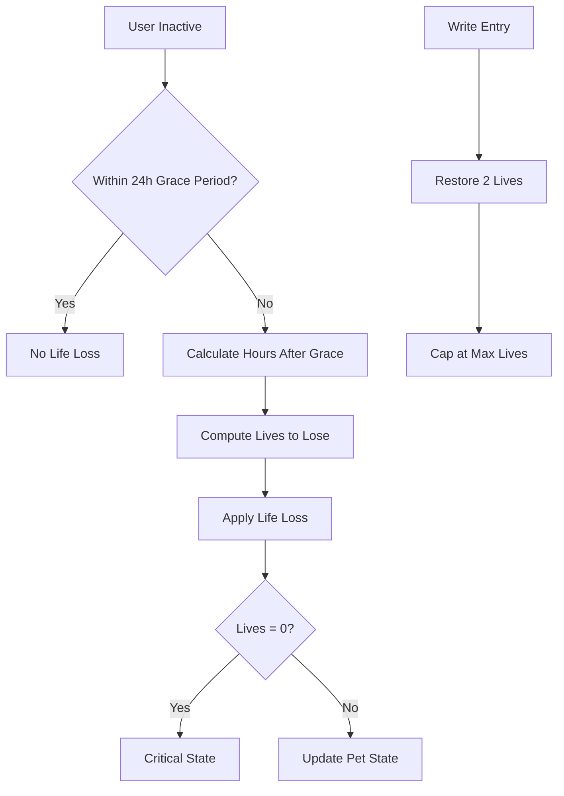
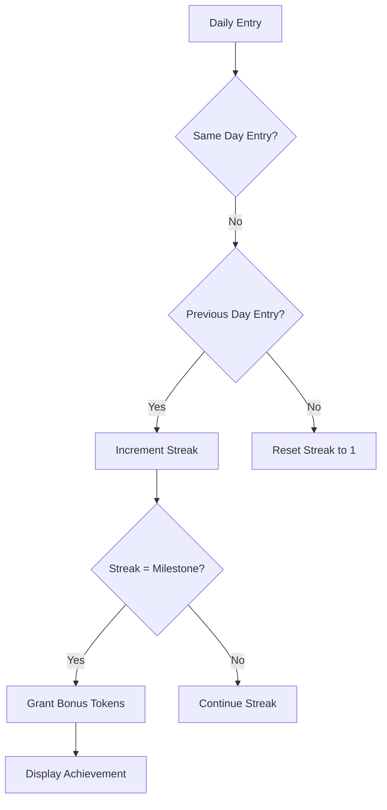
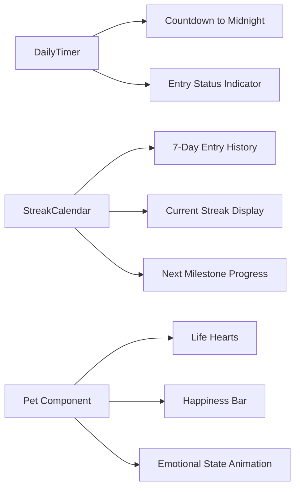

# Gamification System

<cite>
**Referenced Files in This Document**   
- [lifeSystem.ts](file://lib/gamification/lifeSystem.ts)
- [streakRewards.ts](file://lib/gamification/streakRewards.ts)
- [itemsConfig.ts](file://lib/gamification/itemsConfig.ts)
- [DailyTimer.tsx](file://components/DailyTimer.tsx)
- [StreakCalendar.tsx](file://components/StreakCalendar.tsx)
- [useLifeCheck.ts](file://hooks/useLifeCheck.ts)
- [LifeCheckWrapper.tsx](file://components/LifeCheckWrapper.tsx)
- [CriticalLifeModal.tsx](file://components/CriticalLifeModal.tsx)
</cite>

## Table of Contents
1. [Introduction](#introduction)
2. [Core Mechanics Overview](#core-mechanics-overview)
3. [Life System Implementation](#life-system-implementation)
4. [Streak Rewards Logic](#streak-rewards-logic)
5. [Shop Items Configuration](#shop-items-configuration)
6. [Gamification Metrics Display](#gamification-metrics-display)
7. [Entry Triggered Events](#entry-triggered-events)
8. [Edge Cases and Time Handling](#edge-cases-and-time-handling)
9. [Conclusion](#conclusion)

## Introduction

The gamification system in DiaryBeast is designed to foster consistent journaling habits through engaging virtual pet mechanics. This document details the core components of the system including the life system, streak tracking, reward multipliers, and shop configuration. The system uses a combination of time-based decay, milestone achievements, and user interaction to create an emotionally engaging experience that encourages daily participation.

## Core Mechanics Overview

DiaryBeast's gamification system revolves around three interconnected mechanics: pet health (lives), streak tracking, and token rewards. Users start with 7 lives for their virtual pet, which decay after 24 hours of inactivity following a 24-hour grace period. Writing diary entries restores 2 lives and resets the decay timer. The streak system tracks consecutive days of journaling, with milestone bonuses awarded at key intervals. Reward multipliers are applied based on the pet's health and happiness, creating a consistency-based incentive structure.

**Section sources**
- [GAMIFICATION.md](file://GAMIFICATION.md#L1-L513)

## Life System Implementation

The life system in DiaryBeast implements a health decay mechanism that balances user forgiveness with engagement incentives. The core logic is contained in `lifeSystem.ts`, which defines constants for the grace period (24 hours), life loss interval (24 hours), and maximum lives (7). The `calculateLifeLoss` function computes the number of lives lost based on inactivity duration, applying the grace period before initiating decay. Lives are lost at a rate of one per 24 hours after the grace period expires.

The system handles critical states when lives reach zero, triggering special UI elements and notifications. The `getPetState` function categorizes the pet's emotional state as 'happy' (4-7 lives), 'sad' (1-3 lives), or 'critical' (0 lives), which drives visual feedback and user engagement. The `restoreLives` function adds 2 lives per diary entry but caps at the maximum of 7, preventing full restoration through a single action and encouraging ongoing participation.

**Diagram sources**
- [lifeSystem.ts](file://lib/gamification/lifeSystem.ts#L65-L115)
- [lifeSystem.ts](file://lib/gamification/lifeSystem.ts#L132-L134)

**Section sources**
- [lifeSystem.ts](file://lib/gamification/lifeSystem.ts#L1-L345)

## Streak Rewards Logic

The streak rewards system is implemented in `streakRewards.ts` and provides bonus tokens for reaching consecutive day milestones. The system defines specific thresholds for rewards: 3 days (+5 tokens), 7 days (+20 tokens), 14 days (+50 tokens), 30 days (+100 tokens), and progressively larger bonuses up to 365 days (+5000 tokens). The `calculateStreakBonus` function checks if the current streak matches any milestone and returns the appropriate bonus.

The system resets the streak counter when a day is missed, creating a "fresh start" mechanic that encourages re-engagement. The `getNextMilestone` function helps users track their progress toward the next reward tier, providing clear goals and motivation. This milestone-based approach creates natural engagement peaks at key intervals, encouraging users to maintain their journaling habit through challenging periods.

**Diagram sources**
- [streakRewards.ts](file://lib/gamification/streakRewards.ts#L28-L46)

**Section sources**
- [streakRewards.ts](file://lib/gamification/streakRewards.ts#L1-L61)

## Shop Items Configuration

The shop system is configured in `itemsConfig.ts`, which serves as the source of truth for all purchasable items. The configuration includes food items like Basic Kibble (5 tokens), Premium Meat (20 tokens), Veggie Bowl (15 tokens), and Energy Drink (50 tokens), each with different life and happiness restoration values. Consumable items include utility items like Time Skip Potion (100 tokens) and restoration items like Health Potion (150 tokens) and Happy Pill (50 tokens).

The system implements a personality-based bonus system where pets have favorite foods that provide double effects. The `generatePetPersonality` function creates consistent personality traits based on the user's wallet address, ensuring fairness and persistence. The `calculateFoodEffect` function applies the favorite food multiplier when appropriate, adding strategic depth to feeding decisions.

**Section sources**
- [itemsConfig.ts](file://lib/gamification/itemsConfig.ts#L1-L233)

## Gamification Metrics Display

Gamification metrics are displayed through several UI components that provide real-time feedback to users. The `DailyTimer` component shows a countdown to midnight UTC, indicating the time remaining to write an entry for the day. When an entry is written, it displays "ENTRY CLAIMED!" with a success indicator. The timer updates every second to provide precise feedback.

The `StreakCalendar` component visualizes the user's journaling history as a 7-day calendar, with green checkmarks for days with entries and current day pulsing. It displays the current streak count and progress toward the next milestone, including the number of days remaining and the bonus tokens available. This visual feedback helps users understand their consistency pattern and motivates them to maintain their streak.

**Diagram sources**
- [DailyTimer.tsx](file://components/DailyTimer.tsx#L8-L84)
- [StreakCalendar.tsx](file://components/StreakCalendar.tsx#L14-L113)

**Section sources**
- [DailyTimer.tsx](file://components/DailyTimer.tsx#L1-L85)
- [StreakCalendar.tsx](file://components/StreakCalendar.tsx#L1-L114)

## Entry Triggered Events

Writing a diary entry triggers multiple gamification events that provide immediate feedback and rewards. The `useLifeCheck` hook monitors user activity and automatically checks life status on component mount, route changes, and every minute to detect midnight crossings. When an entry is saved, it triggers life restoration, token minting, and streak incrementation.

The `LifeCheckWrapper` component orchestrates notifications based on life status changes. If the pet reaches critical state (0 lives), it displays the `CriticalLifeModal` which cannot be dismissed without taking action. For non-critical life loss, it shows a toast notification with details about lives lost. This tiered notification system ensures appropriate urgency based on the severity of the pet's condition.

**Section sources**
- [useLifeCheck.ts](file://hooks/useLifeCheck.ts#L1-L153)
- [LifeCheckWrapper.tsx](file://components/LifeCheckWrapper.tsx#L1-L59)
- [CriticalLifeModal.tsx](file://components/CriticalLifeModal.tsx#L1-L116)

## Edge Cases and Time Handling

The gamification system addresses several edge cases related to time handling and user behavior. The system uses UTC midnight as the day boundary to ensure consistency across time zones, with the `didCrossMidnight` function detecting when a new day begins regardless of the user's local time. This prevents issues with daylight saving time changes and international users.

The system implements cooldown mechanisms to prevent spamming of life checks, with a 30-second debounce in the `useLifeCheck` hook. It also handles cases where users may have multiple tabs open by synchronizing state changes across instances. The life loss calculation accounts for clock drift by using server time when available and falling back to client time with appropriate safeguards.

**Section sources**
- [lifeSystem.ts](file://lib/gamification/lifeSystem.ts#L265-L295)
- [useLifeCheck.ts](file://hooks/useLifeCheck.ts#L1-L153)

## Conclusion

DiaryBeast's gamification system creates a compelling engagement loop through its interconnected mechanics of pet health, streak tracking, and reward multipliers. By combining time-based decay with milestone achievements and emotional feedback, the system encourages consistent journaling while providing meaningful rewards. The implementation balances technical precision with emotional design, creating a system that feels both fair and engaging. Future enhancements could include streak insurance, pet evolution based on consistency, and social sharing of achievements.