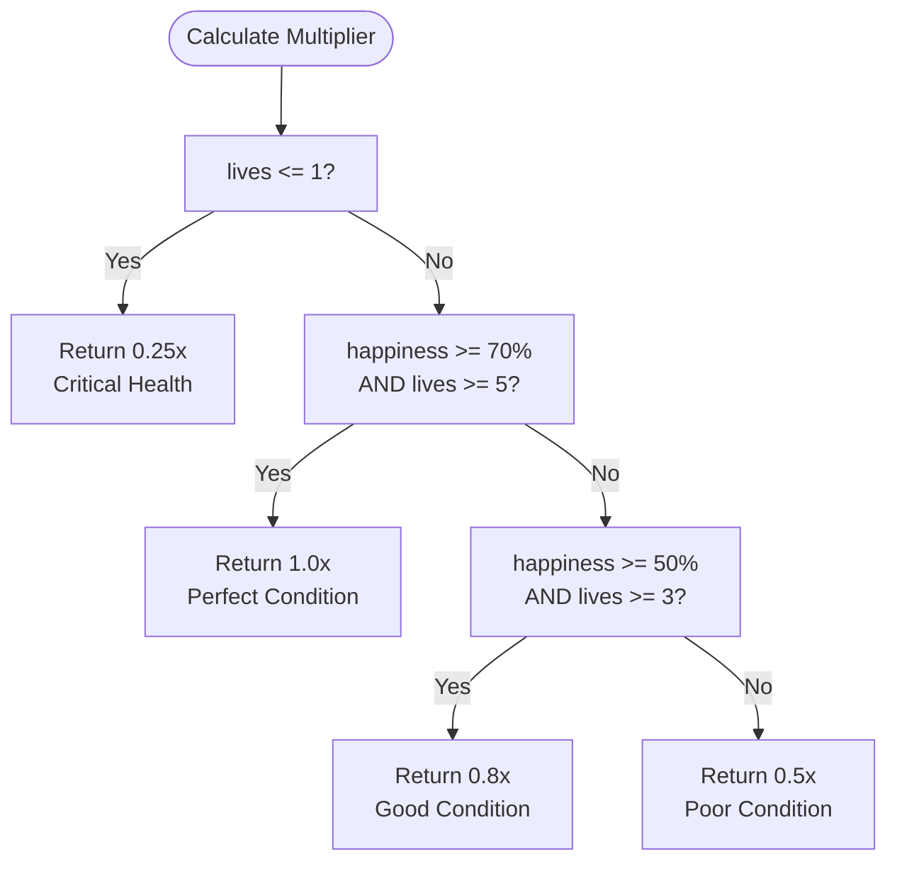
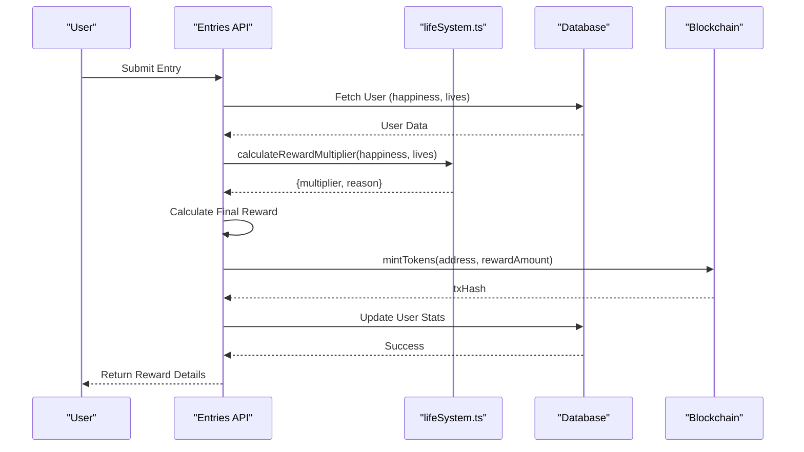

# Reward Multiplier System

<cite>
**Referenced Files in This Document**   
- [lifeSystem.ts](file://lib/gamification/lifeSystem.ts)
- [itemsConfig.ts](file://lib/gamification/itemsConfig.ts)
- [route.ts](file://app/api/entries/route.ts)
- [feed/route.ts](file://app/api/pet/feed/route.ts)
- [use-item/route.ts](file://app/api/pet/use-item/route.ts)
- [user/[address]/route.ts](file://app/api/user/[address]/route.ts)
</cite>

## Table of Contents
1. [Introduction](#introduction)
2. [Reward Multiplier Implementation](#reward-multiplier-implementation)
3. [Multiplier Tiers and Conditions](#multiplier-tiers-and-conditions)
4. [Integration with Entry Submission](#integration-with-entry-submission)
5. [Happiness Decay System](#happiness-decay-system)
6. [Item-Based Happiness Boosts](#item-based-happiness-boosts)
7. [Gameplay Incentives and Penalties](#gameplay-incentives-and-penalties)
8. [Technical Considerations](#technical-considerations)
9. [Best Practices for Game Economy](#best-practices-for-game-economy)

## Introduction
The Reward Multiplier System in DiaryBeast is a core gamification mechanic that dynamically adjusts DIARY token rewards based on the pet's health (lives) and emotional state (happiness). This system encourages consistent user engagement by rewarding active participation and penalizing neglect. The multiplier is calculated at the time of diary entry submission and directly impacts the amount of tokens minted. This document details the implementation of `calculateRewardMultiplier()` in `lifeSystem.ts`, its integration with the API, the happiness decay mechanism, and how consumable items can influence the reward outcome.

## Reward Multiplier Implementation

The `calculateRewardMultiplier()` function in `lifeSystem.ts` evaluates the pet's current condition to determine the appropriate reward multiplier. It takes two parameters: `happiness` (a percentage value) and `livesRemaining` (an integer from 0–7). The function returns an object containing the `multiplier` value and a `reason` string explaining the calculation.

The logic follows a hierarchical evaluation where critical health conditions override all other factors. This ensures that severely neglected pets receive the maximum penalty regardless of happiness level. The multiplier is applied during the entry submission process to modulate the base token reward.

**Section sources**
- [lifeSystem.ts](file://lib/gamification/lifeSystem.ts#L297-L344)

## Multiplier Tiers and Conditions

The system implements four distinct multiplier tiers based on pet condition:

- **1.0x (Perfect)**: Triggered when happiness ≥ 70% AND lives ≥ 5. This represents optimal pet care and yields full rewards.
- **0.8x (Good)**: Activated when happiness ≥ 50% AND lives ≥ 3. Indicates acceptable care with minor reductions.
- **0.5x (Poor)**: Applied when happiness < 50% OR lives < 3. Reflects neglect in either health or happiness.
- **0.25x (Critical)**: Enforced when lives ≤ 1, regardless of happiness. This severe penalty overrides all other conditions.

The critical condition acts as a hard cap, ensuring that near-death pets cannot receive substantial rewards even if happiness is high. This design prioritizes life restoration as the primary recovery action.

**Diagram sources**
- [lifeSystem.ts](file://lib/gamification/lifeSystem.ts#L297-L344)

**Section sources**
- [lifeSystem.ts](file://lib/gamification/lifeSystem.ts#L297-L344)

## Integration with Entry Submission

The reward multiplier is applied during the diary entry submission process in the API route `/api/entries/route.ts`. When a user submits a new entry, the system:

1. Retrieves the user's current happiness and lives from the database
2. Calls `calculateRewardMultiplier()` with these values
3. Applies the multiplier to the base reward (10 tokens for regular entries, 50 for first entry)
4. Calculates the final reward amount using `Math.floor(baseReward * multiplier)`
5. Mints the adjusted number of DIARY tokens via the blockchain

For example, a user with 2 lives (critical condition) receives only 25% of the base reward. A standard 10-token entry would yield just 2 tokens (after flooring). The response includes both the multiplier and the reason, providing transparency to the user.

**Diagram sources**
- [route.ts](file://app/api/entries/route.ts#L45-L100)
- [lifeSystem.ts](file://lib/gamification/lifeSystem.ts#L297-L344)

**Section sources**
- [route.ts](file://app/api/entries/route.ts#L45-L100)

## Happiness Decay System

Happiness naturally decays over time through the `calculateHappinessDecay()` function. The system reduces happiness by 1% every 2 hours of inactivity, calculated from the user's `lastActiveAt` timestamp. The decay is applied when retrieving user data in the `/api/user/[address]/route.ts` endpoint.

The decay formula uses floor division to determine complete 2-hour intervals since last activity. For example:
- 1 hour inactive: 0% decay
- 2 hours inactive: -1% happiness
- 4 hours inactive: -2% happiness
- 10 hours inactive: -5% happiness

This gradual decay encourages daily engagement without being overly punitive for short absences. The decay is only applied when there's a measurable difference, preventing unnecessary database updates.

**Section sources**
- [lifeSystem.ts](file://lib/gamification/lifeSystem.ts#L246-L276)
- [user/[address]/route.ts](file://app/api/user/[address]/route.ts#L46-L50)

## Item-Based Happiness Boosts

Users can counteract happiness decay and improve reward multipliers by using consumable items from the shop. The `itemsConfig.ts` file defines various food and consumables that boost happiness:

- **Premium Meat**: +10 happiness
- **Veggie Bowl**: +20 happiness  
- **Energy Drink**: +30 happiness
- **Happy Pill**: +30 happiness (instant use)

When a user feeds their pet or uses a consumable item, the happiness gain is applied immediately in the respective API routes (`/api/pet/feed/route.ts` and `/api/pet/use-item/route.ts`). The system also applies a 2x bonus if the food matches the pet's favorite type, determined by the wallet-based personality system.

These items provide strategic recovery options, allowing users to restore happiness and improve their reward multiplier without relying solely on diary entries.

**Section sources**
- [itemsConfig.ts](file://lib/gamification/itemsConfig.ts#L15-L80)
- [feed/route.ts](file://app/api/pet/feed/route.ts#L60-L70)
- [use-item/route.ts](file://app/api/pet/use-item/route.ts#L45-L55)

## Gameplay Incentives and Penalties

The Reward Multiplier System creates a balanced incentive structure that promotes consistent engagement:

- **Positive Reinforcement**: Users are rewarded with full (1.0x) or near-full (0.8x) multipliers for maintaining healthy pets through regular entries and care.
- **Progressive Penalties**: Neglect results in tiered reductions (0.5x, 0.25x), making inactivity costly but not completely discouraging.
- **Recovery Mechanisms**: Items and entries allow users to restore lives and happiness, providing clear paths to multiplier improvement.
- **Critical State Urgency**: The 0.25x penalty for ≤1 life creates urgency to restore health, as other improvements become irrelevant.

This system effectively ties token economics to user behavior, ensuring that rewards reflect genuine engagement with the diary practice.

## Technical Considerations

The implementation addresses several technical challenges:

- **Floating-Point Precision**: The system uses `Math.floor()` when applying multipliers to avoid fractional tokens and potential precision issues.
- **Performance**: Calculations are lightweight and executed only during entry submission or user data retrieval.
- **State Management**: Happiness decay is calculated on read rather than stored, reducing database write frequency.
- **Fallback Logic**: The function includes a default 0.8x fallback to ensure a multiplier is always returned.

The use of constants (e.g., `CRITICAL_LIVES_THRESHOLD`, `HAPPINESS_PENALTY_THRESHOLD`) allows for easy tuning of the system without modifying core logic.

**Section sources**
- [lifeSystem.ts](file://lib/gamification/lifeSystem.ts#L15-L30)
- [route.ts](file://app/api/entries/route.ts#L90-L95)

## Best Practices for Game Economy

To maintain a stable game economy while using this multiplier system:

1. **Balance Thresholds**: Ensure the 1.0x tier is achievable but requires consistent care (≥70 happiness, ≥5 lives).
2. **Control Item Availability**: Limit high-value items in the shop to prevent multiplier inflation.
3. **Monitor Reward Distribution**: Track average multipliers across users to detect economy imbalances.
4. **Adjust Base Rewards**: Tune base entry rewards rather than multipliers for broad economy adjustments.
5. **Seasonal Events**: Temporarily modify multiplier conditions during special events to create engagement spikes.

The current thresholds create a challenging but fair system where optimal rewards require genuine daily engagement, aligning token distribution with the app's core purpose of consistent diary writing.