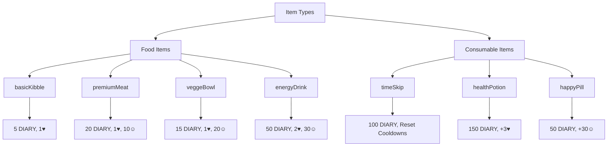
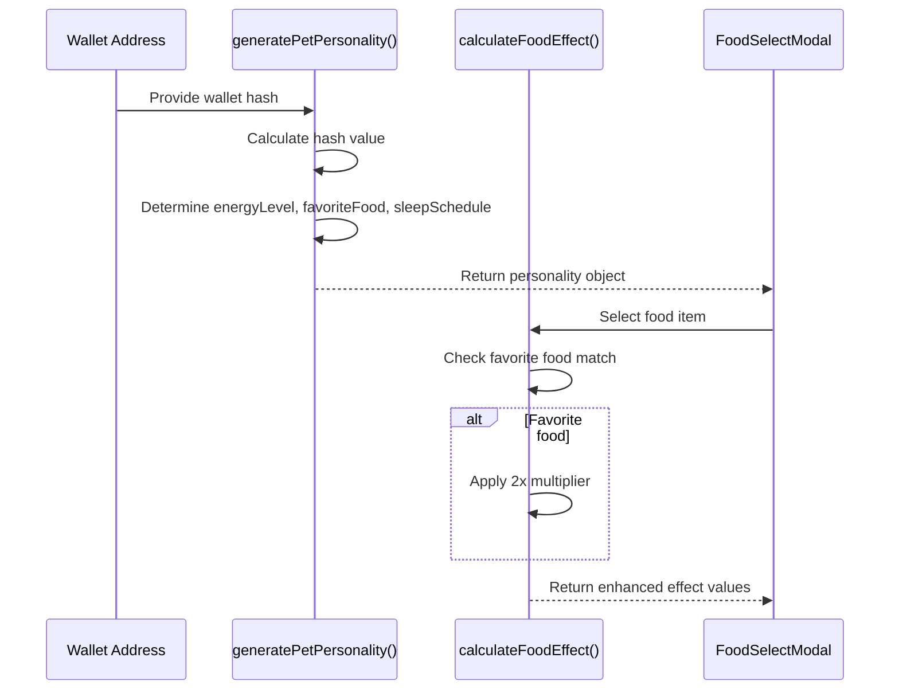
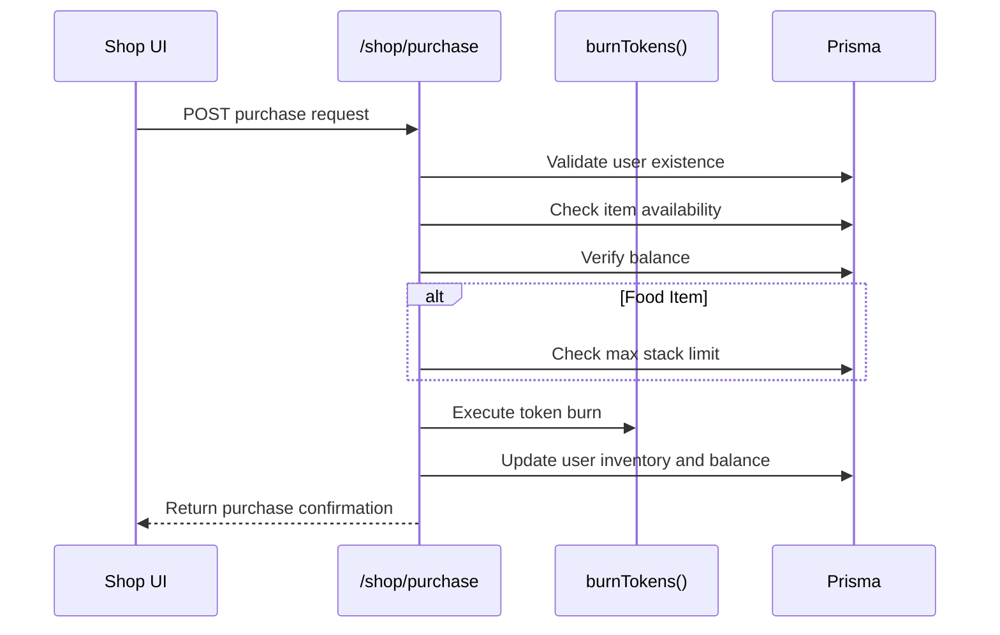

# Shop & Items System

<cite>
**Referenced Files in This Document**   
- [itemsConfig.ts](file://lib/gamification/itemsConfig.ts)
- [route.ts](file://app/api/shop/items/route.ts)
- [route.ts](file://app/api/shop/purchase/route.ts)
- [FoodSelectModal.tsx](file://components/FoodSelectModal.tsx)
- [page.tsx](file://app/shop/page.tsx)
</cite>

## Table of Contents
1. [Introduction](#introduction)
2. [Item Configuration](#item-configuration)
3. [Pet Personality System](#pet-personality-system)
4. [API Integration](#api-integration)
5. [UI Components](#ui-components)
6. [Common Issues and Solutions](#common-issues-and-solutions)
7. [Game Economy and Balancing](#game-economy-and-balancing)
8. [Conclusion](#conclusion)

## Introduction
The Shop & Items System in DiaryBeast enables players to purchase and use various food and consumable items to care for their virtual pets. This system integrates blockchain-based DIARY token transactions with personalized pet mechanics based on wallet-derived personalities. The core functionality revolves around feeding pets, managing inventory, and applying strategic bonuses through personalized interactions.

**Section sources**
- [itemsConfig.ts](file://lib/gamification/itemsConfig.ts#L1-L20)

## Item Configuration

### Food Items
The FOOD_ITEMS configuration defines consumable food types available for pet feeding. Each item includes properties such as price in DIARY tokens, life and happiness restoration values, cooldown periods, rarity levels, and stacking limits.

The available food items are:
- **basicKibble**: Common food priced at 5 DIARY tokens, restores 1 life with no happiness gain, 8-hour cooldown
- **premiumMeat**: Premium food priced at 20 DIARY tokens, restores 1 life and 10 happiness, 6-hour cooldown
- **veggeBowl**: Premium food priced at 15 DIARY tokens, restores 1 life and 20 happiness, 6-hour cooldown  
- **energyDrink**: Rare food priced at 50 DIARY tokens, restores 2 lives and 30 happiness, 8-hour cooldown

All food items are stackable with defined maximum inventory limits.

### Consumable Items
The CONSUMABLE_ITEMS configuration includes utility items that provide immediate effects:
- **timeSkip**: Costs 100 DIARY tokens, resets feed and play cooldowns
- **healthPotion**: Costs 150 DIARY tokens, instantly restores 3 lives
- **happyPill**: Costs 50 DIARY tokens, instantly grants 30 happiness points

These items are categorized by function (utility, restoration, boost) and provide one-time effects upon use.



**Diagram sources**
- [itemsConfig.ts](file://lib/gamification/itemsConfig.ts#L25-L100)

**Section sources**
- [itemsConfig.ts](file://lib/gamification/itemsConfig.ts#L25-L100)

## Pet Personality System

### Personality Generation
The `generatePetPersonality()` function creates a unique pet profile based on the user's wallet address hash. This deterministic approach ensures each wallet receives a consistent personality with three attributes:
- **energyLevel**: lazy, normal, or hyper - affects play bonus and happiness decay
- **favoriteFood**: meat, veggie, kibble, or energy - enables food effect doubling
- **sleepSchedule**: morning, afternoon, or night - may influence daily patterns

The hash-based algorithm processes the wallet address characters to produce reproducible results across sessions.

### Food Effect Calculation
The `calculateFoodEffect()` function determines the actual benefit when feeding a pet. When a pet consumes its favorite food type, the effect is doubled through the `FAVORITE_FOOD_MULTIPLIER`. For example:
- A pet with "meat" as favorite food receives double benefits from premiumMeat
- A pet with "energy" preference gets enhanced effects from energyDrink

This system encourages strategic feeding based on the pet's personalized preferences.



**Diagram sources**
- [itemsConfig.ts](file://lib/gamification/itemsConfig.ts#L166-L232)

**Section sources**
- [itemsConfig.ts](file://lib/gamification/itemsConfig.ts#L166-L232)

## API Integration

### GET /shop/items
This endpoint retrieves all available shop items from the database. It queries the `shopItem` table for records where `available` is true, returning items sorted by `sortOrder`. The response includes item details needed for display in the shop interface.

### POST /shop/purchase
This endpoint handles all purchase transactions. It processes three item types:
1. **Food items**: Validates balance, checks inventory stack limits, updates user inventory
2. **Consumable items**: Processes single-item purchases with immediate inventory addition
3. **Regular shop items**: Manages non-consumable purchases like backgrounds and accessories

The purchase flow includes DIARY token burning via blockchain transactions and database updates to user balances and inventories.



**Diagram sources**
- [route.ts](file://app/api/shop/purchase/route.ts#L1-L184)
- [route.ts](file://app/api/shop/items/route.ts#L1-L18)

**Section sources**
- [route.ts](file://app/api/shop/purchase/route.ts#L1-L184)
- [route.ts](file://app/api/shop/items/route.ts#L1-L18)

## UI Components

### FoodSelectModal
This component displays available food items from the user's inventory when feeding a pet. It integrates with the personality system to highlight favorite foods with special styling and displays enhanced effect values when applicable. The modal shows real-time inventory counts and effect bonuses, enabling informed feeding decisions.

### Shop Page
The main shop interface organizes items into tabs (Food, Consumables, Collectibles) with quantity selectors for food items. It displays real-time balance information and handles purchase operations through the API. The UI provides visual feedback for transactions and updates inventory displays after purchases.

```mermaid
graph TB
A[Shop Page] --> B[Food Tab]
A --> C[Consumables Tab]
A --> D[Collectibles Tab]
B --> E[Quantity Selector]
B --> F[Price Calculator]
C --> G[Single Purchase Button]
A --> H[Balance Display]
A --> I[Purchase Handler]
I --> J[/shop/purchase API]
K[Feed Action] --> L[FoodSelectModal]
L --> M[Favorite Food Highlight]
L --> N[Enhanced Effect Display]
```

**Diagram sources**
- [FoodSelectModal.tsx](file://components/FoodSelectModal.tsx#L1-L133)
- [page.tsx](file://app/shop/page.tsx#L1-L477)

**Section sources**
- [FoodSelectModal.tsx](file://components/FoodSelectModal.tsx#L1-L133)
- [page.tsx](file://app/shop/page.tsx#L1-L477)

## Common Issues and Solutions

### Inventory Management
The system prevents inventory overflow by checking `maxStack` limits before food purchases. Users cannot exceed defined stack sizes, ensuring balanced gameplay.

### Cooldown Enforcement
While cooldown tracking occurs in the pet system, the shop ensures proper item availability. Consumable items like timeSkip can reset these cooldowns, providing strategic gameplay options.

### Duplicate Purchase Prevention
For non-consumable items (backgrounds, accessories), the system checks existing purchases via the `purchase` table to prevent duplicates. Consumable and food items use inventory counts instead.

### Balance Validation
All purchase operations validate sufficient DIARY token balance before processing. The system provides clear error messages when balances are insufficient.

**Section sources**
- [route.ts](file://app/api/shop/purchase/route.ts#L50-L184)

## Game Economy and Balancing

### Adding New Items
To introduce new items, developers should:
1. Add the item to either `FOOD_ITEMS` or `CONSUMABLE_ITEMS` in itemsConfig.ts
2. Define appropriate pricing based on effect strength
3. Set reasonable cooldowns and stack limits
4. Update database schema if needed for new item types

### Balancing Considerations
- Food items should have escalating cost-to-benefit ratios
- Premium items should offer meaningful advantages without unbalancing gameplay
- Consumable items should provide strategic value at appropriate price points
- Rarity levels should reflect item power and availability
- The favorite food bonus should encourage engagement without creating pay-to-win dynamics

**Section sources**
- [itemsConfig.ts](file://lib/gamification/itemsConfig.ts#L25-L150)

## Conclusion
The Shop & Items System in DiaryBeast creates an engaging economy where players use DIARY tokens to care for personalized virtual pets. By combining blockchain transactions with personality-driven mechanics, the system offers both strategic depth and emotional connection. The integration of inventory management, API endpoints, and intuitive UI components provides a seamless experience for players while maintaining game balance through careful item configuration and transaction validation.