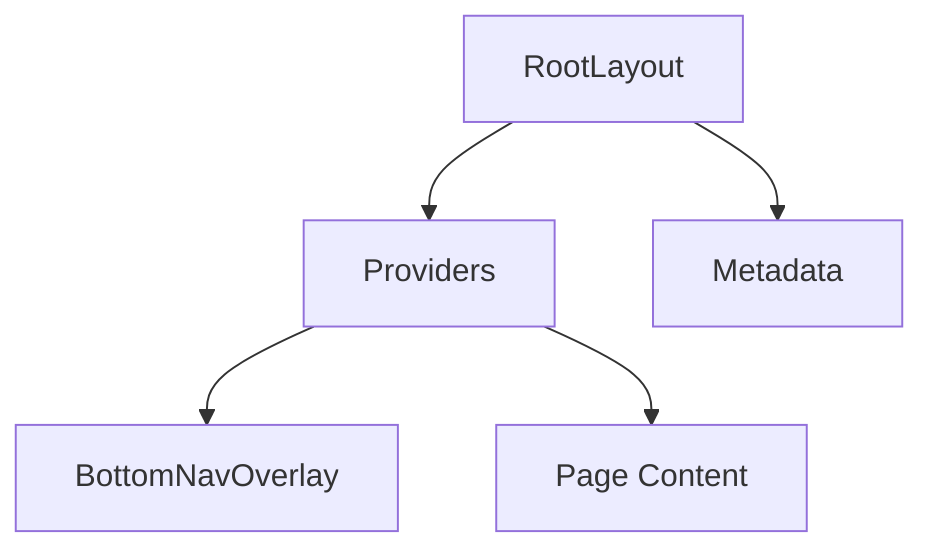
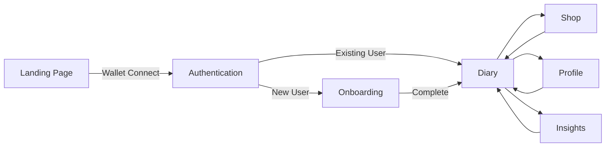
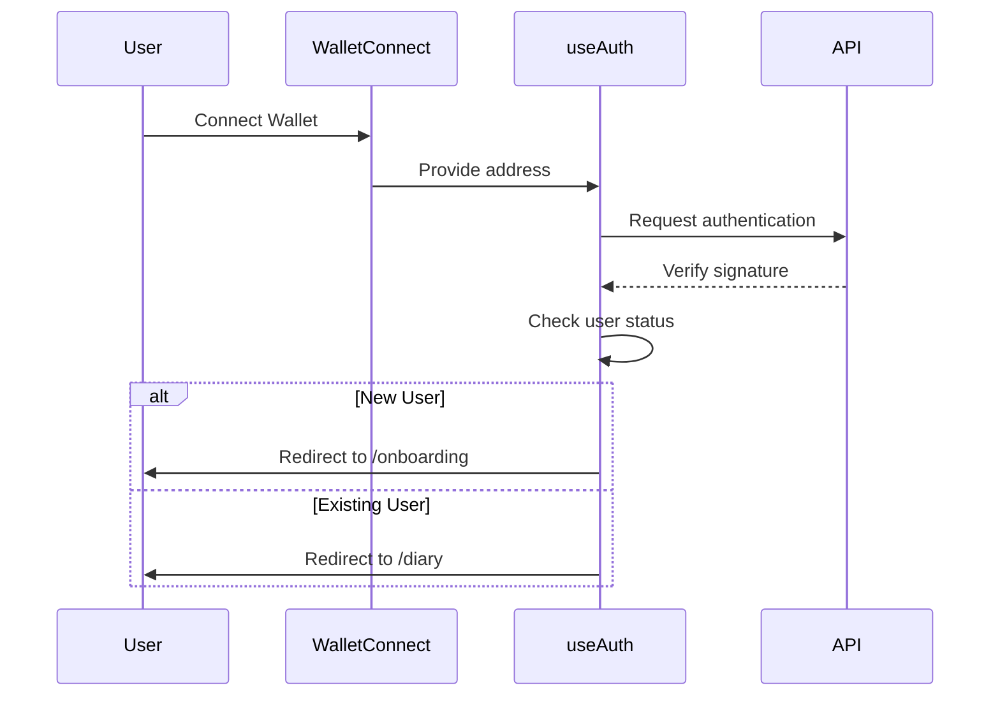
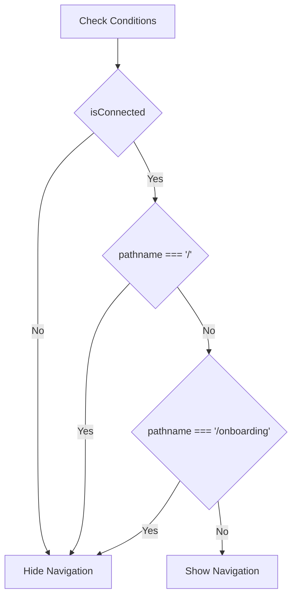
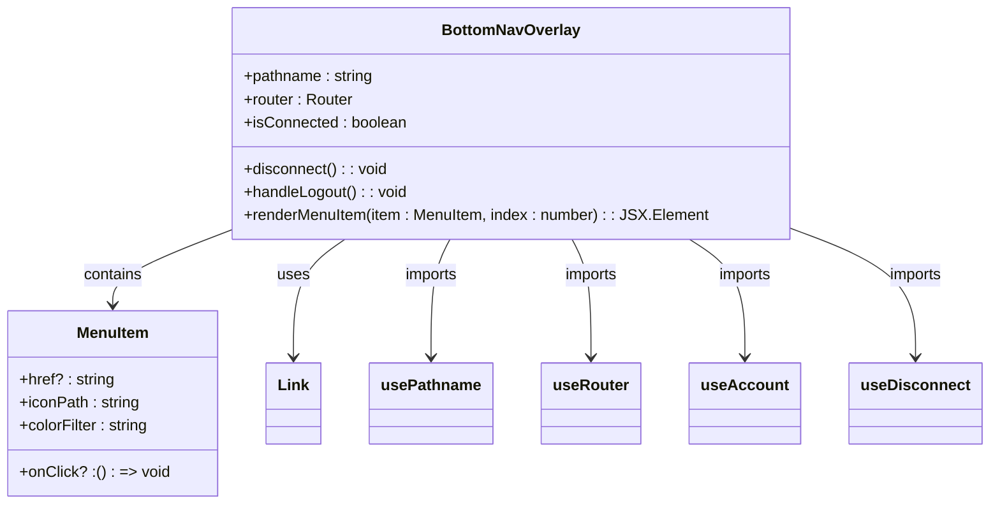
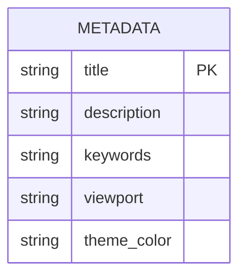

# Routing & Navigation

<cite>
**Referenced Files in This Document**   
- [app/page.tsx](file://app/page.tsx)
- [app/layout.tsx](file://app/layout.tsx)
- [app/onboarding/page.tsx](file://app/onboarding/page.tsx)
- [app/diary/page.tsx](file://app/diary/page.tsx)
- [app/shop/page.tsx](file://app/shop/page.tsx)
- [app/profile/page.tsx](file://app/profile/page.tsx)
- [components/BottomNavOverlay.tsx](file://components/BottomNavOverlay.tsx)
- [lib/useAuth.ts](file://lib/useAuth.ts)
</cite>

## Table of Contents
1. [Introduction](#introduction)
2. [File-Based Routing Structure](#file-based-routing-structure)
3. [Layout Structure](#layout-structure)
4. [Navigation Flow](#navigation-flow)
5. [Authentication & Route Protection](#authentication--route-protection)
6. [BottomNavOverlay Component](#bottomnavoverlay-component)
7. [Route Transitions & Parameter Handling](#route-transitions--parameter-handling)
8. [Error Handling](#error-handling)
9. [SEO & Metadata Management](#seo--metadata-management)

## Introduction
DiaryBeast utilizes the Next.js App Router to implement a comprehensive routing and navigation system that guides users through a gamified journaling experience. The application features a file-based routing structure under the app/ directory, with static routes for core functionality and dynamic routes for user-specific content. The navigation flow is designed to onboard new users, authenticate wallet connections, and provide seamless access to key features including diary writing, shop access, and profile management. This documentation details the routing architecture, navigation components, authentication integration, and user experience flow.

## File-Based Routing Structure
The routing system in DiaryBeast follows the Next.js App Router convention, organizing routes as directories under the app/ folder. Each route directory contains a page.tsx file that defines the UI for that route.

### Static Routes
The application implements several static routes for core functionality:
- `/` - Landing page with wallet connection interface
- `/onboarding` - User onboarding flow for new users
- `/diary` - Main diary entry interface
- `/shop` - Virtual shop for purchasing items
- `/profile` - User profile and settings
- `/info` - Information about the application
- `/insights` - Analytics and insights dashboard

### Dynamic Routes
Dynamic routing is implemented through the API routes using the [address] parameter pattern:
- `/api/user/[address]/route.ts` - Handles user-specific operations based on wallet address
- This pattern enables personalized content retrieval and updates for authenticated users

The file-based routing structure provides a clear organization of the application's navigation hierarchy, with each route corresponding directly to a directory in the filesystem.

**Section sources**
- [app/page.tsx](file://app/page.tsx)
- [app/onboarding/page.tsx](file://app/onboarding/page.tsx)
- [app/diary/page.tsx](file://app/diary/page.tsx)
- [app/shop/page.tsx](file://app/shop/page.tsx)
- [app/profile/page.tsx](file://app/profile/page.tsx)

## Layout Structure
The application uses a root layout defined in layout.tsx that wraps all pages with shared providers and UI elements. This layout provides a consistent structure across all routes while allowing individual pages to define their specific content.

**Diagram sources**
- [app/layout.tsx](file://app/layout.tsx)

The layout includes:
- Font configurations using Inter, JetBrains_Mono, and Chakra_Petch
- Global CSS styling
- Providers component that wraps children with necessary context providers
- Metadata configuration for SEO purposes
- BottomNavOverlay component for mobile navigation

The Providers component initializes the application with necessary context providers including Wagmi for wallet integration, React Query for data fetching, and OnchainKit for blockchain interactions.

**Section sources**
- [app/layout.tsx](file://app/layout.tsx)
- [app/providers.tsx](file://app/providers.tsx)

## Navigation Flow
The navigation flow in DiaryBeast follows a structured progression from initial connection to full application usage:

**Diagram sources**
- [app/page.tsx](file://app/page.tsx)
- [lib/useAuth.ts](file://lib/useAuth.ts)
- [app/onboarding/page.tsx](file://app/onboarding/page.tsx)
- [app/diary/page.tsx](file://app/diary/page.tsx)

### Flow Details
1. **Landing → Authentication**: Users begin at the landing page where they connect their wallet through the WalletConnect component.
2. **Authentication → Onboarding**: After wallet connection, users are authenticated via a signature request. New users are redirected to the onboarding flow.
3. **Onboarding → Diary**: The onboarding process collects user preferences and pet information, then redirects to the main diary interface upon completion.
4. **Diary → Shop/Profile**: From the diary interface, users can navigate to the shop to purchase items or to their profile to view statistics and settings.
5. **Shop/Profile → Diary**: Navigation is designed to be circular, allowing users to return to the diary from any section.

The navigation flow ensures users complete necessary setup steps before accessing core functionality while providing easy access to all features once authenticated.

**Section sources**
- [app/page.tsx](file://app/page.tsx)
- [lib/useAuth.ts](file://lib/useAuth.ts)
- [app/onboarding/page.tsx](file://app/onboarding/page.tsx)
- [app/diary/page.tsx](file://app/diary/page.tsx)
- [app/shop/page.tsx](file://app/shop/page.tsx)
- [app/profile/page.tsx](file://app/profile/page.tsx)

## Authentication & Route Protection
Authentication in DiaryBeast is wallet-based, using the useAuth hook to manage the authentication state and control route accessibility.

**Diagram sources**
- [lib/useAuth.ts](file://lib/useAuth.ts)
- [app/page.tsx](file://app/page.tsx)

### Authentication Process
1. When a user connects their wallet on the landing page, the useAuth hook is triggered.
2. The hook requests a signature from the user's wallet to verify ownership.
3. The signature is sent to the `/api/auth/verify` endpoint for validation.
4. Based on the response, the user is redirected:
   - New users (or users without completed onboarding) are redirected to `/onboarding`
   - Existing users with completed onboarding are redirected to `/diary`

### Route Protection
Route protection is implemented through conditional rendering in the BottomNavOverlay component, which only displays when the user is connected and not on the landing or onboarding pages:

**Diagram sources**
- [components/BottomNavOverlay.tsx](file://components/BottomNavOverlay.tsx)

Wallet connection triggers redirects based on the user's authentication state, ensuring proper onboarding and access control.

**Section sources**
- [lib/useAuth.ts](file://lib/useAuth.ts)
- [components/BottomNavOverlay.tsx](file://components/BottomNavOverlay.tsx)

## BottomNavOverlay Component
The BottomNavOverlay component provides mobile navigation between the core sections of the application, appearing as a fixed overlay at the bottom of the screen.

**Diagram sources**
- [components/BottomNavOverlay.tsx](file://components/BottomNavOverlay.tsx)

### Component Structure
The component consists of three sections:
- **Left Menu Items**: Insights, Shop, and Profile navigation
- **Center Item**: Diary navigation (primary action)
- **Right Menu Items**: Info, Leaderboard (locked), and Logout

### Behavior
- The component only renders when the user is connected and not on the landing page or onboarding flow
- Active routes are highlighted with cyan glow effects and scaling animations
- The leaderboard item is currently locked and non-interactive
- The logout button disconnects the wallet and redirects to the landing page

The navigation uses Next.js Link components for client-side routing with smooth transitions between sections.

**Section sources**
- [components/BottomNavOverlay.tsx](file://components/BottomNavOverlay.tsx)

## Route Transitions & Parameter Handling
Route transitions in DiaryBeast are handled through Next.js navigation methods with proper state management.

### Navigation Methods
- `router.push()` is used for programmatic navigation between routes
- Next.js Link components enable client-side navigation with prefetching
- Navigation events trigger data loading to ensure content is up-to-date

### Parameter Handling
Dynamic parameters are handled through the API routes using the [address] pattern:
- The address parameter is extracted from the URL and used to fetch user-specific data
- API routes validate the address parameter and return appropriate user data
- Client components use the address to make authenticated requests

Route transitions are smooth, with loading states displayed during data fetching to provide feedback to users.

**Section sources**
- [lib/useAuth.ts](file://lib/useAuth.ts)
- [app/onboarding/page.tsx](file://app/onboarding/page.tsx)
- [app/diary/page.tsx](file://app/diary/page.tsx)

## Error Handling
The routing system includes error handling for invalid routes and unauthorized access.

### Invalid Routes
- The application does not define explicit error pages, relying on Next.js default 404 handling
- Invalid API routes return appropriate HTTP status codes
- Client-side navigation checks prevent navigation to undefined routes

### Unauthorized Access
- The BottomNavOverlay component prevents access to protected routes when not authenticated
- API routes validate authentication state before processing requests
- The useAuth hook manages authentication state and redirects appropriately

Error states are handled gracefully, with user-friendly messages and clear paths to resolution.

**Section sources**
- [components/BottomNavOverlay.tsx](file://components/BottomNavOverlay.tsx)
- [lib/useAuth.ts](file://lib/useAuth.ts)

## SEO & Metadata Management
SEO considerations are addressed through Next.js metadata configuration in the layout component.

**Diagram sources**
- [app/layout.tsx](file://app/layout.tsx)

The root layout defines metadata including:
- Title: "DiaryBeast - Feed your beast, grow your mind"
- Description: "Web3 gamified journaling app with your virtual pet companion"
- Viewport configuration for responsive design
- Theme color for browser chrome

These metadata elements help with search engine indexing and provide a consistent experience when the application is shared or bookmarked.

**Section sources**
- [app/layout.tsx](file://app/layout.tsx)