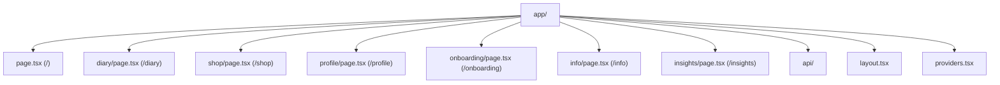
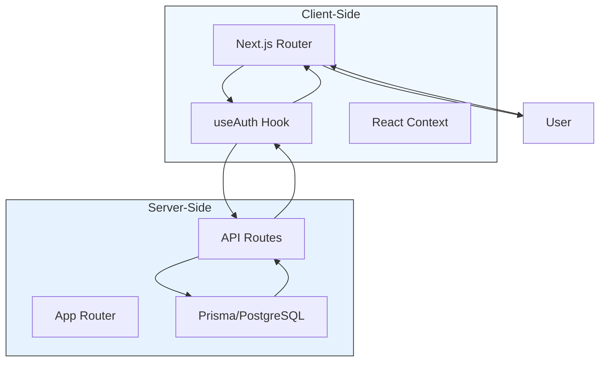
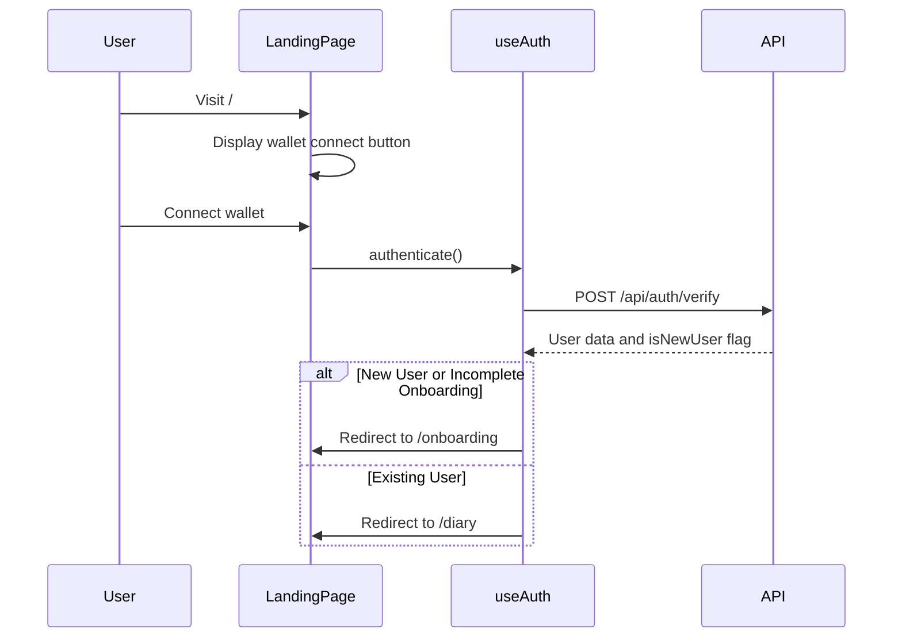
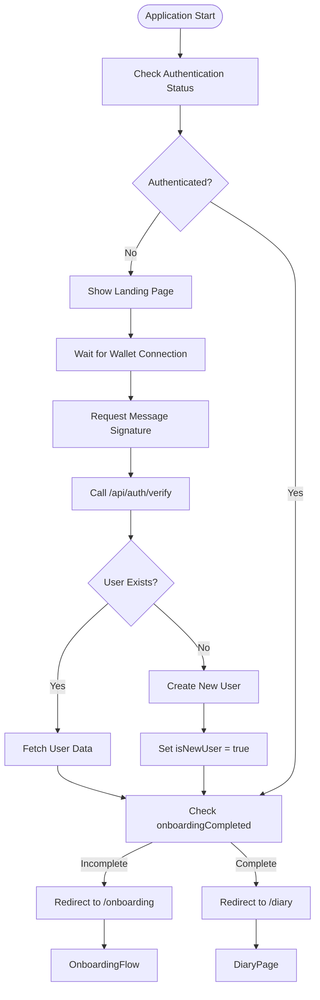
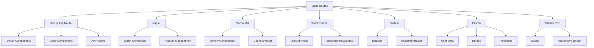

# Static Routes

<cite>
**Referenced Files in This Document**   
- [page.tsx](file://app/page.tsx)
- [diary/page.tsx](file://app/diary/page.tsx)
- [shop/page.tsx](file://app/shop/page.tsx)
- [profile/page.tsx](file://app/profile/page.tsx)
- [onboarding/page.tsx](file://app/onboarding/page.tsx)
- [info/page.tsx](file://app/info/page.tsx)
- [insights/page.tsx](file://app/insights/page.tsx)
- [layout.tsx](file://app/layout.tsx)
- [providers.tsx](file://app/providers.tsx)
- [useAuth.ts](file://lib/useAuth.ts)
</cite>

## Table of Contents
1. [Introduction](#introduction)
2. [Project Structure](#project-structure)
3. [Core Components](#core-components)
4. [Architecture Overview](#architecture-overview)
5. [Detailed Component Analysis](#detailed-component-analysis)
6. [Dependency Analysis](#dependency-analysis)
7. [Performance Considerations](#performance-considerations)
8. [Troubleshooting Guide](#troubleshooting-guide)
9. [Conclusion](#conclusion)

## Introduction
This document provides comprehensive documentation for the static route implementation in the Next.js App Router structure of DiaryBeast, a Web3 gamified journaling application. The application utilizes a client-side routing system where each static route corresponds to a specific page component under the app/ directory. The routing architecture is designed to guide users through a structured journey from initial wallet connection to daily journaling, pet management, and insights generation. This documentation explains how each static route is mapped to its respective page component, details the user journey for each page, and describes the implementation of authentication state management, SEO metadata, and loading states. The document also provides troubleshooting guidance for common routing issues.

## Project Structure
The DiaryBeast frontend application follows a standard Next.js App Router structure with a clear organization of pages, components, and utilities. The app/ directory contains all the page components and API routes, with each static route represented as a subdirectory containing a page.tsx file. The application uses a modular architecture with separate directories for components, hooks, lib (utilities and contexts), and other resources. The routing system is file-based, where the directory structure under app/ directly maps to the application's URL structure.

**Diagram sources**
- [page.tsx](file://app/page.tsx)
- [diary/page.tsx](file://app/diary/page.tsx)
- [shop/page.tsx](file://app/shop/page.tsx)
- [profile/page.tsx](file://app/profile/page.tsx)
- [onboarding/page.tsx](file://app/onboarding/page.tsx)
- [info/page.tsx](file://app/info/page.tsx)
- [insights/page.tsx](file://app/insights/page.tsx)

**Section sources**
- [page.tsx](file://app/page.tsx)
- [diary/page.tsx](file://app/diary/page.tsx)
- [shop/page.tsx](file://app/shop/page.tsx)
- [profile/page.tsx](file://app/profile/page.tsx)
- [onboarding/page.tsx](file://app/onboarding/page.tsx)
- [info/page.tsx](file://app/info/page.tsx)
- [insights/page.tsx](file://app/insights/page.tsx)

## Core Components
The static route implementation in DiaryBeast centers around several core components that handle user authentication, navigation, and state management. The useAuth hook is critical for managing the authentication flow, while the Providers component wraps the application with necessary context providers. Each page component implements specific functionality related to its route, with consistent patterns for loading states, data fetching, and user interaction. The routing system is protected by authentication checks that redirect users to appropriate pages based on their login status and onboarding completion.

**Section sources**
- [useAuth.ts](file://lib/useAuth.ts)
- [providers.tsx](file://app/providers.tsx)
- [page.tsx](file://app/page.tsx)

## Architecture Overview
The routing architecture in DiaryBeast follows the Next.js App Router pattern, where the file system structure directly determines the application's URL routes. The application implements a client-side navigation system with server-side rendering capabilities. Authentication state is managed globally through React context and is used to control access to protected routes. The architecture includes a layout component that provides consistent styling and metadata across all pages, and a providers component that initializes all necessary context providers for the application.

**Diagram sources**
- [useAuth.ts](file://lib/useAuth.ts)
- [layout.tsx](file://app/layout.tsx)
- [providers.tsx](file://app/providers.tsx)

## Detailed Component Analysis

### Route Implementation Analysis
The static route implementation in DiaryBeast follows the Next.js App Router convention where each directory under app/ corresponds to a route segment. The page.tsx files within these directories define the UI and functionality for each route. The application uses client-side navigation with the Next.js router, and implements authentication-based routing that redirects users to appropriate pages based on their authentication status and onboarding completion.

#### Landing Page (/)
The landing page serves as the entry point for the application and handles wallet connection and authentication. It displays a welcome interface with the DiaryBeast logo and a connection prompt. When a user connects their wallet, they are prompted to sign a message for authentication. Upon successful authentication, users are redirected to either the onboarding flow (for new users) or the diary page (for existing users). The page uses the useAuth hook to manage the authentication flow and displays appropriate loading and error states.

**Diagram sources**
- [page.tsx](file://app/page.tsx)
- [useAuth.ts](file://lib/useAuth.ts)

**Section sources**
- [page.tsx](file://app/page.tsx)

#### Diary Page (/diary)
The diary page is the primary interface for journal entry creation and management. It features a text editor for writing entries, a weekly history sidebar for viewing past entries, and a right sidebar displaying pet and user statistics. The page implements a save flow where entries are encrypted client-side before being sent to the API. Users earn tokens and restore pet lives when creating entries. The page also displays modals for entry success, weekly summaries, and gamification rewards. Authentication is required to access this page, and unauthenticated users are redirected to the landing page.

**Section sources**
- [diary/page.tsx](file://app/diary/page.tsx)

#### Shop Page (/shop)
The shop page allows users to purchase items for their virtual pet using DIARY tokens earned from journaling. It features a tabbed interface for browsing different item categories (food, consumables, collectibles) and displays item details, prices, and purchase options. Users can buy multiple quantities of stackable items and apply purchased items to customize their pet or environment. The page checks authentication status on load and redirects unauthenticated users to the landing page. It also displays the user's current token balance and updates the inventory after purchases.

**Section sources**
- [shop/page.tsx](file://app/shop/page.tsx)

#### Profile Page (/profile)
The profile page provides an overview of the user's account, pet status, and settings. It features a tabbed interface with sections for overview, achievements, and deep analysis. The overview tab displays the user's pet, statistics (token balance, streak, total entries), and settings (AI analysis toggle). The page fetches user data and entry history on load and allows users to toggle AI analysis for their entries. Authentication is required, and the page handles cases where user data is not found by redirecting to the home page.

**Section sources**
- [profile/page.tsx](file://app/profile/page.tsx)

#### Onboarding Page (/onboarding)
The onboarding page guides new users through the account setup process after their first authentication. It presents a multi-step form where users name their pet, provide their name, select their age group, and choose their diary goal. The page fetches the user's randomly assigned animal (cat or dog) from the API and displays it throughout the onboarding process. Upon completion, the user's profile is updated with their preferences, and they are redirected to the diary page to begin journaling. The page implements a progress indicator and navigation controls for moving between steps.

**Section sources**
- [onboarding/page.tsx](file://app/onboarding/page.tsx)

#### Info Page (/info)
The info page provides comprehensive documentation about the DiaryBeast application, including its purpose, mechanics, token economy, and privacy practices. It features a back button that uses the router.back() function to return to the previous page. The content is organized into sections covering various aspects of the application, such as the token economy, reward multipliers, pet mechanics, and food items. This page serves as an educational resource for users to understand the gamification elements and how their actions affect their pet and rewards.

**Section sources**
- [info/page.tsx](file://app/info/page.tsx)

#### Insights Page (/insights)
The insights page displays a collection of weekly emotional analyses generated from the user's journal entries. It shows a grid of summary cards, each representing a week of journaling with information about emotions, trends, and key insights. Users can click on a summary to view detailed analysis in a modal. The page checks authentication status and redirects unauthenticated users to the landing page. For users with no summaries, it displays a call-to-action to visit the diary page and generate their first analysis. The page uses client-side navigation to maintain the application's responsive feel.

**Section sources**
- [insights/page.tsx](file://app/insights/page.tsx)

### Authentication and Navigation Flow
The authentication and navigation flow in DiaryBeast is managed by the useAuth hook, which coordinates wallet connection, message signing, and API verification. This hook is used across multiple pages to ensure consistent authentication behavior and redirect users appropriately based on their status.

**Diagram sources**
- [useAuth.ts](file://lib/useAuth.ts)
- [page.tsx](file://app/page.tsx)

## Dependency Analysis
The static route implementation in DiaryBeast has several key dependencies that enable its functionality. The application relies on Next.js for routing, rendering, and API routes. Authentication is handled through wagmi and OnchainKit for wallet integration. State management uses React context and Zustand for client-side state. The application also depends on Prisma for database operations and various UI libraries for styling and components.

**Diagram sources**
- [useAuth.ts](file://lib/useAuth.ts)
- [providers.tsx](file://app/providers.tsx)
- [layout.tsx](file://app/layout.tsx)

**Section sources**
- [useAuth.ts](file://lib/useAuth.ts)
- [providers.tsx](file://app/providers.tsx)

## Performance Considerations
The static route implementation in DiaryBeast incorporates several performance optimizations to ensure a responsive user experience. Each page implements loading states to provide feedback during data fetching, and uses React's useEffect hook to manage side effects efficiently. The application leverages Next.js features like code splitting and server-side rendering to optimize initial load times. Data fetching is implemented with proper error handling and loading states to prevent UI blocking. The use of React context and Zustand for state management helps minimize unnecessary re-renders across the application.

## Troubleshooting Guide
This section provides guidance for troubleshooting common issues related to the static route implementation in DiaryBeast.

### Authentication and Redirect Issues
When users experience issues with authentication or unexpected redirects, check the following:

1. Ensure the useAuth hook is properly initialized and the authenticate function is called after wallet connection
2. Verify that the /api/auth/verify endpoint is correctly handling authentication and returning the expected user data
3. Check that the router.push calls in the useAuth hook are using the correct paths (/onboarding for new users, /diary for existing users)
4. Confirm that the isAuthenticated state is being updated correctly based on the user object and wallet connection status

### Hydration Mismatches
Hydration mismatches can occur when there is a discrepancy between server-rendered and client-rendered content. To resolve these issues:

1. Ensure all client-side only code is wrapped in useEffect or conditional checks for window object
2. Use the 'use client' directive appropriately in page components that require client-side interactivity
3. Verify that any dynamic content based on user state is properly handled during server rendering
4. Check that loading states are implemented consistently across all pages

### Data Fetching Problems
When pages fail to load user data or display loading indefinitely:

1. Verify that the API endpoints are accessible and returning expected data
2. Check that the fetch calls include proper error handling and loading state management
3. Ensure that authentication headers and parameters are correctly included in API requests
4. Confirm that the user address is available before making data requests

**Section sources**
- [useAuth.ts](file://lib/useAuth.ts)
- [page.tsx](file://app/page.tsx)
- [diary/page.tsx](file://app/diary/page.tsx)
- [shop/page.tsx](file://app/shop/page.tsx)

## Conclusion
The static route implementation in DiaryBeast effectively leverages the Next.js App Router to create a structured user journey through the application. Each route is carefully designed to serve a specific purpose in the user experience, from initial onboarding to daily journaling and pet management. The authentication system ensures that users are properly guided through the application based on their status, while the consistent use of loading states and error handling provides a smooth user experience. The modular architecture with clear separation of concerns makes the codebase maintainable and extensible. By following Next.js best practices and implementing robust error handling, the routing system provides a reliable foundation for the DiaryBeast application.