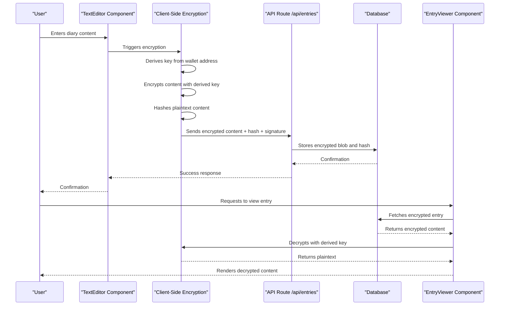
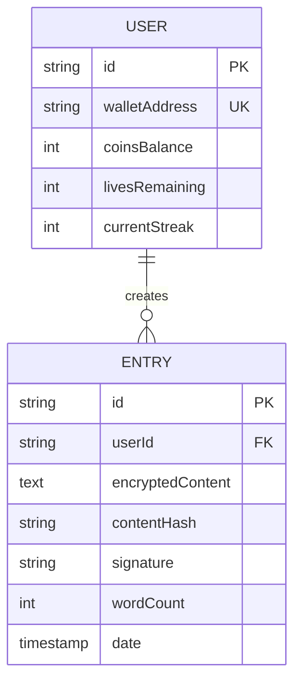

# Data Security

<cite>
**Referenced Files in This Document**   
- [TextEditor.tsx](file://components/TextEditor.tsx)
- [EntryViewer.tsx](file://components/EntryViewer.tsx)
- [encryption.ts](file://lib/encryption.ts)
- [EncryptionKeyContext.tsx](file://lib/EncryptionKeyContext.tsx)
- [route.ts](file://app/api/entries/route.ts)
</cite>

## Table of Contents
1. [Introduction](#introduction)
2. [End-to-End Data Security Workflow](#end-to-end-data-security-workflow)
3. [Client-Side Encryption Process](#client-side-encryption-process)
4. [API Transmission Security](#api-transmission-security)
5. [Server-Side Data Handling](#server-side-data-handling)
6. [Client-Side Decryption and Rendering](#client-side-decryption-and-rendering)
7. [Data Integrity Verification](#data-integrity-verification)
8. [Security Vulnerabilities and Mitigations](#security-vulnerabilities-and-mitigations)
9. [Best Practices for Secure Development](#best-practices-for-secure-development)
10. [Conclusion](#conclusion)

## Introduction
DiaryBeast implements a zero-knowledge architecture that ensures user diary entries remain private and secure throughout their lifecycle. This document details the end-to-end data security workflow, explaining how encrypted entries are created, transmitted, stored, and rendered without the server ever accessing plaintext content. The system leverages client-side encryption, cryptographic hashing, and wallet-based authentication to maintain user privacy while enabling core application functionality.

## End-to-End Data Security Workflow
The DiaryBeast data security model follows a comprehensive workflow from user input to persistent storage and retrieval. All sensitive content is encrypted on the client side before transmission, stored in encrypted form on the server, and decrypted exclusively on the client side during viewing. This approach ensures that even if the database is compromised, attackers cannot access readable diary content without individual user encryption keys derived from wallet addresses.

**Diagram sources**
- [TextEditor.tsx](file://components/TextEditor.tsx)
- [EntryViewer.tsx](file://components/EntryViewer.tsx)
- [encryption.ts](file://lib/encryption.ts)
- [route.ts](file://app/api/entries/route.ts)

## Client-Side Encryption Process
The encryption process begins in the TextEditor component where users input their diary entries. When a user submits an entry, the system derives an encryption key from their wallet address using a deterministic algorithm. This key derivation process combines the lowercase wallet address with a salt value ("DiaryBeast_v1_encryption") and applies the keccak256 hashing algorithm to generate a consistent encryption key across all devices.

The actual encryption uses AES-256 in CBC mode through the CryptoJS library, converting the plaintext diary content into an encrypted string. Simultaneously, the system creates a cryptographic hash of the original plaintext content using keccak256, which serves as a fingerprint for data integrity verification without exposing the content itself.

**Section sources**
- [TextEditor.tsx](file://components/TextEditor.tsx#L12-L246)
- [encryption.ts](file://lib/encryption.ts#L8-L25)

## API Transmission Security
When transmitting encrypted diary entries to the server, the system sends three critical pieces of information: the encrypted content blob, the content hash, and a digital signature. The digital signature is created by signing the content hash with the user's wallet, providing cryptographic proof of authorship and preventing tampering.

The API route at `/api/entries` receives these components and verifies the signature against the user's wallet address. This verification ensures that only the legitimate owner of the wallet can create entries associated with that address. The transmission occurs over HTTPS, adding an additional layer of transport security to prevent interception during transit.

**Section sources**
- [route.ts](file://app/api/entries/route.ts#L1-L238)
- [encryption.ts](file://lib/encryption.ts#L23-L25)

## Server-Side Data Handling
The server-side handling of diary entries is designed with privacy as a core principle. Upon receiving a valid request, the API route stores only the encrypted content blob and its corresponding hash in the database. The server never processes or stores the plaintext content, making it impossible for server administrators or attackers with database access to read user diaries.

The database schema includes fields for `encryptedContent`, `contentHash`, and `signature`, but no field for plaintext content. This design enforces the zero-knowledge principle at the data storage level. Additional metadata such as word count and timestamp are stored to support application features without compromising privacy.

**Diagram sources**
- [route.ts](file://app/api/entries/route.ts#L1-L238)
- [TECHNICAL_DOCUMENTATION.md](file://TECHNICAL_DOCUMENTATION.md#L1-L1196)

## Client-Side Decryption and Rendering
When users view their diary entries, the decryption process occurs entirely on the client side within the EntryViewer component. The system retrieves the encrypted content from the server and uses the same deterministic key derivation process to obtain the encryption key from the user's wallet address.

The decryption function uses CryptoJS to convert the encrypted blob back to plaintext, which is then rendered in the user interface. If decryption fails (indicating either a corrupted entry or attempted access to someone else's entry), the system displays an appropriate error message without revealing any content. The EntryViewer component also preserves user preferences such as font selection when rendering the decrypted content.

**Section sources**
- [EntryViewer.tsx](file://components/EntryViewer.tsx#L19-L123)
- [encryption.ts](file://lib/encryption.ts#L18-L21)

## Data Integrity Verification
The hashContent function plays a crucial role in verifying data integrity without compromising privacy. By storing a cryptographic hash of the original plaintext, the system can verify that content has not been tampered with during storage or transmission. Since the hash is created from the plaintext before encryption, it serves as a fingerprint that can be used to detect modifications.

This approach allows the system to ensure data integrity while maintaining the zero-knowledge principle. Even if an attacker modifies the encrypted content in the database, the hash comparison would fail when the legitimate user attempts to decrypt it, alerting them to potential tampering without revealing the original content to the server.

**Section sources**
- [encryption.ts](file://lib/encryption.ts#L23-L25)
- [route.ts](file://app/api/entries/route.ts#L1-L238)

## Security Vulnerabilities and Mitigations
Despite the robust security architecture, several potential vulnerabilities require consideration and mitigation:

**Browser Storage Leaks**: Encryption keys are derived from wallet addresses but never stored directly. However, browser storage could potentially leak information through saved form data or cache. The system mitigates this by avoiding local storage of sensitive content and using memory-only operations for encryption/decryption.

**XSS Risks**: Cross-site scripting attacks could potentially intercept encryption keys or plaintext content during the encryption/decryption process. The system mitigates this through strict Content Security Policy (CSP) headers, input sanitization, and avoiding dangerous JavaScript practices like eval().

**Wallet Phishing**: Attackers could create phishing sites that mimic DiaryBeast to steal wallet signatures. The system mitigates this through clear UI indicators of wallet connection status and educating users about wallet security.

**Timing Attacks**: Differences in encryption/decryption time could potentially leak information about content length or patterns. The system does not implement specific countermeasures against timing attacks, representing a potential area for improvement.

**Key Derivation Security**: The deterministic key derivation relies on the security of the keccak256 algorithm and the secrecy of the salt value. While keccak256 is cryptographically secure, the salt value is hardcoded in the client-side code, making it publicly visible. This represents a trade-off between usability and security, as changing the salt would prevent cross-device access to encrypted entries.

**Section sources**
- [EncryptionKeyContext.tsx](file://lib/EncryptionKeyContext.tsx#L11-L13)
- [encryption.ts](file://lib/encryption.ts#L8-L12)
- [TextEditor.tsx](file://components/TextEditor.tsx#L12-L246)

## Best Practices for Secure Development
When extending the DiaryBeast system while maintaining security guarantees, developers should adhere to the following best practices:

**Maintain Zero-Knowledge Principle**: Never modify the system to process, log, or store plaintext diary content on the server side. All content processing should occur client-side with encrypted data.

**Secure Key Management**: Avoid introducing new key storage mechanisms that could compromise security. The current deterministic key derivation from wallet addresses provides a balance of security and usability across devices.

**Validate Cryptographic Operations**: Always verify the success of encryption and decryption operations and handle failures gracefully without exposing sensitive information in error messages.

**Preserve Data Integrity**: When adding new features that interact with diary entries, ensure that the content hash verification mechanism remains intact and is used to detect tampering.

**Minimize Attack Surface**: Avoid introducing new client-side libraries or dependencies that could increase XSS risks. Carefully audit all third-party packages for security vulnerabilities.

**Protect Metadata**: While the content itself is encrypted, metadata such as entry timestamps and word counts could potentially reveal sensitive information. Consider implementing metadata protection measures for users requiring higher privacy levels.

**Regular Security Audits**: Conduct regular code reviews and security audits focusing on the encryption workflow, key derivation, and data handling processes to identify and address potential vulnerabilities.

**Section sources**
- [encryption.ts](file://lib/encryption.ts)
- [EncryptionKeyContext.tsx](file://lib/EncryptionKeyContext.tsx)
- [TextEditor.tsx](file://components/TextEditor.tsx)
- [EntryViewer.tsx](file://components/EntryViewer.tsx)
- [route.ts](file://app/api/entries/route.ts)

## Conclusion
DiaryBeast's data security architecture successfully implements a zero-knowledge model that protects user privacy while enabling a rich journaling experience. By performing all encryption and decryption client-side, deriving keys deterministically from wallet addresses, and storing only encrypted content on the server, the system ensures that diary entries remain confidential even in the event of a database breach. The combination of cryptographic hashing for integrity verification and wallet-based authentication for authorship verification creates a robust security framework that balances privacy, usability, and functionality. Developers extending the system should carefully maintain these security principles to preserve the trust users place in the platform.