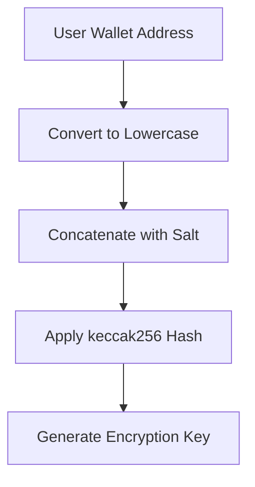
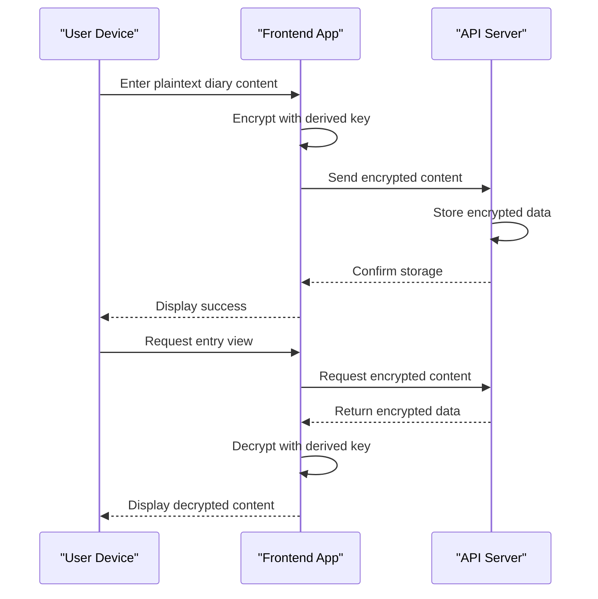
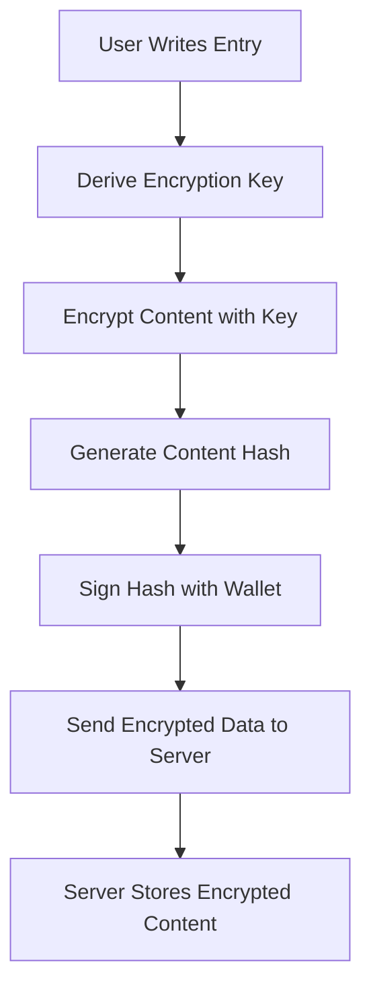
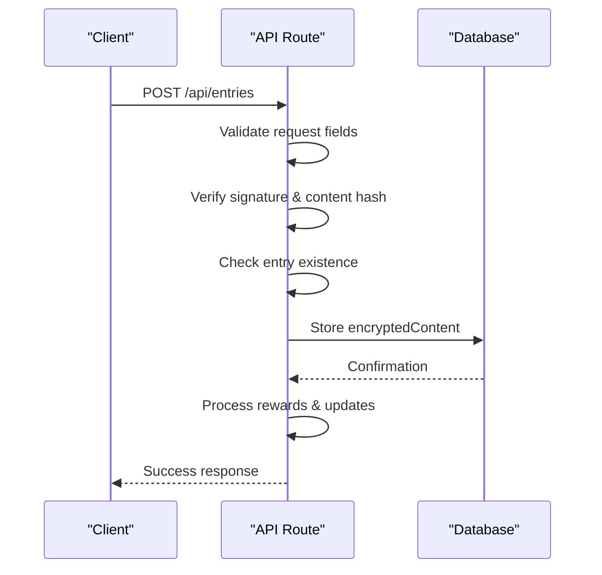
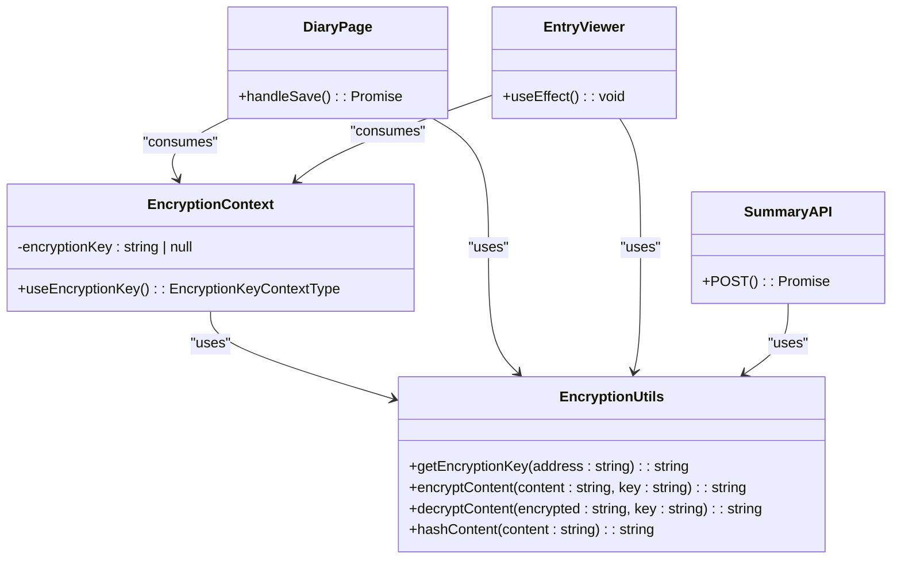

# Encryption Model

<cite>
**Referenced Files in This Document**   
- [lib/encryption.ts](file://lib/encryption.ts)
- [app/api/entries/route.ts](file://app/api/entries/route.ts)
- [lib/EncryptionKeyContext.tsx](file://lib/EncryptionKeyContext.tsx)
- [components/EntryViewer.tsx](file://components/EntryViewer.tsx)
- [app/diary/page.tsx](file://app/diary/page.tsx)
- [app/api/summary/generate/route.ts](file://app/api/summary/generate/route.ts)
- [TECHNICAL_DOCUMENTATION.md](file://TECHNICAL_DOCUMENTATION.md)
- [DEVELOPMENT_PLAN.md](file://DEVELOPMENT_PLAN.md)
- [GENERAL_DESCRIPTION.md](file://GENERAL_DESCRIPTION.md)
</cite>

## Table of Contents
1. [Introduction](#introduction)
2. [Key Derivation Mechanism](#key-derivation-mechanism)
3. [AES Encryption Implementation](#aes-encryption-implementation)
4. [Client-Side Encryption Flow](#client-side-encryption-flow)
5. [Server-Side Processing](#server-side-processing)
6. [Security Benefits](#security-benefits)
7. [Limitations and Considerations](#limitations-and-considerations)
8. [Code Architecture](#code-architecture)
9. [Conclusion](#conclusion)

## Introduction
DiaryBeast implements a zero-knowledge encryption model that ensures user diary entries remain private and accessible only to the user. The system leverages cryptographic techniques to provide end-to-end encryption where plaintext content is never exposed to the server. This document details the encryption architecture, focusing on deterministic key derivation, AES encryption implementation, and the overall security model that protects user data across devices and sessions.

**Section sources**
- [GENERAL_DESCRIPTION.md](file://GENERAL_DESCRIPTION.md#L176-L238)
- [TECHNICAL_DOCUMENTATION.md](file://TECHNICAL_DOCUMENTATION.md#L893-L950)

## Key Derivation Mechanism
DiaryBeast uses a deterministic key derivation process based on the user's wallet address combined with a static salt value. The `getEncryptionKey` function in `lib/encryption.ts` generates a consistent encryption key by concatenating the lowercase wallet address with the salt string 'DiaryBeast_v1_encryption' and applying the keccak256 hash function. This approach ensures that the same encryption key is generated across all devices whenever the user connects with their wallet, enabling seamless access to encrypted entries without requiring additional authentication steps or key management.

The key derivation process works with both externally owned accounts (EOAs) and smart wallets, making it compatible with various wallet types. Unlike approaches that require signature challenges to derive keys, DiaryBeast's method eliminates the need for additional wallet interactions during key generation, improving user experience while maintaining security. The static salt value is embedded in the client-side code and remains constant across the application's lifecycle.

**Diagram sources**
- [lib/encryption.ts](file://lib/encryption.ts#L8-L12)

**Section sources**
- [lib/encryption.ts](file://lib/encryption.ts#L8-L12)
- [lib/EncryptionKeyContext.tsx](file://lib/EncryptionKeyContext.tsx#L24-L33)

## AES Encryption Implementation
The encryption and decryption of diary content is implemented using the CryptoJS library with AES (Advanced Encryption Standard) algorithm. The `encryptContent` and `decryptContent` functions in `lib/encryption.ts` handle the cryptographic operations, using the deterministically derived key as the encryption passphrase. When a user saves a diary entry, the plaintext content is encrypted client-side before transmission to the server, ensuring that the original text never leaves the user's device.

The AES implementation uses CryptoJS's default configuration, which typically employs AES-256 in CBC (Cipher Block Chaining) mode with PKCS#7 padding. The encrypted output is converted to a string representation using CryptoJS's built-in encoding, making it suitable for JSON serialization and HTTP transmission. During decryption, the process is reversed: the encrypted string is decoded, decrypted using the user's key, and converted back to UTF-8 plaintext for display in the application interface.

**Diagram sources**
- [lib/encryption.ts](file://lib/encryption.ts#L14-L21)

**Section sources**
- [lib/encryption.ts](file://lib/encryption.ts#L14-L21)
- [components/EntryViewer.tsx](file://components/EntryViewer.tsx#L39-L44)

## Client-Side Encryption Flow
The encryption process occurs entirely on the client side within the user's browser, following a specific sequence when a user saves a diary entry. In the diary interface (`app/diary/page.tsx`), when the user clicks "Save & Sign Entry", the application first generates the encryption key using their wallet address through the `EncryptionKeyProvider` context. The plaintext content is then encrypted using the `encryptContent` function with this key.

Concurrently, the application creates a content hash using the `hashContent` function, which applies keccak256 to the plaintext. This hash is then signed with the user's wallet to create a digital signature that proves authorship without revealing the content. Both the encrypted content and the signature are included in the request payload sent to the API endpoint. This design ensures that even if the server were compromised, attackers would only access encrypted data that cannot be decrypted without the user's wallet-derived key.

**Diagram sources**
- [app/diary/page.tsx](file://app/diary/page.tsx#L74-L88)

**Section sources**
- [app/diary/page.tsx](file://app/diary/page.tsx#L74-L88)
- [lib/encryption.ts](file://lib/encryption.ts#L23-L25)

## Server-Side Processing
The server-side implementation in `app/api/entries/route.ts` handles encrypted entries without ever accessing plaintext content. When receiving a POST request to create a new entry, the API validates the required fields including `encryptedContent`, `signature`, and `contentHash`. It verifies the wallet signature against the content hash to authenticate the user and ensure data integrity, but does not attempt to decrypt or inspect the entry content.

The verified encrypted content is stored directly in the PostgreSQL database through Prisma ORM, with no additional processing or transformation. This zero-knowledge architecture means the server treats diary entries as opaque data blobs, completely unaware of their actual content. Even database administrators or attackers with database access cannot read the entries without the user-specific encryption keys, which are never transmitted to or stored on the server.

**Diagram sources**
- [app/api/entries/route.ts](file://app/api/entries/route.ts#L1-L38)

**Section sources**
- [app/api/entries/route.ts](file://app/api/entries/route.ts#L1-L38)
- [TECHNICAL_DOCUMENTATION.md](file://TECHNICAL_DOCUMENTATION.md#L100-L137)

## Security Benefits
DiaryBeast's encryption model provides several significant security advantages, primarily centered around the zero-knowledge principle. The most critical benefit is that diary content remains private and inaccessible to the service provider, as plaintext entries are never transmitted to or stored on servers. This architecture protects user data even in the event of a complete server breach, as attackers would only obtain encrypted content that cannot be decrypted without individual user keys.

The deterministic key derivation eliminates the need for users to manage encryption keys separately, reducing the risk of key loss while maintaining strong security. Since the key is derived from the wallet address—a piece of information users already protect—the system leverages existing security practices without adding complexity. Additionally, the use of wallet signatures for authentication and content verification creates a tamper-proof record of authorship, ensuring that entries cannot be forged or altered without detection.

The model also provides forward secrecy in practice, as compromising a single entry's encryption does not automatically expose other entries. Each user's data is protected by their unique key, creating isolation between accounts. This design aligns with privacy-first principles, giving users genuine control over their personal information and fulfilling the promise that "not even we can decrypt them" as stated in the application's documentation.

**Section sources**
- [TECHNICAL_DOCUMENTATION.md](file://TECHNICAL_DOCUMENTATION.md#L893-L950)
- [GENERAL_DESCRIPTION.md](file://GENERAL_DESCRIPTION.md#L339-L350)

## Limitations and Considerations
While the encryption model provides strong privacy guarantees, it has several important limitations and considerations. The primary risk is wallet compromise: if an attacker gains access to a user's wallet, they can derive the same encryption key and decrypt all diary entries. This single point of failure means that the security of the entire journal depends entirely on the security of the user's wallet, with no recovery mechanism available if the wallet is lost or stolen.

The system does not support sharing or collaborative editing of entries, as there is no mechanism for key exchange or multi-party decryption. Users cannot access their entries without their wallet, eliminating the possibility of password-based recovery or administrator access. While this strengthens privacy, it also means that losing wallet access results in permanent loss of journal content.

Another consideration is the static salt value used in key derivation. While this enables cross-device consistency, it represents a potential attack surface if the client-side code is compromised. However, since the salt is combined with the unique wallet address, its exposure does not enable mass decryption of user data. The model also assumes that the keccak256 hash function and AES encryption remain cryptographically secure, which is currently the case but subject to future advances in cryptanalysis.

**Section sources**
- [lib/encryption.ts](file://lib/encryption.ts#L8-L12)
- [TECHNICAL_DOCUMENTATION.md](file://TECHNICAL_DOCUMENTATION.md#L893-L950)

## Code Architecture
The encryption functionality is organized across multiple components in a layered architecture. The core cryptographic functions are centralized in `lib/encryption.ts`, which exports utilities for key derivation, encryption, decryption, and hashing. This module depends on external libraries CryptoJS for AES operations and viem for keccak256 hashing, maintaining a clear separation of concerns.

The `EncryptionKeyContext.tsx` component provides a React context wrapper that manages the encryption key lifecycle, deriving it from the connected wallet address and making it available throughout the application via the `useEncryptionKey` hook. This context-based approach ensures consistent key usage across different components while abstracting the derivation logic from individual features.

Various application components consume these encryption services: the diary page (`app/diary/page.tsx`) uses `encryptContent` when saving entries, while the entry viewer (`components/EntryViewer.tsx`) uses `decryptContent` when displaying stored entries. The summary generation API (`app/api/summary/generate/route.ts`) also uses both `getEncryptionKey` and `decryptContent` to process entries for analysis, demonstrating how the same key derivation principles apply across different use cases.

**Diagram sources**
- [lib/encryption.ts](file://lib/encryption.ts#L8-L25)
- [lib/EncryptionKeyContext.tsx](file://lib/EncryptionKeyContext.tsx#L24-L33)
- [app/diary/page.tsx](file://app/diary/page.tsx#L74-L88)
- [components/EntryViewer.tsx](file://components/EntryViewer.tsx#L39-L44)
- [app/api/summary/generate/route.ts](file://app/api/summary/generate/route.ts#L82-L83)

**Section sources**
- [lib/encryption.ts](file://lib/encryption.ts#L8-L25)
- [lib/EncryptionKeyContext.tsx](file://lib/EncryptionKeyContext.tsx#L1-L43)
- [app/diary/page.tsx](file://app/diary/page.tsx#L4-L95)
- [components/EntryViewer.tsx](file://components/EntryViewer.tsx#L1-L124)
- [app/api/summary/generate/route.ts](file://app/api/summary/generate/route.ts#L1-L228)

## Conclusion
DiaryBeast's encryption model successfully implements a zero-knowledge architecture that prioritizes user privacy and data security. By combining deterministic key derivation from wallet addresses with client-side AES encryption, the system ensures that diary entries remain confidential and accessible only to their authors. The design eliminates server-side knowledge of plaintext content, protecting users even in the event of infrastructure breaches.

The choice to derive keys from wallet addresses rather than requiring signature challenges strikes a balance between security and usability, enabling seamless cross-device access without compromising protection. While the model has inherent limitations related to wallet security and recovery, it represents a robust approach to private journaling in a Web3 context. This architecture aligns with the application's core philosophy of giving users true ownership of their personal data while leveraging blockchain technology for authentication and verification.