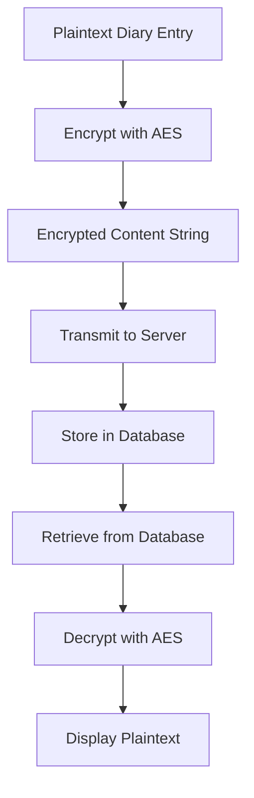
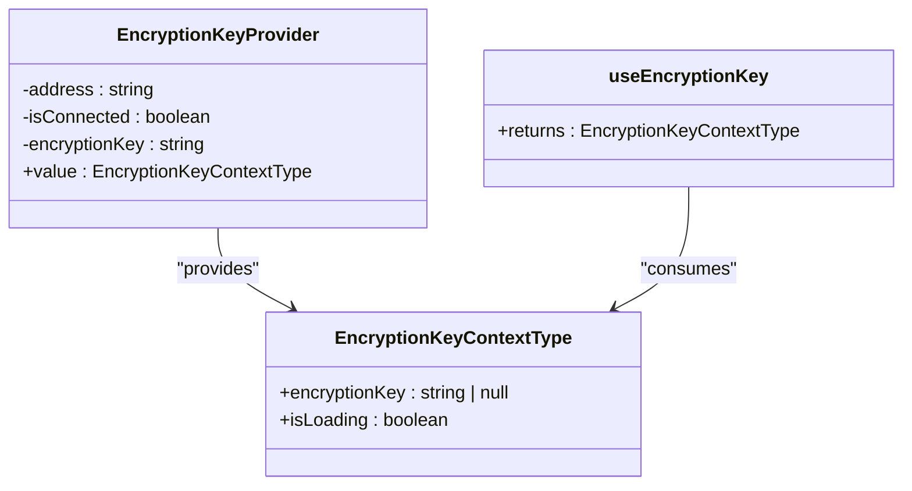
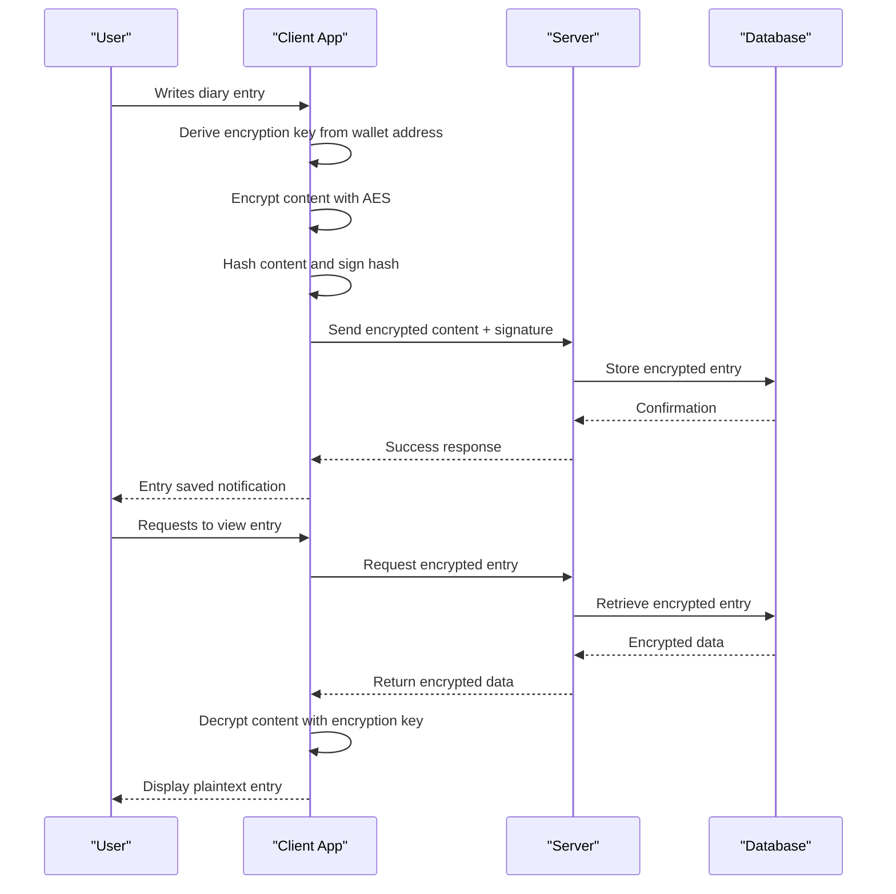

# Security & Encryption

<cite>
**Referenced Files in This Document**   
- [encryption.ts](file://lib/encryption.ts)
- [EncryptionKeyContext.tsx](file://lib/EncryptionKeyContext.tsx)
- [diary/page.tsx](file://app/diary/page.tsx)
- [summary/generate/route.ts](file://app/api/summary/generate/route.ts)
- [useAuth.ts](file://lib/useAuth.ts)
</cite>

## Table of Contents
1. [Introduction](#introduction)
2. [Client-Side Encryption Model](#client-side-encryption-model)
3. [Encryption Implementation](#encryption-implementation)
4. [Key Derivation and Management](#key-derivation-and-management)
5. [Secure Data Flow](#secure-data-flow)
6. [Authentication Flow Integration](#authentication-flow-integration)
7. [Encryption Lifecycle Example](#encryption-lifecycle-example)
8. [Security Considerations](#security-considerations)

## Introduction
DiaryBeast implements a client-side encryption system that ensures user diary entries remain private and secure. The system uses a deterministic encryption key derived from the user's wallet address to encrypt content before it leaves the browser. This design guarantees that plaintext content never reaches the server, providing end-to-end encryption where only the user with their wallet can access their diary entries.

## Client-Side Encryption Model
DiaryBeast employs a client-side encryption model where all diary entries are encrypted in the user's browser before being transmitted to the server. The encryption key is deterministically derived from the user's wallet address combined with a fixed salt, ensuring the same key is generated across devices without requiring additional signatures for encryption operations. This approach maintains privacy while providing a seamless user experience.

The server stores only encrypted content and has no capability to decrypt entries, as it never receives access to the encryption key or the user's private keys. This architecture ensures that even if the server is compromised, user diary content remains protected and inaccessible.

**Section sources**
- [encryption.ts](file://lib/encryption.ts#L1-L25)
- [EncryptionKeyContext.tsx](file://lib/EncryptionKeyContext.tsx#L1-L43)

## Encryption Implementation
The encryption implementation in DiaryBeast uses the CryptoJS library for AES encryption with the following functions:

- `encryptContent(content: string, key: string)`: Encrypts plaintext content using AES algorithm with the provided key
- `decryptContent(encrypted: string, key: string)`: Decrypts ciphertext back to plaintext using the encryption key
- `hashContent(content: string)`: Generates a keccak256 hash of the content for integrity verification

The system uses symmetric encryption where the same key is used for both encryption and decryption. The encrypted content is stored as a string representation that can be safely transmitted and stored.

**Diagram sources**
- [encryption.ts](file://lib/encryption.ts#L14-L22)

**Section sources**
- [encryption.ts](file://lib/encryption.ts#L14-L22)

## Key Derivation and Management
The EncryptionKeyContext manages the encryption key lifecycle using React's context API. The key is derived deterministically from the user's wallet address using a fixed salt value, eliminating the need for repeated wallet signatures for encryption operations.

The `getEncryptionKey(address: string)` function combines the lowercase wallet address with the salt 'DiaryBeast_v1_encryption' and applies keccak256 hashing to generate a consistent encryption key. This approach works across different wallet types (EOAs and Smart Wallets) and ensures the key remains the same across devices and sessions.

The EncryptionKeyProvider component uses React's useMemo hook to cache the encryption key and only regenerate it when the wallet address changes, optimizing performance while maintaining security.

**Diagram sources**
- [EncryptionKeyContext.tsx](file://lib/EncryptionKeyContext.tsx#L11-L43)

**Section sources**
- [EncryptionKeyContext.tsx](file://lib/EncryptionKeyContext.tsx#L1-L43)

## Secure Data Flow
The secure data flow in DiaryBeast follows a strict client-side encryption pattern. When a user creates a diary entry, the content is immediately encrypted in the browser using the derived encryption key. The encrypted content, along with a hash of the original content and a signature of that hash, is then sent to the server.

The server stores the encrypted content without any knowledge of the plaintext. When retrieving entries, the server returns the encrypted data which is then decrypted in the user's browser using the same deterministic key. This ensures that plaintext content is only ever present in the client environment.

The EntryViewer component handles decryption of entries for display, ensuring that content is only decrypted when actively being viewed by the authorized user.

**Section sources**
- [diary/page.tsx](file://app/diary/page.tsx#L46-L95)
- [summary/generate/route.ts](file://app/api/summary/generate/route.ts#L2-L228)
- [components/EntryViewer.tsx](file://components/EntryViewer.tsx#L80-L123)

## Authentication Flow Integration
The authentication flow establishes the encryption context when a user connects their wallet. During the authentication process in useAuth.ts, the system verifies the user's identity through wallet signature, but the encryption key itself is derived directly from the wallet address rather than requiring additional signatures.

This integration allows for seamless encryption without adding extra signature requests to the user experience. Once authenticated, the EncryptionKeyProvider automatically generates the encryption key based on the connected wallet address, enabling immediate encryption capabilities for diary entries.

The system separates authentication (proving wallet ownership) from encryption (protecting content), using the wallet address as the link between these systems while maintaining their distinct purposes.

**Section sources**
- [useAuth.ts](file://lib/useAuth.ts#L45-L99)
- [EncryptionKeyContext.tsx](file://lib/EncryptionKeyContext.tsx#L25-L43)

## Encryption Lifecycle Example
The encryption lifecycle begins when a user writes a diary entry in the Diary component. The process follows these steps:

1. User writes content in the text editor
2. System retrieves the encryption key from EncryptionKeyContext
3. Content is encrypted using encryptContent() with the derived key
4. Content hash is generated for integrity verification
5. Hash is signed with the user's wallet
6. Encrypted content, hash, and signature are sent to the API
7. Server stores encrypted data without accessing plaintext

When viewing entries, the reverse process occurs:
1. Encrypted content is retrieved from server
2. Content is decrypted using decryptContent() with the derived key
3. Plaintext is displayed only in the user's browser

**Diagram sources**
- [diary/page.tsx](file://app/diary/page.tsx#L46-L95)
- [encryption.ts](file://lib/encryption.ts#L14-L22)

**Section sources**
- [diary/page.tsx](file://app/diary/page.tsx#L46-L95)

## Security Considerations
DiaryBeast's encryption system addresses several key security considerations:

**Key Leakage Prevention**: The deterministic key derivation from wallet address eliminates the need to store or transmit encryption keys. Since the key can be regenerated from public information (wallet address) plus a fixed salt, there's no need to expose or store the actual key.

**Browser Storage Safety**: Encryption keys are not stored in browser storage but are derived on-demand from the wallet address. This reduces the risk of key exposure through localStorage or sessionStorage vulnerabilities.

**Forward Secrecy**: While not implementing perfect forward secrecy, the system ensures that compromise of a single entry's encryption does not compromise other entries, as each entry's security depends on the overall encryption key protection.

**Server Trust Minimization**: The server never handles plaintext content, reducing the attack surface and trust requirements. Even with full server access, attackers cannot decrypt user entries without the user's wallet.

**Consistent Security Across Devices**: The deterministic key derivation ensures users can access their encrypted entries from any device without additional setup, while maintaining the same security guarantees.

**Section sources**
- [encryption.ts](file://lib/encryption.ts#L1-L25)
- [EncryptionKeyContext.tsx](file://lib/EncryptionKeyContext.tsx#L1-L43)