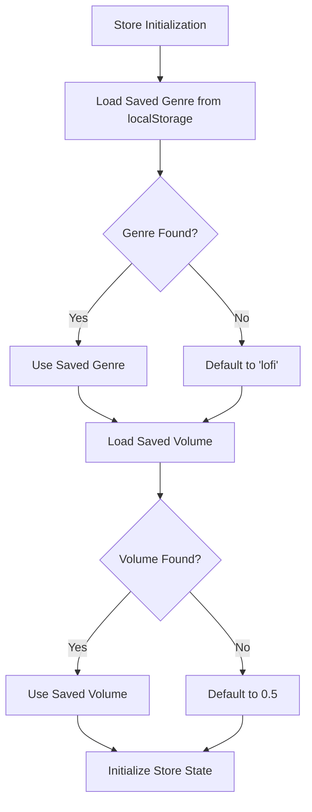
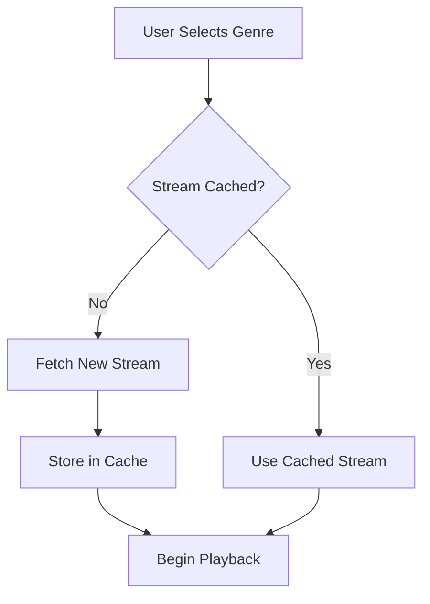
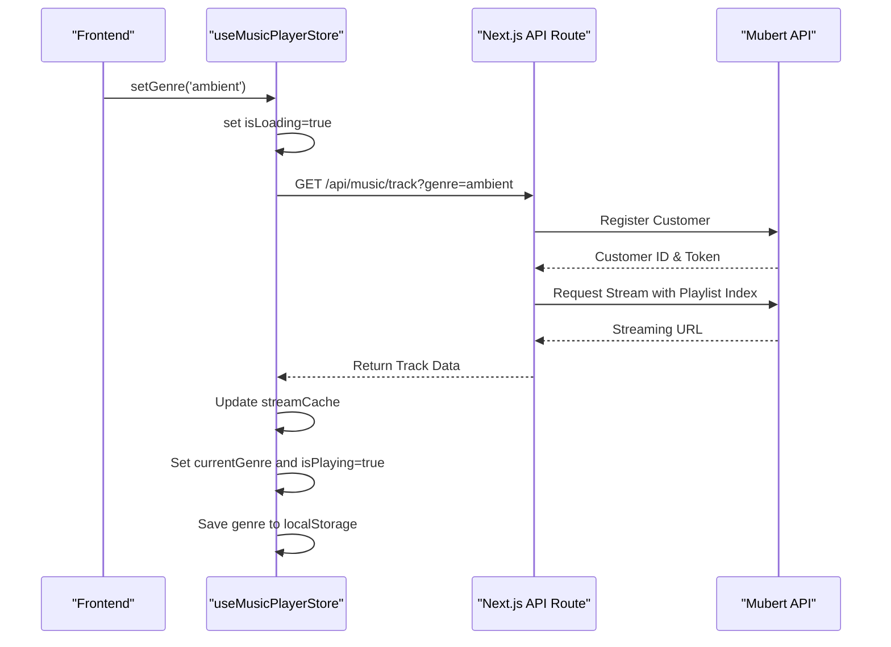
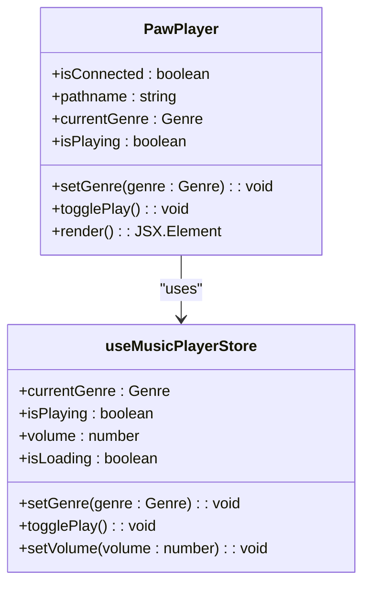
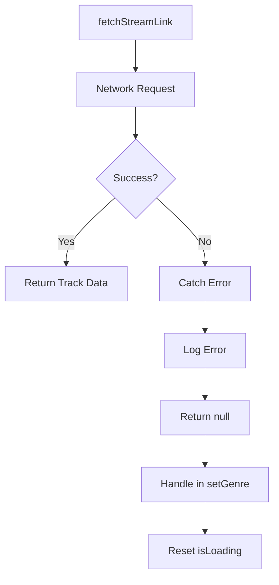

# Music Player State Management

<cite>
**Referenced Files in This Document**   
- [musicPlayerStore.ts](file://lib/stores/musicPlayerStore.ts)
- [PawPlayer.tsx](file://components/GlobalMusicPlayer/PawPlayer.tsx)
- [route.ts](file://app/api/music/track/route.ts)
</cite>

## Table of Contents
1. [Introduction](#introduction)
2. [Core State Structure](#core-state-structure)
3. [Stream Caching Mechanism](#stream-caching-mechanism)
4. [Mubert API Integration](#mubert-api-integration)
5. [Playback Control Implementation](#playback-control-implementation)
6. [Volume Persistence](#volume-persistence)
7. [UI Integration with PawPlayer](#ui-integration-with-pawplayer)
8. [Error Handling and Edge Cases](#error-handling-and-edge-cases)
9. [Customization and Extension](#customization-and-extension)
10. [Performance Optimization](#performance-optimization)

## Introduction
The music player state management system in DiaryBeast is centered around the `useMusicPlayerStore` Zustand store, which manages audio playback state, genre selection, volume control, and integration with Mubert's AI music generation API. This document provides a comprehensive analysis of the implementation, focusing on state management patterns, API integration, and performance optimization strategies.

**Section sources**
- [musicPlayerStore.ts](file://lib/stores/musicPlayerStore.ts#L1-L20)

## Core State Structure
The `useMusicPlayerStore` manages several key state variables that control the music player's behavior:

- **currentGenre**: Tracks the currently selected music genre ('ambient', 'lofi', or 'nature')
- **isPlaying**: Boolean flag indicating playback status
- **volume**: Current volume level (0.0 to 1.0)
- **isLoading**: Indicates when stream loading operations are in progress

The store initializes with persisted user preferences from localStorage, defaulting to 'lofi' genre and 0.5 volume if no saved values exist. This ensures a consistent user experience across sessions.



**Diagram sources**
- [musicPlayerStore.ts](file://lib/stores/musicPlayerStore.ts#L56-L62)

**Section sources**
- [musicPlayerStore.ts](file://lib/stores/musicPlayerStore.ts#L37-L44)

## Stream Caching Mechanism
The system implements an efficient caching strategy using a `streamCache` object that stores streaming URLs for each genre. This prevents redundant network requests when switching between genres the user has already accessed.

```typescript
const streamCache: Record<Genre, Track | null> = {
  ambient: null,
  lofi: null,
  nature: null,
};
```

When a genre is selected, the system first checks the cache before making an API request. If the stream is cached, playback begins immediately. If not, the system fetches a new streaming URL and updates the cache. This approach significantly reduces latency and API usage while improving the user experience during genre switching.



**Diagram sources**
- [musicPlayerStore.ts](file://lib/stores/musicPlayerStore.ts#L14-L18)

**Section sources**
- [musicPlayerStore.ts](file://lib/stores/musicPlayerStore.ts#L14-L18)

## Mubert API Integration
The music player integrates with Mubert's API through a Next.js API route that dynamically generates streaming links based on genre selection. The integration follows a two-step process:

1. **Customer Authentication**: The system registers a customer with Mubert's API and caches the authentication token
2. **Stream Generation**: Uses the authenticated customer credentials to generate genre-specific streaming URLs



The API maps genres to Mubert playlist indices:
- 'ambient' → '3.0' (All Ambient channels)
- 'lofi' → '3' (All Calm category)
- 'nature' → '3.0.0' (Meditation channel)

**Diagram sources**
- [route.ts](file://app/api/music/track/route.ts#L19-L25)
- [musicPlayerStore.ts](file://lib/stores/musicPlayerStore.ts#L21-L35)

**Section sources**
- [route.ts](file://app/api/music/track/route.ts#L19-L35)
- [musicPlayerStore.ts](file://lib/stores/musicPlayerStore.ts#L21-L35)

## Playback Control Implementation
The store provides a comprehensive set of actions for controlling playback:

- **setGenre**: Changes the current genre and loads a new stream
- **play**: Starts playback, loading a stream if necessary
- **pause**: Stops playback
- **togglePlay**: Toggles between play and pause states

The `play` method implements lazy loading, only fetching a stream when one isn't already cached for the current genre. The `togglePlay` method orchestrates the play/pause logic by calling the appropriate action based on the current `isPlaying` state.

```mermaid
flowchart TD
A[togglePlay] --> B{isPlaying?}
B --> |Yes| C[pause()]
B --> |No| D[play()]
D --> E{Stream Cached?}
E --> |No| F[fetchStreamLink()]
F --> G[Update Cache]
G --> H[Set isPlaying=true]
E --> |Yes| H
C --> I[Set isPlaying=false]
```

**Diagram sources**
- [musicPlayerStore.ts](file://lib/stores/musicPlayerStore.ts#L100-L140)

**Section sources**
- [musicPlayerStore.ts](file://lib/stores/musicPlayerStore.ts#L48-L51)

## Volume Persistence
Volume settings are persisted across sessions using localStorage, providing a consistent user experience. The `setVolume` method includes validation to ensure the volume remains within the valid range (0.0 to 1.0) and automatically saves the value to localStorage when running in a browser environment.

```mermaid
flowchart TD
A[setVolume(volume)] --> B[Clamp to 0.0-1.0]
B --> C[Update Store State]
C --> D{Browser Environment?}
D --> |Yes| E[Save to localStorage]
D --> |No| F[No Persistence]
E --> G[Key: 'music-volume']
```

This implementation ensures that users don't need to adjust volume levels each time they visit the application, while also handling edge cases like invalid input values.

**Diagram sources**
- [musicPlayerStore.ts](file://lib/stores/musicPlayerStore.ts#L142-L152)

**Section sources**
- [musicPlayerStore.ts](file://lib/stores/musicPlayerStore.ts#L52-L52)

## UI Integration with PawPlayer
The `PawPlayer` component serves as the visual interface for the music player, integrating directly with `useMusicPlayerStore` to reflect the current playback state. It conditionally renders based on user connection status and current route, ensuring it only appears when appropriate.

The component displays:
- Genre selection buttons for ambient, lofi, and nature
- A central play/pause button
- Visual feedback through animations and color changes

When a genre button is clicked, it calls `setGenre` with the corresponding genre. The play/pause button calls `togglePlay` to control playback. Visual states are synchronized with the store's `currentGenre`, `isPlaying`, and `isLoading` values, providing immediate feedback to user interactions.



**Diagram sources**
- [PawPlayer.tsx](file://components/GlobalMusicPlayer/PawPlayer.tsx#L1-L203)
- [musicPlayerStore.ts](file://lib/stores/musicPlayerStore.ts#L37-L55)

**Section sources**
- [PawPlayer.tsx](file://components/GlobalMusicPlayer/PawPlayer.tsx#L1-L203)

## Error Handling and Edge Cases
The system implements robust error handling for various edge cases:

- **Failed Stream Loading**: Network errors during stream fetching are caught and logged, with the UI state reset appropriately
- **Invalid Genre Selection**: The API validates genre parameters and returns 400 errors for invalid values
- **Browser Autoplay Policies**: The system requires user interaction to begin playback, complying with browser autoplay restrictions
- **Server-Side Rendering**: Checks for window object existence prevent localStorage access during SSR

When stream loading fails, the system logs the error to the console and resets the `isLoading` state, allowing users to retry. The API route catches exceptions and returns appropriate HTTP status codes, enabling the frontend to handle different error scenarios gracefully.



**Diagram sources**
- [musicPlayerStore.ts](file://lib/stores/musicPlayerStore.ts#L21-L35)
- [route.ts](file://app/api/music/track/route.ts#L75-L97)

**Section sources**
- [musicPlayerStore.ts](file://lib/stores/musicPlayerStore.ts#L21-L35)
- [route.ts](file://app/api/music/track/route.ts#L75-L97)

## Customization and Extension
The music player system is designed to be extensible, allowing for customization of default settings and addition of new features:

- **Default Genre and Volume**: Can be modified by changing the default values in the store initialization
- **Supported Genres**: New genres can be added by extending the `Genre` type and updating the `GENRE_PLAYLISTS` mapping in the API route
- **Audio Context**: The system can be enhanced with Web Audio API features for advanced audio processing

To customize default settings, developers can modify the fallback values in the store initialization:

```typescript
const savedGenre = /* ... */ || 'lofi'; // Change default genre
const savedVolume = /* ... */ || 0.5;   // Change default volume
```

Adding new genres requires updates to both the frontend type definition and the backend API route to ensure proper mapping to Mubert playlist indices.

**Section sources**
- [musicPlayerStore.ts](file://lib/stores/musicPlayerStore.ts#L59-L62)

## Performance Optimization
The system implements several performance optimizations:

- **Stream Caching**: Prevents redundant network requests for previously accessed genres
- **Lazy Loading**: Only fetches streams when necessary, reducing initial load time
- **Memory Management**: The in-memory cache is lightweight and automatically updated
- **Efficient State Updates**: Zustand's optimized state management minimizes re-renders

The caching strategy significantly reduces API calls and improves response times when users switch between genres. The lazy loading approach ensures that audio resources are only loaded when explicitly requested, conserving bandwidth and improving overall application performance.

Additional optimization opportunities include:
- Implementing cache expiration to handle token invalidation
- Preloading streams for likely next genres
- Memory cleanup for unused cached streams
- Debouncing rapid genre switches

**Section sources**
- [musicPlayerStore.ts](file://lib/stores/musicPlayerStore.ts#L14-L18)
- [musicPlayerStore.ts](file://lib/stores/musicPlayerStore.ts#L80-L95)