# Utility and Navigation Components

<cite>
**Referenced Files in This Document**   
- [DailyTimer.tsx](file://components/DailyTimer.tsx)
- [StreakCalendar.tsx](file://components/StreakCalendar.tsx)
- [MonthlyCalendar.tsx](file://components/MonthlyCalendar.tsx)
- [WeeklyHistory.tsx](file://components/WeeklyHistory.tsx)
- [BottomNavOverlay.tsx](file://components/BottomNavOverlay.tsx)
- [RightSidebar.tsx](file://components/RightSidebar.tsx)
- [TextEditor.tsx](file://components/TextEditor.tsx)
- [WalletConnect.tsx](file://components/WalletConnect.tsx)
- [GamificationContext.tsx](file://lib/contexts/GamificationContext.tsx)
- [EncryptionKeyContext.tsx](file://lib/EncryptionKeyContext.tsx)
- [encryption.ts](file://lib/encryption.ts)
- [streakRewards.ts](file://lib/gamification/streakRewards.ts)
</cite>

## Table of Contents
1. [Introduction](#introduction)
2. [Timer and Calendar Components](#timer-and-calendar-components)
3. [Navigation Layout Components](#navigation-layout-components)
4. [Input and Authentication Components](#input-and-authentication-components)
5. [Context and State Management](#context-and-state-management)
6. [Performance and Responsive Design](#performance-and-responsive-design)
7. [Conclusion](#conclusion)

## Introduction
This document details the utility and navigation components that support core functionality in DiaryBeast, a Web3-powered journaling application with gamification elements. The components covered include time-based utilities (DailyTimer), calendar visualizations (StreakCalendar, MonthlyCalendar, WeeklyHistory), navigation layouts (BottomNavOverlay, RightSidebar), input mechanisms (TextEditor), and authentication interfaces (WalletConnect). These components work together to create an engaging, mobile-first experience that encourages consistent journaling through visual feedback, gamification, and secure, encrypted input.

**Section sources**
- [DailyTimer.tsx](file://components/DailyTimer.tsx#L8-L84)
- [StreakCalendar.tsx](file://components/StreakCalendar.tsx#L14-L113)
- [MonthlyCalendar.tsx](file://components/MonthlyCalendar.tsx#L11-L131)

## Timer and Calendar Components

### DailyTimer Component
The DailyTimer component displays a countdown to the next entry deadline (midnight UTC) and provides visual feedback on whether the user has written today. It uses React's useState and useEffect hooks to maintain and update the time remaining, recalculating every second. When the user has already written today, it displays a success state with "ENTRY CLAIMED!" and shows the time until the next entry window. The component features a retro LCD-style display with cyan glow effects and uses font-mono for a digital aesthetic.


**Diagram sources**
- [DailyTimer.tsx](file://components/DailyTimer.tsx#L8-L84)

**Section sources**
- [DailyTimer.tsx](file://components/DailyTimer.tsx#L8-L84)

### StreakCalendar Component
The StreakCalendar component visualizes journaling consistency over the last 7 days, showing a compact weekly view with color-coded indicators for written days (green), today (orange pulse), and missed days (gray). It accepts entries and currentStreak as props and renders a horizontal timeline of days. The component also displays the current streak count with a special achievement icon and calculates progress toward the next milestone using the getNextMilestone function from the gamification system. This provides motivational feedback by showing how many more days are needed to earn bonus tokens.


**Diagram sources**
- [StreakCalendar.tsx](file://components/StreakCalendar.tsx#L14-L113)
- [streakRewards.ts](file://lib/gamification/streakRewards.ts#L51-L53)

**Section sources**
- [StreakCalendar.tsx](file://components/StreakCalendar.tsx#L14-L113)
- [streakRewards.ts](file://lib/gamification/streakRewards.ts#L51-L53)

### MonthlyCalendar Component
The MonthlyCalendar component provides a comprehensive monthly view of journaling activity, displaying all days of the current month in a grid format with Sunday as the first column. It highlights days with entries in green, today in orange with a pulse animation, and future days in gray with a disabled cursor. The component includes a legend explaining the color coding and uses responsive grid layout to adapt to different screen sizes. Unlike the StreakCalendar, this component focuses on historical patterns rather than streak tracking, allowing users to see their overall consistency across the month.


**Diagram sources**
- [MonthlyCalendar.tsx](file://components/MonthlyCalendar.tsx#L11-L131)

**Section sources**
- [MonthlyCalendar.tsx](file://components/MonthlyCalendar.tsx#L11-L131)

### WeeklyHistory Component
The WeeklyHistory component serves as a comprehensive entry management interface, displaying past entries grouped by week with collapsible sections. It features a vertical sidebar layout with a logo, history header, and expandable week groups. Each week shows a mini calendar view of the 7 days, entry count, and a "SUMMARY" button that consumes 50 DIARY tokens to generate AI-powered insights. The component manages expand/collapse state for weeks and handles summary generation through API calls to /api/summary/generate. It also supports entry clicking via the onEntryClick callback, enabling navigation to specific entries.


**Diagram sources**
- [WeeklyHistory.tsx](file://components/WeeklyHistory.tsx#L103-L342)

**Section sources**
- [WeeklyHistory.tsx](file://components/WeeklyHistory.tsx#L103-L342)

## Navigation Layout Components

### BottomNavOverlay Component
The BottomNavOverlay component implements a fixed-position navigation bar optimized for mobile touch interaction, positioned at the bottom of the screen with pointer-events handling. It conditionally renders based on wallet connection status and current route, hiding on the home and onboarding pages. The navigation features a distinctive layout with left, center, and right sections containing different menu items. The center "Diary" button is highlighted with cyan glow effects, emphasizing it as the primary action. The component uses React Router for navigation and wagmi's useDisconnect for logout functionality, providing a seamless mobile-first navigation experience.


**Diagram sources**
- [BottomNavOverlay.tsx](file://components/BottomNavOverlay.tsx#L13-L204)

**Section sources**
- [BottomNavOverlay.tsx](file://components/BottomNavOverlay.tsx#L13-L204)

### RightSidebar Component
The RightSidebar component provides a vertical sidebar on the right side of the screen, containing user statistics, achievements, and pet information. It integrates multiple components including StreakCalendar and Pet, creating a comprehensive dashboard of user progress. The sidebar features collapsible achievements that show current streak, next milestone progress with a visual progress bar, best streak, and total entries. It consumes userData and entries props to display personalized information and uses useState to manage the showAchievements toggle state. The component is designed to optimize screen real estate while providing rich gamification feedback.


**Diagram sources**
- [RightSidebar.tsx](file://components/RightSidebar.tsx#L37-L199)
- [streakRewards.ts](file://lib/gamification/streakRewards.ts#L51-L53)

**Section sources**
- [RightSidebar.tsx](file://components/RightSidebar.tsx#L37-L199)
- [streakRewards.ts](file://lib/gamification/streakRewards.ts#L51-L53)

## Input and Authentication Components

### TextEditor Component
The TextEditor component provides a feature-rich, encrypted input interface for diary entries with markdown formatting support and voice-to-text capabilities. It implements a clean, distraction-free writing environment with a retro LCD-inspired design. The component supports three formatting options (bold, italic, list) through markdown syntax insertion and offers three font choices (sans, serif, mono) that are persisted in localStorage. The voice input feature uses the Web Audio API and MediaRecorder to capture audio, which is then sent to the /api/transcribe endpoint for speech-to-text conversion. The editor is designed with touch-friendly buttons and responsive layout for mobile use.

```mermaid
sequenceDiagram
participant User
participant TextEditor
participant MediaRecorder
participant API
User->>TextEditor : Click [🎤]
TextEditor->>TextEditor : startRecording()
TextEditor->>MediaRecorder : getUserMedia()
MediaRecorder-->>TextEditor : MediaStream
TextEditor->>MediaRecorder : start()
User->>TextEditor : Click [⏹️]
TextEditor->>MediaRecorder : stop()
MediaRecorder->>TextEditor : ondataavailable
TextEditor->>TextEditor : collect audio chunks
TextEditor->>TextEditor : onstop event
TextEditor->>API : transcribeAudio()
API->>API : POST /api/transcribe
API-->>TextEditor : Return transcribed text
TextEditor->>TextEditor : Append to value
TextEditor-->>User : Display transcribed text
```



**Diagram sources**
- [TextEditor.tsx](file://components/TextEditor.tsx#L12-L246)

**Section sources**
- [TextEditor.tsx](file://components/TextEditor.tsx#L12-L246)

### WalletConnect Component
The WalletConnect component integrates with Coinbase's OnchainKit to provide Web3 authentication UI, displaying either a connection button for unconnected users or a wallet dropdown for connected users. For connected users, it shows the wallet avatar and name in the navigation bar and provides a dropdown with identity information including address copying functionality. The component uses wagmi's useAccount hook to monitor connection status and conditionally renders the appropriate UI state. The connection button features a prominent "Play & Grow" call-to-action with a custom primary button style, encouraging user onboarding into the gamified journaling experience.


**Diagram sources**
- [WalletConnect.tsx](file://components/WalletConnect.tsx#L6-L33)

**Section sources**
- [WalletConnect.tsx](file://components/WalletConnect.tsx#L6-L33)

## Context and State Management

### GamificationContext Integration
The GamificationContext provides a centralized state management system for gamification features, particularly the gamification modal that displays achievement notifications and rewards. The context is implemented using React's createContext and useContext hooks, with a GamificationProvider that wraps the application. Components can use the useGamification hook to access modal state and control functions (openGamificationModal, closeGamificationModal). This pattern allows any component to trigger gamification feedback without prop drilling, supporting the application's reward-based engagement model.


**Diagram sources**
- [GamificationContext.tsx](file://lib/contexts/GamificationContext.tsx#L10-L10)

**Section sources**
- [GamificationContext.tsx](file://lib/contexts/GamificationContext.tsx#L10-L38)

### EncryptionKeyContext Integration
The EncryptionKeyContext enables secure, deterministic encryption key derivation for diary entries based on the user's wallet address. The context uses wagmi's useAccount to access the connected wallet address and derives an encryption key using keccak256 hashing of the address combined with a salt. This approach ensures that the encryption key is consistent across devices while remaining secure, as it cannot be reverse-engineered from the wallet address alone. The TextEditor and other components consume this context to encrypt entries before storage, implementing end-to-end encryption that protects user privacy.

```mermaid
flowchart TD
Start([EncryptionKeyProvider]) --> CheckWallet["useAccount()"]
CheckWallet --> |Connected| DeriveKey["getEncryptionKey(address)"]
DeriveKey --> Combine["address + salt"]
Combine --> Hash["keccak256()"]
Hash --> Key["Return encryption key"]
CheckWallet --> |Not connected| NullKey["Return null"]
Key --> Context["Provide in EncryptionKeyContext"]
NullKey --> Context
TextEditor --> Context : "useEncryptionKey()"
TextEditor --> Encrypt["encryptContent()"]
TextEditor --> Decrypt["decryptContent()"]
```

**Diagram sources**
- [EncryptionKeyContext.tsx](file://lib/EncryptionKeyContext.tsx#L11-L13)
- [encryption.ts](file://lib/encryption.ts#L8-L12)

**Section sources**
- [EncryptionKeyContext.tsx](file://lib/EncryptionKeyContext.tsx#L11-L44)
- [encryption.ts](file://lib/encryption.ts#L8-L26)

## Performance and Responsive Design

### Responsive Layout Strategy
DiaryBeast implements a mobile-first responsive design strategy with components optimized for touch interaction and small screens. The BottomNavOverlay uses fixed positioning at the bottom of the screen with proper z-index stacking to ensure accessibility on mobile devices. The RightSidebar and WeeklyHistory components use vertical layouts with appropriate padding and touch targets, while the TextEditor provides ample writing space with intuitive formatting controls. All components use Tailwind CSS for responsive styling, with font sizes, padding, and layout adjustments that adapt to different screen sizes. The design prioritizes thumb-friendly navigation with large tap targets and clear visual hierarchy.

### Calendar Performance Optimization
The calendar components (StreakCalendar, MonthlyCalendar, WeeklyHistory) are designed to efficiently render large datasets while maintaining performance. The StreakCalendar limits its view to the last 7 days, minimizing the number of DOM elements created. The MonthlyCalendar uses a grid layout with empty slots for alignment, avoiding complex date calculations. The WeeklyHistory implements virtualization through collapsible sections, only rendering entries for expanded weeks. All components use React's memoization patterns where appropriate, with pure function components that only re-render when props change. The use of useMemo and useCallback is implicit in the clean component design, preventing unnecessary re-renders during user interaction.

### Efficient Re-renders and Memoization
The components leverage React's reactivity model efficiently, using state only when necessary and avoiding unnecessary re-renders. The DailyTimer uses a setInterval for time updates but only re-renders when the time changes. The TextEditor memoizes font preferences in localStorage, reducing state updates. The WalletConnect component conditionally renders based on connection status, avoiding unnecessary DOM updates. The RightSidebar uses useState for the showAchievements toggle but doesn't re-render the entire sidebar when entries change, thanks to proper prop management. These patterns ensure smooth performance even on lower-end mobile devices, providing a responsive user experience.

## Conclusion
The utility and navigation components in DiaryBeast work together to create an engaging, secure, and user-friendly journaling experience. The timer and calendar components provide visual feedback on journaling consistency, leveraging gamification principles to encourage daily writing. The navigation components (BottomNavOverlay and RightSidebar) optimize screen real estate with mobile-first design, providing intuitive access to key features. The TextEditor offers a rich input experience with encryption, formatting, and voice-to-text capabilities, while WalletConnect enables seamless Web3 authentication. Through effective use of React context for state management and careful attention to performance, these components create a cohesive ecosystem that supports the application's core mission of making journaling engaging and accessible.