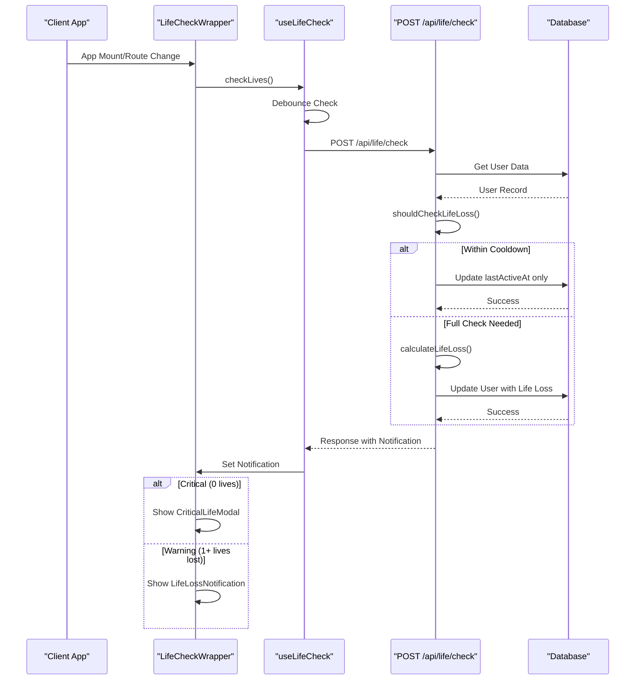

# Health Monitoring API

<cite>
**Referenced Files in This Document**   
- [route.ts](file://app/api/life/check/route.ts)
- [lifeSystem.ts](file://lib/gamification/lifeSystem.ts)
- [LifeCheckWrapper.tsx](file://components/LifeCheckWrapper.tsx)
- [useLifeCheck.ts](file://hooks/useLifeCheck.ts)
- [CriticalLifeModal.tsx](file://components/CriticalLifeModal.tsx)
- [LifeLossNotification.tsx](file://components/LifeLossNotification.tsx)
</cite>

## Table of Contents
1. [Introduction](#introduction)
2. [POST /api/life/check - Inactivity-Based Life Loss Calculation](#post-apilifecheck---inactivity-based-life-loss-calculation)
3. [GET /api/life/check - Read-Only Status Retrieval](#get-apilifecheck---read-only-status-retrieval)
4. [Core Calculation Logic in lifeSystem.ts](#core-calculation-logic-in-lifesystemts)
5. [Rate Limiting and Database Write Optimization](#rate-limiting-and-database-write-optimization)
6. [LifeCheckWrapper Integration and User Notifications](#lifecheckwrapper-integration-and-user-notifications)
7. [Notification Types and User Experience](#notification-types-and-user-experience)
8. [Sequence Diagram: Life Check Flow](#sequence-diagram-life-check-flow)
9. [Conclusion](#conclusion)

## Introduction
The Health Monitoring API provides a gamified health system for users' virtual pets based on their journaling activity. The system implements a life-based mechanic where users lose lives when inactive and can restore them by writing entries. This documentation details the two primary endpoints: POST /api/life/check for calculating and updating life status based on inactivity, and GET /api/life/check for retrieving current life status without making updates. The API integrates with the core gamification logic in lib/gamification/lifeSystem.ts and is consumed by the LifeCheckWrapper component to provide user notifications.

**Section sources**
- [route.ts](file://app/api/life/check/route.ts)
- [lifeSystem.ts](file://lib/gamification/lifeSystem.ts)

## POST /api/life/check - Inactivity-Based Life Loss Calculation
The POST endpoint performs the core life loss calculation and updates the user's pet status based on inactivity. When called, it calculates how many lives should be lost due to the user's absence from the application.

The endpoint first retrieves the user's information from the database using their wallet address. It then determines whether a full life loss check should be performed based on the CHECK_COOLDOWN_HOURS rate limiting mechanism. If insufficient time has passed since the last check, the system only updates the user's last active timestamp without performing a full calculation.

When a full check is warranted, the system calculates life loss using the formula: hours after grace period divided by life loss interval. The grace period is 24 hours, during which no lives are lost. After this period, one life is lost for every additional 24 hours of inactivity, up to a maximum of 7 lives.

The endpoint also handles streak reset logic: when a user loses any lives due to inactivity, their current streak is reset to zero. If the current streak was their longest, it is saved before resetting.

**Section sources**
- [route.ts](file://app/api/life/check/route.ts#L1-L145)
- [lifeSystem.ts](file://lib/gamification/lifeSystem.ts#L65-L115)

## GET /api/life/check - Read-Only Status Retrieval
The GET endpoint provides a read-only interface for retrieving the current life status of a user's pet. Unlike the POST endpoint, this endpoint does not update any database records or perform life loss calculations.

This endpoint is designed for display purposes, allowing the frontend to show the user's current pet status without triggering any state changes. It returns key information including lives remaining, last active timestamp, current streak, and longest streak.

The read-only nature of this endpoint makes it suitable for frequent polling or display in multiple locations throughout the application without concern for unintended side effects or excessive database writes.

**Section sources**
- [route.ts](file://app/api/life/check/route.ts#L147-L189)

## Core Calculation Logic in lifeSystem.ts
The core life loss calculation logic is implemented in lib/gamification/lifeSystem.ts, which contains the calculateLifeLoss function. This function takes the user's last active timestamp and current lives as inputs and returns a comprehensive result object.

The calculation follows these steps:
1. Determine total hours inactive by comparing current time with last active timestamp
2. If within the 24-hour grace period, no lives are lost
3. For inactivity beyond the grace period, calculate lives to lose as floor((hoursInactive - 24) / 24)
4. Cap lives lost at the user's current lives (cannot go below zero)
5. Generate appropriate messaging and notification types

The function returns a LifeLossResult object containing:
- livesLost: Number of lives lost in this check
- newLives: Updated lives count after loss
- streakReset: Boolean indicating if the user's streak was reset
- hoursInactive: Total hours since last activity
- shouldNotify: Whether to show a notification
- notificationType: 'warning' or 'critical' based on severity
- message: User-friendly message about the life loss

**Section sources**
- [lifeSystem.ts](file://lib/gamification/lifeSystem.ts#L65-L115)

## Rate Limiting and Database Write Optimization
The system implements several optimization strategies to prevent excessive database writes and ensure efficient operation.

The primary rate limiting mechanism is controlled by the CHECK_COOLDOWN_HOURS constant, set to 1 hour. This prevents full life loss calculations from occurring too frequently. When a user accesses the application within this cooldown period, the system only updates the lastActiveAt field without performing the full calculation.

This optimization significantly reduces database load by avoiding redundant calculations when users are actively using the application. The system still tracks activity for streak purposes but defers the computationally intensive life loss calculation until sufficient time has passed.

Additionally, the useLifeCheck hook implements client-side debouncing with a 30-second interval, preventing rapid successive calls to the API even if multiple route changes occur in quick succession.

**Section sources**
- [route.ts](file://app/api/life/check/route.ts#L45-L58)
- [lifeSystem.ts](file://lib/gamification/lifeSystem.ts#L16)
- [useLifeCheck.ts](file://hooks/useLifeCheck.ts#L75-L85)

## LifeCheckWrapper Integration and User Notifications
The LifeCheckWrapper component serves as the integration point between the life check API and the user interface. It wraps the entire application and automatically handles life checking and notification display.

The wrapper uses the useLifeCheck hook to perform life checks on key events:
- Component mount (initial load)
- Wallet connection
- Route changes
- Midnight crossing detection (via interval check)

When a life check returns a notification, the wrapper conditionally renders the appropriate UI component:
- For critical notifications (0 lives), it displays the CriticalLifeModal
- For warning notifications (1+ lives lost but still alive), it displays the LifeLossNotification toast

The wrapper manages the notification state and provides a clean interface for the rest of the application, abstracting away the complexity of the life check system.

**Section sources**
- [LifeCheckWrapper.tsx](file://components/LifeCheckWrapper.tsx)
- [useLifeCheck.ts](file://hooks/useLifeCheck.ts)

## Notification Types and User Experience
The system differentiates between two types of notifications to provide appropriate user feedback based on the severity of the life loss:

**Critical Notifications** occur when the user's pet reaches 0 lives. These trigger the CriticalLifeModal, which:
- Blocks the user interface (cannot be dismissed without action)
- Displays the number of days inactive
- Shows streak reset information
- Provides a "Write Now" button that navigates to the diary page
- Uses urgent visual styling (red colors, heartbeat animation)

**Warning Notifications** occur when the user loses 1 or more lives but still has at least 1 life remaining. These appear as toast notifications that:
- Auto-dismiss after 5 seconds
- Show the number of lives lost and remaining
- Display a friendly message about the pet missing the user
- Can be manually dismissed with a close button
- Use attention-grabbing but less urgent styling (orange/yellow)

This tiered notification system creates appropriate urgency for critical situations while providing gentle reminders for less severe inactivity.

**Section sources**
- [CriticalLifeModal.tsx](file://components/CriticalLifeModal.tsx)
- [LifeLossNotification.tsx](file://components/LifeLossNotification.tsx)

## Sequence Diagram: Life Check Flow

**Diagram sources**
- [route.ts](file://app/api/life/check/route.ts)
- [useLifeCheck.ts](file://hooks/useLifeCheck.ts)
- [LifeCheckWrapper.tsx](file://components/LifeCheckWrapper.tsx)
- [lifeSystem.ts](file://lib/gamification/lifeSystem.ts)

## Conclusion
The Health Monitoring API provides a robust system for tracking user engagement through a gamified pet health mechanic. The POST endpoint handles the core life loss calculation with intelligent rate limiting to prevent excessive database writes, while the GET endpoint provides read-only access for display purposes. The system integrates seamlessly with the frontend through the LifeCheckWrapper component, which manages notifications and user experience. The tiered notification system (critical vs. warning) ensures appropriate urgency based on the severity of inactivity, encouraging consistent user engagement with the application.

**Section sources**
- [route.ts](file://app/api/life/check/route.ts)
- [lifeSystem.ts](file://lib/gamification/lifeSystem.ts)
- [LifeCheckWrapper.tsx](file://components/LifeCheckWrapper.tsx)