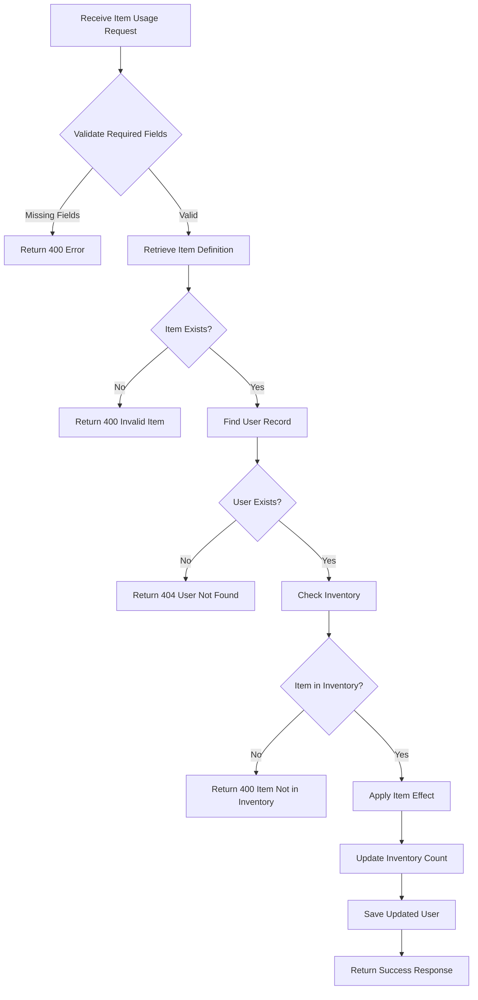
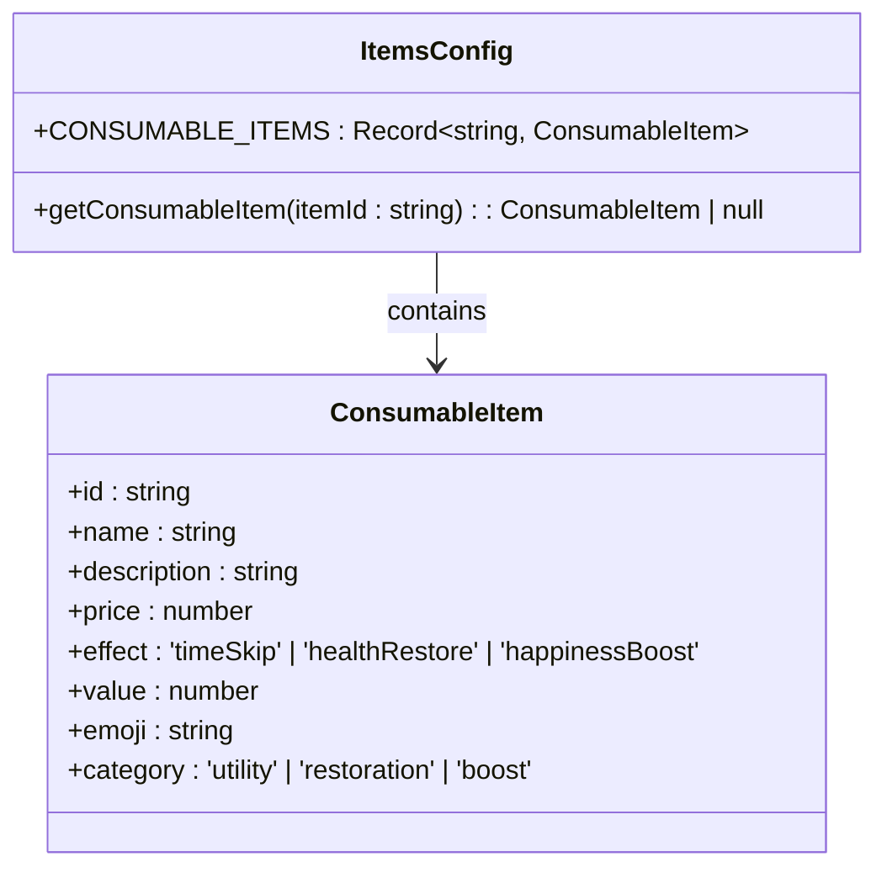
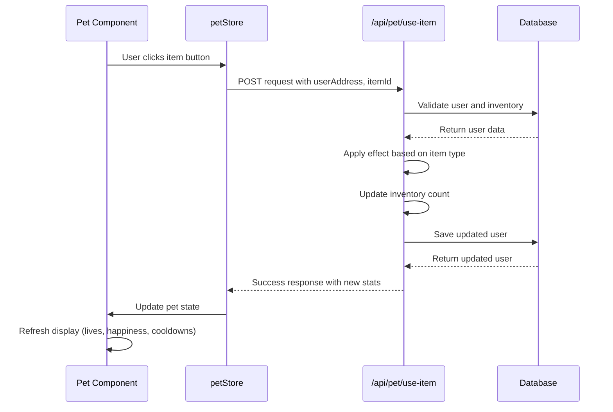
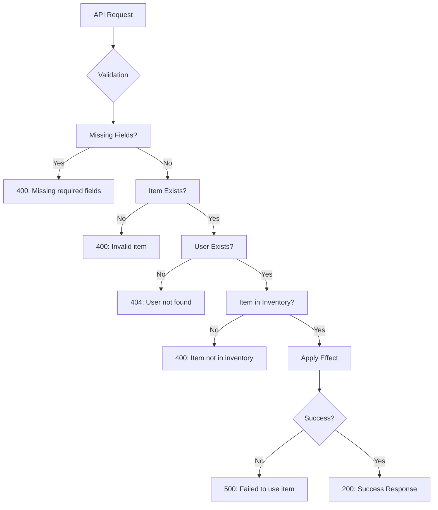

# Item Usage API

<cite>
**Referenced Files in This Document**   
- [use-item/route.ts](file://app/api/pet/use-item/route.ts)
- [itemsConfig.ts](file://lib/gamification/itemsConfig.ts)
- [petStore.ts](file://lib/stores/petStore.ts)
- [Pet.tsx](file://components/Pet.tsx)
</cite>

## Table of Contents
1. [Introduction](#introduction)
2. [Item Effect Types](#item-effect-types)
3. [Inventory Validation and Item Consumption](#inventory-validation-and-item-consumption)
4. [Effect Application Logic](#effect-application-logic)
5. [Item Configuration and Definitions](#item-configuration-and-definitions)
6. [State Synchronization and UI Integration](#state-synchronization-and-ui-integration)
7. [API Usage Examples](#api-usage-examples)
8. [Error Handling](#error-handling)

## Introduction
The POST /api/pet/use-item endpoint enables users to consume items from their inventory to apply various effects to their pet. This API integrates with the gamification system to provide utility, restoration, and boost effects through consumable items. The endpoint validates inventory ownership, applies item effects, updates user state, and synchronizes changes across the application.

**Section sources**
- [use-item/route.ts](file://app/api/pet/use-item/route.ts#L1-L97)

## Item Effect Types
The item usage system supports three distinct effect types, each providing unique benefits to the pet:

### timeSkip
The timeSkip effect resets both feed and play cooldowns, allowing immediate interaction with the pet. When used, this effect sets the lastFeedTime and lastPlayTime to null in the database, effectively removing any time-based restrictions on these actions.

### healthRestore
The healthRestore effect increases the pet's lives by a specified value. The system enforces a maximum of 7 lives, ensuring the pet cannot exceed this limit. This effect is particularly valuable for recovering from life loss due to inactivity.

### happinessBoost
The happinessBoost effect increases the pet's happiness level by a specified value. The system enforces a maximum happiness of 100, preventing values from exceeding this cap. Higher happiness levels contribute to a healthier pet state and more positive interactions.

**Section sources**
- [use-item/route.ts](file://app/api/pet/use-item/route.ts#L50-L78)
- [itemsConfig.ts](file://lib/gamification/itemsConfig.ts#L100-L130)

## Inventory Validation and Item Consumption
The API implements a robust inventory validation and consumption system to ensure proper item usage mechanics.

### Inventory Validation
Before applying any effects, the system validates that:
- The user has the requested item in their inventory
- The item count is greater than zero
- The user exists in the database

The validation process retrieves the user's inventory as a key-value object where keys are item IDs and values are quantities. If the requested item ID doesn't exist in the inventory or has a count of zero, the system returns an "Item not in inventory" error.

### Item Consumption Mechanics
After successful validation and effect application, the system decrements the item count in the user's inventory:
- Creates a copy of the current inventory object
- Decreases the count of the used item by one
- Removes the item from the inventory object entirely if the count reaches zero
- Updates the user record with the modified inventory

This consumption model ensures items are properly tracked and depleted as they are used.



**Diagram sources**
- [use-item/route.ts](file://app/api/pet/use-item/route.ts#L1-L97)

**Section sources**
- [use-item/route.ts](file://app/api/pet/use-item/route.ts#L30-L45)
- [use-item/route.ts](file://app/api/pet/use-item/route.ts#L80-L90)

## Effect Application Logic
The effect application system uses a switch-based logic structure to handle different item effect types efficiently.

### Switch-Based Effect Handling
The system implements a switch statement on the item.effect property to determine which effect to apply:
- For timeSkip: Resets lastFeedTime and lastPlayTime to null
- For healthRestore: Increases livesRemaining up to the MAX_LIVES limit
- For happinessBoost: Increases happiness up to the MAX_HAPPINESS limit

Each case in the switch statement modifies the updates object with the appropriate changes, which are then applied to the user record in a single database operation.

### State Updates
The system applies all changes in a single atomic update operation to ensure data consistency. The updates object includes:
- lastActiveAt timestamp
- Effect-specific changes (lives, happiness, or cooldowns)
- Modified inventory
All these changes are applied simultaneously through Prisma's update method.

**Section sources**
- [use-item/route.ts](file://app/api/pet/use-item/route.ts#L79-L90)

## Item Configuration and Definitions
Consumable items are defined in a centralized configuration file that provides a structured approach to item management.

### Item Configuration Structure
The itemsConfig.ts file defines consumable items through the CONSUMABLE_ITEMS constant, which is a record of item objects with the following properties:
- id: Unique identifier for the item
- name: Display name
- description: Effect description
- price: Cost in DIARY tokens
- effect: Type of effect (timeSkip, healthRestore, happinessBoost)
- value: Magnitude of the effect
- emoji: Visual representation
- category: Classification (utility, restoration, boost)

### Item Definition Examples
The system includes predefined consumable items:
- Time Skip Potion (time-skip): Resets cooldowns
- Health Potion (health-potion): Restores 3 lives
- Happy Pill (happy-pill): Increases happiness by 30 points

The getConsumableItem function provides a safe way to retrieve item definitions by ID, returning null if the item doesn't exist.



**Diagram sources**
- [itemsConfig.ts](file://lib/gamification/itemsConfig.ts#L100-L130)

**Section sources**
- [itemsConfig.ts](file://lib/gamification/itemsConfig.ts#L80-L130)

## State Synchronization and UI Integration
The system maintains consistent state between the backend API and frontend UI components through proper state management.

### Pet Store Integration
The usePetStore Zustand store manages the pet's state on the client side, including:
- Lives and happiness levels
- Feed and play cooldowns
- Pet animation state
When an item is used successfully, the UI components update to reflect the changes in real-time.

### UI Component Response
The Pet component listens for state changes and updates the display accordingly:
- Updates the lives display (♥ icons)
- Refreshes the happiness bar
- Modifies cooldown timers
- Changes pet animation state based on current status
The component also handles optimistic updates, providing immediate visual feedback while waiting for API confirmation.



**Diagram sources**
- [petStore.ts](file://lib/stores/petStore.ts#L13-L40)
- [Pet.tsx](file://components/Pet.tsx#L24-L386)

**Section sources**
- [petStore.ts](file://lib/stores/petStore.ts#L13-L40)
- [Pet.tsx](file://components/Pet.tsx#L24-L386)

## API Usage Examples
The following examples demonstrate proper usage of the item usage endpoint.

### Successful Item Usage
```json
Request:
POST /api/pet/use-item
{
  "userAddress": "0x123abc...",
  "itemId": "health-potion"
}

Response:
{
  "success": true,
  "itemUsed": "Health Potion",
  "effect": "healthRestore",
  "newLives": 5,
  "newHappiness": 70,
  "inventory": {
    "health-potion": 2,
    "happy-pill": 1
  },
  "message": "Used Health Potion! Instantly restore 3 lives"
}
```

### Multiple Item Types
Using a timeSkip potion:
```json
{
  "userAddress": "0x123abc...",
  "itemId": "time-skip"
}
```

Using a happiness boost item:
```json
{
  "userAddress": "0x123abc...",
  "itemId": "happy-pill"
}
```

**Section sources**
- [use-item/route.ts](file://app/api/pet/use-item/route.ts#L90-L96)

## Error Handling
The API implements comprehensive error handling to provide clear feedback for various failure scenarios.

### Validation Errors
The system returns specific error messages for different validation failures:
- Missing required fields: Returns 400 with "Missing required fields"
- Invalid item: Returns 400 with "Invalid item"
- User not found: Returns 404 with "User not found"
- Item not in inventory: Returns 400 with "Item not in inventory"

### Server Errors
For unexpected issues, the system catches exceptions and returns a 500 status with:
- A generic "Failed to use item" message
- Detailed error information when available
- Proper error logging for debugging

The error handling ensures users receive meaningful feedback while protecting system details from exposure.



**Diagram sources**
- [use-item/route.ts](file://app/api/pet/use-item/route.ts#L10-L45)
- [use-item/route.ts](file://app/api/pet/use-item/route.ts#L97-L107)

**Section sources**
- [use-item/route.ts](file://app/api/pet/use-item/route.ts#L10-L45)
- [use-item/route.ts](file://app/api/pet/use-item/route.ts#L97-L107)