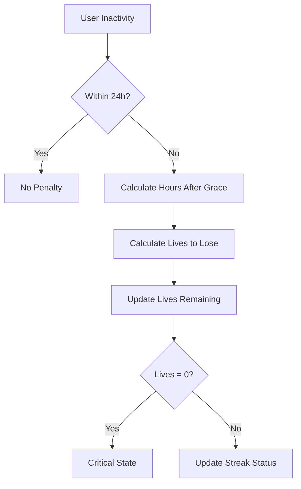
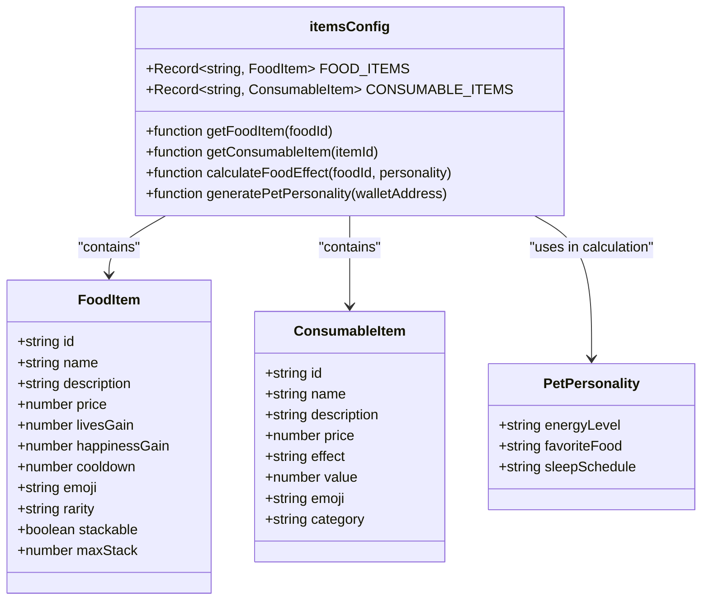
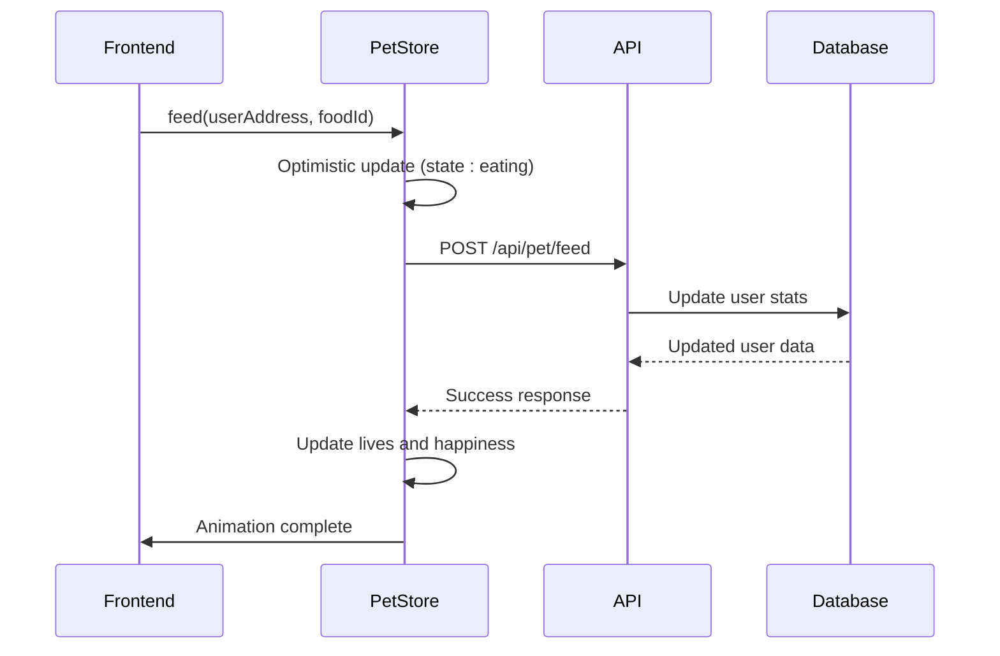
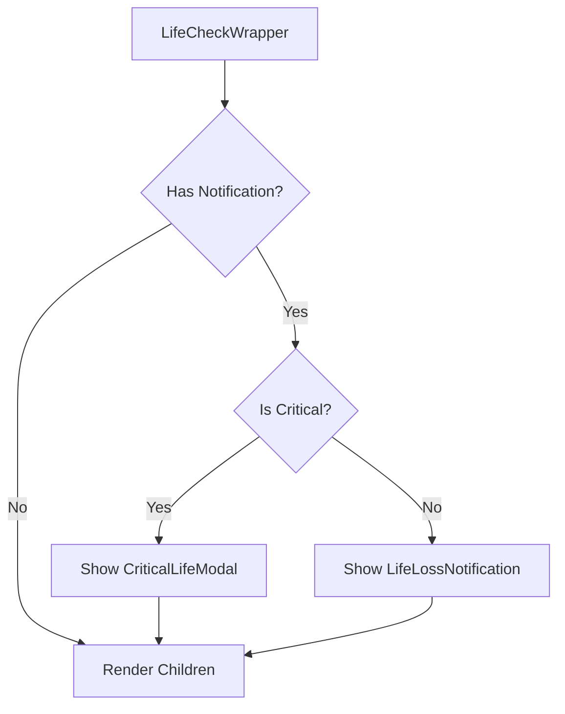
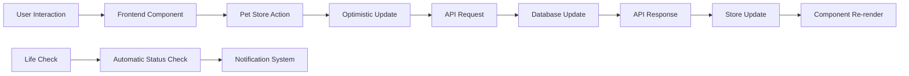

# Pet Interaction API

<cite>
**Referenced Files in This Document**   
- [app/api/pet/feed/route.ts](file://app/api/pet/feed/route.ts)
- [app/api/pet/play/route.ts](file://app/api/pet/play/route.ts)
- [app/api/pet/use-item/route.ts](file://app/api/pet/use-item/route.ts)
- [app/api/life/check/route.ts](file://app/api/life/check/route.ts)
- [lib/gamification/lifeSystem.ts](file://lib/gamification/lifeSystem.ts)
- [lib/stores/petStore.ts](file://lib/stores/petStore.ts)
- [components/Pet.tsx](file://components/Pet.tsx)
- [lib/gamification/itemsConfig.ts](file://lib/gamification/itemsConfig.ts)
- [components/FoodSelectModal.tsx](file://components/FoodSelectModal.tsx)
- [components/LifeCheckWrapper.tsx](file://components/LifeCheckWrapper.tsx)
</cite>

## Table of Contents
1. [Introduction](#introduction)
2. [API Endpoints](#api-endpoints)
3. [Gamification System Integration](#gamification-system-integration)
4. [State Management and Synchronization](#state-management-and-synchronization)
5. [Frontend Interaction and Animation](#frontend-interaction-and-animation)
6. [Error Handling](#error-handling)
7. [Real-Time State Consistency](#real-time-state-consistency)
8. [Conclusion](#conclusion)

## Introduction
The Pet Interaction API manages virtual pet behavior and gamification state in the DiaryBeast application. This API enables users to interact with their virtual pets through feeding, playing, and using cosmetic items, while maintaining health status through an automated life system. The system integrates with blockchain-based user accounts and implements cooldown periods, inventory validation, and personality-based effects to create an engaging gamified experience.

**Section sources**
- [app/api/pet/feed/route.ts](file://app/api/pet/feed/route.ts#L1-L127)
- [app/api/pet/play/route.ts](file://app/api/pet/play/route.ts#L1-L74)
- [app/api/pet/use-item/route.ts](file://app/api/pet/use-item/route.ts#L1-L97)
- [app/api/life/check/route.ts](file://app/api/life/check/route.ts#L1-L145)

## API Endpoints

### Feed Pet Endpoint
The `POST /api/pet/feed` endpoint allows users to feed their virtual pet with food items from their inventory.

**Request Parameters**
```json
{
  "userAddress": "string",
  "foodId": "string (optional, defaults to 'basic-kibble')"
}
```

**Validation and Business Logic**
- Validates user address presence
- Checks if the specified food item exists in the catalog
- Verifies the user owns the requested food item in their inventory
- Enforces cooldown periods based on food type (8 hours for basic kibble, 6 hours for premium items)
- Prevents feeding when pet is already at maximum health (7 lives)

**Response**
```json
{
  "success": true,
  "newLives": 5,
  "newHappiness": 75,
  "inventory": {
    "basic-kibble": 2
  },
  "livesGain": 1,
  "happinessGain": 0,
  "foodUsed": "Basic Kibble",
  "foodRemaining": 2,
  "isFavorite": false,
  "message": "Fed pet Basic Kibble! Lives: 5/7"
}
```

When a pet is fed its favorite food, the effect is doubled (2x lives and happiness gain) with a special message indicating the bonus effect.

**Section sources**
- [app/api/pet/feed/route.ts](file://app/api/pet/feed/route.ts#L12-L126)

### Play with Pet Endpoint
The `POST /api/pet/play` endpoint enables users to play a mini-game with their virtual pet.

**Request Parameters**
```json
{
  "userAddress": "string"
}
```

**Validation and Business Logic**
- Validates user address presence
- Checks if the pet's happiness is already at maximum (100%)
- Enforces a 4-hour cooldown period between play sessions
- Increases pet happiness by 10 points (capped at 100)

**Response**
```json
{
  "success": true,
  "newHappiness": 65,
  "newLives": 5,
  "message": "Played with pet! Happiness increased to 65/100"
}
```

**Section sources**
- [app/api/pet/play/route.ts](file://app/api/pet/play/route.ts#L10-L73)

### Use Cosmetic Item Endpoint
The `POST /api/pet/use-item` endpoint applies cosmetic or utility items to the pet.

**Request Parameters**
```json
{
  "userAddress": "string",
  "itemId": "string"
}
```

**Item Effects**
- **Time Skip Potion**: Resets feed and play cooldowns
- **Health Potion**: Restores 3 lives (capped at maximum of 7)
- **Happy Pill**: Increases happiness by 30 points (capped at 100)

**Validation and Business Logic**
- Validates both user address and item ID presence
- Checks if the user owns the specified item in their inventory
- Decrements the item count in inventory after use
- Removes the item from inventory when count reaches zero

**Response**
```json
{
  "success": true,
  "itemUsed": "Time Skip Potion",
  "effect": "timeSkip",
  "newLives": 5,
  "newHappiness": 65,
  "inventory": {
    "time-skip": 0
  },
  "message": "Used Time Skip Potion! Instantly reset feed and play cooldowns"
}
```

**Section sources**
- [app/api/pet/use-item/route.ts](file://app/api/pet/use-item/route.ts#L14-L96)

### Life Status Check Endpoint
The `POST /api/life/check` endpoint verifies pet health status and applies life loss based on inactivity.

**Request Parameters**
```json
{
  "userAddress": "string"
}
```

**GET Alternative**
The endpoint also supports GET requests for display purposes only:
`GET /api/life/check?userAddress=0x...`

**Life Loss Calculation**
- 24-hour grace period with no penalties
- After grace period: 1 life lost per 24 hours of inactivity
- Maximum of 7 lives can be lost (pet dies at 0 lives)
- Streak is reset when any lives are lost

**Response**
```json
{
  "livesLost": 1,
  "newLives": 4,
  "streakReset": false,
  "shouldNotify": true,
  "notificationType": "warning",
  "message": "Your pet missed you! Lost 1 life",
  "hoursInactive": 48
}
```

**Section sources**
- [app/api/life/check/route.ts](file://app/api/life/check/route.ts#L14-L144)

## Gamification System Integration

### Life System
The life system manages pet health based on user activity patterns, implementing a progressive penalty system for inactivity.

**Core Constants**
- `GRACE_PERIOD_HOURS = 24`: No penalties within the first 24 hours of inactivity
- `LIFE_LOSS_INTERVAL_HOURS = 24`: 1 life lost per 24 hours after grace period
- `MAX_LIVES = 7`: Maximum health points for the pet
- `CHECK_COOLDOWN_HOURS = 1`: Minimum time between full life checks

**Life Loss Calculation**
The system calculates life loss using the formula:
- hoursInactive = current time - lastActiveAt
- hoursAfterGrace = hoursInactive - GRACE_PERIOD_HOURS
- livesToLose = floor(hoursAfterGrace / LIFE_LOSS_INTERVAL_HOURS)
- newLives = max(0, currentLives - livesToLose)

**Pet Emotional States**
- **Happy**: 4-7 lives remaining
- **Sad**: 1-3 lives remaining
- **Critical**: 0 lives remaining



**Diagram sources**
- [lib/gamification/lifeSystem.ts](file://lib/gamification/lifeSystem.ts#L40-L115)

**Section sources**
- [lib/gamification/lifeSystem.ts](file://lib/gamification/lifeSystem.ts#L1-L345)

### Food and Item Configuration
The gamification system includes a comprehensive catalog of food and consumable items with various effects.

**Food Items**
| Item | Lives Gain | Happiness Gain | Cooldown | Price (DIARY) |
|------|------------|----------------|----------|---------------|
| Basic Kibble | 1 | 0 | 8h | 5 |
| Premium Meat | 1 | 10 | 6h | 20 |
| Veggie Bowl | 1 | 20 | 6h | 15 |
| Energy Drink | 2 | 30 | 8h | 50 |

**Consumable Items**
| Item | Effect | Value | Price (DIARY) |
|------|--------|-------|---------------|
| Time Skip Potion | Reset cooldowns | 1 | 100 |
| Health Potion | Restore lives | 3 | 150 |
| Happy Pill | Boost happiness | 30 | 50 |

**Pet Personality System**
Each pet has a unique personality with three attributes:
- **Energy Level**: lazy, normal, or hyper
- **Favorite Food**: meat, veggie, kibble, or energy
- **Sleep Schedule**: morning, afternoon, or night

When a pet is fed its favorite food, the effect is doubled (2x lives and happiness gain).



**Diagram sources**
- [lib/gamification/itemsConfig.ts](file://lib/gamification/itemsConfig.ts#L10-L233)

**Section sources**
- [lib/gamification/itemsConfig.ts](file://lib/gamification/itemsConfig.ts#L1-L233)

## State Management and Synchronization

### Pet Store
The pet state is managed using Zustand, providing a centralized store for pet-related data and actions.

**Store State**
```typescript
interface PetStoreState {
  lives: number;
  happiness: number;
  state: PetState;
  lastFeedTime: Date | null;
  lastPlayTime: Date | null;
  canFeed: boolean;
  canPlay: boolean;
  feedCooldownRemaining: number;
  playCooldownRemaining: number;
}
```

**Key Actions**
- **initializePet**: Syncs store state with server data
- **feed**: Handles feeding logic with API integration
- **play**: Manages play interaction with backend
- **updateCooldowns**: Calculates remaining cooldown times

The store implements optimistic updates, immediately reflecting changes in the UI while waiting for API confirmation, and reverts on error.



**Diagram sources**
- [lib/stores/petStore.ts](file://lib/stores/petStore.ts#L42-L220)

**Section sources**
- [lib/stores/petStore.ts](file://lib/stores/petStore.ts#L1-L234)

## Frontend Interaction and Animation

### Pet Component
The main Pet component renders the virtual pet and handles user interactions.

**Props**
```typescript
interface PetProps {
  animal: 'cat' | 'dog';
  livesRemaining: number;
  petName?: string;
  happiness?: number;
  lastFeedTime?: string | null;
  lastPlayTime?: string | null;
  inventory?: Record<string, number>;
  petPersonality?: any;
  onStatsChange?: () => void;
}
```

**Animation State Priority**
1. Action states (eating, playing) from pet store
2. Critical state (0 lives)
3. Music state (dancing when music plays)
4. Sleep state (inactive >12 hours)
5. Mood-based states (based on happiness and lives)
6. Idle state (default)

**Section sources**
- [components/Pet.tsx](file://components/Pet.tsx#L24-L386)

### Food Selection Modal
The FoodSelectModal component allows users to choose which food to feed their pet from their inventory.

**Features**
- Displays only food items currently in inventory
- Highlights favorite foods with special indicators
- Shows effect values (lives and happiness gain)
- Indicates cooldown periods
- Shows current inventory count

**Section sources**
- [components/FoodSelectModal.tsx](file://components/FoodSelectModal.tsx#L1-L133)

### Life Check Wrapper
The LifeCheckWrapper component handles automatic life checking and displays appropriate notifications.

**Components**
- **ToastContainer**: Manages notifications
- **CriticalLifeModal**: Displayed when pet reaches 0 lives
- **LifeLossNotification**: Shows warning toast for life loss



**Diagram sources**
- [components/LifeCheckWrapper.tsx](file://components/LifeCheckWrapper.tsx#L20-L58)

**Section sources**
- [components/LifeCheckWrapper.tsx](file://components/LifeCheckWrapper.tsx#L1-L59)

## Error Handling

### API Error Responses
All API endpoints follow a consistent error response format:

```json
{
  "error": "Error message",
  "details": "Additional error details"
}
```

**Common Error Scenarios**
- **400 Bad Request**: Missing required fields, invalid food/item, pet at maximum health/happiness
- **404 Not Found**: User not found
- **429 Too Many Requests**: Action on cooldown
- **500 Internal Server Error**: Unexpected server errors

### Frontend Error Handling
The frontend implements comprehensive error handling with user-friendly messages:

**Pet Store Error Handling**
- Reverts optimistic updates on API failure
- Maintains previous state values
- Preserves cooldown status
- Displays error alerts to users

**Feed and Play Actions**
- Prevents duplicate actions during processing
- Validates action eligibility before API calls
- Provides clear error messages for common issues (no food, cooldown, max stats)

**Section sources**
- [app/api/pet/feed/route.ts](file://app/api/pet/feed/route.ts#L110-L126)
- [app/api/pet/play/route.ts](file://app/api/pet/play/route.ts#L62-L73)
- [app/api/pet/use-item/route.ts](file://app/api/pet/use-item/route.ts#L85-L96)
- [lib/stores/petStore.ts](file://lib/stores/petStore.ts#L100-L115)

## Real-Time State Consistency

### Synchronization Strategy
The system maintains real-time state consistency between frontend and backend through a combination of techniques:

**Optimistic Updates**
- UI updates immediately on user action
- API call runs in background
- Rollback on failure
- Provides responsive user experience

**Periodic Sync**
- Pet store updates cooldowns every minute
- LifeCheckWrapper automatically checks life status
- Inventory and stats refreshed after successful actions

**Event-Driven Updates**
- `onStatsChange` callback triggers data refresh
- Zustand store updates propagate to all subscribers
- React components re-render automatically

### Data Flow


**Section sources**
- [lib/stores/petStore.ts](file://lib/stores/petStore.ts#L42-L220)
- [components/Pet.tsx](file://components/Pet.tsx#L24-L386)
- [components/LifeCheckWrapper.tsx](file://components/LifeCheckWrapper.tsx#L20-L58)

## Conclusion
The Pet Interaction API provides a comprehensive system for managing virtual pet behavior and gamification state. By integrating feeding, playing, and item usage with a sophisticated life system, the API creates an engaging user experience that encourages regular interaction. The system's robust validation, cooldown management, and personality-based mechanics add depth to the gameplay, while the real-time state synchronization ensures a seamless experience between frontend and backend. The modular design allows for easy extension with new items, effects, and interaction types, making it a flexible foundation for the gamification features in DiaryBeast.