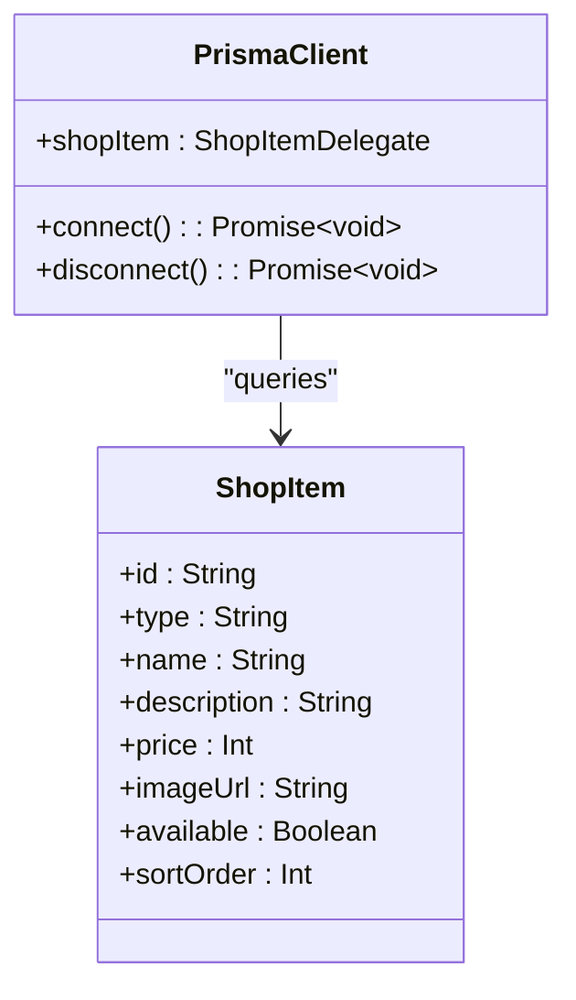
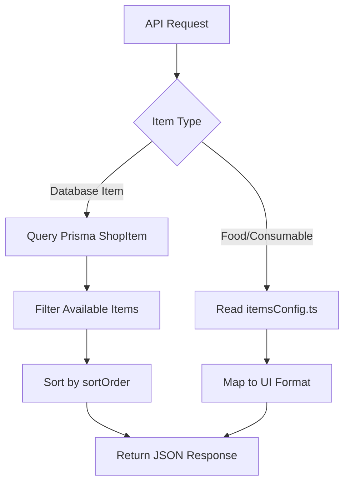
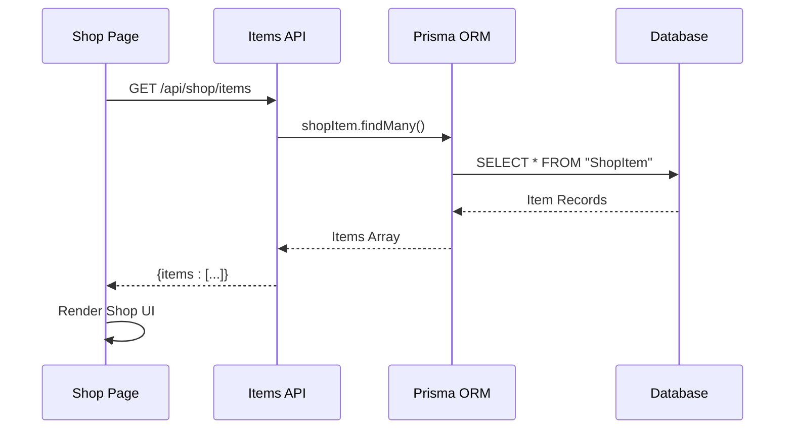

# Item Catalog

<cite>
**Referenced Files in This Document**   
- [app/api/shop/items/route.ts](file://app/api/shop/items/route.ts)
- [lib/gamification/itemsConfig.ts](file://lib/gamification/itemsConfig.ts)
- [app/shop/page.tsx](file://app/shop/page.tsx)
- [prisma/schema.prisma](file://prisma/schema.prisma)
- [lib/prisma.ts](file://lib/prisma.ts)
</cite>

## Table of Contents
1. [Introduction](#introduction)
2. [API Endpoint Overview](#api-endpoint-overview)
3. [Database Integration with Prisma](#database-integration-with-prisma)
4. [Response Structure and Data Flow](#response-structure-and-data-flow)
5. [Item Configuration and Frontend Integration](#item-configuration-and-frontend-integration)
6. [Error Handling](#error-handling)
7. [Frontend Consumption and UI Rendering](#frontend-consumption-and-ui-rendering)
8. [Sequence Diagram](#sequence-diagram)

## Introduction
The Item Catalog API endpoint provides a mechanism to retrieve all available shop items for the DiaryBeast application. This document details the implementation of the GET method in the `/api/shop/items` route, which integrates with Prisma ORM to query the database and deliver a structured response. The system combines persistent data from the database with dynamic configuration from the `itemsConfig.ts` file to support both static shop items and gamification elements such as food and consumables.

## API Endpoint Overview
The GET method at `app/api/shop/items/route.ts` serves as the primary interface for retrieving shop items. It returns a JSON response containing all active items sorted by their display order. The endpoint filters results to include only items where the `available` field is set to `true`, ensuring that out-of-stock or disabled items are not presented to users.

The API is designed to be simple and efficient, focusing solely on retrieval without requiring authentication or parameters. This allows the frontend to load the shop catalog quickly and reliably during user navigation.

**Section sources**
- [app/api/shop/items/route.ts](file://app/api/shop/items/route.ts#L3-L18)

## Database Integration with Prisma
The endpoint leverages Prisma ORM to interact with the PostgreSQL database. The `prisma.shopItem.findMany()` method is used to retrieve records from the `ShopItem` model defined in the Prisma schema. Two key query modifiers are applied:

- **Filtering**: The `where: { available: true }` condition ensures only active items are returned
- **Sorting**: The `orderBy: { sortOrder: 'asc' }` directive arranges items based on their predefined display order

The Prisma client is imported from `@/lib/prisma`, which implements a singleton pattern to optimize database connections in production environments. This setup prevents connection leaks and improves performance under high load.

**Diagram sources**
- [prisma/schema.prisma](file://prisma/schema.prisma#L108-L117)
- [lib/prisma.ts](file://lib/prisma.ts#L6-L6)

**Section sources**
- [app/api/shop/items/route.ts](file://app/api/shop/items/route.ts#L3-L18)
- [lib/prisma.ts](file://lib/prisma.ts#L6-L6)

## Response Structure and Data Flow
The API returns a standardized JSON response containing an array of shop items. Each item includes the following properties:
- `id`: Unique identifier for the item
- `type`: Category of the item (e.g., background, accessory)
- `name`: Display name
- `description`: Item description
- `price`: Cost in DIARY tokens
- `imageUrl`: Path to the item's visual representation

The response structure is minimal, containing only the `items` array at the top level. This design simplifies parsing on the frontend and aligns with REST API best practices.

In cases where the database query fails, the endpoint catches the error and returns a 500 Internal Server Error with a generic error message to prevent exposure of sensitive system details.

**Section sources**
- [app/api/shop/items/route.ts](file://app/api/shop/items/route.ts#L3-L18)

## Item Configuration and Frontend Integration
While the API retrieves basic item data from the database, additional item definitions for food and consumable items are sourced from `lib/gamification/itemsConfig.ts`. This configuration file defines two main categories:

- **Food Items**: Includes properties like `livesGain`, `happinessGain`, and `cooldown` that affect pet care mechanics
- **Consumable Items**: Defines special effects such as time skipping, health restoration, and happiness boosts

These configurations are not stored in the database but are instead compiled into the application bundle. This approach allows for easy modification of game mechanics without requiring database migrations.

The frontend combines data from both sources: using the API response for general shop items (backgrounds, accessories) and the configuration file for gamification items. This hybrid approach enables flexible pricing and availability control through the database while maintaining complex game logic in code.

**Diagram sources**
- [lib/gamification/itemsConfig.ts](file://lib/gamification/itemsConfig.ts#L1-L233)
- [app/api/shop/items/route.ts](file://app/api/shop/items/route.ts#L3-L18)

**Section sources**
- [lib/gamification/itemsConfig.ts](file://lib/gamification/itemsConfig.ts#L1-L233)

## Error Handling
The endpoint implements robust error handling to ensure reliability. All database operations are wrapped in a try-catch block that intercepts any exceptions during query execution. When an error occurs:

1. The error is logged to the server console with the message "Get shop items error:"
2. A 500 Internal Server Error response is returned to the client
3. The response body contains a generic error message: "Failed to fetch items"

This approach prevents the exposure of sensitive database errors to clients while still providing enough information for server-side debugging. The error handling is designed to fail gracefully, ensuring that the shop interface remains functional even when the item catalog cannot be loaded.

**Section sources**
- [app/api/shop/items/route.ts](file://app/api/shop/items/route.ts#L3-L18)

## Frontend Consumption and UI Rendering
The frontend component `app/shop/page.tsx` consumes the Item Catalog API to render the shop interface. During initialization, it makes a fetch request to `/api/shop/items` as part of its `loadData()` function, which runs when the user navigates to the shop.

The retrieved items are stored in the component's state and used to populate the UI based on the active tab (food, consumables, or animals). For food items, the component enhances the basic item data with additional properties from `itemsConfig.ts`, such as emoji representations and ASCII art.

The UI implements several key features:
- Quantity selection for stackable items
- Balance checking before purchase
- Real-time inventory updates
- Visual feedback during network operations

When a user purchases an item, the frontend updates its local state by calling `loadData()` again, ensuring synchronization with the server.

**Section sources**
- [app/shop/page.tsx](file://app/shop/page.tsx#L36-L84)
- [app/shop/page.tsx](file://app/shop/page.tsx#L86-L128)

## Sequence Diagram

**Diagram sources**
- [app/api/shop/items/route.ts](file://app/api/shop/items/route.ts#L3-L18)
- [app/shop/page.tsx](file://app/shop/page.tsx#L36-L84)