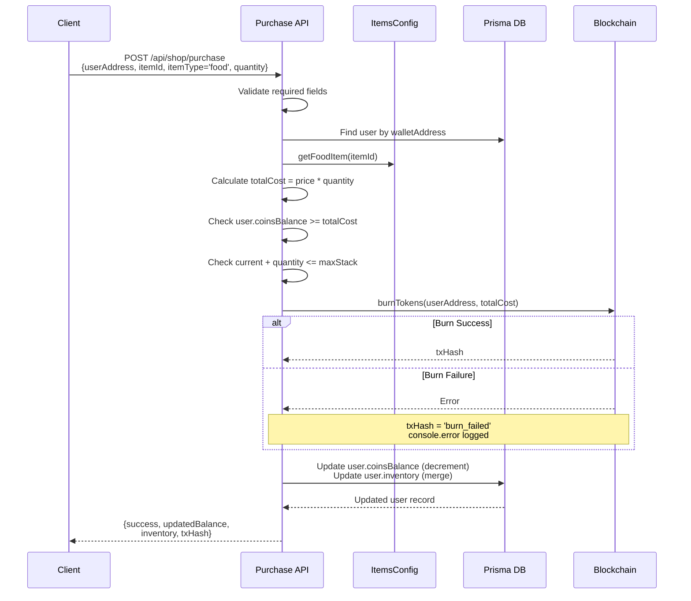

# Food Items Purchase

<cite>
**Referenced Files in This Document**   
- [purchase/route.ts](file://app/api/shop/purchase/route.ts)
- [itemsConfig.ts](file://lib/gamification/itemsConfig.ts)
- [blockchain.ts](file://lib/blockchain.ts)
- [feed/route.ts](file://app/api/pet/feed/route.ts)
</cite>

## Table of Contents
1. [Introduction](#introduction)
2. [Purchase Request Parameters](#purchase-request-parameters)
3. [Food Item Validation and Configuration](#food-item-validation-and-configuration)
4. [Price Calculation and Balance Verification](#price-calculation-and-balance-verification)
5. [Inventory Stack Management](#inventory-stack-management)
6. [Token Burning Process](#token-burning-process)
7. [Inventory Update Mechanism](#inventory-update-mechanism)
8. [Error Handling and Partial Failures](#error-handling-and-partial-failures)
9. [Reconciliation Between On-Chain and Off-Chain State](#reconciliation-between-on-chain-and-off-chain-state)
10. [Integration with Pet Feeding Mechanics](#integration-with-pet-feeding-mechanics)
11. [Purchase Flow Diagram](#purchase-flow-diagram)

## Introduction
This document details the end-to-end purchase flow for stackable food items in the DiaryBeast application, such as Basic Kibble and Premium Meat. It covers the validation, pricing, balance checking, token burning, inventory management, and error resilience mechanisms involved in acquiring food items. The system ensures consistency between on-chain token burns and off-chain inventory updates while supporting gamification features like pet feeding.

**Section sources**
- [purchase/route.ts](file://app/api/shop/purchase/route.ts#L1-L185)
- [itemsConfig.ts](file://lib/gamification/itemsConfig.ts#L1-L234)

## Purchase Request Parameters
The purchase endpoint accepts the following parameters:
- `userAddress`: Wallet address of the user making the purchase
- `itemId`: Unique identifier of the food item (e.g., 'basic-kibble')
- `itemType`: Must be set to 'food' for food items
- `quantity`: Optional integer specifying how many units to buy (defaults to 1 if not provided)

These parameters are validated at the start of the request handling process to ensure all required fields are present before proceeding with business logic.

**Section sources**
- [purchase/route.ts](file://app/api/shop/purchase/route.ts#L4-L10)

## Food Item Validation and Configuration
Food items are validated using the `getFoodItem()` function from `itemsConfig.ts`. This function searches the `FOOD_ITEMS` configuration object by the `id` field (not the object key) to retrieve the correct item. If no matching item is found, a 404 error is returned.

The `FOOD_ITEMS` configuration defines properties for each food type, including name, price, effects, cooldown, and stacking limits. For example:
- **Basic Kibble**: Price 5 DIARY, max stack 99
- **Premium Meat**: Price 20 DIARY, max stack 50

This centralized configuration enables easy updates and consistent behavior across the application.

**Section sources**
- [itemsConfig.ts](file://lib/gamification/itemsConfig.ts#L24-L77)
- [itemsConfig.ts](file://lib/gamification/itemsConfig.ts#L189-L192)

## Price Calculation and Balance Verification
The total cost is calculated by multiplying the unit price of the food item by the requested quantity. For example, purchasing 3 Premium Meat items (priced at 20 DIARY each) results in a total cost of 60 DIARY.

Before proceeding, the system checks whether the user's `coinsBalance` is sufficient to cover the total cost. If not, a 400 error response is returned with details about the required versus available balance.

This ensures that users cannot make purchases exceeding their current token holdings.

**Section sources**
- [purchase/route.ts](file://app/api/shop/purchase/route.ts#L38-L45)

## Inventory Stack Management
The system enforces per-item inventory limits defined in the `maxStack` property of each `FoodItem`. When a purchase is made, the current inventory count for the item is retrieved from the user's `inventory` JSON field.

The new total (current count + purchase quantity) is checked against `maxStack`. If it exceeds the limit, a 400 error is returned. For example, if a user already has 48 Premium Meat items (maxStack 50), they can only purchase up to 2 more.

This prevents inventory overflow and maintains game balance.

**Section sources**
- [purchase/route.ts](file://app/api/shop/purchase/route.ts#L47-L56)

## Token Burning Process
Tokens are burned via the `burnTokens()` function in `blockchain.ts`, which calls the `burnFrom` method on the DiaryToken smart contract. The burn amount is converted to wei (multiplied by 10^18) before submission.

The process is wrapped in a try-catch block to ensure resilience. If the blockchain transaction fails, the error is logged via `console.error`, and `txHash` is set to `'burn_failed'`. Despite the failure, the purchase may still proceed off-chain depending on business rules, ensuring user experience continuity.

This design prioritizes availability while maintaining auditability of failures.

**Section sources**
- [blockchain.ts](file://lib/blockchain.ts#L75-L85)
- [purchase/route.ts](file://app/api/shop/purchase/route.ts#L58-L64)

## Inventory Update Mechanism
Upon successful validation and token burn, the user's inventory is updated by merging the new quantity with existing counts. The `inventory` field is a JSON object where keys are item IDs and values are quantities.

For example, if a user has 5 Basic Kibble and purchases 3 more, the resulting inventory will show 8 for `basic-kibble`. The update is performed using Prisma's `update` operation with a decrement on `coinsBalance` and replacement of the `inventory` object.

This merge strategy supports stackable items and preserves other inventory entries.

**Section sources**
- [purchase/route.ts](file://app/api/shop/purchase/route.ts#L66-L73)

## Error Handling and Partial Failures
The system employs comprehensive error handling:
- Missing fields trigger 400 responses
- Invalid items return 404
- Insufficient funds or stack overflow return 400
- Blockchain failures are caught and logged
- Unhandled exceptions result in 500 errors

Partial failures (e.g., token burn failure) are logged but do not necessarily abort the entire operation, allowing the system to remain functional during temporary network issues.

All errors are logged using `console.error` for monitoring and debugging.

**Section sources**
- [purchase/route.ts](file://app/api/shop/purchase/route.ts#L178-L184)

## Reconciliation Between On-Chain and Off-Chain State
The system maintains consistency between on-chain token balances and off-chain inventory through atomic updates within database transactions. While the token burn occurs on-chain, the inventory update is handled off-chain via Prisma.

In cases where the burn fails but the database update succeeds (or vice versa), the `txHash='burn_failed'` flag enables reconciliation workflows. Admin tools can later audit and correct discrepancies, ensuring long-term consistency.

This hybrid approach balances user experience with financial integrity.

**Section sources**
- [purchase/route.ts](file://app/api/shop/purchase/route.ts#L58-L73)
- [blockchain.ts](file://lib/blockchain.ts#L75-L85)

## Integration with Pet Feeding Mechanics
Purchased food items are consumed through the `/pet/feed` endpoint. Before feeding, the system checks the user's inventory for the selected food item. Only items with a quantity greater than zero can be used.

Feeding applies effects based on the food's `livesGain` and `happinessGain` values, potentially multiplied by 2x if the food matches the pet's `favoriteFood` trait. After feeding, the inventory count is decremented, and if it reaches zero, the item is removed from the inventory object.

This creates a closed-loop economy where purchased items provide tangible gameplay benefits.

**Section sources**
- [feed/route.ts](file://app/api/pet/feed/route.ts#L35-L45)
- [itemsConfig.ts](file://lib/gamification/itemsConfig.ts#L205-L232)

## Purchase Flow Diagram

**Diagram sources**
- [purchase/route.ts](file://app/api/shop/purchase/route.ts#L1-L185)
- [blockchain.ts](file://lib/blockchain.ts#L75-L85)
- [itemsConfig.ts](file://lib/gamification/itemsConfig.ts#L189-L192)