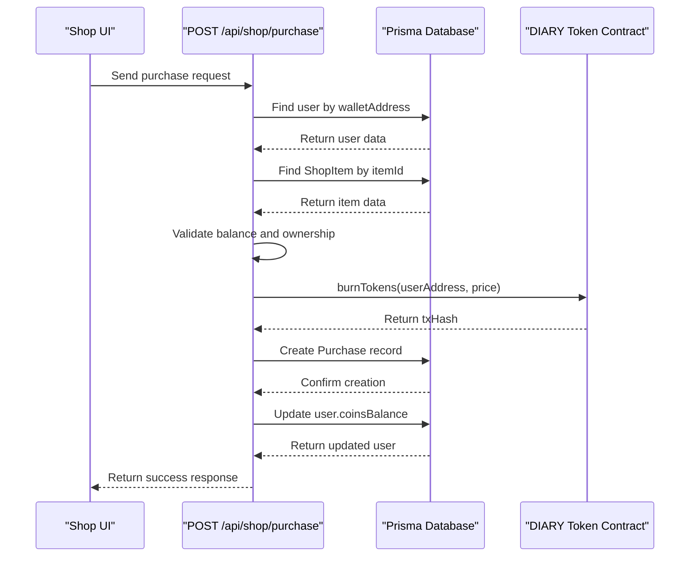
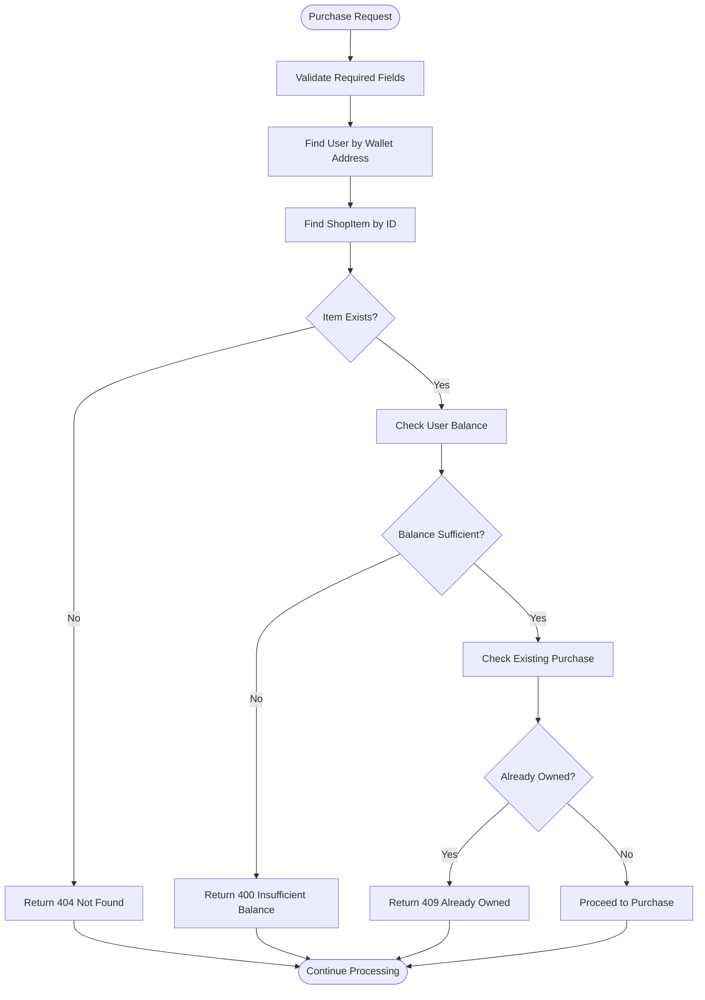
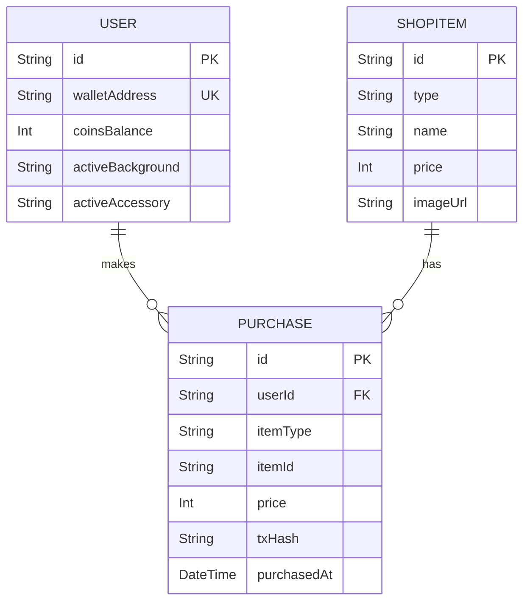
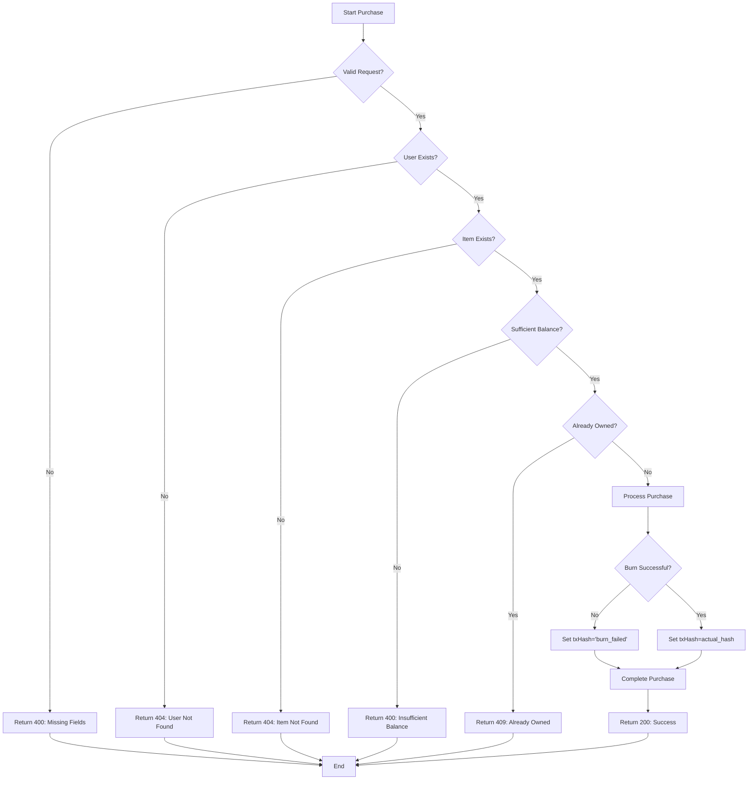

# Regular Items Purchase

<cite>
**Referenced Files in This Document**   
- [app/api/shop/purchase/route.ts](file://app/api/shop/purchase/route.ts)
- [app/shop/page.tsx](file://app/shop/page.tsx)
- [lib/prisma.ts](file://lib/prisma.ts)
- [lib/blockchain.ts](file://lib/blockchain.ts)
- [prisma/schema.prisma](file://prisma/schema.prisma)
- [lib/gamification/itemsConfig.ts](file://lib/gamification/itemsConfig.ts)
</cite>

## Table of Contents
1. [Introduction](#introduction)
2. [Processing Flow](#processing-flow)
3. [Validation Steps](#validation-steps)
4. [Database Transaction Sequence](#database-transaction-sequence)
5. [Routing Logic with itemType and itemId](#routing-logic-with-itemtype-and-itemid)
6. [Request and Response Examples](#request-and-response-examples)
7. [Error Handling](#error-handling)
8. [Blockchain Integration and Failure Handling](#blockchain-integration-and-failure-handling)
9. [UI Integration](#ui-integration)
10. [Conclusion](#conclusion)

## Introduction
The Regular Items Purchase sub-feature enables users to acquire non-consumable shop items such as backgrounds and accessories through the `POST /api/shop/purchase` endpoint. This functionality is integral to the gamification system, allowing users to customize their diary experience by purchasing visual elements using DIARY tokens. The process involves server-side validation, blockchain token burning, and database updates to ensure secure and consistent state management across on-chain and off-chain systems.

**Section sources**
- [app/api/shop/purchase/route.ts](file://app/api/shop/purchase/route.ts#L1-L184)
- [app/shop/page.tsx](file://app/shop/page.tsx#L20-L476)

## Processing Flow
The purchase processing flow for regular items begins when a user submits a purchase request through the shop interface. The request is sent to the `POST /api/shop/purchase` API endpoint with parameters including `userAddress`, `itemId`, `itemType`, and optional `quantity`. The server first validates the presence of required fields and authenticates the user by looking up their wallet address in the database. Once authenticated, the system determines the item type and routes the request accordingly.

For regular shop items like backgrounds and accessories, the system performs a series of validation checks before proceeding with the transaction. These include verifying the item's existence in the `ShopItem` table, confirming the user has sufficient token balance, and checking whether the item has already been purchased by the user. After successful validation, the system initiates a blockchain token burn operation to reduce the user's token balance on-chain, creates a purchase record in the database, and updates the user's remaining coin balance.



**Diagram sources**
- [app/api/shop/purchase/route.ts](file://app/api/shop/purchase/route.ts#L1-L184)
- [lib/blockchain.ts](file://lib/blockchain.ts#L60-L80)
- [prisma/schema.prisma](file://prisma/schema.prisma#L70-L83)

**Section sources**
- [app/api/shop/purchase/route.ts](file://app/api/shop/purchase/route.ts#L1-L184)
- [app/shop/page.tsx](file://app/shop/page.tsx#L106-L142)

## Validation Steps
The validation process for regular item purchases consists of three critical checks that ensure data integrity and prevent invalid transactions. First, the system verifies the existence of the requested item by querying the `ShopItem` table using Prisma's `findUnique` method with the provided `itemId`. This lookup confirms that the item is valid and available for purchase.

Second, ownership verification is performed using the `Purchase` model to prevent duplicate purchases. The system queries for any existing purchase records where both `userId` and `itemId` match the current request. If such a record exists, the system returns a 409 Conflict error with the message "Already owned", ensuring users cannot purchase the same non-consumable item multiple times.

Third, balance validation checks whether the user's `coinsBalance` is sufficient to cover the item's price. This is accomplished by comparing the user's current balance against the item's price field. If the balance is insufficient, the system returns a 400 Bad Request error with the message "Insufficient balance". These validation steps are executed sequentially to ensure all prerequisites are met before proceeding with the transaction.



**Diagram sources**
- [app/api/shop/purchase/route.ts](file://app/api/shop/purchase/route.ts#L1-L184)
- [prisma/schema.prisma](file://prisma/schema.prisma#L70-L83)

**Section sources**
- [app/api/shop/purchase/route.ts](file://app/api/shop/purchase/route.ts#L1-L184)

## Database Transaction Sequence
The database transaction sequence for regular item purchases follows a specific order to maintain data consistency and integrity. After successful validation, the system creates a new purchase record in the `Purchase` table containing key information such as `userId`, `itemType`, `itemId`, `price`, and `txHash`. This record serves as an immutable ledger entry documenting the transaction.

Following the creation of the purchase record, the system updates the user's `coinsBalance` by decrementing it with the item's price value. This update is performed using Prisma's atomic decrement operation, which ensures thread safety and prevents race conditions in concurrent purchase scenarios. The sequence of operations—first creating the purchase record and then updating the balance—ensures that even if the balance update fails, the purchase record will not be created, maintaining referential integrity.

The transaction sequence is designed to be idempotent and resilient to partial failures. Each operation includes appropriate error handling, and the entire process is wrapped in a try-catch block to handle unexpected errors gracefully. In case of failure, the system returns a 500 Internal Server Error response while preserving the original state of the database.



**Diagram sources**
- [prisma/schema.prisma](file://prisma/schema.prisma#L30-L122)
- [app/api/shop/purchase/route.ts](file://app/api/shop/purchase/route.ts#L1-L184)

**Section sources**
- [app/api/shop/purchase/route.ts](file://app/api/shop/purchase/route.ts#L1-L184)
- [prisma/schema.prisma](file://prisma/schema.prisma#L30-L122)

## Routing Logic with itemType and itemId
The routing logic in the purchase system utilizes the `itemType` and `itemId` parameters to determine the appropriate processing path for different categories of purchasable items. The `itemType` parameter acts as a discriminator that routes requests to specialized handlers for food items, consumable items, and regular shop items (backgrounds and accessories).

When `itemType` is set to "food", the system retrieves food item configuration from the `FOOD_ITEMS` constant in `itemsConfig.ts` and processes the purchase with quantity-based calculations and inventory stacking rules. For `itemType` "consumable", the system fetches consumable item data from `CONSUMABLE_ITEMS` and handles single-unit purchases that are added to the user's inventory.

For regular shop items, the system bypasses the configuration-based approach and instead queries the `ShopItem` table directly using Prisma. This allows dynamic management of shop items through database operations rather than code changes. The `itemId` parameter serves as the primary key for lookups in both the static configuration objects and the database tables, ensuring consistent addressing of items across the system.

This routing architecture enables extensibility by allowing new item types to be added without modifying the core purchase logic, promoting separation of concerns between item configuration and transaction processing.

**Section sources**
- [app/api/shop/purchase/route.ts](file://app/api/shop/purchase/route.ts#L1-L184)
- [lib/gamification/itemsConfig.ts](file://lib/gamification/itemsConfig.ts#L1-L233)

## Request and Response Examples
The `POST /api/shop/purchase` endpoint accepts JSON payloads containing purchase parameters. For accessory purchases, a typical request payload includes the user's wallet address, the item identifier, and the item type:

```json
{
  "userAddress": "0x742d35Cc6634C0532925a3b8D4C0cD906E3C9aAa",
  "itemId": "acc-bandana",
  "itemType": "accessory"
}
```

Upon successful processing, the endpoint returns a response containing the updated balance and transaction hash:

```json
{
  "success": true,
  "updatedBalance": 70,
  "txHash": "0x8b71a6b9d2c5e8f4a3b6c7d8e9f0a1b2c3d4e5f6a7b8c9d0e1f2a3b4c5d6e7f8"
}
```

For zero-price items like the default background, the request is similar but results in a purchase without blockchain interaction:

```json
{
  "userAddress": "0x742d35Cc6634C0532925a3b8D4C0cD906E3C9aAa",
  "itemId": "bg-default",
  "itemType": "background"
}
```

The corresponding response omits the `txHash` since no blockchain transaction occurs:

```json
{
  "success": true,
  "updatedBalance": 100,
  "txHash": null
}
```

These examples demonstrate the consistent response structure across different purchase scenarios, facilitating predictable client-side handling.

**Section sources**
- [app/api/shop/purchase/route.ts](file://app/api/shop/purchase/route.ts#L1-L184)
- [TECHNICAL_DOCUMENTATION.md](file://TECHNICAL_DOCUMENTATION.md#L431-L461)

## Error Handling
The system implements comprehensive error handling to manage various failure scenarios during the purchase process. For validation errors, the endpoint returns appropriate HTTP status codes with descriptive messages. When a user attempts to purchase an item they already own, the system returns a 409 Conflict status with the message "Already owned", preventing duplicate purchases of non-consumable items.

Insufficient balance scenarios are handled with a 400 Bad Request response containing the message "Insufficient balance". This error is triggered when the user's `coinsBalance` is less than the item's price, ensuring that purchases cannot overdraft the user's account. The client application uses this information to display appropriate feedback to the user.

Other error cases include missing required fields (400 Bad Request with "Missing required fields"), user not found (404 Not Found with "User not found"), and item not found (404 Not Found with "Item not found"). Server-side exceptions are caught and return a 500 Internal Server Error with "Purchase failed", providing a safety net for unexpected issues while maintaining API contract consistency.



**Diagram sources**
- [app/api/shop/purchase/route.ts](file://app/api/shop/purchase/route.ts#L1-L184)

**Section sources**
- [app/api/shop/purchase/route.ts](file://app/api/shop/purchase/route.ts#L1-L184)

## Blockchain Integration and Failure Handling
The purchase system integrates with the blockchain through the `burnTokens` function from `lib/blockchain.ts`, which interacts with the DIARY token smart contract on the Base Sepolia network. When a user purchases a regular item with a positive price, the system calls `burnTokens(userAddress, item.price)` to reduce the user's token balance on-chain, providing cryptographic proof of the transaction.

For zero-price items, the system bypasses blockchain burning entirely, setting `txHash` to null. This optimization avoids unnecessary gas costs for free items like the default background theme. The conditional burning logic is implemented with `if (item.price > 0)` check, ensuring that only paid items trigger blockchain operations.

In cases where the blockchain burn fails—due to network issues, contract errors, or other factors—the system catches the exception and sets `txHash` to 'burn_failed' while still completing the off-chain purchase. This fault-tolerant design ensures that users can acquire items even during temporary blockchain outages, maintaining application usability. The failed transaction hash is preserved in the database for later reconciliation or auditing purposes.

This hybrid approach balances security with reliability, leveraging blockchain for value transfer verification while maintaining system availability through graceful degradation.

**Section sources**
- [app/api/shop/purchase/route.ts](file://app/api/shop/purchase/route.ts#L1-L184)
- [lib/blockchain.ts](file://lib/blockchain.ts#L60-L80)

## UI Integration
The UI integration for the Regular Items Purchase feature is implemented in the `Shop` component (`app/shop/page.tsx`), which provides a user-friendly interface for browsing and purchasing items. The component displays available shop items in a grid layout, showing key information such as name, description, price, and visual preview.

When a user initiates a purchase, the `handlePurchase` function constructs the appropriate request payload and sends it to the `POST /api/shop/purchases` endpoint. Before making the request, the function performs client-side validation to check if the user has sufficient balance, providing immediate feedback without requiring a server round-trip.

After a successful purchase, the UI updates by calling `loadData()` to refresh the user's inventory and balance information from the server. This ensures that the interface reflects the current state of the user's account. The component also manages purchase state through the `purchasing` state variable, disabling purchase buttons during transaction processing to prevent duplicate submissions.

The UI also integrates with the user's active customizations, allowing them to apply purchased backgrounds and accessories through the `handleApply` function, which updates the user's `activeBackground` or `activeAccessory` fields via the user API endpoint.

**Section sources**
- [app/shop/page.tsx](file://app/shop/page.tsx#L20-L476)
- [app/api/shop/purchase/route.ts](file://app/api/shop/purchase/route.ts#L1-L184)

## Conclusion
The Regular Items Purchase sub-feature provides a robust and secure mechanism for users to acquire non-consumable items such as backgrounds and accessories using DIARY tokens. The system combines server-side validation, database transactions, and blockchain integration to create a reliable purchasing experience. Key aspects include comprehensive validation checks, atomic database operations, conditional blockchain burning, and graceful error handling.

The architecture effectively separates concerns between item configuration, transaction processing, and UI presentation, enabling maintainability and extensibility. By allowing off-chain purchases to proceed even when blockchain operations fail, the system prioritizes user experience while maintaining an audit trail of all transactions. This implementation supports the gamification goals of the application by enabling users to personalize their experience through meaningful token expenditures.