# Shop API

<cite>
**Referenced Files in This Document**   
- [app/api/shop/items/route.ts](file://app/api/shop/items/route.ts)
- [app/api/shop/purchase/route.ts](file://app/api/shop/purchase/route.ts)
- [app/api/shop/purchases/route.ts](file://app/api/shop/purchases/route.ts)
- [lib/gamification/itemsConfig.ts](file://lib/gamification/itemsConfig.ts)
- [lib/blockchain.ts](file://lib/blockchain.ts)
- [app/shop/page.tsx](file://app/shop/page.tsx)
- [prisma/seed.ts](file://prisma/seed.ts)
</cite>

## Table of Contents
1. [Introduction](#introduction)
2. [API Endpoints](#api-endpoints)
3. [Item Configuration](#item-configuration)
4. [Purchase Validation Flow](#purchase-validation-flow)
5. [Request Examples](#request-examples)
6. [Error Responses](#error-responses)
7. [Idempotency and Audit Logging](#idempotency-and-audit-logging)
8. [Integration with Blockchain](#integration-with-blockchain)

## Introduction
The Shop API enables users to interact with virtual items in the DiaryBeast ecosystem. It supports retrieving available items, executing purchases using DIARY tokens, and fetching purchase history. The system integrates with on-chain token balances and maintains state through Prisma-managed database persistence. This document details the three core endpoints: retrieving shop items, processing purchases, and accessing user purchase history.

## API Endpoints

### GET /api/shop/items
Retrieves all available shop items sorted by display priority.

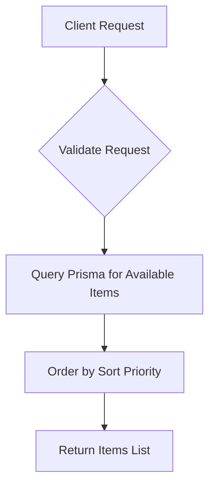

**Section sources**
- [app/api/shop/items/route.ts](file://app/api/shop/items/route.ts#L1-L18)

### POST /api/shop/purchase
Processes a purchase of virtual items using DIARY tokens.

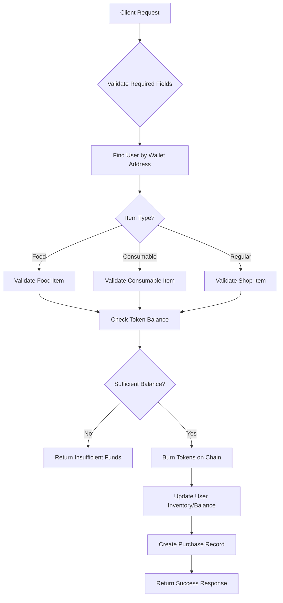

**Section sources**
- [app/api/shop/purchase/route.ts](file://app/api/shop/purchase/route.ts#L1-L184)

### GET /api/shop/purchases
Fetches a user's purchase history based on wallet address.

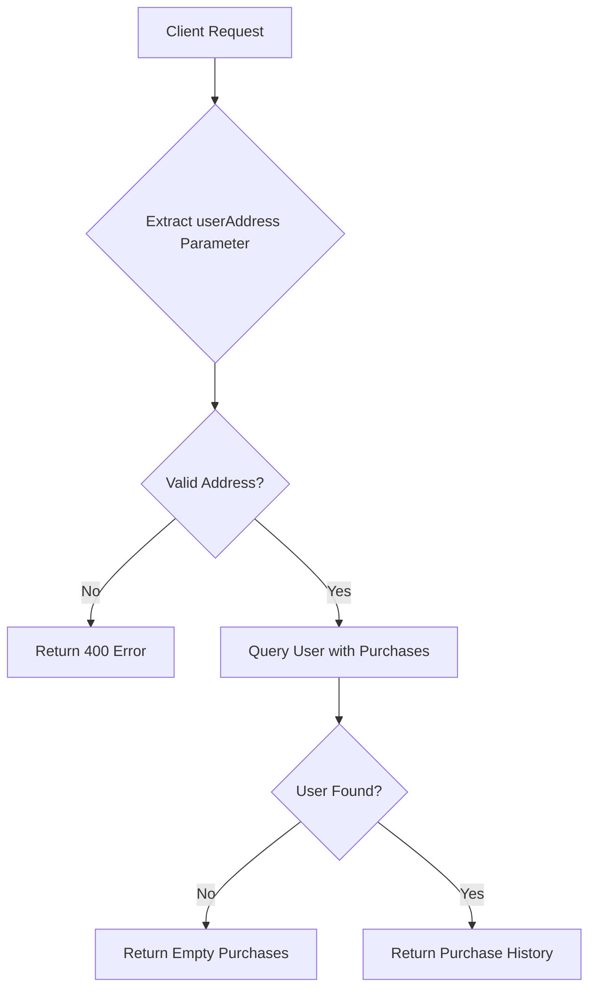

**Section sources**
- [app/api/shop/purchases/route.ts](file://app/api/shop/purchases/route.ts#L1-L32)

## Item Configuration

### Food Items
Configured in `itemsConfig.ts`, food items are stackable consumables with specific gameplay effects.

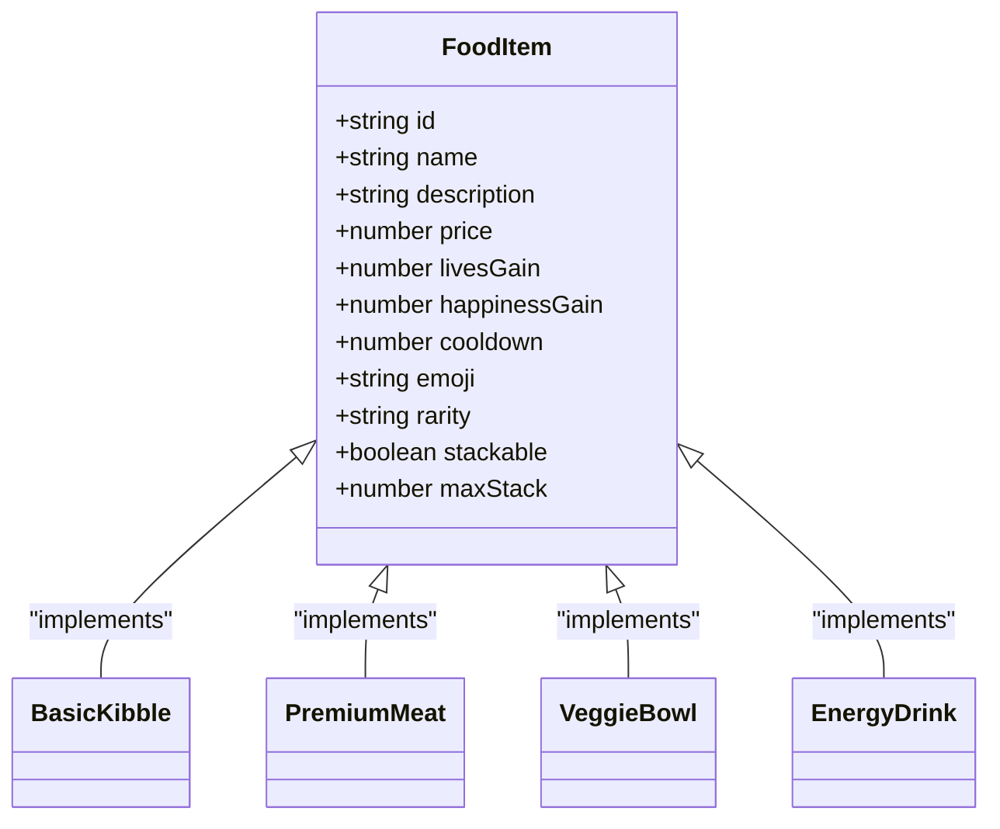

**Diagram sources**
- [lib/gamification/itemsConfig.ts](file://lib/gamification/itemsConfig.ts#L10-L50)

### Consumable Items
One-time use items providing various gameplay benefits.

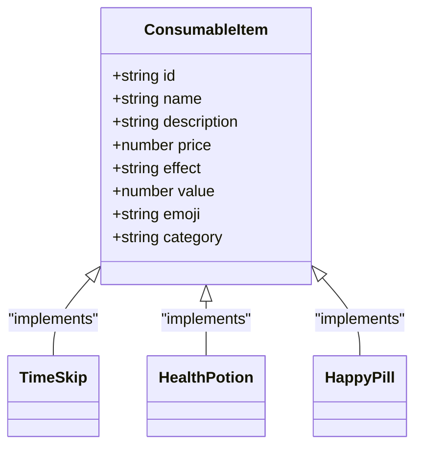

**Diagram sources**
- [lib/gamification/itemsConfig.ts](file://lib/gamification/itemsConfig.ts#L60-L90)

## Purchase Validation Flow

### Complete Purchase Sequence
The purchase process follows a strict validation and execution sequence to ensure data consistency.

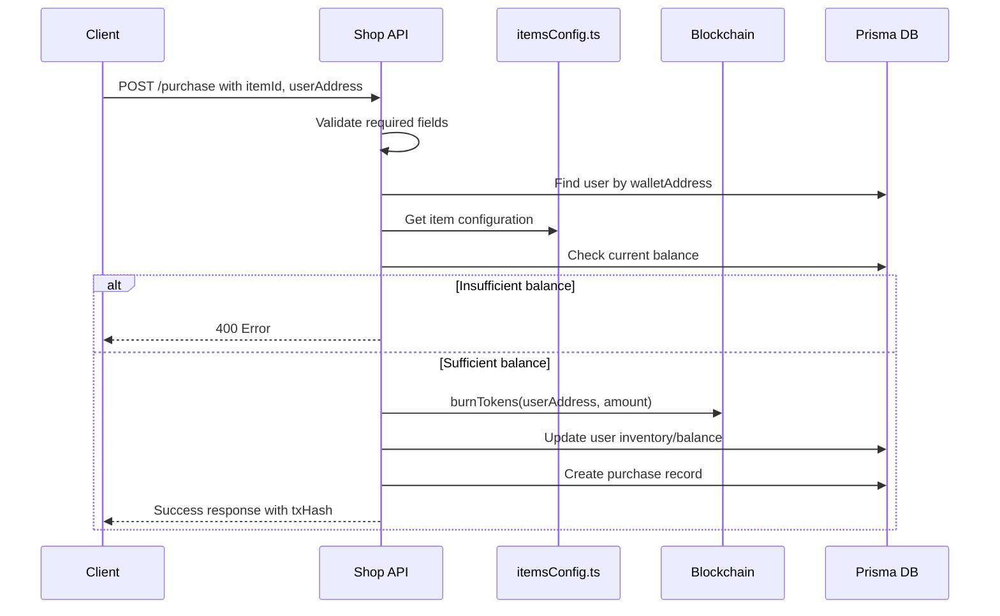

**Diagram sources**
- [app/api/shop/purchase/route.ts](file://app/api/shop/purchase/route.ts#L1-L184)
- [lib/gamification/itemsConfig.ts](file://lib/gamification/itemsConfig.ts#L1-L234)
- [lib/blockchain.ts](file://lib/blockchain.ts#L1-L112)

### Database Schema
The Prisma schema defines the structure for shop-related data persistence.

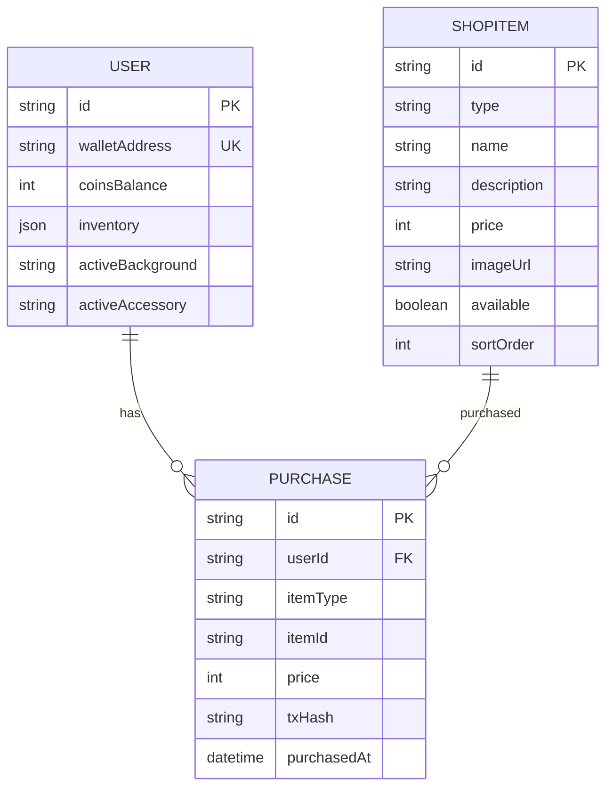

**Diagram sources**
- [prisma/seed.ts](file://prisma/seed.ts#L1-L66)
- [TECHNICAL_DOCUMENTATION.md](file://TECHNICAL_DOCUMENTATION.md#L139-L254)

## Request Examples

### Retrieve Available Items
Example request to get all available shop items.

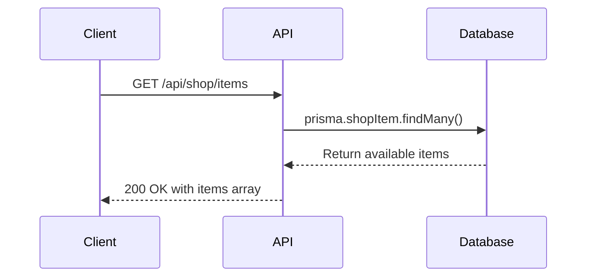

**Section sources**
- [app/shop/page.tsx](file://app/shop/page.tsx#L36-L49)

### Execute Purchase
Example flow for purchasing a food item.

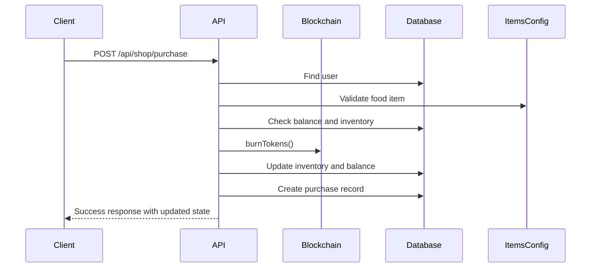

**Section sources**
- [app/shop/page.tsx](file://app/shop/page.tsx#L106-L142)

### Fetch Purchase History
Example request to retrieve a user's purchase history.

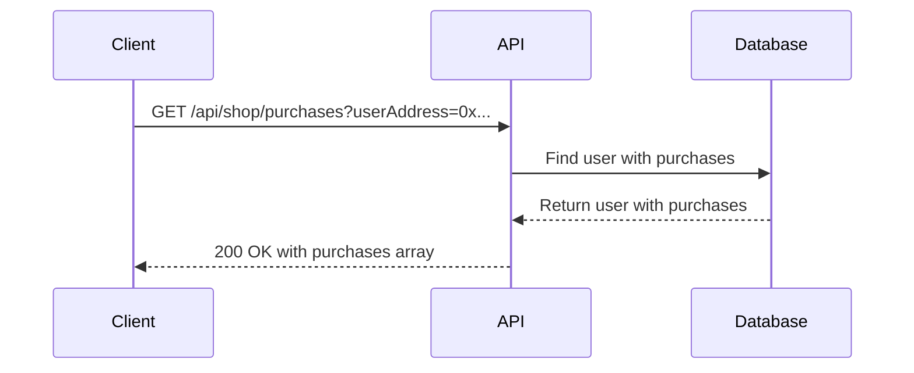

**Section sources**
- [app/shop/page.tsx](file://app/shop/page.tsx#L56-L56)

## Error Responses

### Common Error Scenarios
The API returns specific error responses for various failure conditions.

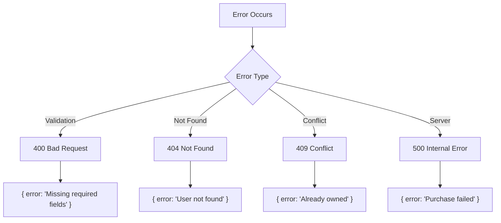

**Section sources**
- [app/api/shop/purchase/route.ts](file://app/api/shop/purchase/route.ts#L5-L184)

### Specific Error Messages
Detailed error responses for purchase validation failures.

| Error Condition | HTTP Status | Response Body |
|----------------|------------|---------------|
| Missing required fields | 400 | `{ error: 'Missing required fields' }` |
| User not found | 404 | `{ error: 'User not found' }` |
| Food item not found | 404 | `{ error: 'Food item not found' }` |
| Insufficient balance | 400 | `{ error: 'Not enough DIARY. Need X, have Y' }` |
| Exceeds max stack | 400 | `{ error: 'Cannot exceed max stack of Z' }` |
| Item already owned | 409 | `{ error: 'Already owned' }` |
| Purchase failed | 500 | `{ error: 'Purchase failed' }` |

**Section sources**
- [app/api/shop/purchase/route.ts](file://app/api/shop/purchase/route.ts#L5-L184)

## Idempotency and Audit Logging

### Idempotency Implementation
The purchase endpoint ensures idempotent operations through careful state management.

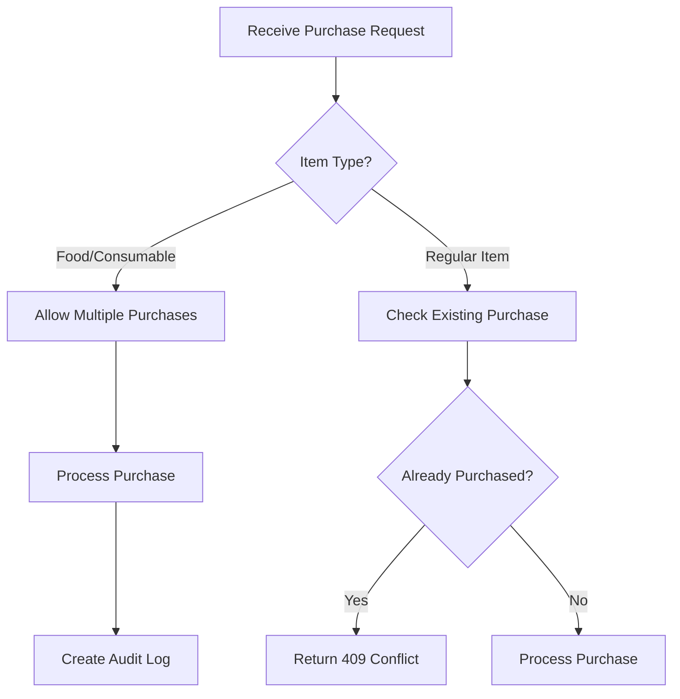

**Section sources**
- [app/api/shop/purchase/route.ts](file://app/api/shop/purchase/route.ts#L136-L145)

### Audit Logging
Comprehensive logging ensures traceability of all purchase operations.

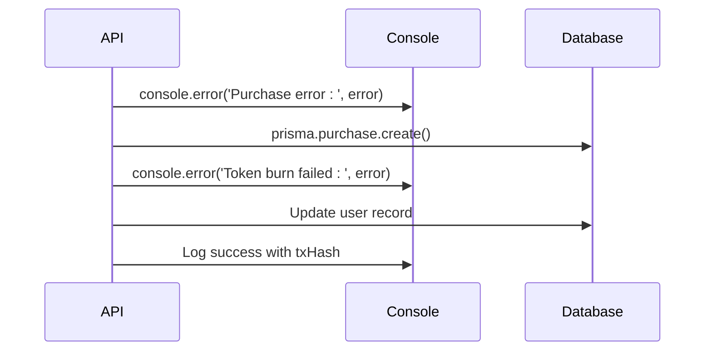

**Section sources**
- [app/api/shop/purchase/route.ts](file://app/api/shop/purchase/route.ts#L5-L184)

## Integration with Blockchain

### Token Balance Verification
The system synchronizes token balances between on-chain state and database records.

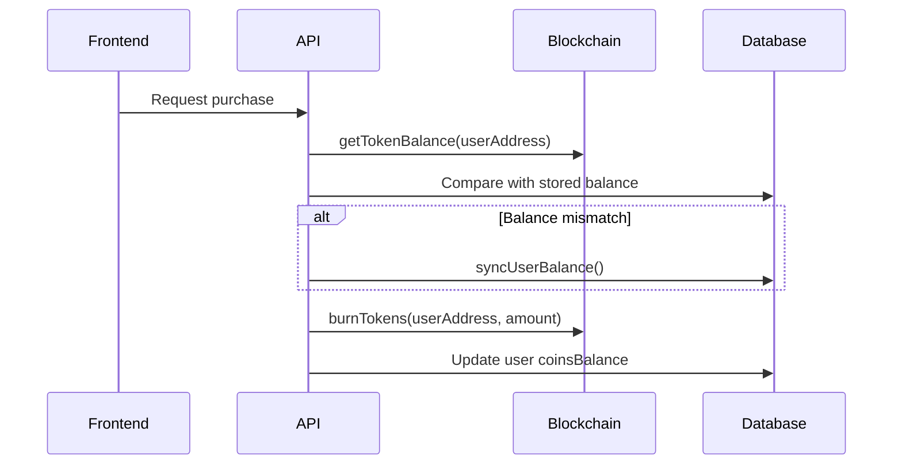

**Section sources**
- [lib/blockchain.ts](file://lib/blockchain.ts#L1-L112)
- [app/api/shop/purchase/route.ts](file://app/api/shop/purchase/route.ts#L1-L184)

### Blockchain Interaction
The `blockchain.ts` module handles all interactions with the DIARY token contract.

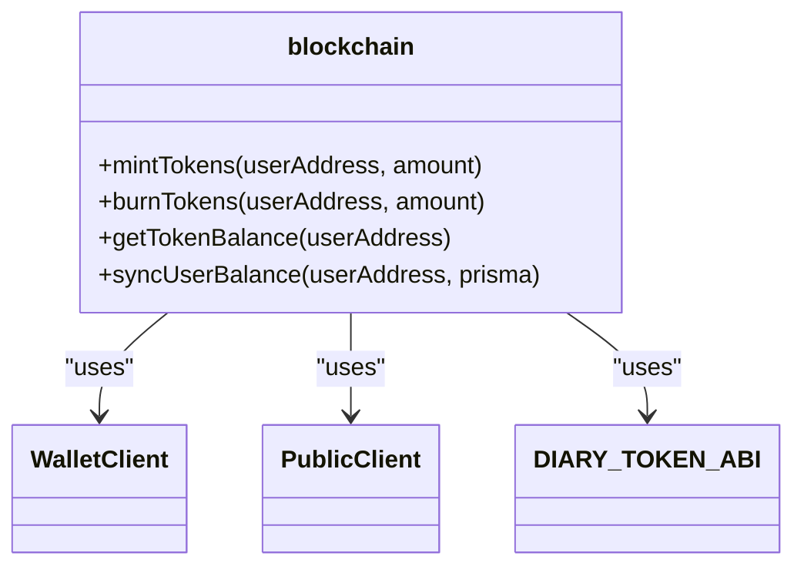

**Diagram sources**
- [lib/blockchain.ts](file://lib/blockchain.ts#L1-L112)