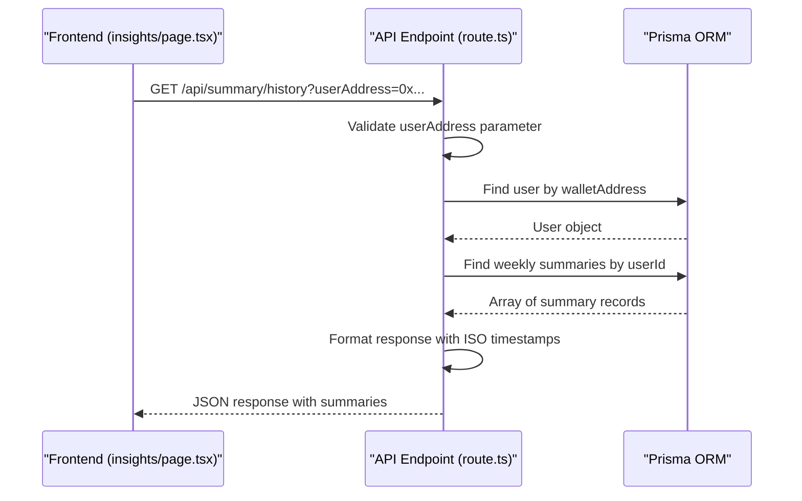
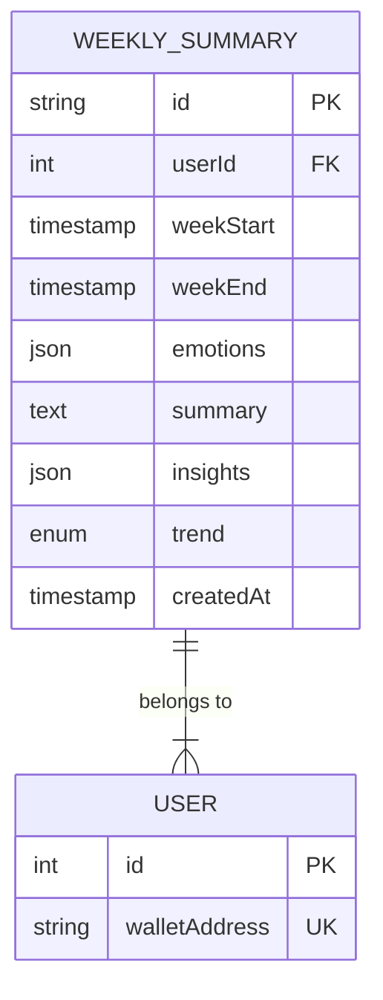
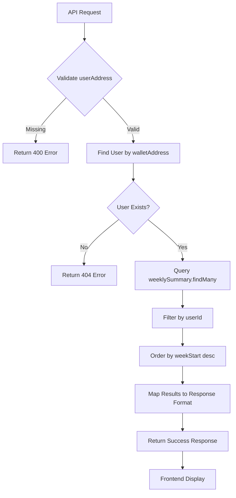
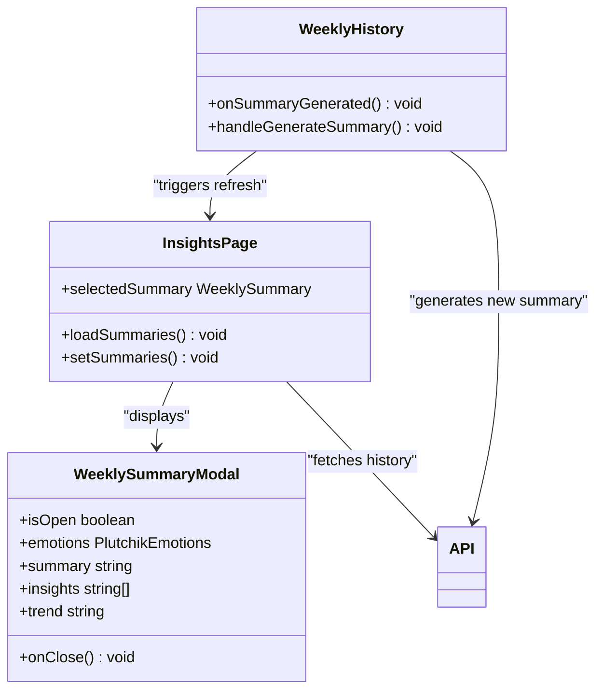
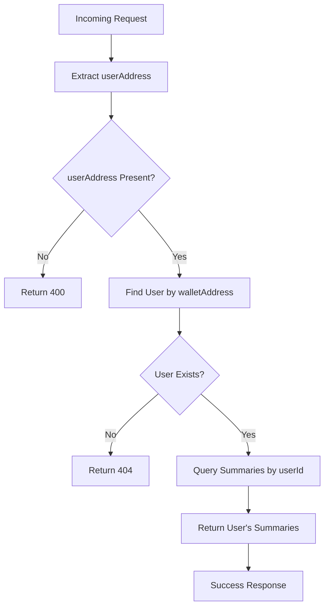
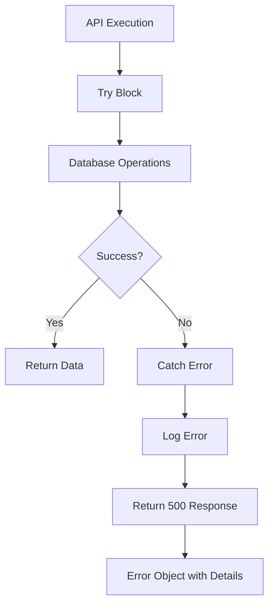

# Summary History API

<cite>
**Referenced Files in This Document**   
- [route.ts](file://app/api/summary/history/route.ts)
- [WeeklySummaryModal.tsx](file://components/WeeklySummaryModal.tsx)
- [prisma.ts](file://lib/prisma.ts)
- [page.tsx](file://app/insights/page.tsx)
- [WeeklyHistory.tsx](file://components/WeeklyHistory.tsx)
</cite>

## Table of Contents
1. [Introduction](#introduction)
2. [API Endpoint Overview](#api-endpoint-overview)
3. [Data Model](#data-model)
4. [Database Integration](#database-integration)
5. [Frontend Integration](#frontend-integration)
6. [Security Implementation](#security-implementation)
7. [Error Handling](#error-handling)
8. [Conclusion](#conclusion)

## Introduction

The Summary History API provides access to historical weekly summary records for users of the DiaryBeast application. This documentation details the implementation of the history endpoint, which retrieves emotional analysis records including timestamps, summary IDs, and metadata. The system integrates with the Prisma ORM for database operations and supports frontend consumption through the WeeklySummaryModal component. The API enables users to review their emotional journey over time, with data structured for optimal display and analysis.

## API Endpoint Overview

The Summary History endpoint implements a GET request handler that retrieves all weekly summaries for a specific user. The endpoint requires a userAddress parameter to identify the requesting user and returns a structured response containing summary records ordered by recency.

**Diagram sources**
- [route.ts](file://app/api/summary/history/route.ts#L3-L53)
- [page.tsx](file://app/insights/page.tsx#L30-L30)

**Section sources**
- [route.ts](file://app/api/summary/history/route.ts#L3-L53)

## Data Model

The data model for stored summaries defines the structure of weekly emotional analysis records. Each summary contains comprehensive emotional data, narrative content, and metadata for tracking user progress over time.

**Diagram sources**
- [page.tsx](file://app/insights/page.tsx#L8-L17)
- [route.ts](file://app/api/summary/history/route.ts#L3-L53)

**Section sources**
- [page.tsx](file://app/insights/page.tsx#L8-L17)

## Database Integration

The API integrates with the Prisma ORM to query the database for summary records. The implementation uses Prisma's type-safe query builder to retrieve all summaries for a user, ordered by weekStart in descending order to show the most recent summaries first.

**Diagram sources**
- [route.ts](file://app/api/summary/history/route.ts#L3-L53)
- [prisma.ts](file://lib/prisma.ts#L6-L6)

**Section sources**
- [route.ts](file://app/api/summary/history/route.ts#L3-L53)
- [prisma.ts](file://lib/prisma.ts#L6-L6)

## Frontend Integration

The Summary History API is consumed by the frontend in two primary locations: the Insights page for browsing historical summaries and the WeeklySummaryModal for detailed viewing. The integration follows a clean separation of concerns between data retrieval and presentation.

**Diagram sources**
- [page.tsx](file://app/insights/page.tsx#L30-L30)
- [WeeklySummaryModal.tsx](file://components/WeeklySummaryModal.tsx#L13-L22)
- [WeeklyHistory.tsx](file://components/WeeklyHistory.tsx#L23-L23)

**Section sources**
- [page.tsx](file://app/insights/page.tsx#L30-L30)
- [WeeklySummaryModal.tsx](file://components/WeeklySummaryModal.tsx#L13-L22)
- [WeeklyHistory.tsx](file://components/WeeklyHistory.tsx#L23-L23)

## Security Implementation

The API implements security measures to ensure that users can only access their own summary history. The implementation verifies the user's identity through their wallet address and performs authorization checks before returning any data.

**Diagram sources**
- [route.ts](file://app/api/summary/history/route.ts#L3-L53)

**Section sources**
- [route.ts](file://app/api/summary/history/route.ts#L3-L53)

## Error Handling

The API implements comprehensive error handling for database connectivity issues and empty result sets. Errors are caught in a try-catch block and returned with appropriate HTTP status codes and descriptive messages.

**Diagram sources**
- [route.ts](file://app/api/summary/history/route.ts#L3-L53)

**Section sources**
- [route.ts](file://app/api/summary/history/route.ts#L3-L53)

## Conclusion

The Summary History API provides a robust interface for retrieving historical emotional analysis records in the DiaryBeast application. The implementation effectively integrates with the Prisma ORM for database operations and supports frontend consumption through well-structured components. The API follows security best practices by ensuring users can only access their own data and implements comprehensive error handling for reliability. The data model supports rich emotional analysis with Plutchik's emotion wheel, narrative summaries, and trend tracking, enabling users to reflect on their emotional journey over time.