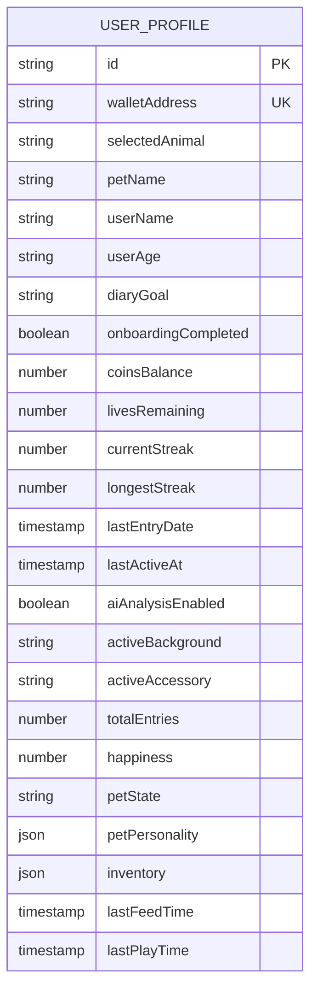
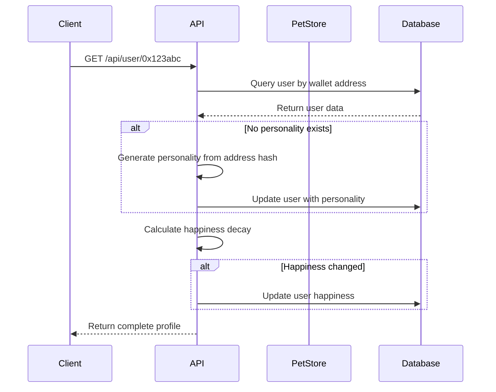
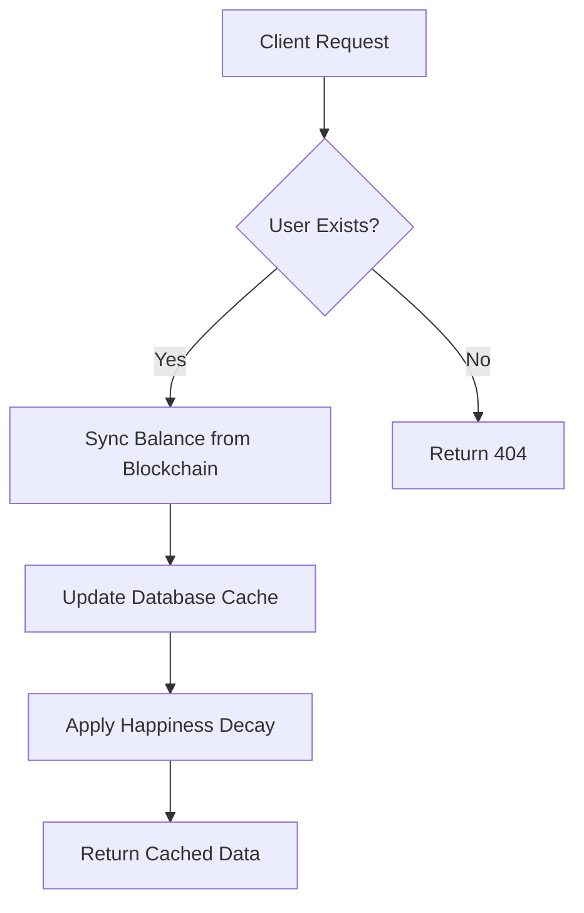
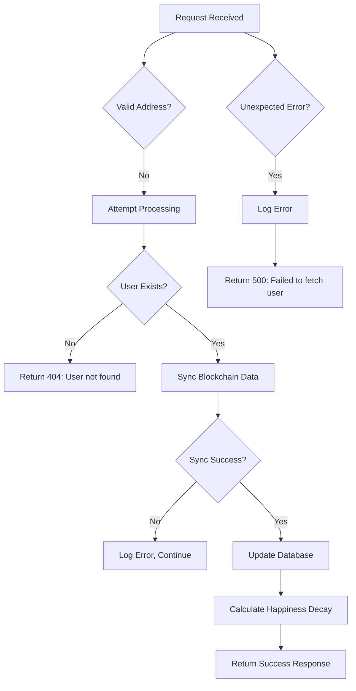
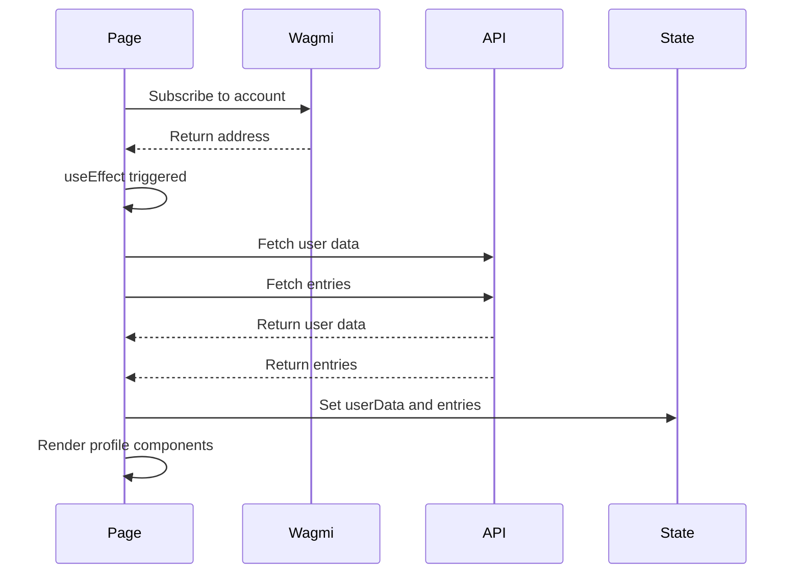

# User Profile API

<cite>
**Referenced Files in This Document**   
- [app/api/user/[address]/route.ts](file://app/api/user/[address]/route.ts)
- [lib/stores/petStore.ts](file://lib/stores/petStore.ts)
- [app/profile/page.tsx](file://app/profile/page.tsx)
- [components/Pet.tsx](file://components/Pet.tsx)
- [lib/gamification/lifeSystem.ts](file://lib/gamification/lifeSystem.ts)
- [lib/blockchain.ts](file://lib/blockchain.ts)
- [lib/gamification/itemsConfig.ts](file://lib/gamification/itemsConfig.ts)
</cite>

## Table of Contents
1. [Introduction](#introduction)
2. [Dynamic Route Parameter](#dynamic-route-parameter)
3. [Response Structure](#response-structure)
4. [Pet State Synchronization](#pet-state-synchronization)
5. [Caching Mechanisms](#caching-mechanisms)
6. [Error Handling](#error-handling)
7. [Data Fetching and UI Integration](#data-fetching-and-ui-integration)
8. [Security Considerations](#security-considerations)

## Introduction
The User Profile API endpoint at `app/api/user/[address]/route.ts` serves as the central data source for user profile information in the DiaryBeast application. This API provides comprehensive user data including metadata, pet state, streak count, and token balance. The endpoint uses wallet-based user identification through a dynamic route parameter and integrates with various backend systems to deliver real-time, synchronized data. The API is designed to support the Profile page UI component and other parts of the application that require user profile information.

**Section sources**
- [app/api/user/[address]/route.ts](file://app/api/user/[address]/route.ts#L6-L172)

## Dynamic Route Parameter
The User Profile API uses a dynamic route parameter `[address]` to identify users based on their wallet address. This parameter is extracted from the URL path and used to fetch the corresponding user data from the database. The API validates and sanitizes the address by converting it to lowercase before querying the database, ensuring consistent matching regardless of the original case format. This approach enables direct wallet-based user identification without requiring additional authentication tokens or session management.

```mermaid
flowchart TD
A[Request to /api/user/0x123abc] --> B{Extract Address}
B --> C[Convert to Lowercase]
C --> D[Query Database with address.toLowerCase()]
D --> E[Return User Data]
```

**Diagram sources**
- [app/api/user/[address]/route.ts](file://app/api/user/[address]/route.ts#L6-L172)

**Section sources**
- [app/api/user/[address]/route.ts](file://app/api/user/[address]/route.ts#L6-L172)

## Response Structure
The API response contains comprehensive user profile information organized into several categories:

### User Metadata
- Basic identification: `id`, `walletAddress`
- Profile information: `userName`, `userAge`, `diaryGoal`
- Onboarding status: `onboardingCompleted`
- Preferences: `selectedAnimal`, `petName`, `activeBackground`, `activeAccessory`

### Gamification Metrics
- Token balance: `coinsBalance`
- Streak tracking: `currentStreak`, `longestStreak`
- Activity metrics: `totalEntries`, `lastEntryDate`
- Engagement: `aiAnalysisEnabled`

### Pet State
- Health and mood: `happiness`, `petState`
- Behavioral traits: `petPersonality` (energyLevel, favoriteFood, sleepSchedule)
- Inventory: `inventory` (items and quantities)
- Activity tracking: `lastFeedTime`, `lastPlayTime`

### System Status
- Timestamps: `lastActiveAt`
- Internal identifiers: various state flags

The response structure is designed to provide all necessary user data in a single request, minimizing the need for additional API calls from the client.



**Diagram sources**
- [app/api/user/[address]/route.ts](file://app/api/user/[address]/route.ts#L6-L172)

**Section sources**
- [app/api/user/[address]/route.ts](file://app/api/user/[address]/route.ts#L6-L172)

## Pet State Synchronization
The API integrates with `petStore.ts` to ensure real-time synchronization of pet status between the backend and frontend. When a user profile is requested, the API triggers several pet state updates:

1. **Personality Generation**: If the user doesn't have a pet personality, one is generated based on their wallet address using a deterministic hash function. This ensures consistent personality traits across sessions.

2. **Happiness Decay**: The API applies happiness decay based on the time since the user's last activity. The decay calculation occurs every 2 hours, reducing happiness by 1% per interval. This creates a dynamic pet experience that reflects user engagement patterns.

3. **State Updates**: The pet's state (happy, sad, critical) is determined by its current happiness level and lives remaining, providing visual feedback on the pet's condition.



**Diagram sources**
- [app/api/user/[address]/route.ts](file://app/api/user/[address]/route.ts#L6-L172)
- [lib/stores/petStore.ts](file://lib/stores/petStore.ts#L13-L40)
- [lib/gamification/lifeSystem.ts](file://lib/gamification/lifeSystem.ts#L246-L276)
- [lib/gamification/itemsConfig.ts](file://lib/gamification/itemsConfig.ts#L166-L184)

**Section sources**
- [app/api/user/[address]/route.ts](file://app/api/user/[address]/route.ts#L6-L172)
- [lib/stores/petStore.ts](file://lib/stores/petStore.ts#L13-L40)

## Caching Mechanisms
The API implements several caching strategies to reduce redundant blockchain calls and improve performance:

1. **Database Caching**: User token balances are synchronized from the blockchain to the database, eliminating the need for repeated on-chain queries. The `syncUserBalance` function updates the database with the latest on-chain balance, serving as a cache layer.

2. **Conditional Updates**: Balance synchronization is performed on each profile request, but failures are handled gracefully (logged but not propagated), ensuring the main user data remains available even if blockchain connectivity is temporarily lost.

3. **State Caching**: Pet personality is generated once and stored in the database, preventing repeated computation. The deterministic generation algorithm ensures the same personality is produced for the same wallet address.

4. **Computed Field Caching**: The `totalEntries` field is calculated using Prisma's `_count` feature, which efficiently counts related entries without loading them all into memory.



**Diagram sources**
- [app/api/user/[address]/route.ts](file://app/api/user/[address]/route.ts#L6-L172)
- [lib/blockchain.ts](file://lib/blockchain.ts#L100-L111)

**Section sources**
- [app/api/user/[address]/route.ts](file://app/api/user/[address]/route.ts#L6-L172)
- [lib/blockchain.ts](file://lib/blockchain.ts#L87-L111)

## Error Handling
The API implements comprehensive error handling for various failure scenarios:

### Invalid Addresses
When an invalid or malformed wallet address is provided, the API attempts to process it (converting to lowercase) but will ultimately return a 404 error if no user is found with that address. The lowercase conversion helps handle case variations but doesn't validate address format.

### Missing Users
If no user exists with the provided wallet address, the API returns a 404 status with a clear error message: `{ error: 'User not found' }`. This allows the frontend to handle new users appropriately.

### Network Failures
Blockchain operations are wrapped in try-catch blocks. If balance synchronization fails (due to network issues, node problems, etc.), the error is logged but the request continues, returning the last known balance from the database. This graceful degradation ensures user data remains accessible even when blockchain connectivity is compromised.

### Server Errors
All unexpected errors are caught and returned with a 500 status, including a generic error message to avoid exposing implementation details. The actual error is logged server-side for debugging purposes.



**Diagram sources**
- [app/api/user/[address]/route.ts](file://app/api/user/[address]/route.ts#L6-L172)

**Section sources**
- [app/api/user/[address]/route.ts](file://app/api/user/[address]/route.ts#L6-L172)

## Data Fetching and UI Integration
The Profile page (`Profile/page.tsx`) demonstrates how the User Profile API is consumed in the frontend application:

1. **Data Fetching**: The page uses React's `useEffect` hook to fetch user data when the wallet address becomes available through the `useAccount` hook from wagmi.

2. **Loading States**: A loading skeleton is displayed while data is being fetched, providing immediate feedback to users.

3. **Error Handling**: If data loading fails, an appropriate error message is displayed with navigation options.

4. **State Management**: The fetched data is stored in React state and used to render various profile components, including the pet display, statistics, and settings.

5. **Optimistic Updates**: When profile settings are changed, the UI may update optimistically before confirming the change with the API.



**Diagram sources**
- [app/profile/page.tsx](file://app/profile/page.tsx#L1-L368)
- [components/Pet.tsx](file://components/Pet.tsx#L1-L387)

**Section sources**
- [app/profile/page.tsx](file://app/profile/page.tsx#L1-L368)
- [components/Pet.tsx](file://components/Pet.tsx#L1-L387)

## Security Considerations
The API implements several security measures to protect against abuse and ensure data integrity:

### Address Verification
The API relies on the wallet address provided in the URL path, which is controlled by the client. However, it converts the address to lowercase before database queries, ensuring consistent matching. The actual authentication and authorization are handled at the application level through the wallet connection.

### Rate Limiting
While not explicitly implemented in the provided code, rate limiting should be applied to prevent abuse of the API endpoint. Potential approaches include:
- IP-based rate limiting
- Wallet address-based rate limiting
- Token-based rate limiting for authenticated requests

### Input Sanitization
The API performs basic input sanitization by converting the wallet address to lowercase, which helps prevent issues related to case sensitivity. However, more comprehensive validation of the address format would enhance security.

### Error Message Security
The API returns generic error messages for server errors, preventing information disclosure about the underlying implementation. Specific error details are logged server-side but not exposed to clients.

### Data Exposure
The API carefully controls what data is exposed in the response, only including necessary fields for the profile display. Sensitive information like passwords or private keys is not included in the response.

**Section sources**
- [app/api/user/[address]/route.ts](file://app/api/user/[address]/route.ts#L6-L172)
- [app/profile/page.tsx](file://app/profile/page.tsx#L1-L368)