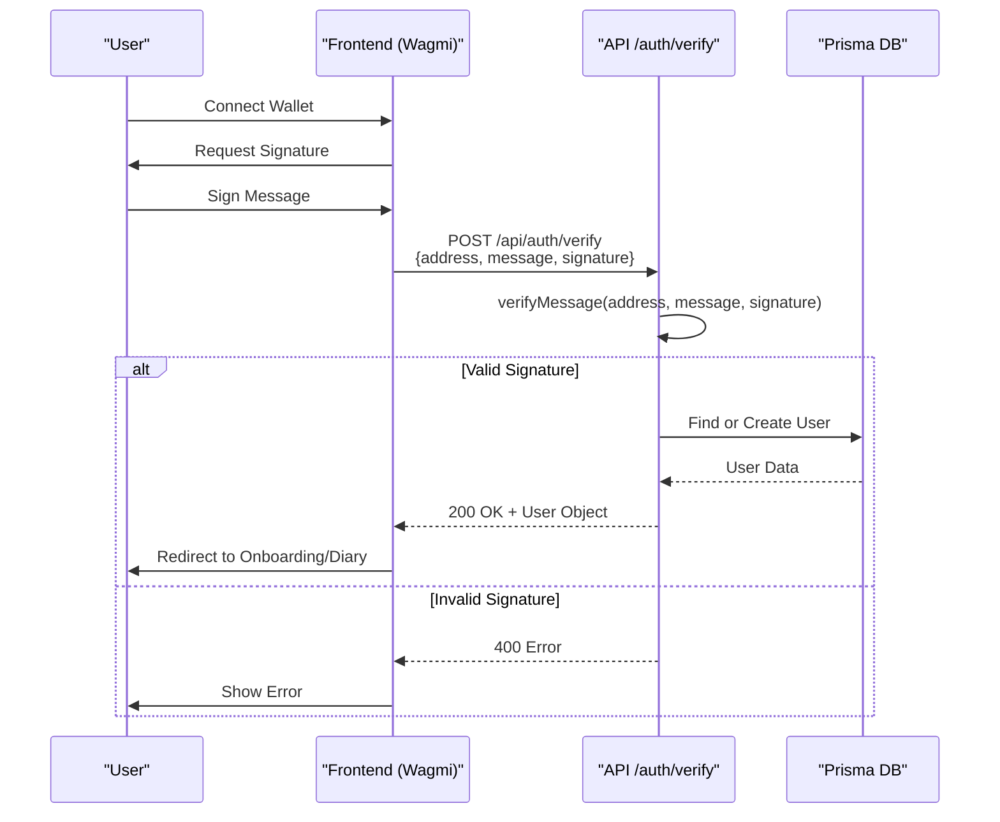
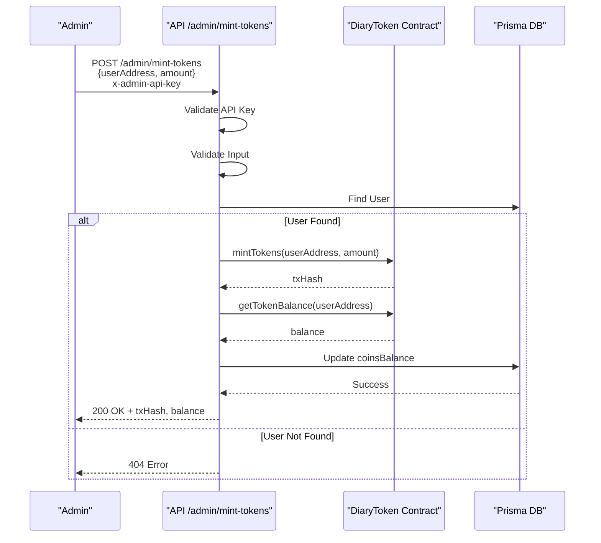

# Blockchain Integration

<cite>
**Referenced Files in This Document**   
- [lib/blockchain.ts](file://lib/blockchain.ts)
- [contracts/contracts/DiaryToken.sol](file://contracts/contracts/DiaryToken.sol)
- [app/api/admin/mint-tokens/route.ts](file://app/api/admin/mint-tokens/route.ts)
- [app/api/auth/verify/route.ts](file://app/api/auth/verify/route.ts)
- [lib/useAuth.ts](file://lib/useAuth.ts)
</cite>

## Table of Contents
1. [Introduction](#introduction)
2. [Wallet-Based Authentication Flow](#wallet-based-authentication-flow)
   - [Supported Wallets](#supported-wallets)
   - [Authentication Process](#authentication-process)
3. [DiaryToken ERC-20 Contract Implementation](#diarytoken-erc-20-contract-implementation)
4. [Blockchain Utility Layer](#blockchain-utility-layer)
5. [Token Balance Reading and UI Display](#token-balance-reading-and-ui-display)
6. [Admin Mint Tokens Endpoint](#admin-mint-tokens-endpoint)
7. [Security Considerations](#security-considerations)
8. [Example Flows](#example-flows)
9. [Basename Integration](#basename-integration)
   - [What are Basenames?](#what-are-basenames)
   - [Multi-Chain Configuration](#multi-chain-configuration)
   - [Identity Components](#identity-components)
10. [Token Minting Events](#token-minting-events)
11. [Conclusion](#conclusion)

## Introduction
DiaryBeast integrates blockchain technology to enable decentralized user identity management and token-based gamification. This document details the architecture of the blockchain integration, focusing on wallet-based authentication using Wagmi, the implementation of the DiaryToken ERC-20 contract with soul-bound characteristics, and the utility layer that abstracts blockchain interactions. The system is deployed on **Base Sepolia** for transactions, with additional **Base Mainnet** support for Basename resolution, leveraging viem for contract interactions and Next.js API routes for backend logic.

### Network Configuration
- **Primary Network**: Base Sepolia (Chain ID: 84532) - Used for all token transactions
- **Secondary Network**: Base Mainnet (Chain ID: 8453) - Used for Basename resolution
- **Token Contract**: Deployed on Base Sepolia at `NEXT_PUBLIC_DIARY_TOKEN_ADDRESS`
- **Basename Support**: Queries Base Mainnet for ENS-like usernames while maintaining testnet transactions

**Section sources**
- [lib/blockchain.ts](file://lib/blockchain.ts#L1-L112)
- [contracts/contracts/DiaryToken.sol](file://contracts/contracts/DiaryToken.sol#L1-L56)

## Wallet-Based Authentication Flow

### Supported Wallets
DiaryBeast supports multiple wallet types for connecting to the application:

1. **Coinbase Smart Wallet** (Recommended)
   - Gasless transactions for users
   - Built-in social recovery
   - Optimized for Base network
   - Configured as `preference: 'smartWalletOnly'`

2. **Injected Wallets** (via Browser Extensions)
   - MetaMask
   - Phantom
   - Rainbow
   - Any EIP-1193 compatible wallet

3. **Wallet Selection**
   - Users see a modal with wallet options when clicking "Play & Grow"
   - Selection persists until explicit disconnect
   - `reconnectOnMount={false}` prevents automatic reconnection after logout

### Authentication Process
The wallet-based authentication flow uses Wagmi for wallet connection and message signing to establish user identity without traditional credentials. When a user connects their wallet, they are prompted to sign a message ("Sign this message to authenticate with DiaryBeast"). The signature, along with the wallet address and message, is sent to the `/api/auth/verify` endpoint.

The `useAuth` hook manages the authentication state and triggers the signature request via `useSignMessage`. Upon successful signature verification, the backend creates or retrieves the user in the database, assigning a default pet and initial **50 DIARY token welcome bonus** (minted on-chain). Users are then redirected to onboarding or the diary interface based on their account status.



**Diagram sources**
- [lib/useAuth.ts](file://lib/useAuth.ts#L45-L99)
- [app/api/auth/verify/route.ts](file://app/api/auth/verify/route.ts#L1-L41)

**Section sources**
- [lib/useAuth.ts](file://lib/useAuth.ts#L0-L100)
- [app/api/auth/verify/route.ts](file://app/api/auth/verify/route.ts#L0-L80)
- [app/page.tsx](file://app/page.tsx#L0-L16)

## DiaryToken ERC-20 Contract Implementation
The DiaryToken is an ERC-20 compliant smart contract deployed on Base Sepolia, designed with soul-bound (non-transferable) characteristics to ensure tokens remain tied to user accounts. The contract inherits from OpenZeppelin's `ERC20` and `Ownable` contracts, enabling minting and burning functionality restricted to the owner.

Tokens are minted as rewards for writing diary entries via the `mintReward` function, which can only be called by the contract owner. Users and the system can burn tokens via `burn` and `burnFrom` functions, respectively, for in-app purchases. The transfer functions (`transfer`, `transferFrom`, `approve`) are overridden to revert, making the token non-transferable and soul-bound to each user's wallet.

```mermaid
classDiagram
class DiaryToken {
+constructor()
+mintReward(address user, uint256 amount)
+burnFrom(address account, uint256 amount)
+burn(uint256 amount)
-transfer(address, uint256) bool
-transferFrom(address, address, uint256) bool
-approve(address, uint256) bool
}
class ERC20 {
<<abstract>>
+_mint(address, uint256)
+_burn(address, uint256)
}
class Ownable {
<<abstract>>
onlyOwner modifier
}
DiaryToken --> ERC20 : inherits
DiaryToken --> Ownable : inherits
note right of DiaryToken
Soul-bound : All transfer functions
revert with "transfers are disabled"
end note
```

**Diagram sources**
- [contracts/contracts/DiaryToken.sol](file://contracts/contracts/DiaryToken.sol#L1-L56)

**Section sources**
- [contracts/contracts/DiaryToken.sol](file://contracts/contracts/DiaryToken.sol#L1-L56)

## Blockchain Utility Layer
The `blockchain.ts` utility layer abstracts all interactions with the DiaryToken contract using viem. It provides functions for minting tokens, burning tokens, reading token balances, and syncing on-chain balances with the database. The layer uses environment variables for configuration, including the contract address and owner private key.

Two viem clients are created: a `walletClient` for writing transactions (using the owner's private key) and a `publicClient` for reading data. The `mintTokens` function sends a `mintReward` transaction, while `getTokenBalance` reads the `balanceOf` value and converts it from wei to human-readable units (18 decimals). The `syncUserBalance` function ensures database consistency by updating the user's coin balance after on-chain changes.

**Section sources**
- [lib/blockchain.ts](file://lib/blockchain.ts#L1-L112)

## Token Balance Reading and UI Display
Token balances are read from the blockchain using the `getTokenBalance` function in `blockchain.ts`, which queries the `balanceOf` method of the DiaryToken contract. The balance is returned in ether units (divided by 10^18) for display in the UI. Components like `RightSidebar` and `Shop` display the user's token balance, which is fetched during authentication and updated after transactions.

The balance is stored in the database via Prisma and synchronized after each mint or burn operation to ensure consistency between on-chain and off-chain states. This dual-layer approach allows for fast UI rendering while maintaining blockchain-backed integrity.

**Section sources**
- [lib/blockchain.ts](file://lib/blockchain.ts#L87-L98)
- [lib/blockchain.ts](file://lib/blockchain.ts#L100-L112)

## Admin Mint Tokens Endpoint
The `/api/admin/mint-tokens` endpoint allows authorized administrators to mint tokens to user wallets. Access is controlled via an API key (`x-admin-api-key` header), which must match the `ADMIN_API_KEY` environment variable. The endpoint validates input parameters, checks user existence, mints tokens via `mintTokens`, and updates the database balance.

After minting, the on-chain balance is re-fetched to ensure accuracy, and the user's database record is updated. The response includes the transaction hash, amount minted, and new balance, providing full transparency. This endpoint is used for controlled token distribution, such as rewards or debugging.



**Diagram sources**
- [app/api/admin/mint-tokens/route.ts](file://app/api/admin/mint-tokens/route.ts#L0-L73)

**Section sources**
- [app/api/admin/mint-tokens/route.ts](file://app/api/admin/mint-tokens/route.ts#L0-L73)

## Security Considerations
Security in the blockchain integration is addressed through multiple layers: private key management, transaction handling, and network configuration. The owner's private key is stored in an environment variable (`OWNER_PRIVATE_KEY`) and used only server-side to prevent exposure. The `ADMIN_API_KEY` restricts minting to authorized endpoints.

Transaction signing uses a 60-second timeout to prevent hanging requests, and signature rejection is gracefully handled in the UI. The system currently allows fallback for Smart Wallets (e.g., Coinbase Smart Wallet) that may use non-standard signature formats, with a warning logged and verification based on address presence. In production, proper Smart Wallet signature verification should be implemented.

Network configuration is fixed to Base Sepolia, reducing the risk of network-switching attacks. All wallet addresses are normalized to lowercase in the database to prevent duplication.

**Section sources**
- [lib/blockchain.ts](file://lib/blockchain.ts#L1-L112)
- [app/api/auth/verify/route.ts](file://app/api/auth/verify/route.ts#L25-L41)
- [app/api/admin/mint-tokens/route.ts](file://app/api/admin/mint-tokens/route.ts#L1-L15)

## Example Flows

### Reading Token Balance
To read a user's token balance, the `getTokenBalance` function is called with the user's wallet address. This function uses the `publicClient` to read the `balanceOf` value from the DiaryToken contract and converts it from wei to ether units.

**Section sources**
- [lib/blockchain.ts](file://lib/blockchain.ts#L87-L98)

### Processing a Mint Transaction
To mint tokens, the `mintTokens` function is called with a user address and amount. The `walletClient` sends a `mintReward` transaction to the contract, returning the transaction hash. After minting, the balance is re-fetched and synced with the database.

**Section sources**
- [lib/blockchain.ts](file://lib/blockchain.ts#L63-L73)
- [app/api/admin/mint-tokens/route.ts](file://app/api/admin/mint-tokens/route.ts#L50-L60)

## Basename Integration

### What are Basenames?
Basenames are human-readable names (similar to ENS) on the Base network, allowing users to have memorable identities like `username.base.eth` instead of displaying full wallet addresses.

### Multi-Chain Configuration
DiaryBeast uses a multi-chain configuration to support both Base Sepolia (for transactions) and Base Mainnet (for Basenames):

```typescript
const config = createConfig({
  chains: [baseSepolia, base],
  transports: {
    [baseSepolia.id]: http(),
    [base.id]: http(),
  },
});
```

### Identity Components
The app uses OnchainKit's Identity components to display Basenames:

- **Profile Page**: Shows Basename (if registered) or shortened address
- **Wallet Dropdown**: Displays Basename with full address
- **Navigation**: Shows user's Basename in wallet connect button

```typescript
<Identity address={address} chain={base}>
  <Name className="text-lg text-primary font-mono font-bold" />
  <Address className="text-sm text-primary/60 font-mono" />
</Identity>
```

### Important Notes
- Basenames only exist on **Base Mainnet**, not on testnets
- The app queries mainnet for names while using Sepolia for all token operations
- If no Basename is registered, the shortened wallet address is displayed
- Users can register Basenames at [base.org/names](https://base.org/names)

### Display Locations
1. **Profile Page** - Top section showing wallet info
2. **Wallet Connect Button** - When wallet is connected
3. **Wallet Dropdown Menu** - Shows name and full address

## Token Minting Events

### Welcome Bonus (50 DIARY)
- **Trigger**: New user registration
- **File**: `app/api/auth/verify/route.ts`
- **On-chain**: ✅ Mints via blockchain transaction
- **Fallback**: User still created if mint fails (txHash: 'mint_failed')

### Entry Rewards
- **First Entry**: 50 DIARY (+ multiplier based on pet happiness)
- **Daily Entry**: 10 DIARY (+ multiplier based on pet happiness)
- **File**: `app/api/entries/route.ts`
- **On-chain**: ✅ All rewards minted on blockchain

### Streak Bonuses
- **3-day streak**: Bonus tokens (+ multiplier)
- **7-day streak**: Larger bonus (+ multiplier)
- **14-day streak**: Even larger bonus (+ multiplier)
- **30-day streak**: Maximum bonus (+ multiplier)
- **File**: `app/api/entries/route.ts`
- **On-chain**: ✅ Minted when milestone reached

### Verification
All minting transactions can be verified on Base Sepolia explorer:
- Contract: Check `NEXT_PUBLIC_DIARY_TOKEN_ADDRESS` on Basescan
- View transaction history and mint events
- Verify on-chain balance matches database balance

## Conclusion
The blockchain integration in DiaryBeast provides a secure, decentralized foundation for user identity and token-based gamification. Wallet-based authentication using Wagmi and message signing eliminates the need for traditional credentials, while the soul-bound DiaryToken ensures tokens are tied to user accounts. Multi-chain support enables Basename resolution from mainnet while keeping transactions on testnet. The `blockchain.ts` utility layer abstracts complex interactions, and comprehensive minting events ensure all rewards are recorded on-chain. Security is prioritized through private key management, API key authentication, and robust error handling.