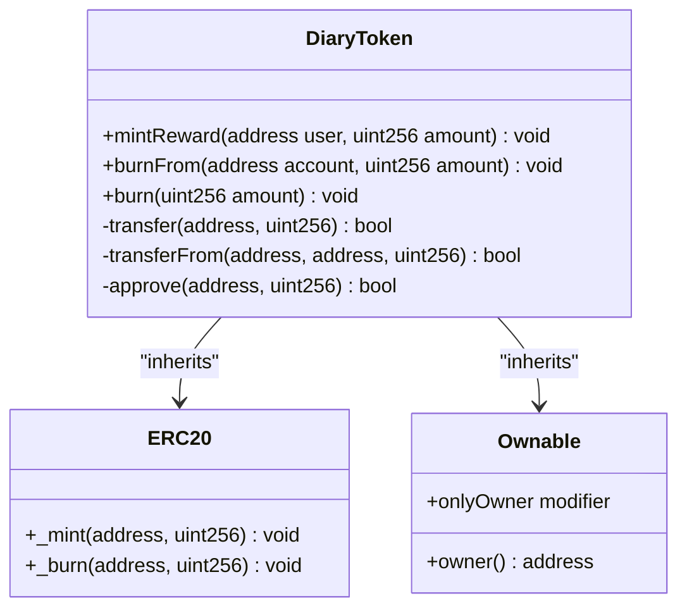
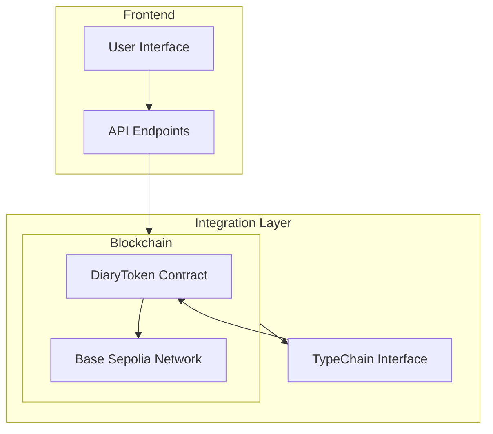
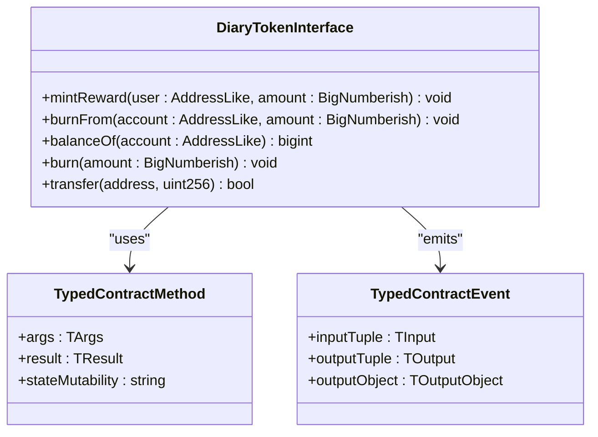
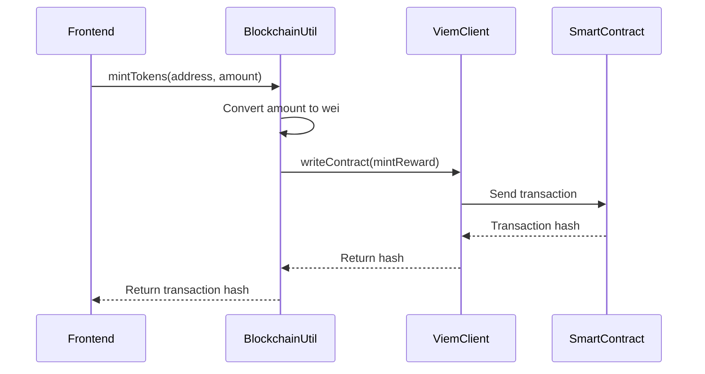
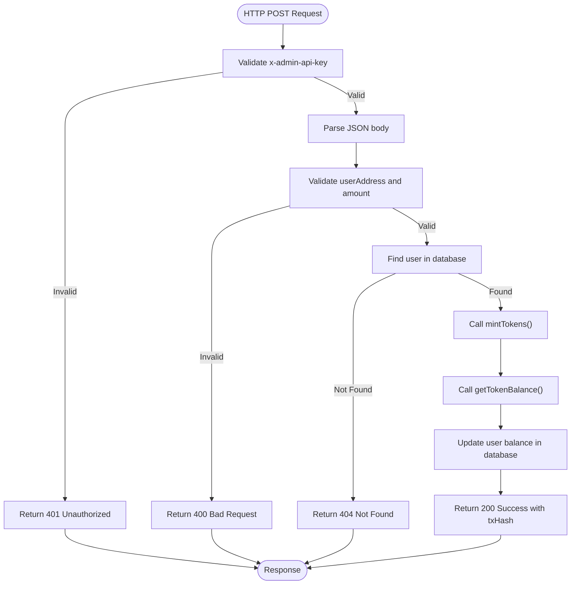

# Smart Contract Interaction

<cite>
**Referenced Files in This Document**   
- [DiaryToken.sol](file://contracts/contracts/DiaryToken.sol)
- [blockchain.ts](file://lib/blockchain.ts)
- [DiaryToken.ts](file://contracts/typechain-types/contracts/DiaryToken.ts)
- [mint-tokens/route.ts](file://app/api/admin/mint-tokens/route.ts)
- [hardhat.config.ts](file://contracts/hardhat.config.ts)
</cite>

## Table of Contents
1. [Introduction](#introduction)
2. [DiaryToken Smart Contract](#diarytoken-smart-contract)
3. [Soul-Bound Token Implementation](#soul-bound-token-implementation)
4. [Frontend Integration Layer](#frontend-integration-layer)
5. [TypeChain Interface](#typechain-interface)
6. [Blockchain Utility Layer](#blockchain-utility-layer)
7. [Network Configuration](#network-configuration)
8. [API Endpoint Example](#api-endpoint-example)
9. [Usage Examples](#usage-examples)
10. [Conclusion](#conclusion)

## Introduction
This document provides comprehensive documentation for the DiaryToken smart contract and its integration with the frontend application. The DiaryToken is a soul-bound ERC-20 token implemented in Solidity, designed to reward users for writing diary entries in the DiaryBeast application. The documentation covers the smart contract implementation, TypeChain-generated TypeScript interface, blockchain utility layer, network configuration, and usage examples for interacting with the contract.

## DiaryToken Smart Contract

The DiaryToken contract is a custom ERC-20 token that inherits from OpenZeppelin's `ERC20` and `Ownable` contracts. It is designed to be non-transferable (soul-bound), meaning users cannot send tokens to other addresses. Tokens are earned through diary entries and spent in the in-app shop.

Key features:
- Inherits from OpenZeppelin's secure ERC20 implementation
- Uses Ownable pattern for administrative functions
- Implements minting and burning functions for token management
- Disables all transfer functionality to enforce soul-bound nature

**Section sources**
- [DiaryToken.sol](file://contracts/contracts/DiaryToken.sol#L1-L57)

## Soul-Bound Token Implementation

### Core Functions
The contract implements three primary functions for token management:

#### mintReward
```solidity
function mintReward(address user, uint256 amount) external onlyOwner
```
Allows the contract owner to mint tokens as rewards for users. This function can only be called by the owner and uses the internal `_mint` function from ERC20.

#### burnFrom
```solidity
function burnFrom(address account, uint256 amount) external onlyOwner
```
Enables the owner to burn tokens from a user's balance, typically used when users make purchases in the shop.

#### burn
```solidity
function burn(uint256 amount) external
```
Allows users to burn their own tokens if needed.

### Disabled Transfer Functions
To make the token soul-bound (non-transferable), the following functions are overridden to revert:

```solidity
function transfer(address, uint256) public pure override returns (bool)
function transferFrom(address, address, uint256) public pure override returns (bool)
function approve(address, uint256) public pure override returns (bool)
```

Each function reverts with the message "DiaryToken: transfers are disabled", preventing any token transfers or approvals.



**Diagram sources**
- [DiaryToken.sol](file://contracts/contracts/DiaryToken.sol#L1-L57)

**Section sources**
- [DiaryToken.sol](file://contracts/contracts/DiaryToken.sol#L1-L57)

## Frontend Integration Layer

The frontend application integrates with the DiaryToken smart contract through a layered architecture that includes TypeChain-generated interfaces, a blockchain utility layer, and API endpoints.

### Architecture Overview


**Diagram sources**
- [blockchain.ts](file://lib/blockchain.ts#L1-L113)
- [DiaryToken.ts](file://contracts/typechain-types/contracts/DiaryToken.ts#L1-L406)

## TypeChain Interface

The TypeChain-generated `DiaryToken` interface provides type-safe contract interactions in TypeScript. This interface is automatically generated from the contract's ABI and enables compile-time type checking for all contract methods.

Key features of the generated interface:
- Strong typing for all contract functions and events
- Type-safe method parameters and return values
- Support for both direct method calls and encoded function data
- Event typing with proper input/output tuple definitions

The interface exposes all contract functions with proper typing:
- `mintReward(user: AddressLike, amount: BigNumberish): TypedContractMethod`
- `burnFrom(account: AddressLike, amount: BigNumberish): TypedContractMethod`
- `balanceOf(account: AddressLike): TypedContractMethod`
- `burn(amount: BigNumberish): TypedContractMethod`

It also includes event interfaces for `Approval`, `OwnershipTransferred`, and `Transfer` events with properly typed input and output tuples.



**Diagram sources**
- [DiaryToken.ts](file://contracts/typechain-types/contracts/DiaryToken.ts#L1-L406)

**Section sources**
- [DiaryToken.ts](file://contracts/typechain-types/contracts/DiaryToken.ts#L1-L406)

## Blockchain Utility Layer

The `blockchain.ts` file provides a utility layer that abstracts Viem wallet and public clients for contract interactions. This layer handles the complexity of blockchain communication, providing simple functions for common operations.

### Key Components

#### Client Initialization
The utility maintains singleton instances of wallet and public clients to avoid recreating them on each call:
- `getWalletClient()`: Creates a wallet client for writing to the contract
- `getPublicClient()`: Creates a public client for reading from the contract

#### Environment Variables
The layer uses environment variables for configuration:
- `OWNER_PRIVATE_KEY`: Private key for the contract owner (admin operations)
- `NEXT_PUBLIC_DIARY_TOKEN_ADDRESS`: Contract address on Base Sepolia

#### Core Functions
- `mintTokens(userAddress: string, amount: number)`: Executes mintReward transaction
- `burnTokens(userAddress: string, amount: number)`: Executes burnFrom transaction
- `getTokenBalance(userAddress: string)`: Reads balanceOf from contract
- `syncUserBalance(userAddress: string, prisma: any)`: Syncs on-chain balance with database

The utility handles unit conversion, converting between human-readable numbers and wei (18 decimals) for blockchain operations.



**Diagram sources**
- [blockchain.ts](file://lib/blockchain.ts#L1-L113)

**Section sources**
- [blockchain.ts](file://lib/blockchain.ts#L1-L113)

## Network Configuration

The project is configured to deploy and interact with the DiaryToken contract on the Base Sepolia testnet. This configuration is defined in the Hardhat configuration file.

### Base Sepolia Network
- Chain ID: 84532
- RPC URL: https://sepolia.base.org
- Block explorer: https://sepolia.basescan.org

### Hardhat Configuration
The `hardhat.config.ts` file configures the Base Sepolia network with:
- RPC endpoint URL
- Account credentials from environment variables
- Chain ID specification
- Etherscan integration for contract verification

### Environment Variables
The following environment variables are used for network configuration:
- `OWNER_PRIVATE_KEY`: Private key for deploying and administering the contract
- `BASESCAN_API_KEY`: API key for verifying the contract on BaseScan
- `NEXT_PUBLIC_DIARY_TOKEN_ADDRESS`: Deployed contract address (frontend)

The configuration also includes Solidity compiler settings with optimization enabled (200 runs).

**Section sources**
- [hardhat.config.ts](file://contracts/hardhat.config.ts#L1-L42)

## API Endpoint Example

The admin minting functionality is exposed through a Next.js API route that validates authentication and orchestrates the token minting process.

### Request Flow


**Diagram sources**
- [mint-tokens/route.ts](file://app/api/admin/mint-tokens/route.ts#L1-L74)

**Section sources**
- [mint-tokens/route.ts](file://app/api/admin/mint-tokens/route.ts#L1-L74)

## Usage Examples

### Reading Token Balance
```typescript
import { getTokenBalance } from '@/lib/blockchain';

const balance = await getTokenBalance('0x...');
console.log(`User balance: ${balance} DIARY tokens`);
```

### Minting Tokens
```typescript
import { mintTokens } from '@/lib/blockchain';

try {
  const txHash = await mintTokens('0x...', 10);
  console.log(`Transaction submitted: ${txHash}`);
} catch (error) {
  console.error('Failed to mint tokens:', error);
}
```

### Handling Transactions
```typescript
// Example of handling transaction confirmation
const handleMint = async (userAddress: string, amount: number) => {
  try {
    const txHash = await mintTokens(userAddress, amount);
    
    // Optionally wait for confirmation
    const client = getPublicClient();
    const receipt = await client.waitForTransactionReceipt({ hash: txHash });
    
    if (receipt.status === 'success') {
      console.log('Tokens minted successfully');
    }
  } catch (error) {
    console.error('Transaction failed:', error);
  }
};
```

The blockchain utility functions return transaction hashes, which can be used to track transaction status and confirmations on the blockchain.

**Section sources**
- [blockchain.ts](file://lib/blockchain.ts#L1-L113)
- [mint-tokens/route.ts](file://app/api/admin/mint-tokens/route.ts#L1-L74)

## Conclusion
The DiaryToken smart contract and its frontend integration provide a robust system for managing soul-bound tokens in the DiaryBeast application. By leveraging OpenZeppelin's secure implementations and TypeChain's type safety, the system ensures reliable and secure token operations. The layered architecture separates concerns between blockchain interactions, business logic, and API endpoints, making the codebase maintainable and extensible. The configuration for Base Sepolia enables testing and deployment on a live Ethereum L2 network, providing fast and low-cost transactions for the application's token economy.