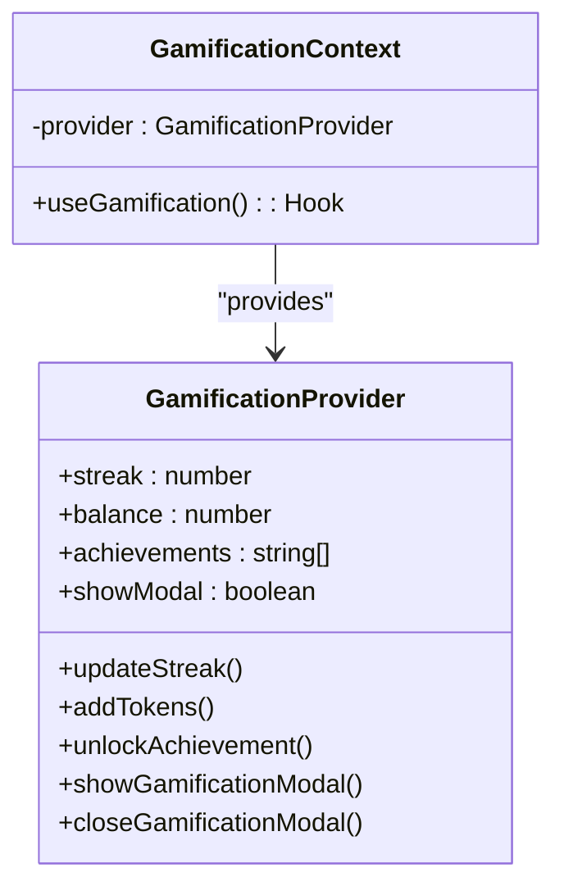
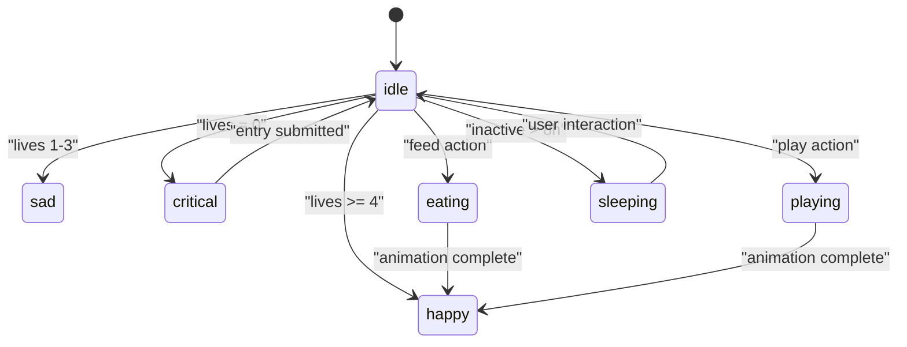
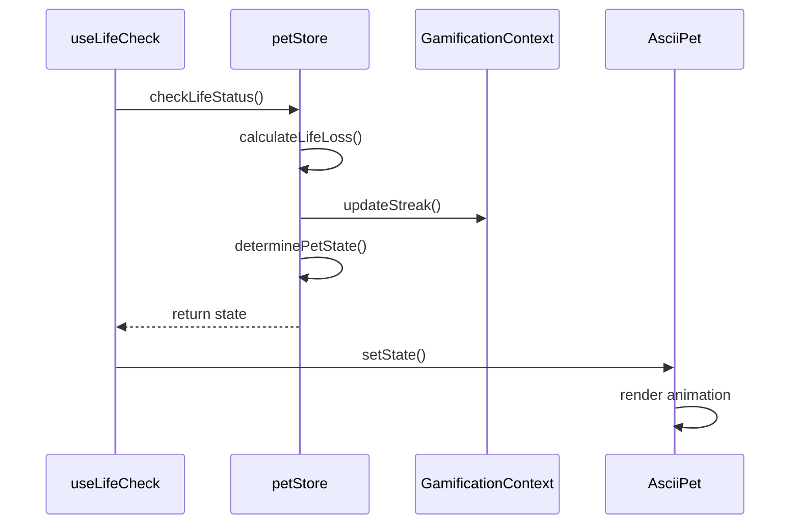
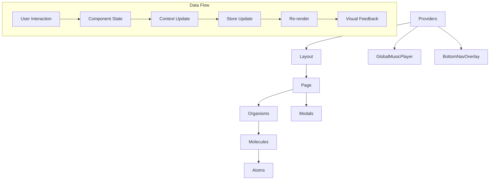

# Component Architecture

<cite>
**Referenced Files in This Document**   
- [AsciiPet.tsx](file://components/AsciiPet.tsx)
- [petStore.ts](file://lib/stores/petStore.ts)
- [GamificationContext.tsx](file://lib/contexts/GamificationContext.tsx)
- [useLifeCheck.ts](file://hooks/useLifeCheck.ts)
- [TextEditor.tsx](file://components/TextEditor.tsx)
- [RightSidebar.tsx](file://components/RightSidebar.tsx)
- [DailyTimer.tsx](file://components/DailyTimer.tsx)
- [diary/page.tsx](file://app/diary/page.tsx)
- [shop/page.tsx](file://app/shop/page.tsx)
- [providers.tsx](file://app/providers.tsx)
</cite>

## Table of Contents
1. [Introduction](#introduction)
2. [Atomic Design System](#atomic-design-system)
3. [Provider Pattern Implementation](#provider-pattern-implementation)
4. [Page Composition Model](#page-composition-model)
5. [ASCII Pet Rendering System](#ascii-pet-rendering-system)
6. [Component Interaction and Hooks](#component-interaction-and-hooks)
7. [Accessibility and Responsive Design](#accessibility-and-responsive-design)
8. [Performance Optimization](#performance-optimization)
9. [Component Hierarchy and Data Flow](#component-hierarchy-and-data-flow)

## Introduction
DiaryBeast implements a component-based architecture following atomic design principles, where UI elements are organized into a hierarchical system of atoms, molecules, and organisms. The architecture centers around an ASCII-rendered pet that serves as the emotional core of the application, with its state and animations driven by user interactions and gamification mechanics. This documentation details the component structure, state management patterns, and rendering system that create an engaging, responsive user experience.

## Atomic Design System
The UI components in DiaryBeast follow the atomic design methodology, organizing elements into progressively complex structures:

### Atoms
Basic UI elements that cannot be broken down further:
- **Buttons**: Interactive elements with distinct visual styles for primary actions
- **Inputs**: Text areas and form controls with Tailwind styling
- **Icons**: SVG and emoji-based visual indicators
- **Labels**: Text elements with specific font and color treatments

### Molecules
Composed of multiple atoms working together:
- **DailyTimer**: Combines countdown display with status indicators and styling
- **TextEditor**: Integrates textarea with formatting controls and voice input
- **FoodSelectModal**: Combines ASCII art display with quantity controls and purchase buttons
- **GamificationModal**: Assembles achievement displays with reward information

### Organisms
Complex UI sections composed of molecules:
- **Pet Interface**: Integrates ASCII pet display with health indicators and interaction controls
- **RightSidebar**: Composes statistics, pet display, and achievement tracking
- **WeeklyCalendar**: Combines date navigation with entry visualization
- **BottomNavOverlay**: Provides mobile navigation with icon-based routing

**Section sources**
- [components/DailyTimer.tsx](file://components/DailyTimer.tsx#L1-L85)
- [components/TextEditor.tsx](file://components/TextEditor.tsx#L1-L247)
- [components/RightSidebar.tsx](file://components/RightSidebar.tsx#L1-L200)

## Provider Pattern Implementation
DiaryBeast utilizes React's context API with the provider pattern to manage global state across the application:

### GlobalMusicProvider
Manages audio playback state and controls for the background music system. This provider wraps the entire application and maintains the current track, playback status, and volume settings.

### GamificationContext
Centralizes gamification state including user streaks, token balance, and achievement tracking. This context provides:
- Streak calculation and milestone tracking
- Reward calculation based on user consistency
- Achievement unlocking and notification systems
- State management for gamification modals



**Diagram sources**
- [lib/contexts/GamificationContext.tsx](file://lib/contexts/GamificationContext.tsx#L1-L50)

**Section sources**
- [lib/contexts/GamificationContext.tsx](file://lib/contexts/GamificationContext.tsx#L1-L50)
- [app/providers.tsx](file://app/providers.tsx#L1-L55)

## Page Composition Model
Pages in DiaryBeast are composed by assembling components according to specific layouts and functionality requirements:

### Diary Page (/diary)
The main journaling interface combines multiple components:
- **TextEditor**: Primary input area for diary entries
- **WeeklyHistory**: Sidebar showing past entries and summaries
- **RightSidebar**: Statistics and pet interface
- **DailyTimer**: Countdown to next entry deadline
- **Modals**: Success, summary, and gamification notifications

### Shop Page (/shop)
The in-app store interface features:
- **Tabbed Navigation**: Food, consumables, and collectibles
- **Inventory Management**: Quantity selectors and stock indicators
- **Purchase System**: Token-based transactions with confirmation
- **Item Display**: ASCII art representations of available items

```mermaid
flowchart TD
A[/diary] --> B[TextEditor]
A --> C[WeeklyHistory]
A --> D[RightSidebar]
A --> E[DailyTimer]
A --> F[EntrySuccessModal]
A --> G[WeeklySummaryModal]
A --> H[GamificationModal]
I[/shop] --> J[Tab Navigation]
I --> K[Food Items Grid]
I --> L[Consumables Grid]
I --> M[Collectibles Placeholder]
I --> N[Quantity Selector]
I --> O[Purchase Button]
```

**Diagram sources**
- [app/diary/page.tsx](file://app/diary/page.tsx#L1-L261)
- [app/shop/page.tsx](file://app/shop/page.tsx#L1-L477)

**Section sources**
- [app/diary/page.tsx](file://app/diary/page.tsx#L1-L261)
- [app/shop/page.tsx](file://app/shop/page.tsx#L1-L477)

## ASCII Pet Rendering System
The ASCII pet is a core visual element that provides emotional feedback through animated text-based art:

### Animation States
The pet transitions between multiple animation states based on its condition:
- **idle**: Default resting state with subtle blinking
- **happy**: Bouncing animation with celebratory symbols
- **sad**: Whimpering state with drooping features
- **critical**: Near-death state with X eyes and dimmed colors
- **eating**: Animation sequence showing food consumption
- **playing**: Interactive animation with moving objects
- **sleeping**: Zzz indicators with slow movement

### State-Driven Rendering
The AsciiPet component uses the petStore to determine which animation to display:
- Lives remaining determines emotional state
- Recent interactions trigger temporary animations
- Evolution milestones unlock new animation states
- User actions like feeding trigger specific sequences



**Diagram sources**
- [components/AsciiPet.tsx](file://components/AsciiPet.tsx#L1-L59)
- [lib/stores/petStore.ts](file://lib/stores/petStore.ts#L1-L50)
- [lib/ascii/types.ts](file://lib/ascii/types.ts#L1-L149)

**Section sources**
- [components/AsciiPet.tsx](file://components/AsciiPet.tsx#L1-L59)
- [lib/ascii/catAnimations.ts](file://lib/ascii/catAnimations.ts#L1-L417)
- [lib/ascii/dogAnimations.ts](file://lib/ascii/dogAnimations.ts#L1-L273)

## Component Interaction and Hooks
Components interact through a combination of context providers, custom hooks, and state management:

### useLifeCheck Hook
Monitors the user's activity status and triggers appropriate responses:
- Checks for life loss based on inactivity
- Determines if streak reset is necessary
- Triggers modal displays for critical conditions
- Updates pet state in response to user actions

### petStore
Reactive store that manages the pet's state:
- Lives remaining and health status
- Happiness level and decay tracking
- Last interaction timestamps
- Inventory of items and accessories
- Evolution stage and milestones

### Context Integration
Components consume multiple contexts simultaneously:
- GamificationContext for reward calculations
- MusicContext for audio state
- EncryptionKeyContext for data security
- petStore for pet state and animations



**Diagram sources**
- [hooks/useLifeCheck.ts](file://hooks/useLifeCheck.ts#L1-L30)
- [lib/stores/petStore.ts](file://lib/stores/petStore.ts#L1-L50)
- [components/AsciiPet.tsx](file://components/AsciiPet.tsx#L1-L59)

**Section sources**
- [hooks/useLifeCheck.ts](file://hooks/useLifeCheck.ts#L1-L30)
- [lib/stores/petStore.ts](file://lib/stores/petStore.ts#L1-L50)
- [lib/gamification/lifeSystem.ts](file://lib/gamification/lifeSystem.ts#L1-L345)

## Accessibility and Responsive Design
The component system incorporates accessibility and responsive design principles:

### Accessibility Features
- Semantic HTML structure with appropriate ARIA labels
- Keyboard navigation support for all interactive elements
- Sufficient color contrast for text and UI elements
- Screen reader compatibility for dynamic content
- Focus management for modal dialogs and overlays

### Responsive Design with Tailwind
The layout adapts to different screen sizes using Tailwind CSS:
- Mobile-first design approach
- Flexible grid and flexbox layouts
- Responsive typography scaling
- Touch-friendly interactive elements
- Conditional rendering for mobile navigation

### Responsive Breakpoints
- **Mobile**: Single-column layout with bottom navigation
- **Tablet**: Two-column layout with collapsible sidebars
- **Desktop**: Three-column layout with persistent sidebars
- **Large Screen**: Expanded content areas with additional visual elements

**Section sources**
- [components/TextEditor.tsx](file://components/TextEditor.tsx#L1-L247)
- [components/RightSidebar.tsx](file://components/RightSidebar.tsx#L1-L200)
- [app/diary/page.tsx](file://app/diary/page.tsx#L1-L261)

## Performance Optimization
The component architecture incorporates several performance optimization techniques:

### Memoization
- React.memo for component re-render prevention
- useMemo for expensive calculations
- useCallback for function reference stability
- Virtualized rendering for long lists

### Code Splitting
- Dynamic imports for heavy components
- Route-based code splitting
- Lazy loading of non-critical resources
- Prefetching of likely-to-be-needed modules

### Rendering Optimization
- Efficient state updates to minimize re-renders
- Batched updates for related state changes
- Debounced inputs for search and filtering
- Optimized animation frame handling

**Section sources**
- [components/TextEditor.tsx](file://components/TextEditor.tsx#L1-L247)
- [components/AsciiPet.tsx](file://components/AsciiPet.tsx#L1-L59)
- [components/RightSidebar.tsx](file://components/RightSidebar.tsx#L1-L200)

## Component Hierarchy and Data Flow
The overall component hierarchy follows a clear parent-child relationship with unidirectional data flow:



**Diagram sources**
- [app/providers.tsx](file://app/providers.tsx#L1-L55)
- [app/layout.tsx](file://app/layout.tsx#L1-L50)
- [app/diary/page.tsx](file://app/diary/page.tsx#L1-L261)

**Section sources**
- [app/providers.tsx](file://app/providers.tsx#L1-L55)
- [components/AsciiPet.tsx](file://components/AsciiPet.tsx#L1-L59)
- [lib/contexts/GamificationContext.tsx](file://lib/contexts/GamificationContext.tsx#L1-L50)