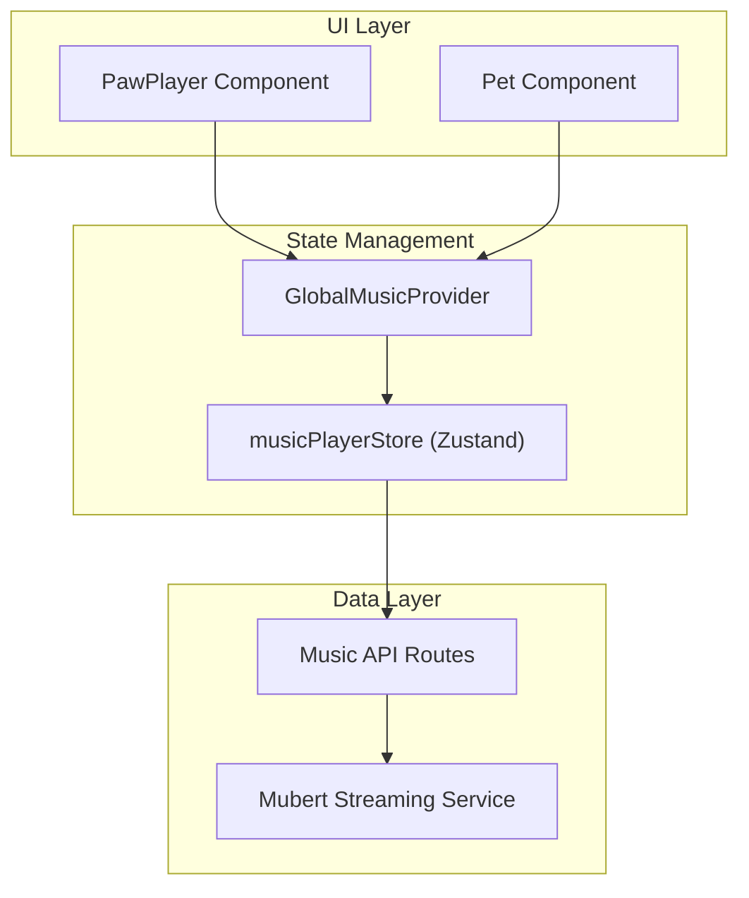
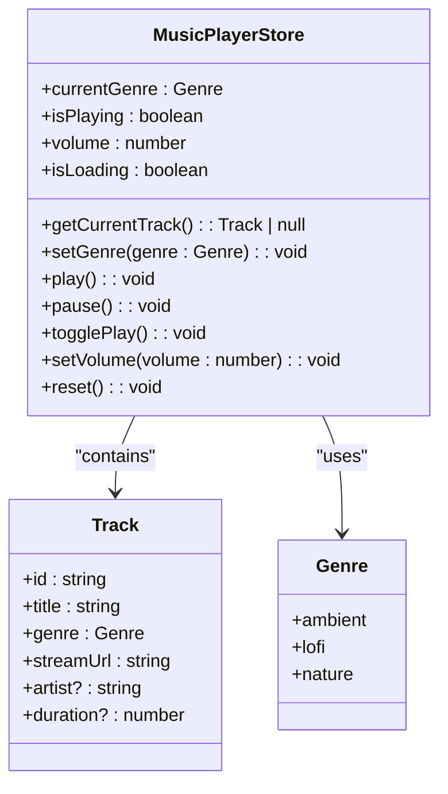
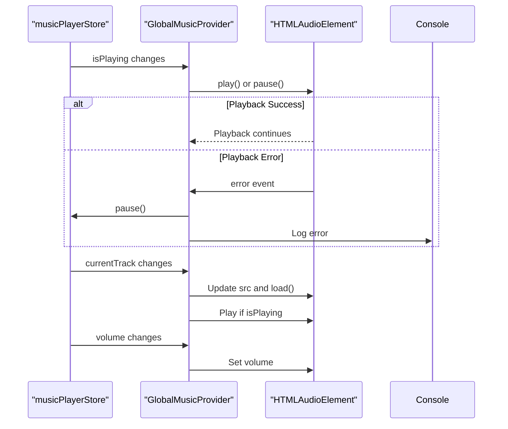
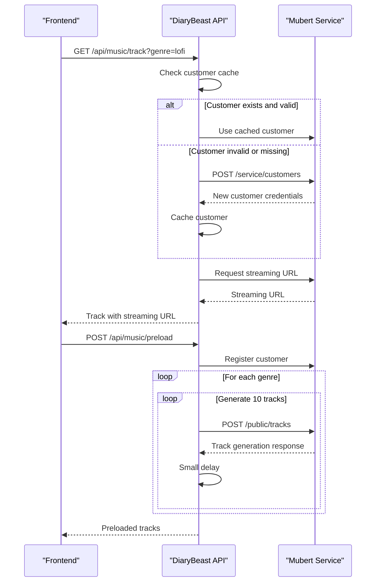
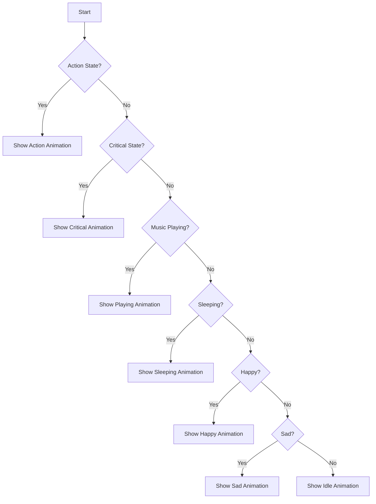

# Music Player Components

<cite>
**Referenced Files in This Document**   
- [GlobalMusicProvider.tsx](file://components/GlobalMusicPlayer/GlobalMusicProvider.tsx)
- [PawPlayer.tsx](file://components/GlobalMusicPlayer/PawPlayer.tsx)
- [musicPlayerStore.ts](file://lib/stores/musicPlayerStore.ts)
- [track/route.ts](file://app/api/music/track/route.ts)
- [preload/route.ts](file://app/api/music/preload/route.ts)
- [MusicContext.tsx](file://lib/contexts/MusicContext.tsx)
- [Pet.tsx](file://components/Pet.tsx)
- [providers.tsx](file://app/providers.tsx)
</cite>

## Table of Contents
1. [Introduction](#introduction)
2. [Architecture Overview](#architecture-overview)
3. [Core Components](#core-components)
4. [State Management](#state-management)
5. [Audio Playback Implementation](#audio-playback-implementation)
6. [Music API Integration](#music-api-integration)
7. [Visual Feedback System](#visual-feedback-system)
8. [Performance Considerations](#performance-considerations)
9. [Conclusion](#conclusion)

## Introduction

The Global Music Player system in DiaryBeast provides an immersive audio experience that enhances user engagement through synchronized visual feedback. This documentation details the architecture and implementation of the music player components, focusing on the GlobalMusicProvider's role in managing audio state, the PawPlayer UI controls, integration with music APIs, and the visual feedback system where pet animations respond to music playback state. The system uses HTMLAudioElement for audio playback with comprehensive error handling and lifecycle management, while leveraging Zustand for state management across the application.

## Architecture Overview

The music player system follows a layered architecture with clear separation of concerns between UI components, state management, and API integration. The GlobalMusicProvider acts as the central orchestrator, managing the audio element and coordinating state changes, while the PawPlayer component provides the user interface for music controls. The system integrates with external music APIs to retrieve streaming content and uses a Zustand store to maintain shared state across components.

**Diagram sources**
- [GlobalMusicProvider.tsx](file://components/GlobalMusicPlayer/GlobalMusicProvider.tsx#L5-L84)
- [PawPlayer.tsx](file://components/GlobalMusicPlayer/PawPlayer.tsx#L7-L202)
- [musicPlayerStore.ts](file://lib/stores/musicPlayerStore.ts#L37-L54)
- [track/route.ts](file://app/api/music/track/route.ts#L1-L98)

## Core Components

The music player system consists of two primary components: GlobalMusicProvider and PawPlayer. The GlobalMusicProvider manages the audio element and coordinates playback state across the application, while the PawPlayer provides the user interface for music controls. These components work together to create a seamless music experience that is tightly integrated with the application's visual elements.

The GlobalMusicProvider is implemented as a React context provider that wraps the application and makes music state available to all components. It creates and manages an HTMLAudioElement instance, handling all playback operations and state synchronization. The PawPlayer component renders as a fixed-position UI element with genre selection buttons and a central play/pause control, styled to match the application's tamagotchi-inspired aesthetic.

**Section sources**
- [GlobalMusicProvider.tsx](file://components/GlobalMusicPlayer/GlobalMusicProvider.tsx#L5-L84)
- [PawPlayer.tsx](file://components/GlobalMusicPlayer/PawPlayer.tsx#L7-L202)

## State Management

The music player system uses Zustand for state management, providing a lightweight and efficient solution for managing shared state across components. The musicPlayerStore contains the core state variables (isPlaying, volume, currentTrack) and provides selectors like getCurrentTrack to access derived state. The store also implements persistence by saving user preferences (genre and volume) to localStorage.

The state structure is designed to support the application's music features while maintaining performance and responsiveness. The store exposes actions for controlling playback (play, pause, togglePlay), changing genres (setGenre), and adjusting volume (setVolume). These actions are designed to be asynchronous where necessary, particularly when fetching new streaming content from the API.

**Diagram sources**
- [musicPlayerStore.ts](file://lib/stores/musicPlayerStore.ts#L37-L54)
- [musicPlayerStore.ts](file://lib/stores/musicPlayerStore.ts#L56-L161)

## Audio Playback Implementation

The audio playback system is implemented using HTMLAudioElement, providing native browser audio capabilities with comprehensive error handling and lifecycle management. The GlobalMusicProvider creates and manages the audio element through a useRef hook, ensuring consistent access across component renders. The implementation includes proper cleanup in useEffect cleanup functions to prevent memory leaks and ensure resources are released when the component unmounts.

The system handles various playback scenarios including track changes, play/pause toggling, and volume adjustments. When the current track changes, the audio element's source is updated and the track is loaded. Playback operations include error handling with appropriate user feedback, and the system listens for audio errors to gracefully handle playback failures. The volume is synchronized with the store's volume state, allowing for dynamic volume adjustments.

**Diagram sources**
- [GlobalMusicProvider.tsx](file://components/GlobalMusicPlayer/GlobalMusicProvider.tsx#L5-L84)
- [musicPlayerStore.ts](file://lib/stores/musicPlayerStore.ts#L37-L54)

## Music API Integration

The music player integrates with external music APIs to retrieve streaming content for playback. The system uses the Mubert API to fetch genre-specific streaming URLs, with endpoints for retrieving individual tracks and preloading multiple tracks. The API integration is handled through server-side routes that proxy requests to the external service, protecting API credentials and providing a consistent interface to the client.

The track retrieval endpoint (/api/music/track) accepts a genre parameter and returns a streaming URL from the Mubert service. The system implements customer management with caching to optimize API usage and reduce latency. The preload endpoint (/api/music/preload) generates multiple tracks for each genre in advance, improving the user experience by reducing wait times when changing genres.

**Diagram sources**
- [track/route.ts](file://app/api/music/track/route.ts#L1-L98)
- [preload/route.ts](file://app/api/music/preload/route.ts#L1-L125)

## Visual Feedback System

The visual feedback system creates an engaging user experience by synchronizing pet animations with music playback state. When music is playing, the pet enters a "playing" animation state regardless of its current mood, creating a dynamic response to audio playback. This system uses a priority-based state machine where music playback has higher priority than mood states but lower priority than critical health states.

The integration is implemented through the Pet component, which consumes the music state and updates its animation accordingly. The system ensures that even pets in sad or critical states can show positive reactions to music, enhancing the emotional connection between the user and their virtual pet. The animation includes visual effects like pulsing and glowing that synchronize with the music playback state.

**Diagram sources**
- [Pet.tsx](file://components/Pet.tsx#L41-L92)
- [MusicContext.tsx](file://lib/contexts/MusicContext.tsx#L1-L53)

## Performance Considerations

The music player system implements several performance optimizations to ensure a smooth user experience. Audio resources are lazy-loaded only when needed, reducing initial page load time and bandwidth usage. The system uses caching at multiple levels, including client-side caching of streaming URLs and server-side caching of customer credentials, to minimize API calls and reduce latency.

Memory management is handled through proper cleanup of the audio element and event listeners when the component unmounts. The implementation avoids unnecessary re-renders by using Zustand's efficient state subscription model and React's useEffect dependency arrays. The preload functionality allows for background loading of multiple tracks, ensuring quick transitions between genres without noticeable delays.

Additional performance considerations include:
- Preloading strategy that generates 10 tracks per genre in advance
- Client-side caching of streaming URLs to avoid redundant API calls
- Efficient state updates that minimize component re-renders
- Proper cleanup of audio resources and event listeners
- Volume and genre persistence to maintain user preferences across sessions

**Section sources**
- [musicPlayerStore.ts](file://lib/stores/musicPlayerStore.ts#L8-L8)
- [track/route.ts](file://app/api/music/track/route.ts#L1-L98)
- [preload/route.ts](file://app/api/music/preload/route.ts#L1-L125)

## Conclusion

The Global Music Player system in DiaryBeast provides a comprehensive audio experience that is deeply integrated with the application's visual elements. By combining efficient state management, robust audio playback implementation, and engaging visual feedback, the system creates an immersive experience that enhances user engagement. The architecture balances performance considerations with rich functionality, using lazy loading, caching, and proper resource management to ensure a smooth user experience. The tight integration between audio playback and pet animations creates a dynamic response system that responds to user interactions in real-time, making the music player a central feature of the DiaryBeast experience.