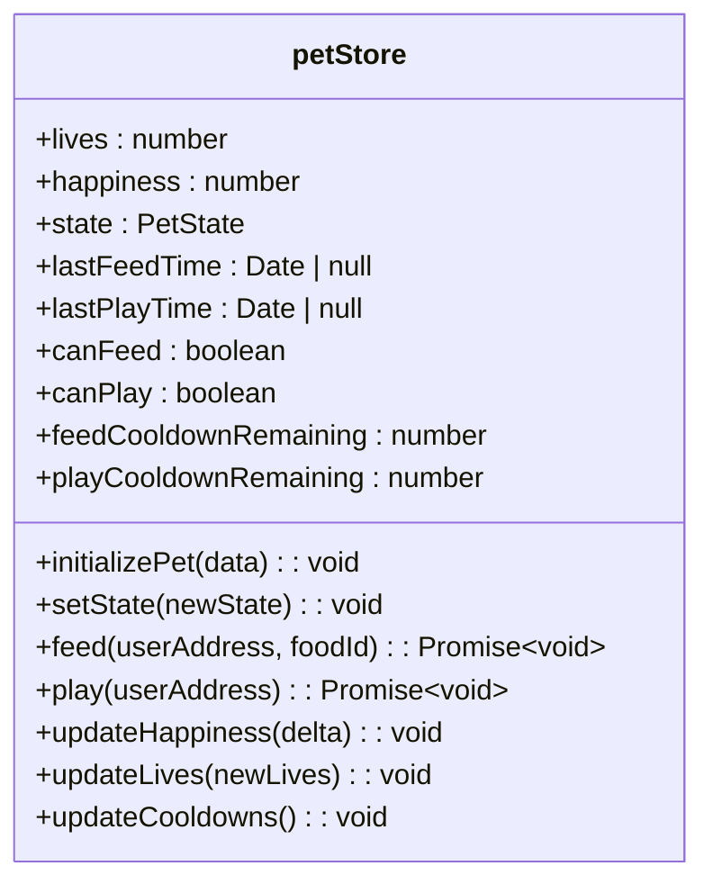
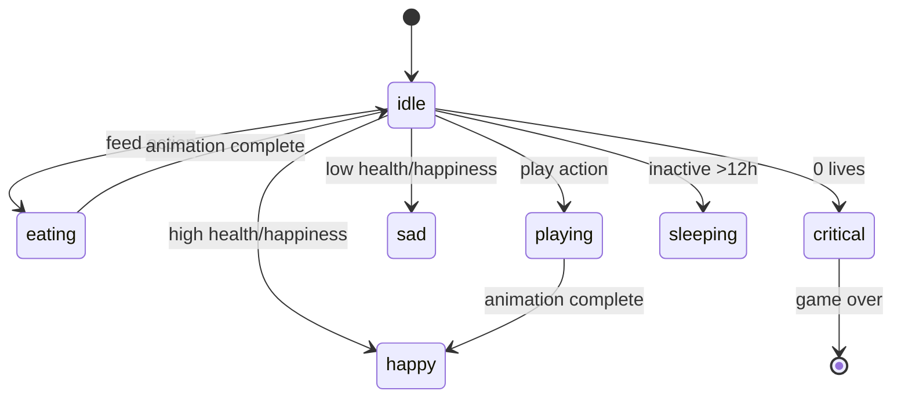
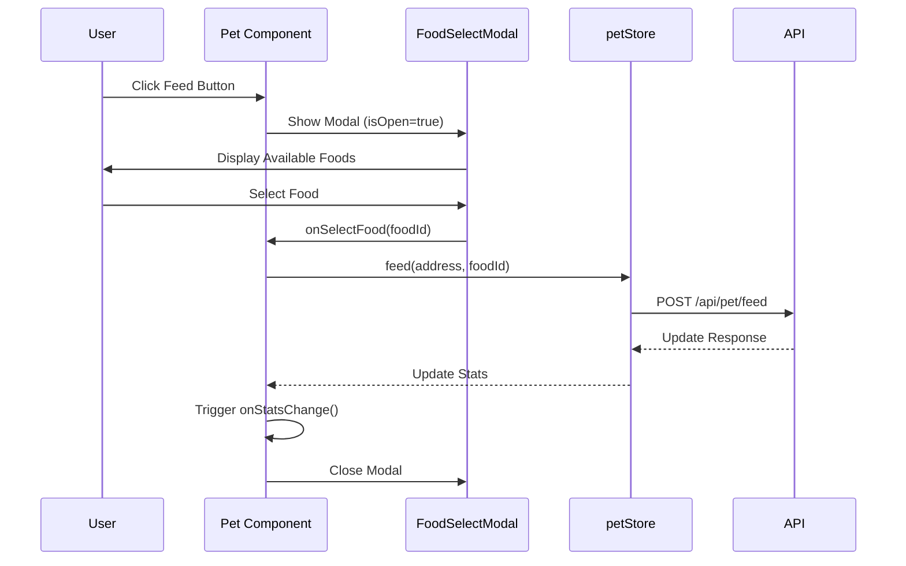
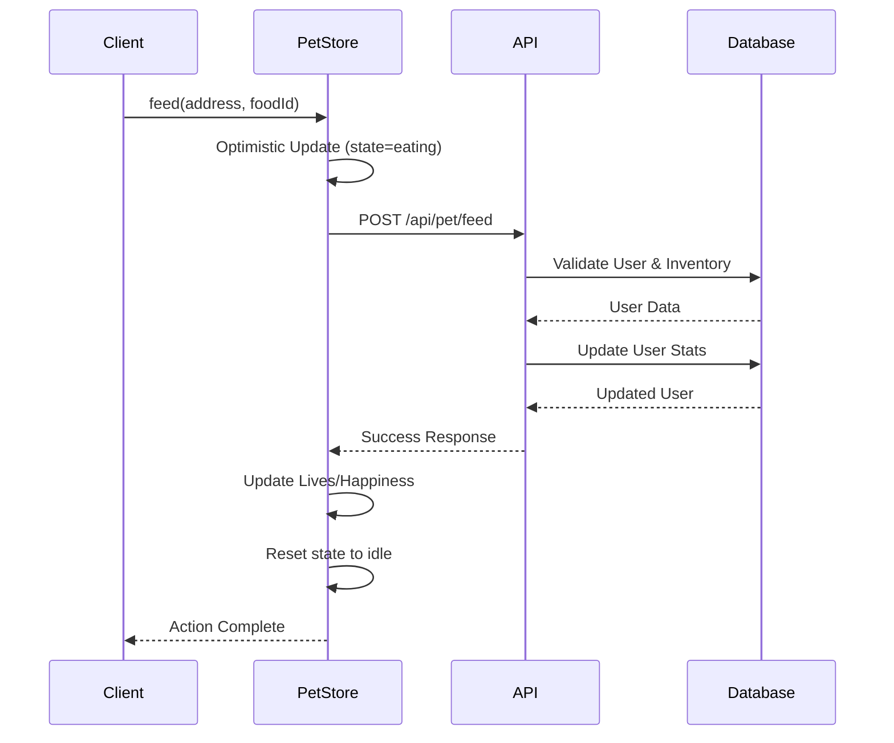

# Pet System Components

<cite>
**Referenced Files in This Document**   
- [Pet.tsx](file://components/Pet.tsx)
- [AsciiPet.tsx](file://components/AsciiPet.tsx)
- [FoodSelectModal.tsx](file://components/FoodSelectModal.tsx)
- [CriticalLifeModal.tsx](file://components/CriticalLifeModal.tsx)
- [petStore.ts](file://lib/stores/petStore.ts)
- [catAnimations.ts](file://lib/ascii/catAnimations.ts)
- [dogAnimations.ts](file://lib/ascii/dogAnimations.ts)
- [feed/route.ts](file://app/api/pet/feed/route.ts)
- [play/route.ts](file://app/api/pet/play/route.ts)
</cite>

## Table of Contents
1. [Introduction](#introduction)
2. [Core Components Overview](#core-components-overview)
3. [Pet Component Architecture](#pet-component-architecture)
4. [State Management with petStore](#state-management-with-petstore)
5. [Animation System](#animation-system)
6. [Interaction Modals](#interaction-modals)
7. [API Integration](#api-integration)
8. [Visual Design and Accessibility](#visual-design-and-accessibility)
9. [Performance Optimization](#performance-optimization)
10. [Error Handling](#error-handling)

## Introduction
The Pet System in DiaryBeast serves as the central interactive interface between users and their virtual pets. This documentation details the component architecture, state management, animation system, and user interaction flows that create an engaging tamagotchi-style experience. The system integrates blockchain-based inventory management with real-time pet state updates, creating a gamified emotional connection that encourages daily diary entries.

## Core Components Overview
The Pet System consists of several interconnected components that work together to create a responsive and emotionally engaging pet interaction experience. The system is built around a central Pet component that orchestrates state, animations, and user interactions.

```mermaid
graph TD
Pet[Pet Component] --> AsciiPet[AsciiPet Renderer]
Pet --> FoodSelectModal[Food Selection Modal]
Pet --> CriticalLifeModal[Critical Life Modal]
Pet --> petStore[petStore State Management]
petStore --> feedAPI[/api/pet/feed]
petStore --> playAPI[/api/pet/play]
AsciiPet --> catAnimations[catAnimations]
AsciiPet --> dogAnimations[dogAnimations]
```

**Diagram sources**
- [Pet.tsx](file://components/Pet.tsx#L1-L387)
- [AsciiPet.tsx](file://components/AsciiPet.tsx#L1-L59)
- [petStore.ts](file://lib/stores/petStore.ts#L1-L234)

**Section sources**
- [Pet.tsx](file://components/Pet.tsx#L1-L387)
- [AsciiPet.tsx](file://components/AsciiPet.tsx#L1-L59)

## Pet Component Architecture
The Pet component serves as the central interface for pet interaction, receiving key props that define the pet's current state and behavior. It manages user interactions, displays pet status, and coordinates with supporting components.

### Key Props and Their Functions
- **animal**: Specifies pet type ('cat' or 'dog'), determining which ASCII animations to use
- **livesRemaining**: Current health points (0-7), directly affecting pet state and animations
- **happiness**: Emotional state (0-100), influencing visual feedback and available actions
- **inventory**: Object mapping food IDs to quantities, enabling inventory-based feeding
- **onStatsChange**: Callback function triggered after successful feed/play actions
- **lastFeedTime/lastPlayTime**: Timestamps used for cooldown calculations

The component implements a sophisticated state prioritization system that determines the current animation based on multiple factors including health, happiness, user actions, and music playback status.

**Section sources**
- [Pet.tsx](file://components/Pet.tsx#L1-L387)

## State Management with petStore
The petStore uses Zustand for efficient state management, handling pet statistics, cooldowns, and API interactions. It serves as the single source of truth for pet state across the application.

### Core State Properties
- **lives**: Current health points (0-7)
- **happiness**: Emotional state (0-100)
- **state**: Current animation state (idle, happy, sad, etc.)
- **lastFeedTime/lastPlayTime**: Action timestamps for cooldown calculation
- **canFeed/canPlay**: Boolean flags indicating action availability
- **feedCooldownRemaining/playCooldownRemaining**: Milliseconds until next action

### Key Methods
- **initializePet**: Syncs store state with server data
- **feed**: Handles feeding logic and API communication
- **play**: Manages play interactions and happiness updates
- **updateCooldowns**: Calculates remaining cooldown times
- **setState**: Updates animation state

The store implements optimistic updates, immediately reflecting user actions in the UI while awaiting API confirmation, creating a responsive experience.



**Diagram sources**
- [petStore.ts](file://lib/stores/petStore.ts#L1-L234)

**Section sources**
- [petStore.ts](file://lib/stores/petStore.ts#L1-L234)

## Animation System
The animation system uses ASCII art to create expressive pet animations that respond to the pet's state. The system supports both cat and dog types with distinct animation sets.

### Animation States and Priorities
The system uses a priority-based state resolution:
1. **Action states**: eating, playing (temporary, from store)
2. **Critical state**: 0 lives = game over
3. **Music state**: pet dances when music plays
4. **Sleep state**: inactive for >12 hours
5. **Mood-based states**: determined by happiness and lives
6. **Idle state**: default calm state

### Animation Implementation
The AsciiPet component renders animations by cycling through frames defined in catAnimations.ts and dogAnimations.ts. Each animation state contains:
- **frames**: Array of frame objects with ASCII lines and colors
- **duration**: Milliseconds per frame
- **loop**: Boolean indicating if animation should loop
- **totalDuration**: Total animation duration

The component automatically cycles through frames and resets when the state changes.



**Diagram sources**
- [AsciiPet.tsx](file://components/AsciiPet.tsx#L1-L59)
- [catAnimations.ts](file://lib/ascii/catAnimations.ts#L1-L417)
- [dogAnimations.ts](file://lib/ascii/dogAnimations.ts#L1-L273)

**Section sources**
- [AsciiPet.tsx](file://components/AsciiPet.tsx#L1-L59)
- [catAnimations.ts](file://lib/ascii/catAnimations.ts#L1-L417)
- [dogAnimations.ts](file://lib/ascii/dogAnimations.ts#L1-L273)

## Interaction Modals
The system uses two primary modals for user interactions: FoodSelectModal for feeding and CriticalLifeModal for zero-life scenarios.

### FoodSelectModal
This modal allows users to select food from their inventory for feeding. Key features include:
- Displays only foods with quantity > 0
- Shows food effects (lives/happiness gain)
- Highlights favorite foods with bonus effects
- Implements inventory-based selection
- Provides visual feedback for food selection

### CriticalLifeModal
Shown when the pet reaches 0 lives, this modal creates urgency to revive the pet:
- Blocks UI (cannot be dismissed without action)
- Shows days of inactivity
- Displays streak reset information
- Includes "Write Now" button to navigate to diary
- Uses emotional design (💔 icon, red border)



**Diagram sources**
- [FoodSelectModal.tsx](file://components/FoodSelectModal.tsx#L1-L133)
- [CriticalLifeModal.tsx](file://components/CriticalLifeModal.tsx#L1-L116)
- [Pet.tsx](file://components/Pet.tsx#L1-L387)

**Section sources**
- [FoodSelectModal.tsx](file://components/FoodSelectModal.tsx#L1-L133)
- [CriticalLifeModal.tsx](file://components/CriticalLifeModal.tsx#L1-L116)

## API Integration
The Pet System integrates with backend API routes to persist state changes and manage game logic.

### Feed API (/api/pet/feed)
Handles pet feeding with inventory management:
- Validates user and food availability
- Checks cooldown periods
- Applies personality-based bonuses
- Updates lives and happiness
- Decrements inventory count
- Returns detailed response with effects

### Play API (/api/pet/play)
Manages play interactions:
- Validates user existence
- Checks happiness limits
- Enforces 4-hour cooldown
- Increases happiness by 10 points
- Updates last play timestamp
- Returns updated happiness

Both APIs use optimistic updates in the frontend store, immediately reflecting changes while awaiting server confirmation, with error handling to revert changes if requests fail.



**Diagram sources**
- [feed/route.ts](file://app/api/pet/feed/route.ts#L1-L127)
- [play/route.ts](file://app/api/pet/play/route.ts#L1-L74)
- [petStore.ts](file://lib/stores/petStore.ts#L1-L234)

**Section sources**
- [feed/route.ts](file://app/api/pet/feed/route.ts#L1-L127)
- [play/route.ts](file://app/api/pet/play/route.ts#L1-L74)

## Visual Design and Accessibility
The Pet System uses a retro tamagotchi-inspired design with LCD-style visuals and ASCII art animations.

### Responsive Design
Implemented with Tailwind CSS for responsive layouts:
- Flexible container sizing with mx-2 and max-w-md
- Mobile-first approach with p-4 padding
- Relative positioning for overlay elements
- Flexbox for alignment and spacing

### Accessibility Features
- High contrast colors for readability
- Semantic HTML structure
- Keyboard navigable buttons
- Screen reader friendly text
- Clear visual feedback for states
- Text-based status indicators (HP, JOY)

### Visual Feedback System
- **Health Status**: Color-coded text (green=healthy, orange=needs care, red=critical)
- **Happiness Bar**: ASCII-style progress bar with color gradients
- **Action Buttons**: Disabled states with cooldown timers
- **Critical Effects**: Pulse and shake animations with red glow
- **Tooltips**: Hover effects on stats and buttons

**Section sources**
- [Pet.tsx](file://components/Pet.tsx#L1-L387)
- [FoodSelectModal.tsx](file://components/FoodSelectModal.tsx#L1-L133)

## Performance Optimization
The system implements several performance optimizations to ensure smooth animations and responsive interactions.

### Memoization and State Management
- Zustand store minimizes re-renders with selective state updates
- useEffect dependencies carefully specified to prevent unnecessary executions
- setInterval for cooldown updates (once per minute) reduces computation

### Animation Optimization
- Frame cycling only occurs for multi-frame animations
- Duration-based intervals prevent excessive re-renders
- CSS transitions for color changes (300ms duration)
- Optimized ASCII rendering with pre-defined color classes

### Resource Management
- Animation data loaded once from lib/ascii modules
- Conditional rendering of modals (only when isOpen=true)
- Cleanup of intervals in useEffect cleanup functions
- Efficient state updates with optimistic UI patterns

**Section sources**
- [Pet.tsx](file://components/Pet.tsx#L1-L387)
- [AsciiPet.tsx](file://components/AsciiPet.tsx#L1-L59)
- [petStore.ts](file://lib/stores/petStore.ts#L1-L234)

## Error Handling
The system implements comprehensive error handling for failed interactions and edge cases.

### Feed Action Errors
- **No inventory**: "No food in inventory! Buy from shop first."
- **Cooldown active**: Displays remaining time in hours/minutes
- **Max health**: "Pet is already at max health"
- **Network failure**: "Failed to feed pet" with technical details
- **Invalid food**: "Invalid food item"

### Play Action Errors
- **Max happiness**: "Pet is already at maximum happiness"
- **Cooldown active**: Shows remaining hours
- **Network issues**: "Failed to play with pet"
- **User not found**: "User not found"

### Error Recovery
- **Optimistic update rollback**: Reverts UI changes on API failure
- **Store state preservation**: Maintains previous state on error
- **User-friendly messages**: Translates technical errors to understandable feedback
- **Console logging**: Detailed error logging for debugging

The system uses try/catch blocks in asynchronous actions, ensuring errors are caught and handled gracefully without crashing the UI.

**Section sources**
- [Pet.tsx](file://components/Pet.tsx#L1-L387)
- [petStore.ts](file://lib/stores/petStore.ts#L1-L234)
- [feed/route.ts](file://app/api/pet/feed/route.ts#L1-L127)
- [play/route.ts](file://app/api/pet/play/route.ts#L1-L74)