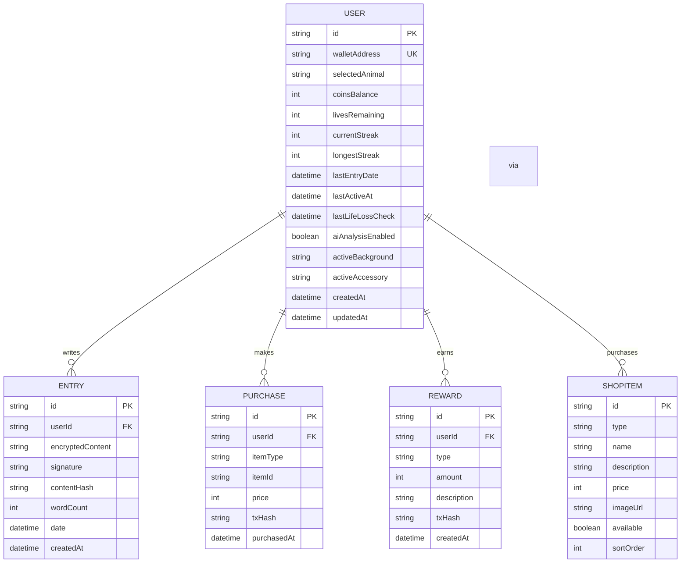

# Data Models & Database Schema

<cite>
**Referenced Files in This Document**   
- [schema.prisma](file://prisma/schema.prisma)
- [lib/encryption.ts](file://lib/encryption.ts)
- [app/api/entries/route.ts](file://app/api/entries/route.ts)
- [app/api/shop/purchase/route.ts](file://app/api/shop/purchase/route.ts)
- [app/shop/page.tsx](file://app/shop/page.tsx)
- [lib/prisma.ts](file://lib/prisma.ts)
</cite>

## Table of Contents
1. [Introduction](#introduction)
2. [Core Data Models](#core-data-models)
3. [Entity Relationship Diagram](#entity-relationship-diagram)
4. [Field Specifications](#field-specifications)
5. [Data Access Patterns](#data-access-patterns)
6. [Data Lifecycle & Security](#data-lifecycle--security)
7. [Sample Data Records](#sample-data-records)

## Introduction
This document provides comprehensive documentation for the DiaryBeast application's data models and database schema. The system is built on a Prisma ORM with PostgreSQL backend, featuring five core entities: User, Entry, Purchase, ShopItem, and Reward. The data model supports a gamified journaling experience where users earn DIARY tokens for writing entries, which can be spent on customizations in the shop. All journal entries are encrypted using the user's wallet-derived key, ensuring privacy and ownership. The schema is designed to support the application's core mechanics including streak tracking, pet health system, and blockchain-integrated token economy.

## Core Data Models
The DiaryBeast application consists of five primary data models that represent the core functionality of the gamified journaling platform. The User model serves as the central entity with walletAddress as the unique identifier, establishing one-to-many relationships with Entry, Purchase, and Reward entities. The Entry model stores encrypted journal content with timestamps and metadata, while the ShopItem model defines available customizations. The Purchase model acts as a junction table enabling the many-to-many relationship between User and ShopItem, recording transactions where users spend earned DIARY tokens on backgrounds and other items. The Reward model tracks token distributions from various activities including daily entries and streak milestones. These models work together to support the application's gamification mechanics, where consistent journaling is rewarded with tokens that can be used to enhance the user experience.

**Section sources**
- [schema.prisma](file://prisma/schema.prisma#L9-L122)

## Entity Relationship Diagram



**Diagram sources**
- [schema.prisma](file://prisma/schema.prisma#L9-L122)

## Field Specifications

### User Model
The User model represents the application's primary entity with walletAddress serving as the unique identifier. Key fields include:
- **walletAddress**: Unique Ethereum wallet address (primary identifier)
- **coinsBalance**: Integer tracking DIARY tokens earned from journaling
- **livesRemaining**: Integer (0-7) representing pet health
- **currentStreak**: Integer tracking consecutive days of journaling
- **lastEntryDate**: DateTime of most recent journal entry
- **activeBackground**: String reference to currently applied background
- **happiness**: Integer (0-100) representing pet mood
- **inventory**: JSON field storing consumable items

**Section sources**
- [schema.prisma](file://prisma/schema.prisma#L9-L35)

### Entry Model
The Entry model stores encrypted journal content with associated metadata:
- **encryptedContent**: Text field containing AES-encrypted journal entry
- **signature**: String storing wallet signature of content hash
- **contentHash**: String storing keccak256 hash of plaintext content
- **wordCount**: Integer for analytics and display
- **date**: DateTime representing the journal entry date
- **userId**: Foreign key linking to User entity

**Section sources**
- [schema.prisma](file://prisma/schema.prisma#L37-L46)

### Purchase Model
The Purchase model records transactions between users and shop items:
- **userId**: Foreign key to User entity
- **itemType**: String categorizing the purchased item
- **itemId**: String referencing the ShopItem
- **price**: Integer representing DIARY tokens spent
- **txHash**: Optional string storing blockchain transaction hash
- **purchasedAt**: DateTime of purchase

**Section sources**
- [schema.prisma](file://prisma/schema.prisma#L48-L57)

### ShopItem Model
The ShopItem model defines available customizations in the shop:
- **id**: Unique identifier for the shop item
- **type**: String categorizing item type (e.g., 'background')
- **name**: Display name of the item
- **price**: Integer cost in DIARY tokens
- **imageUrl**: String path to item image
- **available**: Boolean indicating item availability
- **sortOrder**: Integer for display ordering

**Section sources**
- [schema.prisma](file://prisma/schema.prisma#L91-L99)

### Reward Model
The Reward model tracks token distributions to users:
- **userId**: Foreign key to User entity
- **type**: String indicating reward type (e.g., 'daily_entry')
- **amount**: Integer representing DIARY tokens awarded
- **description**: String explaining the reward
- **txHash**: String storing blockchain mint transaction hash
- **createdAt**: DateTime of reward issuance

**Section sources**
- [schema.prisma](file://prisma/schema.prisma#L79-L88)

## Data Access Patterns
Data access in DiaryBeast is primarily handled through Prisma Client with API routes serving as intermediaries between the frontend and database. The most common query pattern involves fetching recent entries for a user, implemented through the GET /api/entries endpoint which retrieves entries ordered by date in descending order with pagination. User profile and stats are retrieved via GET /api/user/[address], which includes related data such as total entries count through Prisma's _count feature. The shop functionality relies on GET /api/shop/items to retrieve available items and GET /api/shop/purchases to fetch a user's purchase history. When creating a new journal entry, the POST /api/entries endpoint performs multiple operations: verifying the wallet signature, checking for duplicate entries on the same day, creating the entry record, calculating and minting rewards, and updating user statistics including streak and pet health. Purchase transactions are processed through POST /api/shop/purchase, which validates user balance, checks ownership status, records the purchase, and updates the user's token balance. All database operations are wrapped in appropriate error handling to ensure data consistency and provide meaningful feedback to the frontend.

**Section sources**
- [app/api/entries/route.ts](file://app/api/entries/route.ts#L7-L238)
- [app/api/shop/purchase/route.ts](file://app/api/shop/purchase/route.ts#L7-L184)
- [app/api/shop/items/route.ts](file://app/api/shop/items/route.ts#L7-L19)
- [app/api/user/[address]/route.ts](file://app/api/user/[address]/route.ts#L7-L172)

## Data Lifecycle & Security
The data lifecycle in DiaryBeast begins with client-side encryption of journal entries using the user's wallet-derived key before transmission to the server. The encryption key is deterministically generated from the user's wallet address and a fixed salt, ensuring consistent key derivation across devices without requiring additional signatures. Journal content is encrypted using AES encryption with the derived key, while the plaintext is hashed using keccak256 to create a content hash that is signed by the user's wallet. This dual approach ensures both privacy and authenticity. Once encrypted, the data is transmitted to the server where it is stored in the PostgreSQL database at rest. The database implements multiple security measures including unique constraints on wallet addresses, indexes for query optimization, and cascading deletes to maintain referential integrity. Backup strategies are managed by the hosting provider (Vercel Postgres) with automated daily backups and point-in-time recovery. Data retention follows a user-centric model where users maintain ownership of their encrypted entries, and deletion requests would trigger removal of all associated data including entries, purchases, and rewards while preserving blockchain transaction records for audit purposes.

**Section sources**
- [lib/encryption.ts](file://lib/encryption.ts#L7-L26)
- [schema.prisma](file://prisma/schema.prisma#L9-L122)
- [app/api/entries/route.ts](file://app/api/entries/route.ts#L7-L238)

## Sample Data Records

### User Record
```json
{
  "id": "clu123abc",
  "walletAddress": "0x742d35Cc6634C0532925a3b844Bc9e7595f0bEb",
  "selectedAnimal": "cat",
  "coinsBalance": 120,
  "livesRemaining": 7,
  "currentStreak": 5,
  "longestStreak": 12,
  "lastEntryDate": "2025-10-06T10:30:00Z",
  "lastActiveAt": "2025-10-06T10:30:00Z",
  "aiAnalysisEnabled": false,
  "activeBackground": "sunset-bg",
  "activeAccessory": null,
  "createdAt": "2025-10-01T08:15:00Z",
  "updatedAt": "2025-10-06T10:30:00Z",
  "happiness": 100,
  "petState": "idle",
  "inventory": {}
}
```

### Entry Record
```json
{
  "id": "entry123",
  "userId": "clu123abc",
  "encryptedContent": "U2FsdGVkX1+abc123...",
  "signature": "0xdef456...",
  "contentHash": "0xabcd1234...",
  "wordCount": 342,
  "date": "2025-10-06T10:30:00Z",
  "createdAt": "2025-10-06T10:30:00Z"
}
```

### Purchase Record
```json
{
  "id": "purchase123",
  "userId": "clu123abc",
  "itemType": "background",
  "itemId": "sunset-bg",
  "price": 50,
  "txHash": "0xabc123...",
  "purchasedAt": "2025-10-05T14:20:00Z"
}
```

### ShopItem Record
```json
{
  "id": "sunset-bg",
  "type": "background",
  "name": "Sunset",
  "description": "Warm sunset colors",
  "price": 50,
  "imageUrl": "/backgrounds/sunset.jpg",
  "available": true,
  "sortOrder": 1
}
```

### Reward Record
```json
{
  "id": "reward123",
  "userId": "clu123abc",
  "type": "daily_entry",
  "amount": 10,
  "description": "Daily entry reward (1x multiplier)",
  "txHash": "0xdef456...",
  "createdAt": "2025-10-06T10:30:00Z"
}
```

**Section sources**
- [TECHNICAL_DOCUMENTATION.md](file://TECHNICAL_DOCUMENTATION.md#L139-L254)
- [GAMIFICATION.md](file://GAMIFICATION.md#L0-L513)
- [GENERAL_DESCRIPTION.md](file://GENERAL_DESCRIPTION.md#L0-L391)