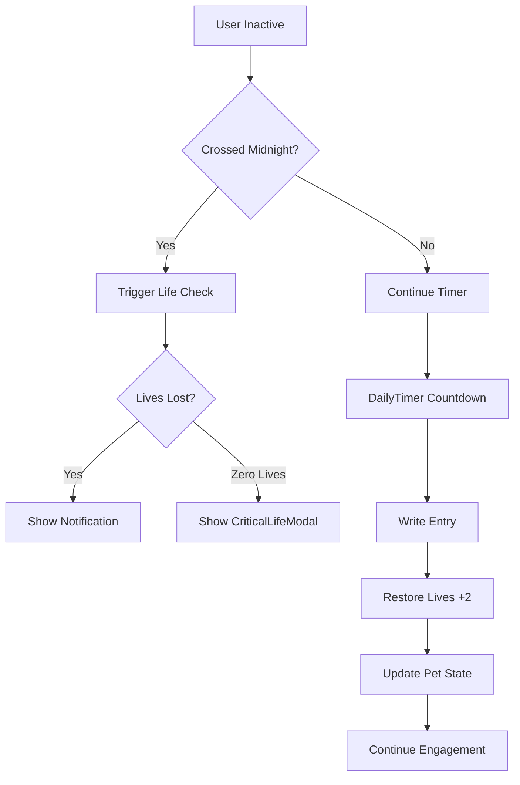

# Life System

<cite>
**Referenced Files in This Document**   
- [lifeSystem.ts](file://lib/gamification/lifeSystem.ts)
- [CriticalLifeModal.tsx](file://components/CriticalLifeModal.tsx)
- [DailyTimer.tsx](file://components/DailyTimer.tsx)
- [useLifeCheck.ts](file://hooks/useLifeCheck.ts)
</cite>

## Table of Contents
1. [Life Decay Mechanics](#life-decay-mechanics)
2. [Life Restoration Logic](#life-restoration-logic)
3. [Pet Emotional States](#pet-emotional-states)
4. [Midnight Crossing Detection](#midnight-crossing-detection)
5. [UI Integration Components](#ui-integration-components)
6. [Edge Cases and Time Handling](#edge-cases-and-time-handling)
7. [Integration with Daily Entry Flow](#integration-with-daily-entry-flow)

## Life Decay Mechanics

The life decay system in DiaryBeast implements a grace period of 24 hours during which no lives are lost after user inactivity. After this grace period, the system deducts one life every 24 hours of continued inactivity. The core calculation is performed by the `calculateLifeLoss()` function, which takes the last active timestamp and current lives as inputs. It computes the total inactive hours and applies the decay formula only to the time exceeding the grace period. The result includes the number of lives lost, updated life count, streak reset status, and notification metadata. This mechanism ensures users are not penalized for short absences while encouraging consistent engagement over longer periods.

**Section sources**
- [lifeSystem.ts](file://lib/gamification/lifeSystem.ts#L65-L115)

## Life Restoration Logic

Lives are restored through user engagement, specifically by writing diary entries. The `restoreLives()` function adds a fixed amount of 2 lives per entry, rather than fully restoring the pet's health. This incremental restoration creates ongoing incentive for daily interaction. The function enforces a hard cap at MAX_LIVES (7), ensuring the pet cannot exceed full health. This design choice promotes sustained engagement rather than allowing users to "bank" excess lives. The restoration occurs server-side upon successful entry submission, updating the user's life count in the database along with other engagement metrics.

**Section sources**
- [lifeSystem.ts](file://lib/gamification/lifeSystem.ts#L132-L134)
- [TECHNICAL_DOCUMENTATION.md](file://TECHNICAL_DOCUMENTATION.md#L697-L752)

## Pet Emotional States

The pet's emotional state is dynamically determined by its remaining lives through the `getPetState()` function. Three distinct states are implemented: 'happy' (4-7 lives), 'sad' (1-3 lives), and 'critical' (0 lives). This simple yet effective mapping creates clear emotional feedback for the user. The state directly influences the pet's visual representation and behavior in the UI, with corresponding animations and expressions. When lives reach zero, the pet enters critical state, triggering urgent UI interventions to re-engage the user. The state system provides immediate, intuitive feedback about the pet's condition based on numerical values.

**Section sources**
- [lifeSystem.ts](file://lib/gamification/lifeSystem.ts#L142-L146)
- [lib/ascii/types.ts](file://lib/ascii/types.ts#L4-L15)

## Midnight Crossing Detection

The `didCrossMidnight()` function implements a crucial boundary detection mechanism that checks whether the current date has advanced beyond the last active date, regardless of the actual time elapsed. By comparing date values at midnight (00:00:00), it identifies when a new calendar day has begun. This detection is essential for enforcing daily engagement requirements and preventing users from circumventing the life decay system by staying active just before midnight. The function returns true whenever the current date is greater than the last active date, triggering life checks and session expiration logic even if less than 24 hours have passed.

**Section sources**
- [lifeSystem.ts](file://lib/gamification/lifeSystem.ts#L184-L195)
- [TECHNICAL_DOCUMENTATION.md](file://TECHNICAL_DOCUMENTATION.md#L697-L752)

## UI Integration Components

The life system integrates with several key UI components to provide feedback and drive user engagement. The `CriticalLifeModal` blocks the interface when lives reach zero, displaying the duration of inactivity and streak reset information, with a prominent "Write Now" button that redirects to the diary page. The `DailyTimer` component shows a countdown to midnight, visually emphasizing the daily entry deadline with animated warnings when time is running out. These components work together to create urgency and emotional connection, transforming abstract life values into compelling visual experiences that motivate user action.

**Diagram sources**
- [CriticalLifeModal.tsx](file://components/CriticalLifeModal.tsx#L1-L116)
- [DailyTimer.tsx](file://components/DailyTimer.tsx#L1-L85)

**Section sources**
- [CriticalLifeModal.tsx](file://components/CriticalLifeModal.tsx#L1-L116)
- [DailyTimer.tsx](file://components/DailyTimer.tsx#L1-L85)

## Edge Cases and Time Handling

The system addresses several edge cases related to time synchronization and client-server consistency. Clock drift and timezone differences are mitigated through server-side time validation in the API endpoints. The `useLifeCheck` hook implements client-side debouncing (30-second minimum between checks) to prevent spam while still detecting midnight crossings every minute. Session expiration is handled gracefully, with the system preserving state across logins by storing timestamps in the database. The combination of client-side timers and server-side validation ensures reliable operation across different devices and network conditions, maintaining game integrity even when client clocks are inaccurate.

**Section sources**
- [useLifeCheck.ts](file://hooks/useLifeCheck.ts#L1-L153)
- [TECHNICAL_DOCUMENTATION.md](file://TECHNICAL_DOCUMENTATION.md#L639-L695)

## Integration with Daily Entry Flow

Writing a diary entry triggers a comprehensive life system update that both restores lives and resets the decay timer. When an entry is submitted, the server calls `restoreLives()` to increase the life count by 2 (capped at 7) and updates the `lastActiveAt` timestamp. This action simultaneously prevents further life decay by resetting the inactivity clock and provides positive reinforcement through the EntrySuccessModal, which displays the lives restored. The integration creates a closed loop where user action directly improves the pet's condition, reinforcing the core engagement mechanic. The system also updates streak counters and reward multipliers in the same transaction, ensuring all gamification elements remain synchronized.

**Section sources**
- [lifeSystem.ts](file://lib/gamification/lifeSystem.ts#L132-L134)
- [TECHNICAL_DOCUMENTATION.md](file://TECHNICAL_DOCUMENTATION.md#L697-L752)