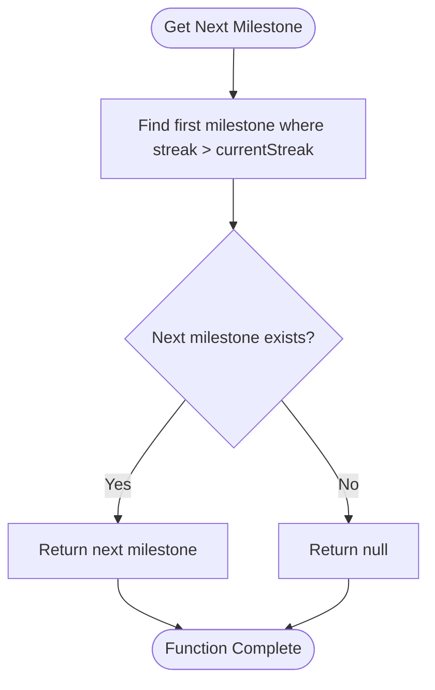

# Streak System

<cite>
**Referenced Files in This Document**   
- [streakRewards.ts](file://lib/gamification/streakRewards.ts)
- [entries/route.ts](file://app/api/entries/route.ts)
- [StreakCalendar.tsx](file://components/StreakCalendar.tsx)
- [WeeklySummaryModal.tsx](file://components/WeeklySummaryModal.tsx)
</cite>

## Table of Contents
1. [Introduction](#introduction)
2. [Core Components](#core-components)
3. [Architecture Overview](#architecture-overview)
4. [Detailed Component Analysis](#detailed-component-analysis)
5. [Integration with Summary System](#integration-with-summary-system)
6. [UI Components](#ui-components)
7. [Timezone Handling](#timezone-handling)
8. [Extensibility](#extensibility)

## Introduction
The Streak System in DiaryBeast is a gamification feature designed to encourage consistent diary writing through milestone-based token rewards. This system tracks consecutive days of diary entries and awards DIARY tokens when users reach predefined thresholds. The implementation combines backend logic for streak calculation with frontend components for visualization and user feedback.

## Core Components

The streak system is primarily implemented in `streakRewards.ts`, which defines the milestone thresholds and provides functions to calculate rewards and track progress. The system integrates with the entry creation API to award bonuses upon milestone achievement and works with UI components to display streak status and upcoming goals.

**Section sources**
- [streakRewards.ts](file://lib/gamification/streakRewards.ts#L1-L60)

## Architecture Overview


**Diagram sources**
- [streakRewards.ts](file://lib/gamification/streakRewards.ts#L1-L60)
- [entries/route.ts](file://app/api/entries/route.ts#L1-L238)

## Detailed Component Analysis

### Streak Milestones Configuration

The `STREAK_MILESTONES` array defines the thresholds and corresponding token bonuses for streak achievements. Each milestone includes the required consecutive days, bonus amount, and display label.

```mermaid
table
| Streak Days | Bonus Tokens | Label |
|-------------|-------------|-------|
| 3 | 5 | 3-Day Streak |
| 7 | 20 | Week Streak |
| 14 | 50 | 2-Week Streak |
| 30 | 100 | Month Streak |
| 60 | 250 | 2-Month Streak |
| 90 | 500 | 3-Month Streak |
| 180 | 1000 | 6-Month Streak |
| 365 | 5000 | Year Streak |
```

**Section sources**
- [streakRewards.ts](file://lib/gamification/streakRewards.ts#L13-L22)

### Streak Bonus Calculation

The `calculateStreakBonus()` function checks if the current streak matches any milestone and returns the appropriate bonus. When a user reaches a 7-day streak, for example, the function returns a 20 DIARY token reward.


**Diagram sources**
- [streakRewards.ts](file://lib/gamification/streakRewards.ts#L28-L46)

### Progress Tracking

The `getNextMilestone()` function helps display progress toward the next goal by finding the first milestone that exceeds the current streak count. This enables UI components to show users how many days remain until their next reward.



**Diagram sources**
- [streakRewards.ts](file://lib/gamification/streakRewards.ts#L51-L53)

## Integration with Summary System

While the streak system primarily operates through the entries API, it complements the summary generation system by encouraging consistent diary writing, which provides richer data for weekly analysis. The streak bonuses are awarded at the time of entry creation, not during summary generation.

The integration occurs in the entries API route, where streak bonuses are calculated and applied as part of the entry creation process. When a user's streak reaches a milestone, the bonus is immediately added to their token balance.


**Diagram sources**
- [entries/route.ts](file://app/api/entries/route.ts#L130-L163)
- [streakRewards.ts](file://lib/gamification/streakRewards.ts#L28-L46)

## UI Components

### Streak Calendar

The `StreakCalendar` component visualizes the user's recent activity with a 7-day calendar view. Each day is marked with a checkmark if an entry exists, and the current streak is displayed prominently below.


**Diagram sources**
- [StreakCalendar.tsx](file://components/StreakCalendar.tsx#L0-L114)

### Weekly Summary Modal

The `WeeklySummaryModal` displays the results of the AI analysis but also indirectly reflects streak achievements through the user's overall engagement and token balance. While it doesn't explicitly show streak rewards, the increased token balance from streak bonuses is visible in the cost/balance section.

**Section sources**
- [WeeklySummaryModal.tsx](file://components/WeeklySummaryModal.tsx#L0-L197)

## Timezone Handling

The streak system handles timezone differences by normalizing dates to midnight (00:00:00) when comparing entry dates. This ensures consistent streak counting across different timezones by focusing on the calendar day rather than the exact timestamp.

The system uses UTC date normalization to determine if an entry was made on a specific day, preventing issues where users in different timezones might have inconsistent streak calculations due to day boundaries.


**Section sources**
- [entries/route.ts](file://app/api/entries/route.ts#L150-L155)
- [lifeSystem.ts](file://lib/gamification/lifeSystem.ts#L167-L214)

## Extensibility

The streak system is designed to be extensible, allowing for the addition of new milestones or dynamic reward scaling. The `STREAK_MILESTONES` array can be modified to include additional thresholds, and the reward calculation functions can be extended to support more complex bonus structures.

To add a new milestone, developers can simply add an entry to the `STREAK_MILESTONES` array with the desired streak length, bonus amount, and display label. The existing functions will automatically incorporate the new milestone into the reward calculation and progress tracking.

For dynamic reward scaling, the system could be extended to consider factors like user level, pet condition, or seasonal events when calculating bonus amounts, building upon the existing multiplier system used for life restoration.

**Section sources**
- [streakRewards.ts](file://lib/gamification/streakRewards.ts#L1-L60)
- [entries/route.ts](file://app/api/entries/route.ts#L130-L163)