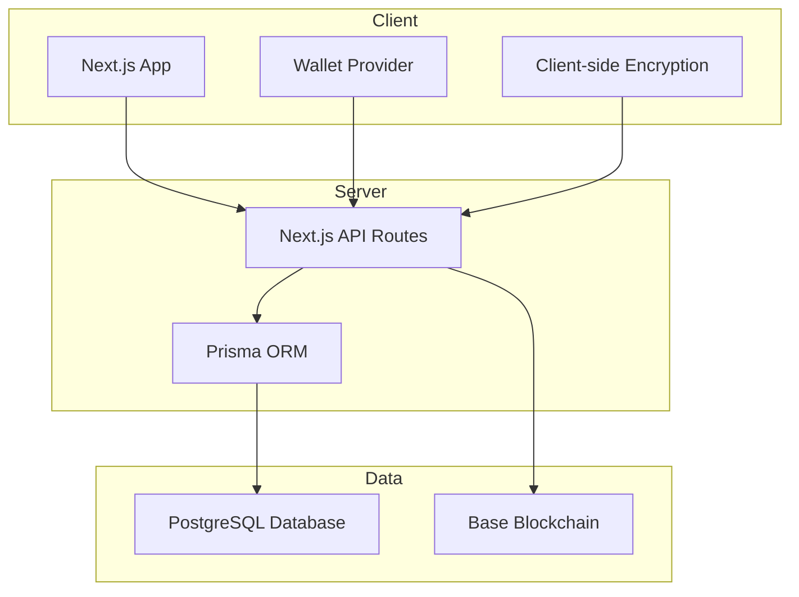
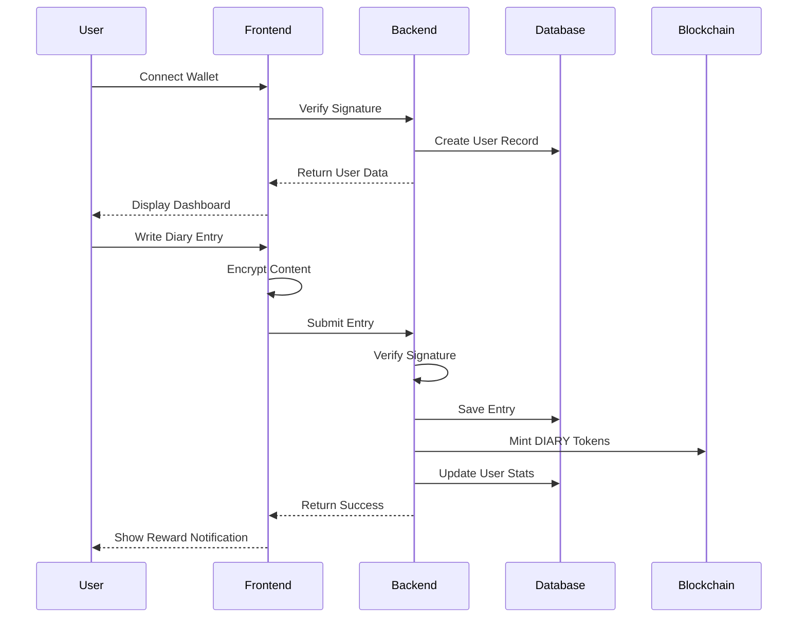
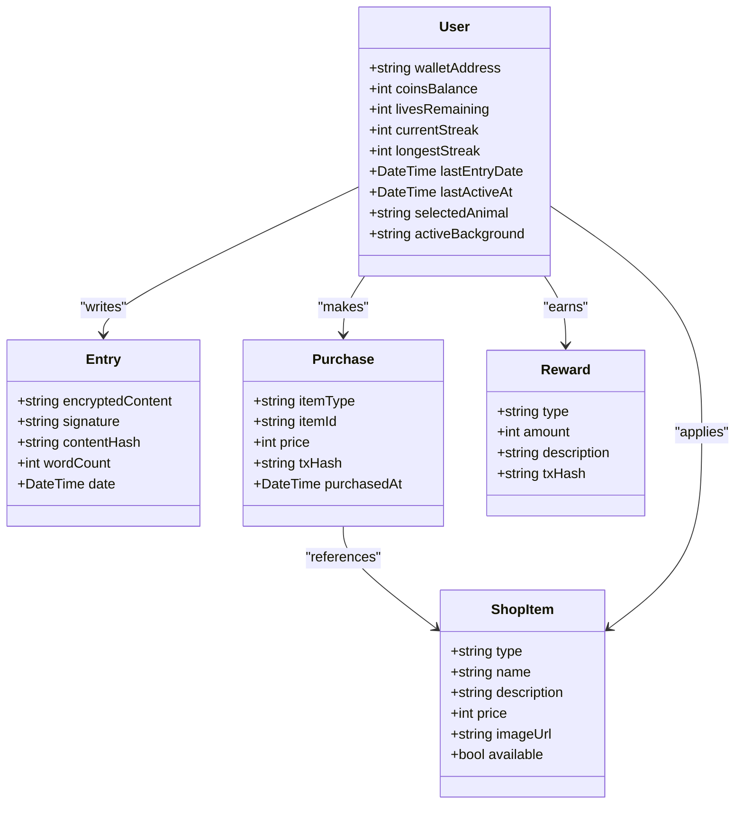
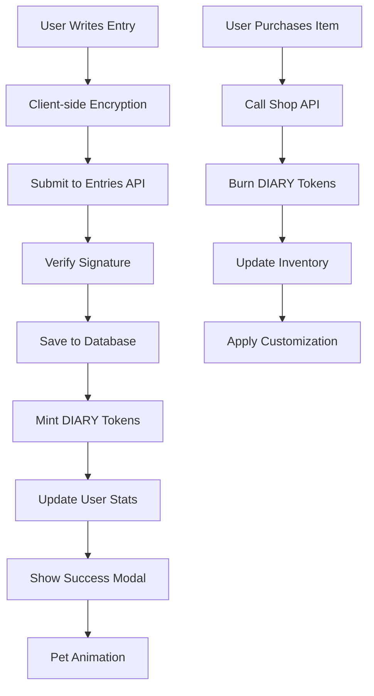

# Project Overview

<cite>
**Referenced Files in This Document**   
- [README.md](file://README.md)
- [GENERAL_DESCRIPTION.md](file://GENERAL_DESCRIPTION.md)
- [TECHNICAL_DOCUMENTATION.md](file://TECHNICAL_DOCUMENTATION.md)
- [GAMIFICATION.md](file://GAMIFICATION.md)
- [app/api/entries/route.ts](file://app/api/entries/route.ts)
- [app/api/auth/verify/route.ts](file://app/api/auth/verify/route.ts)
- [app/api/shop/purchase/route.ts](file://app/api/shop/purchase/route.ts)
- [app/api/pet/feed/route.ts](file://app/api/pet/feed/route.ts)
- [app/api/admin/mint-tokens/route.ts](file://app/api/admin/mint-tokens/route.ts)
- [lib/blockchain.ts](file://lib/blockchain.ts)
- [lib/encryption.ts](file://lib/encryption.ts)
- [lib/prisma.ts](file://lib/prisma.ts)
- [lib/gamification/lifeSystem.ts](file://lib/gamification/lifeSystem.ts)
- [lib/gamification/streakRewards.ts](file://lib/gamification/streakRewards.ts)
- [lib/gamification/itemsConfig.ts](file://lib/gamification/itemsConfig.ts)
- [components/AsciiPet.tsx](file://components/AsciiPet.tsx)
- [components/TextEditor.tsx](file://components/TextEditor.tsx)
- [components/WalletConnect.tsx](file://components/WalletConnect.tsx)
- [contracts/contracts/DiaryToken.sol](file://contracts/contracts/DiaryToken.sol)
</cite>

## Table of Contents
1. [Introduction](#introduction)
2. [Core Value Proposition](#core-value-proposition)
3. [System Architecture](#system-architecture)
4. [Key User Workflows](#key-user-workflows)
5. [Gamification System](#gamification-system)
6. [Data Flow and Token Economy](#data-flow-and-token-economy)
7. [Security and Privacy](#security-and-privacy)
8. [Conclusion](#conclusion)

## Introduction

DiaryBeast is a Web3-powered gamified journaling application that combines mental wellness with blockchain technology. The application allows users to write daily diary entries to care for a virtual pet companion while earning DIARY tokens as rewards. This innovative approach transforms the traditional journaling experience into an engaging, rewarding activity that promotes consistent self-reflection and personal growth.

The application leverages modern web technologies and blockchain infrastructure to create a unique ecosystem where users maintain true ownership of their personal data while participating in a token-based economy. By integrating gamification elements with secure, decentralized technology, DiaryBeast addresses common challenges in journaling apps, such as lack of motivation, privacy concerns, and data ownership issues.

The platform's design philosophy centers on creating an emotionally engaging experience through the virtual pet companion, which reacts to the user's journaling consistency and provides visual feedback on their progress. This emotional connection serves as a powerful motivator for maintaining a regular journaling habit, while the blockchain-based reward system provides tangible incentives for continued engagement.

**Section sources**
- [README.md](file://README.md#L0-L2)
- [GENERAL_DESCRIPTION.md](file://GENERAL_DESCRIPTION.md#L0-L391)

## Core Value Proposition

DiaryBeast's core value proposition lies in its unique combination of mental wellness, blockchain ownership, and gamification mechanics. The application addresses fundamental limitations of traditional journaling apps by providing users with true ownership of their data, verifiable rewards for consistent behavior, and an emotionally engaging experience that encourages habit formation.

Unlike conventional journaling applications where users have no real ownership of their entries and receive only abstract streak counts as motivation, DiaryBeast leverages Web3 technology to ensure that users maintain complete control over their personal content. Journal entries are encrypted using the user's wallet signature, creating a cryptographic guarantee of privacy that even the application operators cannot bypass.

The gamification system centers around a virtual pet companion that depends on the user's journaling consistency for its well-being. This creates a reciprocal relationship where the user's self-care activities directly impact their digital companion's health, fostering an emotional investment in maintaining the journaling habit. The pet's visual state changes based on the user's activity, providing immediate feedback on their consistency.

The DIARY token economy provides tangible rewards for journaling, with users earning tokens for each entry they write. These tokens are implemented as soul-bound, non-transferable ERC-20 tokens on the Base blockchain, ensuring they remain within the DiaryBeast ecosystem while still providing real value that users can spend on customizations and enhancements.

**Section sources**
- [GENERAL_DESCRIPTION.md](file://GENERAL_DESCRIPTION.md#L0-L391)
- [GAMIFICATION.md](file://GAMIFICATION.md#L0-L513)

## System Architecture

DiaryBeast employs a modern, layered architecture that combines Next.js for the frontend, Prisma ORM for database interactions, and smart contract integration for blockchain functionality. The system is designed to balance user experience with security and scalability, leveraging serverless architecture through Vercel for deployment.

The frontend is built with Next.js 14 using the App Router pattern, providing a responsive and dynamic user interface. The application uses TypeScript for type safety and Tailwind CSS for styling, creating a consistent and accessible design system. Wallet integration is handled through Coinbase's OnchainKit and wagmi libraries, enabling seamless wallet connection and signature verification.

The backend consists of Next.js API routes that handle authentication, entry management, shop transactions, and pet interactions. These serverless functions interact with a PostgreSQL database through Prisma ORM, which manages the application's data model including users, entries, purchases, and rewards. The database schema is designed to support the gamification mechanics, tracking user statistics such as coin balance, lives remaining, current streak, and longest streak.

Blockchain integration is achieved through the DiaryToken smart contract, an ERC-20 implementation with transfer restrictions that makes the tokens soul-bound to user wallets. The application uses viem for blockchain interactions, enabling token minting for rewards and burning for purchases. The smart contract is deployed on the Base blockchain, an Ethereum Layer 2 network that provides fast, low-cost transactions ideal for micro-rewards.

**Diagram sources**
- [TECHNICAL_DOCUMENTATION.md](file://TECHNICAL_DOCUMENTATION.md#L0-L799)
- [app/api/entries/route.ts](file://app/api/entries/route.ts#L0-L238)

## Key User Workflows

DiaryBeast's user experience is designed around several key workflows that guide users through onboarding, journaling, pet interaction, and customization. These workflows are carefully orchestrated to create a seamless and engaging experience that encourages regular use.

The onboarding process begins with wallet connection, where users can create a Coinbase Smart Wallet with minimal friction. After connecting their wallet, new users are guided through a simple onboarding flow where they choose their virtual pet (cat or dog) and begin their journaling journey. The system automatically creates a user record with initial parameters, including 7 lives and a starting coin balance.

The daily journaling workflow is the core interaction pattern. Users navigate to the diary page where they encounter a text editor with markdown support and voice input capabilities. After writing their entry, the content is encrypted client-side using the user's wallet-derived key before being submitted to the server. The system verifies the user's signature and creates a new entry record, triggering the reward system.

Pet interaction is facilitated through dedicated API endpoints that allow users to feed or play with their virtual companion. These actions are subject to cooldown periods and may require consumable items purchased from the shop. The pet's state is dynamically updated based on the user's journaling consistency and direct interactions, with visual feedback provided through ASCII animations or emoji representations.

The shop customization workflow enables users to spend earned DIARY tokens on various items, including backgrounds, themes, and pet accessories. Purchases are processed through the shop API, which handles token burning and inventory management. The soul-bound nature of the tokens ensures they remain within the ecosystem while still providing meaningful value to users.

**Diagram sources**
- [app/api/entries/route.ts](file://app/api/entries/route.ts#L0-L238)
- [app/api/auth/verify/route.ts](file://app/api/auth/verify/route.ts#L0-L79)
- [app/api/shop/purchase/route.ts](file://app/api/shop/purchase/route.ts#L0-L184)

**Section sources**
- [GAMIFICATION.md](file://GAMIFICATION.md#L0-L513)
- [app/api/entries/route.ts](file://app/api/entries/route.ts#L0-L238)

## Gamification System

The gamification system in DiaryBeast is built around several interconnected mechanics that work together to create an engaging and motivating user experience. At its core is the life system, which tracks the virtual pet's health based on the user's journaling consistency. Users start with 7 lives, and the pet loses one life every 24 hours after a 24-hour grace period without an entry. Writing an entry restores 2 lives, creating a partial recovery system that encourages regular engagement without being overly punitive.

The streak tracking system rewards users for consecutive days of journaling, with milestone bonuses awarded at specific intervals (3 days, 7 days, 14 days, etc.). These streaks are calculated based on consecutive days with entries, resetting to 1 if a day is missed. The system provides visual feedback through a calendar view and progress indicators, helping users track their progress toward the next milestone.

Soul-bound items represent digital assets that are permanently tied to the user's wallet and cannot be transferred or sold. This includes both the DIARY tokens and purchased shop items, ensuring they remain within the DiaryBeast ecosystem while still providing meaningful value to users. The non-transferable nature of these items reinforces the application's focus on personal growth rather than financial speculation.

The pet interaction system allows users to engage with their virtual companion through feeding and playing actions. These interactions are subject to cooldown periods and may require consumable items purchased from the shop. The pet's reactions are influenced by its personality, which is randomly generated based on the user's wallet address, creating a unique experience for each user.

**Diagram sources**
- [lib/gamification/lifeSystem.ts](file://lib/gamification/lifeSystem.ts#L0-L345)
- [lib/gamification/streakRewards.ts](file://lib/gamification/streakRewards.ts#L0-L61)
- [lib/gamification/itemsConfig.ts](file://lib/gamification/itemsConfig.ts#L0-L233)

**Section sources**
- [GAMIFICATION.md](file://GAMIFICATION.md#L0-L513)
- [lib/gamification/lifeSystem.ts](file://lib/gamification/lifeSystem.ts#L0-L345)

## Data Flow and Token Economy

The data flow in DiaryBeast follows a carefully orchestrated pattern that ensures security, consistency, and user engagement. When a user writes a diary entry, the content is first encrypted client-side using a key derived from their wallet address. This wallet-connected encryption ensures that only the user can decrypt their entries, providing a cryptographic guarantee of privacy.

The encrypted content, along with a signature and content hash, is submitted to the server through the entries API endpoint. The backend verifies the user's signature to confirm ownership, then saves the encrypted entry to the database. Upon successful entry creation, the system triggers the token minting process, calling the DiaryToken smart contract to mint the appropriate number of DIARY tokens to the user's wallet.

The token economy is designed to reward consistent behavior while encouraging engagement with the application's features. Users earn tokens for writing entries, with additional bonuses for maintaining streaks. The reward amount is dynamically adjusted based on the pet's condition, with higher multipliers for pets in good health. This creates a positive feedback loop where caring for the pet increases the rewards for journaling.

Tokens can be spent in the shop to purchase various items, including backgrounds, themes, and consumables. When a purchase is made, the shop API calls the burnFrom function on the DiaryToken contract, reducing the user's balance and recording the transaction. The soul-bound nature of the tokens ensures they cannot be transferred outside the ecosystem, maintaining the integrity of the internal economy.

**Diagram sources**
- [app/api/entries/route.ts](file://app/api/entries/route.ts#L0-L238)
- [app/api/shop/purchase/route.ts](file://app/api/shop/purchase/route.ts#L0-L184)
- [lib/blockchain.ts](file://lib/blockchain.ts#L0-L112)

**Section sources**
- [TECHNICAL_DOCUMENTATION.md](file://TECHNICAL_DOCUMENTATION.md#L0-L799)
- [lib/blockchain.ts](file://lib/blockchain.ts#L0-L112)

## Security and Privacy

DiaryBeast implements a comprehensive security and privacy framework centered around wallet-connected encryption and zero-knowledge principles. The application's design ensures that user data remains private and secure while still enabling the necessary functionality for the gamification system.

The cornerstone of the security model is client-side encryption using the user's wallet signature. When a user writes an entry, the content is encrypted in the browser using a key derived from their wallet address before being transmitted to the server. This ensures that even if the database is compromised, the entries remain unreadable without the user's private key.

Authentication is handled through wallet signature verification, eliminating the need for traditional passwords and reducing the attack surface. The system verifies that the user controls the wallet address by checking their signature against a known message, providing a secure and seamless login experience.

The application follows a zero-knowledge approach to data privacy, meaning that the operators have no access to the content of user entries. This is enforced both technically through encryption and philosophically through the application's design principles. The only data stored in plaintext is metadata necessary for the gamification system, such as entry dates and word counts.

Blockchain integration adds an additional layer of security and transparency. The DiaryToken smart contract is deployed on the Base blockchain, providing an immutable record of token transactions. The contract's source code is open for review, allowing users to verify its functionality and security.

**Section sources**
- [GENERAL_DESCRIPTION.md](file://GENERAL_DESCRIPTION.md#L0-L391)
- [TECHNICAL_DOCUMENTATION.md](file://TECHNICAL_DOCUMENTATION.md#L0-L799)
- [lib/encryption.ts](file://lib/encryption.ts#L0-L26)

## Conclusion

DiaryBeast represents a novel approach to digital journaling by combining mental wellness practices with Web3 technology and gamification mechanics. The application successfully addresses common pain points in traditional journaling apps by providing users with true ownership of their data, tangible rewards for consistent behavior, and an emotionally engaging experience through the virtual pet companion.

The integration of blockchain technology enables a token economy that provides real value to users while maintaining the application's focus on personal growth rather than financial speculation. The soul-bound nature of the DIARY tokens ensures they remain within the ecosystem, creating a self-contained economy that rewards user engagement without encouraging external trading.

The gamification system, centered around the life system and streak tracking, creates powerful psychological incentives for maintaining a regular journaling habit. By making the user's consistency visible through the pet's health and emotional state, the application transforms abstract self-improvement goals into concrete, emotionally resonant outcomes.

Looking ahead, the foundation established by DiaryBeast's current architecture provides a solid platform for future enhancements, including AI-powered insights, expanded customization options, and community features. The application demonstrates the potential of Web3 technology to create meaningful, user-centric experiences that prioritize privacy, ownership, and genuine engagement.