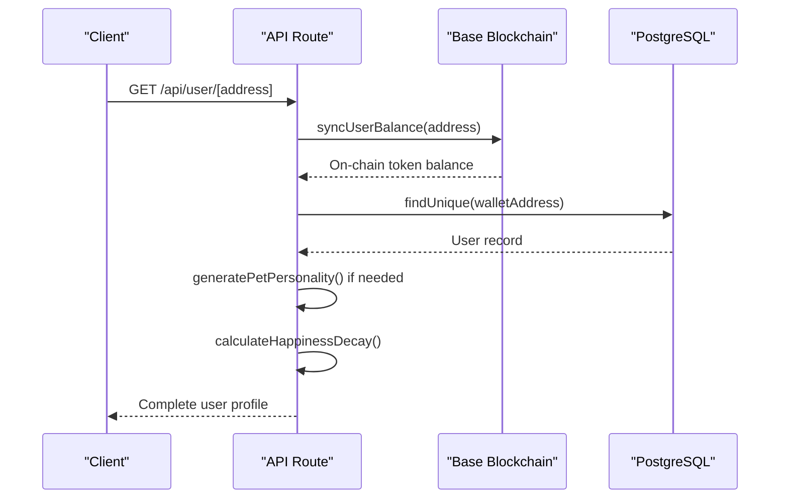
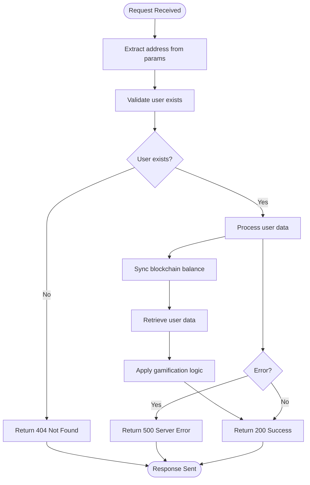

# Dynamic Routes

<cite>
**Referenced Files in This Document**   
- [app/api/user/[address]/route.ts](file://app/api/user/[address]/route.ts)
- [lib/prisma.ts](file://lib/prisma.ts)
- [lib/blockchain.ts](file://lib/blockchain.ts)
- [lib/gamification/lifeSystem.ts](file://lib/gamification/lifeSystem.ts)
- [lib/gamification/itemsConfig.ts](file://lib/gamification/itemsConfig.ts)
</cite>

## Table of Contents
1. [Introduction](#introduction)
2. [Dynamic Route Implementation](#dynamic-route-implementation)
3. [User Data Retrieval Process](#user-data-retrieval-process)
4. [Parameter Extraction and Validation](#parameter-extraction-and-validation)
5. [Security Considerations](#security-considerations)
6. [Blockchain Authentication Integration](#blockchain-authentication-integration)
7. [Error Handling](#error-handling)
8. [Performance Optimization](#performance-optimization)

## Introduction
The DiaryBeast application implements a dynamic routing system using Next.js App Router to support wallet address-based user profiles and data retrieval. This documentation details the implementation of dynamic routes for user-specific pages and API endpoints, focusing on the /[address] route pattern that enables personalized experiences based on blockchain wallet addresses.

## Dynamic Route Implementation

The dynamic routing system in DiaryBeast follows Next.js App Router conventions with a specific implementation for user profiles and data access. The application uses the [address] parameter pattern in two key locations:

1. **API Endpoint**: `app/api/user/[address]/route.ts` - Handles user data retrieval and updates
2. **Page Routes**: While not explicitly shown in the provided code, the pattern suggests similar implementation for user profile pages

The dynamic segment [address] captures the user's wallet address from the URL path, enabling address-based routing for both API requests and page rendering. This approach allows for clean, RESTful URLs like `/api/user/0x123...abc` where the wallet address serves as the unique identifier for user data.

**Section sources**
- [app/api/user/[address]/route.ts](file://app/api/user/[address]/route.ts)

## User Data Retrieval Process

The GET handler in `app/api/user/[address]/route.ts` implements a comprehensive user data retrieval process that synchronizes information from multiple sources:



**Diagram sources**
- [app/api/user/[address]/route.ts](file://app/api/user/[address]/route.ts#L1-L43)
- [lib/blockchain.ts](file://lib/blockchain.ts#L100-L111)
- [lib/gamification/lifeSystem.ts](file://lib/gamification/lifeSystem.ts#L246-L276)
- [lib/gamification/itemsConfig.ts](file://lib/gamification/itemsConfig.ts#L200-L233)

The process begins with blockchain balance synchronization, ensuring the user's token balance is up-to-date with on-chain data. It then retrieves the user record from the database, generates a pet personality if one doesn't exist (based on the wallet address hash), and applies happiness decay calculations based on the user's last activity time.

**Section sources**
- [app/api/user/[address]/route.ts](file://app/api/user/[address]/route.ts#L1-L172)
- [lib/blockchain.ts](file://lib/blockchain.ts#L100-L111)
- [lib/gamification/lifeSystem.ts](file://lib/gamification/lifeSystem.ts#L246-L276)
- [lib/gamification/itemsConfig.ts](file://lib/gamification/itemsConfig.ts#L200-L233)

## Parameter Extraction and Validation

The dynamic route extracts the wallet address parameter using Next.js's built-in parameters object. The implementation uses the modern Promise-based params pattern:

```typescript
export async function GET(req: NextRequest, { params }: { params: Promise<{ address: string }> }) {
  const { address } = await params;
  // Use address parameter
}
```

The system performs several validation and normalization steps:
- Converts the address to lowercase to ensure consistency
- Validates that the user exists in the database
- Returns a 404 status if the user is not found
- Handles errors gracefully with appropriate status codes

The PATCH endpoint also uses the same parameter extraction method, allowing users to update their profile information with the same address-based routing.

**Section sources**
- [app/api/user/[address]/route.ts](file://app/api/user/[address]/route.ts#L1-L172)

## Security Considerations

The dynamic routing system incorporates several security measures to protect user data and prevent abuse:

1. **Input Validation**: The system validates the presence of the user record before processing requests
2. **Case Normalization**: Addresses are converted to lowercase to prevent case-based enumeration attacks
3. **Error Handling**: Comprehensive error handling prevents information leakage
4. **Rate Limiting**: While not explicitly shown, the architecture suggests rate limiting should be implemented at the API gateway level

The system also follows the principle of least privilege by only exposing necessary user data through the API endpoint. Sensitive information is not included in the response, and all database operations are parameterized to prevent injection attacks.

**Section sources**
- [app/api/user/[address]/route.ts](file://app/api/user/[address]/route.ts#L1-L172)

## Blockchain Authentication Integration

The dynamic routing system integrates with the blockchain authentication system to ensure users can only access their own data when authorized. The integration works through several mechanisms:

1. **Wallet-Based Identity**: The wallet address serves as the primary identifier, eliminating the need for traditional usernames and passwords
2. **Signature Verification**: The authentication flow (shown in related files) verifies wallet signatures to confirm user ownership
3. **Data Ownership**: All user data is associated with their wallet address, ensuring proper ownership and access control

When a user authenticates, the system verifies their wallet signature and associates their session with their wallet address. Subsequent requests to dynamic routes are implicitly authorized based on this authentication state.

**Section sources**
- [app/api/user/[address]/route.ts](file://app/api/user/[address]/route.ts#L1-L172)
- [lib/blockchain.ts](file://lib/blockchain.ts#L100-L111)

## Error Handling

The system implements comprehensive error handling for various scenarios:

- **Invalid Addresses**: Returns 404 when a user is not found
- **Server Errors**: Returns 500 with error details when internal processing fails
- **Network Issues**: Gracefully handles blockchain network connectivity problems
- **Data Consistency**: Continues processing even if blockchain sync fails

The error responses include appropriate HTTP status codes and descriptive messages while avoiding the exposure of sensitive implementation details. For example, when a user is not found, the system returns a clean 404 response rather than detailed database error information.



**Diagram sources**
- [app/api/user/[address]/route.ts](file://app/api/user/[address]/route.ts#L1-L172)

**Section sources**
- [app/api/user/[address]/route.ts](file://app/api/user/[address]/route.ts#L1-L172)

## Performance Optimization

The dynamic routing implementation includes several performance optimizations:

1. **Database Optimization**: Uses Prisma's include feature to fetch related data (entry count) in a single query
2. **Conditional Updates**: Only updates happiness values when decay has actually occurred
3. **Error Resilience**: Continues processing even if blockchain synchronization fails
4. **Caching Strategy**: While not explicitly implemented, the architecture suggests opportunities for response caching

The system could be further optimized by:
- Implementing Redis or similar caching for frequent user data requests
- Adding ETag support for conditional requests
- Implementing rate limiting to prevent abuse of the API endpoint
- Using CDN caching for static profile data

The current implementation balances performance with data freshness by synchronizing blockchain balances on each request, ensuring users always see their most up-to-date token balance.

**Section sources**
- [app/api/user/[address]/route.ts](file://app/api/user/[address]/route.ts#L1-L172)
- [lib/blockchain.ts](file://lib/blockchain.ts#L100-L111)
- [lib/prisma.ts](file://lib/prisma.ts#L1-L9)