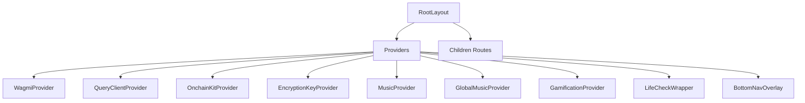
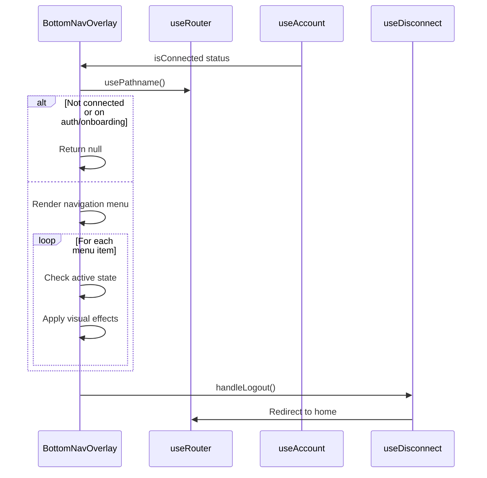

# Navigation Patterns

<cite>
**Referenced Files in This Document**   
- [app/layout.tsx](file://app/layout.tsx)
- [components/BottomNavOverlay.tsx](file://components/BottomNavOverlay.tsx)
- [app/providers.tsx](file://app/providers.tsx)
- [app/diary/page.tsx](file://app/diary/page.tsx)
- [app/insights/page.tsx](file://app/insights/page.tsx)
- [app/shop/page.tsx](file://app/shop/page.tsx)
- [app/profile/page.tsx](file://app/profile/page.tsx)
- [app/info/page.tsx](file://app/info/page.tsx)
</cite>

## Table of Contents
1. [Introduction](#introduction)
2. [RootLayout Structure](#rootlayout-structure)
3. [BottomNavOverlay Component](#bottomnavoverlay-component)
4. [Navigation Menu Structure](#navigation-menu-structure)
5. [Conditional Rendering Logic](#conditional-rendering-logic)
6. [Active State Indication](#active-state-indication)
7. [Accessibility and Responsive Design](#accessibility-and-responsive-design)
8. [Navigation State Persistence](#navigation-state-persistence)
9. [Extension Guidelines](#extension-guidelines)
10. [Conclusion](#conclusion)

## Introduction
DiaryBeast implements a mobile-first navigation architecture centered around the BottomNavOverlay component, which serves as the primary navigation interface for authenticated users. The navigation system is integrated with Next.js routing and Wagmi wallet state to provide a seamless user experience across different authentication states and routes. This document details the implementation of the navigation architecture, focusing on the RootLayout structure, BottomNavOverlay functionality, menu organization, and responsive behavior.

**Section sources**
- [app/layout.tsx](file://app/layout.tsx#L1-L48)
- [components/BottomNavOverlay.tsx](file://components/BottomNavOverlay.tsx#L1-L205)

## RootLayout Structure
The RootLayout component in layout.tsx provides the foundational structure for the application, establishing shared providers and global UI elements that persist across all routes. It imports and configures three font families (Inter, JetBrains_Mono, and Chakra_Petch) as CSS variables, which are applied to the HTML element to ensure consistent typography throughout the application.

The layout wraps all children components with the Providers component, which manages global state and services including wallet connection (Wagmi), blockchain interactions (OnchainKit), data fetching (React Query), and application-specific contexts (encryption, music, gamification). This provider pattern ensures that all nested components have access to necessary state and services without requiring individual imports.



**Diagram sources**
- [app/layout.tsx](file://app/layout.tsx#L1-L48)
- [app/providers.tsx](file://app/providers.tsx#L1-L55)

**Section sources**
- [app/layout.tsx](file://app/layout.tsx#L1-L48)
- [app/providers.tsx](file://app/providers.tsx#L1-L55)

## BottomNavOverlay Component
The BottomNavOverlay component serves as the primary mobile navigation interface in DiaryBeast, providing persistent access to key application features. Implemented as a client-side component, it leverages Next.js navigation hooks (usePathname, useRouter) and Wagmi wallet state (useAccount, useDisconnect) to manage navigation and authentication state.

The component is positioned fixed at the bottom of the viewport with a high z-index (z-50), ensuring it remains visible above other content. It features a semi-transparent background with backdrop blur and a cyan glow effect, creating a futuristic, glowing interface that aligns with the application's visual design language. The navigation container uses a pill-shaped border radius (rounded-[50px]) with a subtle white border and multiple shadow layers to create depth.



**Diagram sources**
- [components/BottomNavOverlay.tsx](file://components/BottomNavOverlay.tsx#L1-L205)

**Section sources**
- [components/BottomNavOverlay.tsx](file://components/BottomNavOverlay.tsx#L1-L205)

## Navigation Menu Structure
The BottomNavOverlay implements a three-section navigation menu structure optimized for mobile thumb reach, with items organized into left, center, and right sections. This layout follows mobile UX best practices by placing the most frequently used action (diary entry) in the center, within easy reach of the user's thumb.

The left section contains three primary navigation items: Insights, Shop, and Profile. These are rendered as purple-tinted icons with corresponding labels. The center section features the Diary icon in cyan, representing the core functionality of the application. The right section includes Info, Leaderboard, and Logout, with the Leaderboard currently locked (grayed out) and Logout using a red color scheme to indicate a destructive action.

Each menu item is implemented as a Link component (for navigation) or button (for actions), with consistent styling including a rounded container, drop shadow, and hover effects. The touch targets are sized at 56px (w-14 h-14), exceeding the recommended minimum of 48px for mobile interfaces, ensuring accessibility and ease of use.

```mermaid
flowchart TD
A[BottomNavOverlay] --> B[Left Section]
A --> C[Center Section]
A --> D[Right Section]
B --> B1[Insights]
B --> B2[Shop]
B --> B3[Profile]
C --> C1[Diary]
D --> D1[Info]
D --> D2[Leaderboard]
D --> D3[Logout]
B1 --> |href| E[/insights]
B2 --> |href| F[/shop]
B3 --> |href| G[/profile]
C1 --> |href| H[/diary]
D1 --> |href| I[/info]
D2 --> |href| J[/leaderboard]
D3 --> |onClick| K[handleLogout]
```

**Diagram sources**
- [components/BottomNavOverlay.tsx](file://components/BottomNavOverlay.tsx#L1-L205)

**Section sources**
- [components/BottomNavOverlay.tsx](file://components/BottomNavOverlay.tsx#L1-L205)

## Conditional Rendering Logic
The BottomNavOverlay employs sophisticated conditional rendering logic to control visibility based on authentication state and current route. The component uses the useAccount hook from Wagmi to determine wallet connection status and the usePathname hook from Next.js to identify the current route.

The navigation menu is hidden when any of the following conditions are met: the user is not connected to their wallet, the current pathname is the root route ('/'), or the user is on the onboarding page ('/onboarding'). This ensures the navigation interface only appears for authenticated users who have completed onboarding and are accessing feature routes.

The logout functionality is implemented through the useDisconnect hook from Wagmi, which handles wallet disconnection, combined with router.push('/') to redirect the user to the home page after logout. The Leaderboard item is conditionally rendered as disabled (cursor-not-allowed, opacity-50) with no onClick handler, indicating it is a locked feature.

**Section sources**
- [components/BottomNavOverlay.tsx](file://components/BottomNavOverlay.tsx#L1-L205)

## Active State Indication
The BottomNavOverlay provides clear visual feedback for active navigation states through multiple design elements. When a menu item corresponds to the current route, it receives several visual enhancements: a cyan border (borderColor: rgba(0, 229, 255, 1)), a semi-transparent cyan background (backgroundColor: rgba(0, 229, 255, 0.4)), and a glowing cyan shadow (boxShadow: 0 0 20px rgba(0, 229, 255, 0.6)).

Additional micro-interactions enhance the user experience: active items scale up slightly (scale-110) and feature a slow pulsing animation (animate-pulse-slow), while all items scale up on hover (hover:scale-110). The icon within active items also scales up (scale-110), creating a layered animation effect. Text labels for active items use the primary text color, while inactive items use a semi-transparent white (text-white/80).

These visual cues create a clear distinction between the current route and other navigation options, helping users understand their location within the application's information architecture at a glance.

**Section sources**
- [components/BottomNavOverlay.tsx](file://components/BottomNavOverlay.tsx#L1-L205)

## Accessibility and Responsive Design
The BottomNavOverlay implements several accessibility and responsive design features to ensure usability across devices and for users with different needs. The navigation container is positioned fixed at the bottom of the viewport with proper centering (left-1/2 -translate-x-1/2), ensuring it remains accessible on various screen sizes.

Touch targets are generously sized at 56px square (w-14 h-14), exceeding the WCAG recommendation of 44px for touch interfaces, reducing the likelihood of mis-taps. The pointer-events-auto class on the inner container ensures only the navigation elements are interactive, while pointer-events-none on the outer container prevents interference with other UI elements.

Visual accessibility is addressed through sufficient color contrast, drop shadows that enhance visibility against various backgrounds, and text labels with uppercase formatting and tracking (tracking-wider) for improved readability. The use of both color and shape differences (lock icon for disabled leaderboard) supports users with color vision deficiencies.

**Section sources**
- [components/BottomNavOverlay.tsx](file://components/BottomNavOverlay.tsx#L1-L205)

## Navigation State Persistence
Navigation state in DiaryBeast is managed through a combination of client-side routing and wallet authentication state. The BottomNavOverlay component, being a client-side component, maintains its state across route changes within the same session. When a user navigates between routes, the React component instance persists, preserving its internal state and re-rendering only when necessary.

The usePathname hook automatically updates when the route changes, triggering a re-render of the BottomNavOverlay to update active state indicators. Authentication state is managed by Wagmi's useAccount hook, which listens for wallet connection and disconnection events, automatically updating the component's visibility.

Page reloads are handled gracefully: when a user refreshes the page, the RootLayout and Providers components initialize first, restoring wallet connection state through Wagmi's persistence layer. The BottomNavOverlay then checks this restored state to determine whether to display the navigation menu, ensuring a consistent experience across sessions.

**Section sources**
- [components/BottomNavOverlay.tsx](file://components/BottomNavOverlay.tsx#L1-L205)
- [app/layout.tsx](file://app/layout.tsx#L1-L48)

## Extension Guidelines
To extend the navigation with new routes while maintaining visual consistency, follow these guidelines:

1. Add new menu items to the appropriate section (left, center, or right) in the BottomNavOverlay component
2. Use consistent icon styling with the filter property to maintain the application's color scheme
3. Implement active state styling using the existing pattern of cyan border, background, and shadow
4. Ensure touch targets are at least 56px square for accessibility
5. Use the same font family (Chakra_Petch) and text styling (text-[8px] font-mono uppercase tracking-wider)
6. Apply consistent hover effects (hover:scale-110) and animations
7. Integrate with Next.js routing using the Link component for navigation items
8. For action items, use button elements with appropriate onClick handlers
9. Consider the user's thumb reach when positioning items (center for most frequent actions)
10. Maintain the visual hierarchy with color coding (cyan for primary, purple for secondary, red for destructive)

When adding new routes, ensure they are properly defined in the app directory structure and that the corresponding page components import necessary providers and contexts from the RootLayout.

**Section sources**
- [components/BottomNavOverlay.tsx](file://components/BottomNavOverlay.tsx#L1-L205)

## Conclusion
The navigation architecture in DiaryBeast effectively combines mobile-first design principles with Web3 authentication patterns to create an intuitive and engaging user experience. The BottomNavOverlay component serves as a persistent, context-aware navigation interface that adapts to authentication state and current route, providing users with seamless access to key features.

By leveraging Next.js routing hooks and Wagmi wallet state, the navigation system maintains consistency across route changes and page reloads while providing clear visual feedback for active states. The three-section layout optimizes for mobile thumb reach, and the implementation of accessibility features ensures usability across different devices and user needs.

The modular design of the RootLayout and Providers components allows for easy extension and maintenance, making it straightforward to add new routes and features while preserving visual and functional consistency throughout the application.