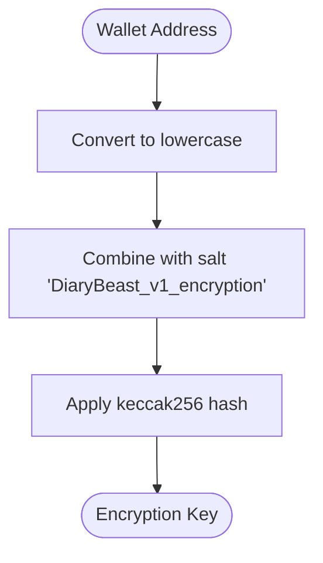

# Key Management

<cite>
**Referenced Files in This Document**   
- [EncryptionKeyContext.tsx](file://lib/EncryptionKeyContext.tsx)
- [encryption.ts](file://lib/encryption.ts)
- [providers.tsx](file://app/providers.tsx)
- [EntryViewer.tsx](file://components/EntryViewer.tsx)
- [page.tsx](file://app/diary/page.tsx)
</cite>

## Table of Contents
1. [Introduction](#introduction)
2. [Encryption Key Context](#encryption-key-context)
3. [Key Derivation Process](#key-derivation-process)
4. [Provider Implementation](#provider-implementation)
5. [Hook Usage](#hook-usage)
6. [Component Integration](#component-integration)
7. [Security Considerations](#security-considerations)
8. [Common Issues](#common-issues)

## Introduction
The encryption key management system in DiaryBeast provides a secure mechanism for handling user journal entries through client-side encryption. This system ensures that only the user can access their content by deriving encryption keys from their wallet address. The implementation uses React Context to make the encryption key available throughout the application while maintaining security and performance.

## Encryption Key Context

The `EncryptionKeyContext` provides a React context wrapper for accessing the derived encryption key. It defines the context type with two properties: `encryptionKey` which can be a string or null, and `isLoading` which indicates the loading state. The context is initialized with an undefined value to ensure proper error handling when used outside the provider.

**Diagram sources**
- [EncryptionKeyContext.tsx](file://lib/EncryptionKeyContext.tsx#L6-L9)
- [EncryptionKeyContext.tsx](file://lib/EncryptionKeyContext.tsx#L20-L35)
- [EncryptionKeyContext.tsx](file://lib/EncryptionKeyContext.tsx#L37-L43)

**Section sources**
- [EncryptionKeyContext.tsx](file://lib/EncryptionKeyContext.tsx#L6-L13)

## Key Derivation Process

The key derivation process uses the wallet address combined with a salt value to generate a deterministic encryption key. This approach ensures that the same key is generated across different devices while maintaining security. The `getEncryptionKey` function takes the wallet address as input, converts it to lowercase, combines it with a predefined salt, and applies the keccak256 hash function to produce the final key.

**Diagram sources**
- [encryption.ts](file://lib/encryption.ts#L8-L12)

**Section sources**
- [encryption.ts](file://lib/encryption.ts#L8-L12)

## Provider Implementation

The `EncryptionKeyProvider` component uses the `useAccount` hook from Wagmi to detect wallet connection status and automatically derive the encryption key when an address is available. The provider leverages React's `useMemo` hook to prevent unnecessary recalculations of the encryption key, only recomputing when the address or connection status changes. When no wallet is connected, the encryption key is set to null.

**Diagram sources**
- [EncryptionKeyContext.tsx](file://lib/EncryptionKeyContext.tsx#L20-L35)
- [encryption.ts](file://lib/encryption.ts#L8-L12)

**Section sources**
- [EncryptionKeyContext.tsx](file://lib/EncryptionKeyContext.tsx#L20-L35)

## Hook Usage

The `useEncryptionKey` hook enables components to securely access the encryption key or null if disconnected. It uses React's `useContext` to consume the `EncryptionKeyContext` and includes a safety check to ensure it is used within the `EncryptionKeyProvider`. If used outside the provider, it throws an error to prevent undefined behavior.

**Diagram sources**
- [EncryptionKeyContext.tsx](file://lib/EncryptionKeyContext.tsx#L37-L43)

**Section sources**
- [EncryptionKeyContext.tsx](file://lib/EncryptionKeyContext.tsx#L37-L43)

## Component Integration

The encryption key system is integrated into various components throughout the application. The `EncryptionKeyProvider` is wrapped around the application in `providers.tsx`, making the context available to all child components. Components like `TextEditor` and `EntryViewer` use the `useEncryptionKey` hook to access the encryption key for encrypting and decrypting journal entries.

**Diagram sources**
- [providers.tsx](file://app/providers.tsx#L31-L54)
- [page.tsx](file://app/diary/page.tsx#L16-L260)
- [EntryViewer.tsx](file://components/EntryViewer.tsx#L19-L123)

**Section sources**
- [providers.tsx](file://app/providers.tsx#L31-L54)
- [page.tsx](file://app/diary/page.tsx#L16-L260)
- [EntryViewer.tsx](file://components/EntryViewer.tsx#L19-L123)

## Security Considerations

The encryption key management system stores keys in memory rather than persisting them to storage, reducing the risk of exposure. Sensitive operations remain isolated to the client side, ensuring that encryption and decryption never occur on the server. The deterministic key derivation allows consistent key generation across devices without requiring additional signatures. However, users must be aware that losing access to their wallet means losing access to their encrypted entries.

**Section sources**
- [EncryptionKeyContext.tsx](file://lib/EncryptionKeyContext.tsx#L15-L18)
- [encryption.ts](file://lib/encryption.ts#L14-L21)

## Common Issues

Common issues include handling disconnected wallet states and ensuring proper context initialization. When a wallet is disconnected, components must gracefully handle the null encryption key state. The `useMemo` optimization prevents unnecessary key recalculations during re-renders. Proper initialization requires wrapping components with `EncryptionKeyProvider` before using `useEncryptionKey`, as attempting to use the hook outside the provider context will throw an error.

**Section sources**
- [EncryptionKeyContext.tsx](file://lib/EncryptionKeyContext.tsx#L23-L26)
- [EncryptionKeyContext.tsx](file://lib/EncryptionKeyContext.tsx#L38-L42)