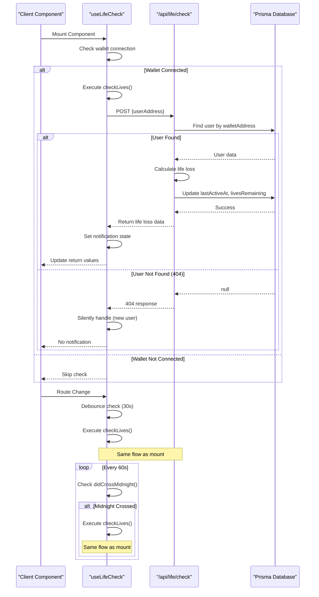
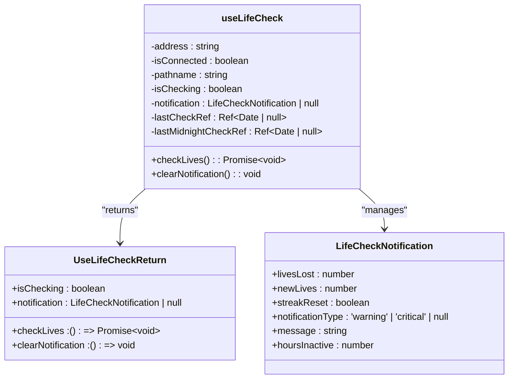

# Custom State Hooks

<cite>
**Referenced Files in This Document**   
- [useLifeCheck.ts](file://hooks/useLifeCheck.ts)
- [LifeCheckWrapper.tsx](file://components/LifeCheckWrapper.tsx)
- [useAuth.ts](file://lib/useAuth.ts)
- [route.ts](file://app/api/life/check/route.ts)
- [lifeSystem.ts](file://lib/gamification/lifeSystem.ts)
</cite>

## Table of Contents
1. [Introduction](#introduction)
2. [Core Components](#core-components)
3. [useLifeCheck Hook Architecture](#uselifecheck-hook-architecture)
4. [Life Check Integration Flow](#life-check-integration-flow)
5. [State Management Patterns](#state-management-patterns)
6. [Error Handling and Edge Cases](#error-handling-and-edge-cases)
7. [Best Practices in Hook Design](#best-practices-in-hook-design)
8. [Debugging Strategies](#debugging-strategies)
9. [Related State Hooks](#related-state-hooks)
10. [Conclusion](#conclusion)

## Introduction
This document provides a comprehensive analysis of custom React hooks that abstract complex state logic in the DiaryBeast application, with a primary focus on the `useLifeCheck` hook. The hook implements a sophisticated pet health monitoring system that checks life status at critical moments including component mount, route changes, and midnight crossing events. The documentation details the integration between client-side hooks and server-side API endpoints, explains the state management patterns using React's useCallback, useRef, and useEffect hooks, and examines the notification system for life loss events. The analysis also covers related state management hooks and best practices for building robust, maintainable custom hooks in React applications.

## Core Components

The DiaryBeast application implements a comprehensive life management system centered around the `useLifeCheck` custom hook. This hook serves as the primary mechanism for monitoring pet health status by checking life conditions at critical moments in the user journey. The system integrates client-side React hooks with server-side API endpoints to create a seamless experience that notifies users of life loss events while maintaining optimal performance through debounced checks and efficient state management.

The hook's primary responsibility is to trigger life status checks when users mount components, change routes, or cross midnight boundaries in their local time. It communicates with the `/api/life/check` endpoint via POST requests containing the user's wallet address, receiving detailed information about life loss, streak resets, and notification requirements. The response data is used to update the UI through notification components that display appropriate messages based on the severity of life loss events.

**Section sources**
- [useLifeCheck.ts](file://hooks/useLifeCheck.ts#L1-L153)
- [LifeCheckWrapper.tsx](file://components/LifeCheckWrapper.tsx#L1-L59)
- [route.ts](file://app/api/life/check/route.ts#L1-L145)

## useLifeCheck Hook Architecture

```mermaid
flowchart TD
A["useLifeCheck Hook"] --> B["State Management"]
A --> C["Effect Triggers"]
A --> D["API Integration"]
B --> B1["isChecking: boolean"]
B --> B2["notification: LifeCheckNotification | null"]
B --> B3["lastCheckRef: useRef<Date | null>"]
B --> B4["lastMidnightCheckRef: useRef<Date | null>"]
C --> C1["Mount: Wallet Connect"]
C --> C2["Route Change"]
C --> C3["Midnight Crossing Interval"]
D --> D1["POST /api/life/check"]
D --> D2["Request: { userAddress }"]
D --> D3["Response: Life loss data"]
D --> D4["Error Handling: 404, Network"]
E["Return Values"] --> E1["checkLives(): Promise<void>"]
E --> E2["isChecking: boolean"]
E --> E3["notification: LifeCheckNotification | null"]
E --> E4["clearNotification(): void"]
A --> E
```

**Diagram sources**
- [useLifeCheck.ts](file://hooks/useLifeCheck.ts#L44-L152)

**Section sources**
- [useLifeCheck.ts](file://hooks/useLifeCheck.ts#L44-L152)

## Life Check Integration Flow

**Diagram sources**
- [useLifeCheck.ts](file://hooks/useLifeCheck.ts#L44-L152)
- [route.ts](file://app/api/life/check/route.ts#L1-L145)

**Section sources**
- [useLifeCheck.ts](file://hooks/useLifeCheck.ts#L44-L152)
- [route.ts](file://app/api/life/check/route.ts#L1-L145)

## State Management Patterns

The `useLifeCheck` hook implements several advanced React patterns for effective state management. It uses `useCallback` to memoize the `checkLives` function and `clearNotification` handler, preventing unnecessary re-renders and ensuring consistent function references across renders. The hook leverages `useRef` to maintain mutable references to the last check time and last midnight check time, allowing the component to track temporal state without triggering re-renders.

The hook's dependency arrays are carefully constructed to ensure proper execution timing. The mount effect depends on `address` and `isConnected` to trigger only when the wallet connects. The route change effect depends solely on `pathname` to execute on navigation events. The interval effect includes `checkLives` in its dependency array, properly handling the function reference while maintaining the interval's stability.

**Diagram sources**
- [useLifeCheck.ts](file://hooks/useLifeCheck.ts#L7-L21)

**Section sources**
- [useLifeCheck.ts](file://hooks/useLifeCheck.ts#L1-L153)

## Error Handling and Edge Cases

The life check system implements comprehensive error handling for various edge cases and failure scenarios. When the API returns a 404 status, indicating the user hasn't signed in yet, the hook silently handles this case without displaying errors to the user. Network errors and other API failures are caught and logged to the console without disrupting the user experience.

The system handles the edge case of new users who haven't established a database record yet by treating 404 responses as valid scenarios rather than errors. For users who temporarily lose connection or experience network interruptions, the hook's debouncing mechanism (30-second minimum between checks) prevents excessive API calls and potential rate limiting issues.

The midnight crossing detection uses the `didCrossMidnight` utility function from the gamification library to determine if the user has crossed a day boundary, even if less than 24 hours have passed. This ensures that life loss calculations occur at the appropriate time regardless of the user's activity patterns.

**Section sources**
- [useLifeCheck.ts](file://hooks/useLifeCheck.ts#L70-L90)
- [route.ts](file://app/api/life/check/route.ts#L1-L145)
- [lifeSystem.ts](file://lib/gamification/lifeSystem.ts#L1-L345)

## Best Practices in Hook Design

The `useLifeCheck` hook exemplifies several best practices in custom React hook design. The dependency arrays in useEffect hooks are precisely defined to avoid infinite loops and ensure proper execution timing. The cleanup function in the interval effect properly clears the interval timer to prevent memory leaks when the component unmounts or dependencies change.

The hook implements debouncing logic to prevent spam checks, limiting executions to once every 30 seconds. This optimization reduces unnecessary API calls and improves application performance. The use of useRef for tracking temporal state avoids unnecessary re-renders while maintaining accurate timing information.

TypeScript interfaces are used to define clear contracts for the hook's return values and notification data structure, providing excellent IDE support and preventing type-related bugs. The hook's documentation includes detailed JSDoc comments explaining its features, usage patterns, and expected behavior.

**Section sources**
- [useLifeCheck.ts](file://hooks/useLifeCheck.ts#L1-L153)

## Debugging Strategies

Effective debugging of the life check system requires understanding the asynchronous nature of the checks and the timing dependencies involved. When troubleshooting timing-related bugs, developers should verify that the interval is properly cleared on unmount and that the midnight crossing detection works correctly across different time zones.

For asynchronous state checks, logging the sequence of events and timing information can help identify issues with the debouncing mechanism or interval execution. Monitoring the network requests to the `/api/life/check` endpoint can reveal problems with authentication, payload formatting, or response handling.

Common issues include improper dependency arrays causing infinite loops, missing cleanup functions leading to memory leaks, and timezone-related bugs in the midnight crossing detection. The console.error statements in the catch blocks provide valuable information for diagnosing API communication problems.

**Section sources**
- [useLifeCheck.ts](file://hooks/useLifeCheck.ts#L70-L90)
- [route.ts](file://app/api/life/check/route.ts#L1-L145)

## Related State Hooks

The application includes other state management hooks that follow similar design patterns. The `useAuth` hook manages wallet connection state and user authentication, using useCallback for the authenticate function and useEffect for handling address changes. It implements timeout logic for signature requests and proper error handling for user rejection scenarios.

These hooks share common patterns including proper dependency array management, cleanup functions for side effects, and clear return value contracts. They demonstrate a consistent approach to state management across the application, making the codebase more maintainable and predictable.

**Section sources**
- [useAuth.ts](file://lib/useAuth.ts#L1-L100)
- [useLifeCheck.ts](file://hooks/useLifeCheck.ts#L1-L153)

## Conclusion

The `useLifeCheck` hook represents a sophisticated implementation of React's state management capabilities, effectively abstracting complex pet health monitoring logic into a reusable component. By leveraging useCallback, useRef, and useEffect hooks with carefully constructed dependency arrays, the implementation achieves optimal performance while maintaining reliability.

The integration between client-side hooks and server-side API endpoints creates a seamless user experience for monitoring pet health status. The comprehensive error handling and edge case management ensure robust behavior across various scenarios, from new user onboarding to network interruptions.

The hook serves as an excellent example of custom React hook design, demonstrating best practices in dependency management, cleanup functions, and type safety. Its architecture provides a solid foundation for extending the life management system with additional features while maintaining code quality and performance.