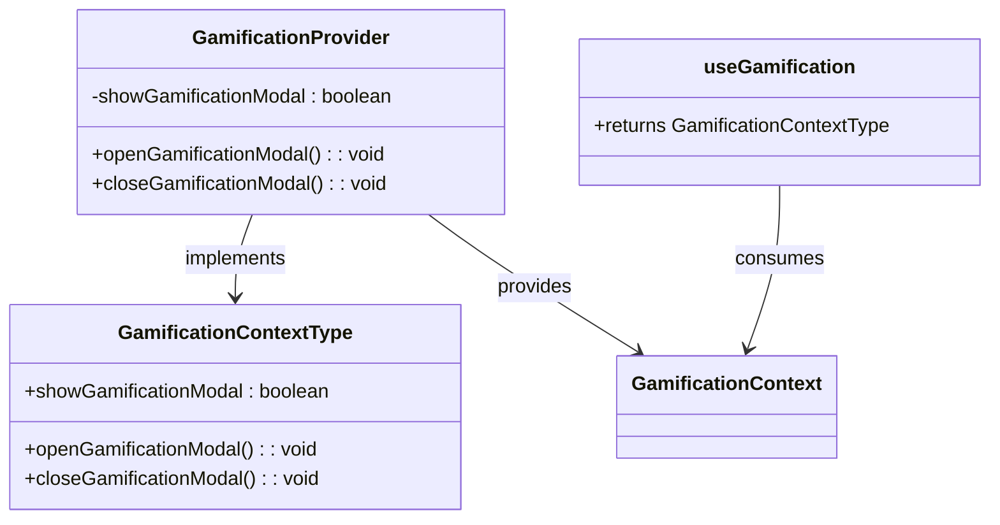
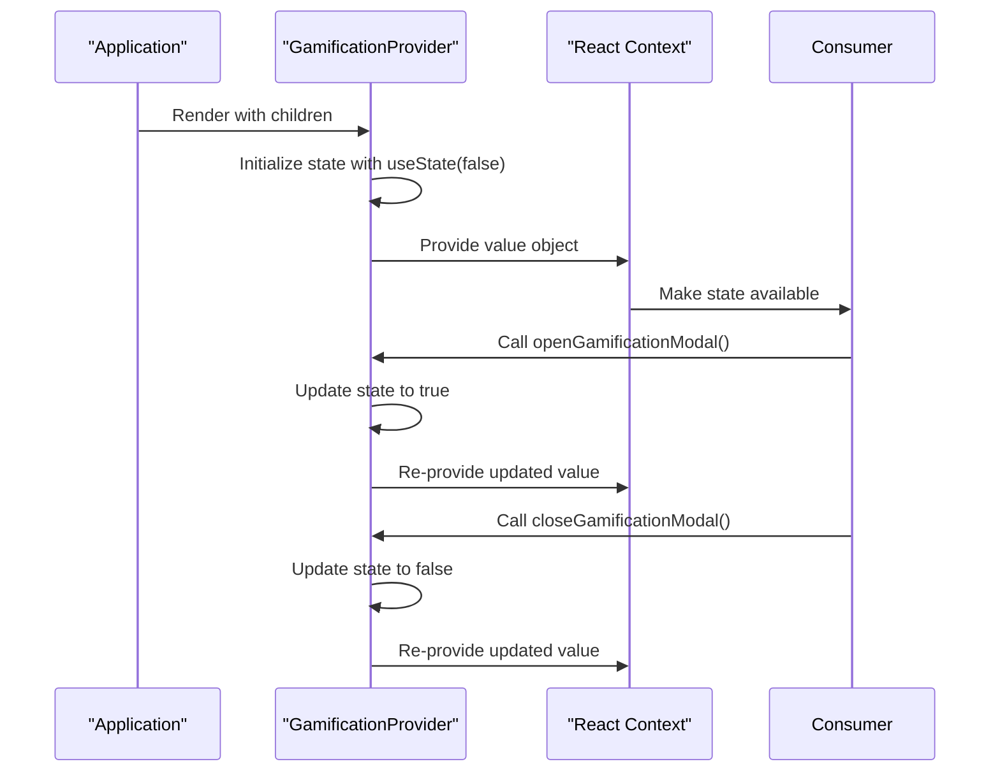
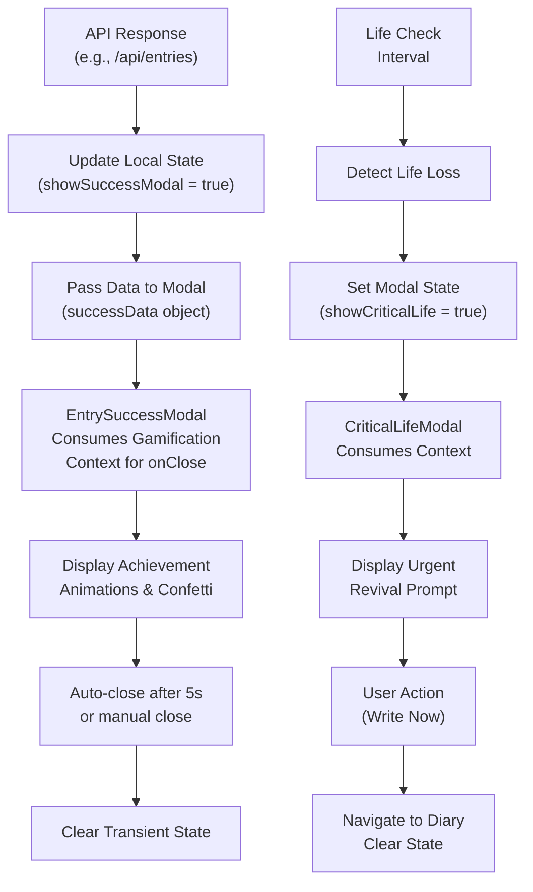

# Gamification UI State Context

<cite>
**Referenced Files in This Document**   
- [GamificationContext.tsx](file://lib/contexts/GamificationContext.tsx)
- [GamificationModal.tsx](file://components/GamificationModal.tsx)
- [CriticalLifeModal.tsx](file://components/CriticalLifeModal.tsx)
- [EntrySuccessModal.tsx](file://components/EntrySuccessModal.tsx)
- [providers.tsx](file://app/providers.tsx)
- [diary/page.tsx](file://app/diary/page.tsx)
</cite>

## Table of Contents
1. [Introduction](#introduction)
2. [Context Architecture](#context-architecture)
3. [Provider Implementation](#provider-implementation)
4. [Consumer Pattern and Modal Integration](#consumer-pattern-and-modal-integration)
5. [Transient State Lifecycle](#transient-state-lifecycle)
6. [Accessibility Considerations](#accessibility-considerations)
7. [Performance Optimization](#performance-optimization)
8. [Troubleshooting Guide](#troubleshooting-guide)

## Introduction

The GamificationContext provides a centralized state management solution for transient UI states in the DiaryBeast application. This context enables the display of gamification events such as achievement unlocks, life loss notifications, and entry success modals across the application without requiring prop drilling. The context manages temporary states that are triggered by user actions and API responses, then automatically cleared after user interaction or timeout periods.

The system is designed to enhance user engagement through visual feedback and emotional connection with the pet companion, while maintaining performance through proper state management practices. The context specifically handles modal visibility states and coordinates with various gamification components to provide a cohesive user experience.

**Section sources**
- [GamificationContext.tsx](file://lib/contexts/GamificationContext.tsx#L1-L37)

## Context Architecture

The GamificationContext follows React's Context API pattern to provide a global state layer accessible to any component within the provider hierarchy. The context is defined with a TypeScript interface that specifies the shape of the state and available actions:

**Diagram sources**
- [GamificationContext.tsx](file://lib/contexts/GamificationContext.tsx#L4-L8)

The context architecture consists of three main components:
1. **GamificationContextType interface**: Defines the shape of the context value with type safety
2. **GamificationProvider component**: Manages the actual state and provides it to consumers
3. **useGamification hook**: Custom hook that encapsulates context consumption with error handling

The context currently manages the visibility state of the gamification guide modal, with extensibility for additional transient states. This focused scope prevents unnecessary re-renders while providing the necessary functionality for the gamification system.

**Section sources**
- [GamificationContext.tsx](file://lib/contexts/GamificationContext.tsx#L4-L37)

## Provider Implementation

The GamificationProvider component wraps the application and provides the gamification state to all child components. It is implemented as a functional component that uses React's useState hook to manage the modal visibility state:

**Diagram sources**
- [GamificationContext.tsx](file://lib/contexts/GamificationContext.tsx#L12-L29)
- [providers.tsx](file://app/providers.tsx#L31-L54)

The provider is integrated into the application's component hierarchy through the Providers wrapper in `providers.tsx`. It is positioned to wrap the main application content while being wrapped by other necessary providers like EncryptionKeyProvider and MusicProvider. This hierarchical arrangement ensures that the gamification context has access to the required dependencies while being available to all UI components that need to display gamification events.

The implementation follows React best practices by memoizing the value object to prevent unnecessary re-renders of consumers when the provider re-renders for other reasons. The state update functions (open/close) are defined outside the render cycle to maintain referential equality.

**Section sources**
- [GamificationContext.tsx](file://lib/contexts/GamificationContext.tsx#L12-L29)
- [providers.tsx](file://app/providers.tsx#L31-L54)

## Consumer Pattern and Modal Integration

Components consume the gamification context through the useGamification custom hook, which provides type-safe access to the context value with built-in error handling. The hook throws an error if used outside the provider scope, preventing runtime issues.

The primary integration points are the modal components that display gamification events:

**Diagram sources**
- [diary/page.tsx](file://app/diary/page.tsx#L16-L260)
- [EntrySuccessModal.tsx](file://components/EntrySuccessModal.tsx#L30-L245)
- [CriticalLifeModal.tsx](file://components/CriticalLifeModal.tsx#L22-L115)

The EntrySuccessModal and CriticalLifeModal components demonstrate different patterns of context usage:

1. **EntrySuccessModal**: Triggered by successful API responses from `/api/entries`, this modal displays achievement unlocks including streak bonuses and tokens earned. It uses the context's close function to handle both automatic dismissal after 5 seconds and manual closure by the user.

2. **CriticalLifeModal**: Displayed when the pet has lost all lives due to inactivity, this modal creates urgency with its visual design and limited dismissal options. It consumes the context to coordinate state but also uses Next.js router for navigation when the user chooses to write an entry.

Both modals receive their trigger state from parent components (typically page-level state) while using the gamification context specifically for the close functionality and modal coordination.

**Section sources**
- [diary/page.tsx](file://app/diary/page.tsx#L16-L260)
- [EntrySuccessModal.tsx](file://components/EntrySuccessModal.tsx#L30-L245)
- [CriticalLifeModal.tsx](file://components/CriticalLifeModal.tsx#L22-L115)

## Transient State Lifecycle

The lifecycle of transient gamification states follows a consistent pattern from trigger to cleanup:

1. **Trigger**: States are initiated by specific events:
   - API responses (e.g., successful entry save)
   - Timer-based checks (e.g., life loss detection)
   - User interactions (e.g., clicking help button)

2. **Activation**: The triggering component sets the appropriate state flag (e.g., `showSuccessModal = true`) and passes relevant data to the modal.

3. **Display**: The modal component renders based on its `isOpen` prop and consumes the gamification context for dismissal functionality.

4. **Interaction**: Users can either wait for automatic dismissal or manually close the modal.

5. **Cleanup**: The close function updates the context state, causing the modal to unmount and clearing the transient state.

For example, when a user successfully saves a diary entry:
- The API response includes reward data and life restoration information
- The page component sets `showSuccessModal = true` and populates `successData`
- The EntrySuccessModal displays with confetti animation and achievement details
- After 5 seconds, the modal automatically closes via the context's close function
- The transient state is cleared, allowing for future notifications

This lifecycle ensures that gamification events are timely, non-intrusive, and don't accumulate or interfere with subsequent interactions.

**Section sources**
- [diary/page.tsx](file://app/diary/page.tsx#L16-L260)
- [EntrySuccessModal.tsx](file://components/EntrySuccessModal.tsx#L30-L245)
- [CriticalLifeModal.tsx](file://components/CriticalLifeModal.tsx#L22-L115)

## Accessibility Considerations

The modal components implement several accessibility features to ensure usability for all users:

1. **Focus Management**: While explicit focus trapping code wasn't found in the current implementation, the modals use proper interactive elements with semantic HTML. The close buttons and action buttons are keyboard accessible.

2. **Screen Reader Support**: The modals use appropriate ARIA roles and semantic HTML elements:
   - Dialog containers use appropriate heading levels (h2, h3)
   - Interactive elements have descriptive text
   - Visual icons are accompanied by text alternatives

3. **Keyboard Navigation**: All interactive elements can be accessed via keyboard:
   - Close buttons (×) are focusable
   - Primary action buttons are focusable
   - Clicking outside the modal (for EntrySuccessModal) closes it

4. **Visual Indicators**: The modals provide clear visual feedback:
   - High contrast between modal and backdrop
   - Animated transitions for better orientation
   - Clear visual hierarchy of information

5. **Timing Considerations**: The EntrySuccessModal balances automated behavior with user control:
   - 5-second auto-dismissal provides reasonable time to read
   - Manual close option allows immediate dismissal
   - Confetti animation is decorative and doesn't interfere with reading

The CriticalLifeModal, being a critical notification, prevents dismissal without action, ensuring users acknowledge the pet's status. This creates urgency while still providing clear action paths.

**Section sources**
- [EntrySuccessModal.tsx](file://components/EntrySuccessModal.tsx#L30-L245)
- [CriticalLifeModal.tsx](file://components/CriticalLifeModal.tsx#L22-L115)

## Performance Optimization

The gamification context implementation includes several performance optimizations to prevent unnecessary re-renders:

1. **Memoized Context Value**: The value object passed to the Context.Provider is stable between renders when the underlying state hasn't changed, preventing consumers from re-rendering unnecessarily.

2. **Selective State Updates**: The context manages only modal visibility states, keeping the context value minimal and reducing the likelihood of re-renders.

3. **Proper Hook Usage**: The useGamification hook maintains referential equality of the returned functions, preventing downstream components from re-rendering due to function recreation.

4. **Conditional Rendering**: Modal components use early returns (`if (!isOpen) return null`) to avoid expensive render calculations when not visible.

5. **Event Cleanup**: The EntrySuccessModal properly cleans up its interval and timeout in the useEffect cleanup function, preventing memory leaks.

The architecture avoids common performance pitfalls such as:
- Passing large data objects through context (data is passed directly to modals)
- Frequent state updates that could trigger re-renders
- Complex calculations within the provider component

By following these optimization patterns, the gamification system provides rich user feedback without impacting application performance.

**Section sources**
- [GamificationContext.tsx](file://lib/contexts/GamificationContext.tsx#L12-L29)
- [EntrySuccessModal.tsx](file://components/EntrySuccessModal.tsx#L30-L245)

## Troubleshooting Guide

### Modal Stacking
**Issue**: Multiple modals appear simultaneously, creating a confusing user experience.
**Solution**: Ensure only one modal state flag is active at a time in the parent component. Use mutually exclusive state management (e.g., if `showSuccessModal` is true, ensure `showCriticalLife` is false).

### State Leakage Between Sessions
**Issue**: Modal states persist after page refresh or navigation.
**Solution**: The current implementation relies on React state which is ephemeral. If persistence is needed, integrate with localStorage or URL parameters, but for transient notifications, the current ephemeral approach is correct.

### Timing Conflicts with Animations
**Issue**: Auto-dismissal occurs before users can read the content.
**Solution**: Adjust the timeout duration based on content length. The EntrySuccessModal's 5-second timeout appears appropriate for its content. For longer content, consider removing auto-dismissal or increasing the timeout.

### Context Not Available
**Issue**: "useGamification must be used within a GamificationProvider" error.
**Solution**: Verify the component is rendered within the GamificationProvider hierarchy. Check that Providers in `providers.tsx` includes GamificationProvider and wraps the appropriate components.

### Focus Issues
**Issue**: Keyboard focus doesn't properly trap within modals.
**Solution**: Implement focus trapping by:
1. Capturing initial focus when modal opens
2. Cycling focus within modal elements
3. Restoring focus to the triggering element when closed

### Accessibility Concerns
**Issue**: Screen readers don't announce modal content properly.
**Solution**: Add appropriate ARIA attributes:
- `role="dialog"` on modal container
- `aria-modal="true"`
- `aria-labelledby` pointing to modal title
- Proper heading hierarchy

The current implementation provides a solid foundation that can be enhanced with these accessibility improvements as needed.

**Section sources**
- [GamificationContext.tsx](file://lib/contexts/GamificationContext.tsx#L31-L37)
- [EntrySuccessModal.tsx](file://components/EntrySuccessModal.tsx#L30-L245)
- [CriticalLifeModal.tsx](file://components/CriticalLifeModal.tsx#L22-L115)